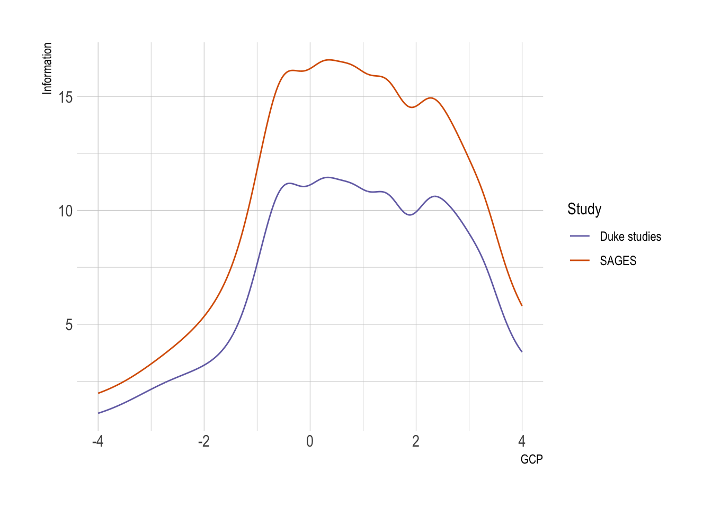
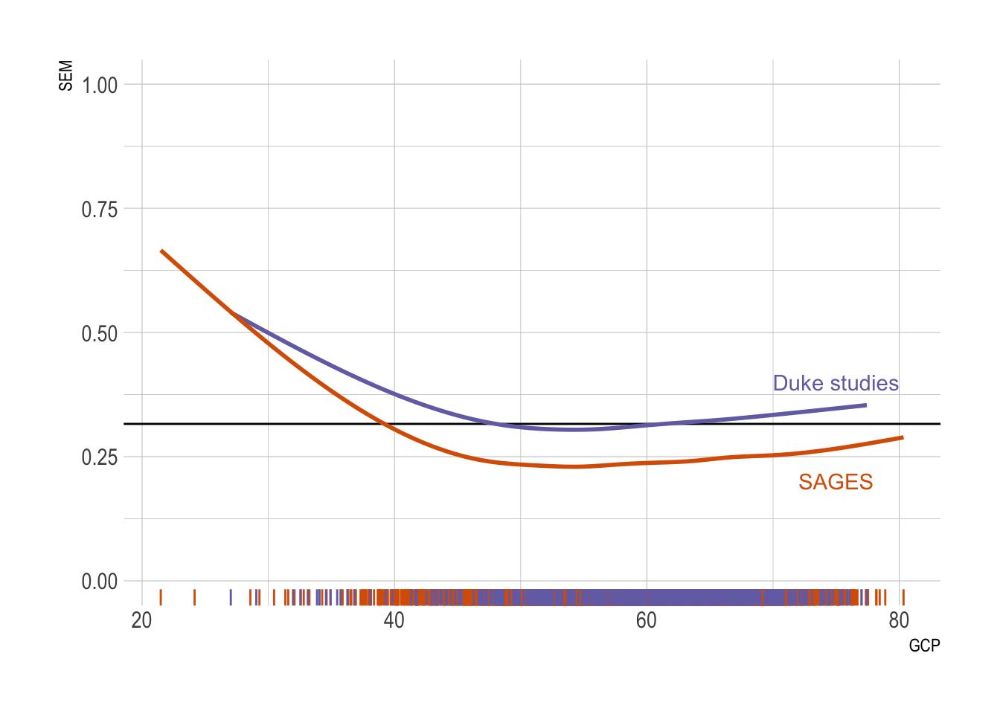
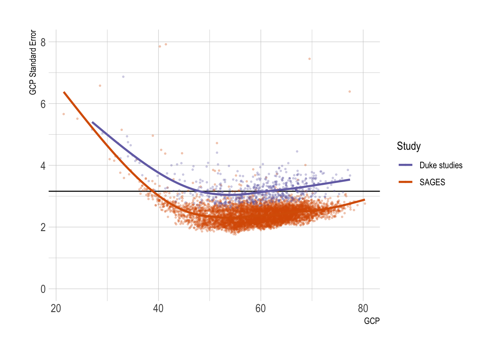
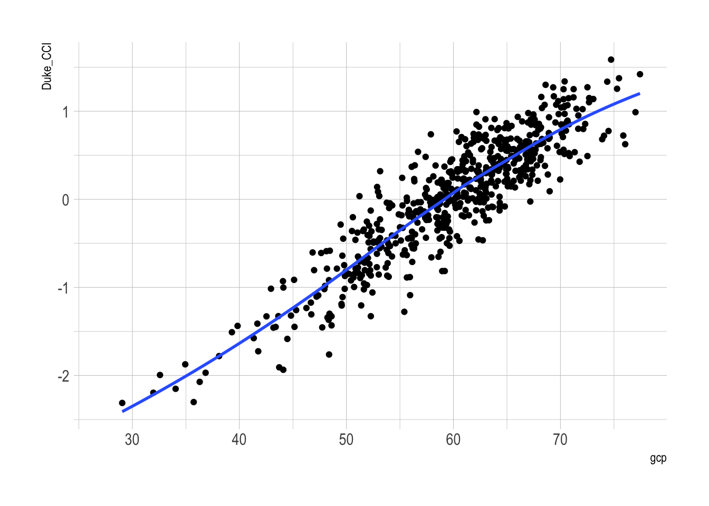

::: {.cell}

:::

::: {.cell}

:::


# Cognitive battery

## @tbl-battery: Cognitive tests by mode and study

These are the items used to harmonize INTUIT/MADCO to SAGES.  The Duke studies are listed in one column because since they used the same cognitive battery, the two studies were harmonized at the same time.  


::: {#tbl-battery .cell .tbl-cap-location-top tbl-cap='Cognitive tests by mode and study'}
::: {.cell-output-display}

```{=html}
<div id="ifhyizwtxh" style="padding-left:0px;padding-right:0px;padding-top:10px;padding-bottom:10px;overflow-x:auto;overflow-y:auto;width:auto;height:auto;">
<style>#ifhyizwtxh table {
  font-family: system-ui, 'Segoe UI', Roboto, Helvetica, Arial, sans-serif, 'Apple Color Emoji', 'Segoe UI Emoji', 'Segoe UI Symbol', 'Noto Color Emoji';
  -webkit-font-smoothing: antialiased;
  -moz-osx-font-smoothing: grayscale;
}

#ifhyizwtxh thead, #ifhyizwtxh tbody, #ifhyizwtxh tfoot, #ifhyizwtxh tr, #ifhyizwtxh td, #ifhyizwtxh th {
  border-style: none;
}

#ifhyizwtxh p {
  margin: 0;
  padding: 0;
}

#ifhyizwtxh .gt_table {
  display: table;
  border-collapse: collapse;
  line-height: normal;
  margin-left: auto;
  margin-right: auto;
  color: #333333;
  font-size: 16px;
  font-weight: normal;
  font-style: normal;
  background-color: #FFFFFF;
  width: auto;
  border-top-style: solid;
  border-top-width: 2px;
  border-top-color: #A8A8A8;
  border-right-style: none;
  border-right-width: 2px;
  border-right-color: #D3D3D3;
  border-bottom-style: solid;
  border-bottom-width: 2px;
  border-bottom-color: #A8A8A8;
  border-left-style: none;
  border-left-width: 2px;
  border-left-color: #D3D3D3;
}

#ifhyizwtxh .gt_caption {
  padding-top: 4px;
  padding-bottom: 4px;
}

#ifhyizwtxh .gt_title {
  color: #333333;
  font-size: 125%;
  font-weight: initial;
  padding-top: 4px;
  padding-bottom: 4px;
  padding-left: 5px;
  padding-right: 5px;
  border-bottom-color: #FFFFFF;
  border-bottom-width: 0;
}

#ifhyizwtxh .gt_subtitle {
  color: #333333;
  font-size: 85%;
  font-weight: initial;
  padding-top: 3px;
  padding-bottom: 5px;
  padding-left: 5px;
  padding-right: 5px;
  border-top-color: #FFFFFF;
  border-top-width: 0;
}

#ifhyizwtxh .gt_heading {
  background-color: #FFFFFF;
  text-align: center;
  border-bottom-color: #FFFFFF;
  border-left-style: none;
  border-left-width: 1px;
  border-left-color: #D3D3D3;
  border-right-style: none;
  border-right-width: 1px;
  border-right-color: #D3D3D3;
}

#ifhyizwtxh .gt_bottom_border {
  border-bottom-style: solid;
  border-bottom-width: 2px;
  border-bottom-color: #D3D3D3;
}

#ifhyizwtxh .gt_col_headings {
  border-top-style: solid;
  border-top-width: 2px;
  border-top-color: #D3D3D3;
  border-bottom-style: solid;
  border-bottom-width: 2px;
  border-bottom-color: #D3D3D3;
  border-left-style: none;
  border-left-width: 1px;
  border-left-color: #D3D3D3;
  border-right-style: none;
  border-right-width: 1px;
  border-right-color: #D3D3D3;
}

#ifhyizwtxh .gt_col_heading {
  color: #333333;
  background-color: #FFFFFF;
  font-size: 100%;
  font-weight: normal;
  text-transform: inherit;
  border-left-style: none;
  border-left-width: 1px;
  border-left-color: #D3D3D3;
  border-right-style: none;
  border-right-width: 1px;
  border-right-color: #D3D3D3;
  vertical-align: bottom;
  padding-top: 5px;
  padding-bottom: 6px;
  padding-left: 5px;
  padding-right: 5px;
  overflow-x: hidden;
}

#ifhyizwtxh .gt_column_spanner_outer {
  color: #333333;
  background-color: #FFFFFF;
  font-size: 100%;
  font-weight: normal;
  text-transform: inherit;
  padding-top: 0;
  padding-bottom: 0;
  padding-left: 4px;
  padding-right: 4px;
}

#ifhyizwtxh .gt_column_spanner_outer:first-child {
  padding-left: 0;
}

#ifhyizwtxh .gt_column_spanner_outer:last-child {
  padding-right: 0;
}

#ifhyizwtxh .gt_column_spanner {
  border-bottom-style: solid;
  border-bottom-width: 2px;
  border-bottom-color: #D3D3D3;
  vertical-align: bottom;
  padding-top: 5px;
  padding-bottom: 5px;
  overflow-x: hidden;
  display: inline-block;
  width: 100%;
}

#ifhyizwtxh .gt_spanner_row {
  border-bottom-style: hidden;
}

#ifhyizwtxh .gt_group_heading {
  padding-top: 8px;
  padding-bottom: 8px;
  padding-left: 5px;
  padding-right: 5px;
  color: #333333;
  background-color: #FFFFFF;
  font-size: 100%;
  font-weight: initial;
  text-transform: inherit;
  border-top-style: solid;
  border-top-width: 2px;
  border-top-color: #D3D3D3;
  border-bottom-style: solid;
  border-bottom-width: 2px;
  border-bottom-color: #D3D3D3;
  border-left-style: none;
  border-left-width: 1px;
  border-left-color: #D3D3D3;
  border-right-style: none;
  border-right-width: 1px;
  border-right-color: #D3D3D3;
  vertical-align: middle;
  text-align: left;
}

#ifhyizwtxh .gt_empty_group_heading {
  padding: 0.5px;
  color: #333333;
  background-color: #FFFFFF;
  font-size: 100%;
  font-weight: initial;
  border-top-style: solid;
  border-top-width: 2px;
  border-top-color: #D3D3D3;
  border-bottom-style: solid;
  border-bottom-width: 2px;
  border-bottom-color: #D3D3D3;
  vertical-align: middle;
}

#ifhyizwtxh .gt_from_md > :first-child {
  margin-top: 0;
}

#ifhyizwtxh .gt_from_md > :last-child {
  margin-bottom: 0;
}

#ifhyizwtxh .gt_row {
  padding-top: 8px;
  padding-bottom: 8px;
  padding-left: 5px;
  padding-right: 5px;
  margin: 10px;
  border-top-style: solid;
  border-top-width: 1px;
  border-top-color: #D3D3D3;
  border-left-style: none;
  border-left-width: 1px;
  border-left-color: #D3D3D3;
  border-right-style: none;
  border-right-width: 1px;
  border-right-color: #D3D3D3;
  vertical-align: middle;
  overflow-x: hidden;
}

#ifhyizwtxh .gt_stub {
  color: #333333;
  background-color: #FFFFFF;
  font-size: 100%;
  font-weight: initial;
  text-transform: inherit;
  border-right-style: solid;
  border-right-width: 2px;
  border-right-color: #D3D3D3;
  padding-left: 5px;
  padding-right: 5px;
}

#ifhyizwtxh .gt_stub_row_group {
  color: #333333;
  background-color: #FFFFFF;
  font-size: 100%;
  font-weight: initial;
  text-transform: inherit;
  border-right-style: solid;
  border-right-width: 2px;
  border-right-color: #D3D3D3;
  padding-left: 5px;
  padding-right: 5px;
  vertical-align: top;
}

#ifhyizwtxh .gt_row_group_first td {
  border-top-width: 2px;
}

#ifhyizwtxh .gt_row_group_first th {
  border-top-width: 2px;
}

#ifhyizwtxh .gt_summary_row {
  color: #333333;
  background-color: #FFFFFF;
  text-transform: inherit;
  padding-top: 8px;
  padding-bottom: 8px;
  padding-left: 5px;
  padding-right: 5px;
}

#ifhyizwtxh .gt_first_summary_row {
  border-top-style: solid;
  border-top-color: #D3D3D3;
}

#ifhyizwtxh .gt_first_summary_row.thick {
  border-top-width: 2px;
}

#ifhyizwtxh .gt_last_summary_row {
  padding-top: 8px;
  padding-bottom: 8px;
  padding-left: 5px;
  padding-right: 5px;
  border-bottom-style: solid;
  border-bottom-width: 2px;
  border-bottom-color: #D3D3D3;
}

#ifhyizwtxh .gt_grand_summary_row {
  color: #333333;
  background-color: #FFFFFF;
  text-transform: inherit;
  padding-top: 8px;
  padding-bottom: 8px;
  padding-left: 5px;
  padding-right: 5px;
}

#ifhyizwtxh .gt_first_grand_summary_row {
  padding-top: 8px;
  padding-bottom: 8px;
  padding-left: 5px;
  padding-right: 5px;
  border-top-style: double;
  border-top-width: 6px;
  border-top-color: #D3D3D3;
}

#ifhyizwtxh .gt_last_grand_summary_row_top {
  padding-top: 8px;
  padding-bottom: 8px;
  padding-left: 5px;
  padding-right: 5px;
  border-bottom-style: double;
  border-bottom-width: 6px;
  border-bottom-color: #D3D3D3;
}

#ifhyizwtxh .gt_striped {
  background-color: rgba(128, 128, 128, 0.05);
}

#ifhyizwtxh .gt_table_body {
  border-top-style: solid;
  border-top-width: 2px;
  border-top-color: #D3D3D3;
  border-bottom-style: solid;
  border-bottom-width: 2px;
  border-bottom-color: #D3D3D3;
}

#ifhyizwtxh .gt_footnotes {
  color: #333333;
  background-color: #FFFFFF;
  border-bottom-style: none;
  border-bottom-width: 2px;
  border-bottom-color: #D3D3D3;
  border-left-style: none;
  border-left-width: 2px;
  border-left-color: #D3D3D3;
  border-right-style: none;
  border-right-width: 2px;
  border-right-color: #D3D3D3;
}

#ifhyizwtxh .gt_footnote {
  margin: 0px;
  font-size: 90%;
  padding-top: 4px;
  padding-bottom: 4px;
  padding-left: 5px;
  padding-right: 5px;
}

#ifhyizwtxh .gt_sourcenotes {
  color: #333333;
  background-color: #FFFFFF;
  border-bottom-style: none;
  border-bottom-width: 2px;
  border-bottom-color: #D3D3D3;
  border-left-style: none;
  border-left-width: 2px;
  border-left-color: #D3D3D3;
  border-right-style: none;
  border-right-width: 2px;
  border-right-color: #D3D3D3;
}

#ifhyizwtxh .gt_sourcenote {
  font-size: 90%;
  padding-top: 4px;
  padding-bottom: 4px;
  padding-left: 5px;
  padding-right: 5px;
}

#ifhyizwtxh .gt_left {
  text-align: left;
}

#ifhyizwtxh .gt_center {
  text-align: center;
}

#ifhyizwtxh .gt_right {
  text-align: right;
  font-variant-numeric: tabular-nums;
}

#ifhyizwtxh .gt_font_normal {
  font-weight: normal;
}

#ifhyizwtxh .gt_font_bold {
  font-weight: bold;
}

#ifhyizwtxh .gt_font_italic {
  font-style: italic;
}

#ifhyizwtxh .gt_super {
  font-size: 65%;
}

#ifhyizwtxh .gt_footnote_marks {
  font-size: 75%;
  vertical-align: 0.4em;
  position: initial;
}

#ifhyizwtxh .gt_asterisk {
  font-size: 100%;
  vertical-align: 0;
}

#ifhyizwtxh .gt_indent_1 {
  text-indent: 5px;
}

#ifhyizwtxh .gt_indent_2 {
  text-indent: 10px;
}

#ifhyizwtxh .gt_indent_3 {
  text-indent: 15px;
}

#ifhyizwtxh .gt_indent_4 {
  text-indent: 20px;
}

#ifhyizwtxh .gt_indent_5 {
  text-indent: 25px;
}
</style>
<table class="gt_table" data-quarto-disable-processing="false" data-quarto-bootstrap="false">
  <thead>
    
    <tr class="gt_col_headings gt_spanner_row">
      <th class="gt_col_heading gt_columns_bottom_border gt_center" rowspan="2" colspan="1" scope="col" id="item_label">item_label</th>
      <th class="gt_center gt_columns_top_border gt_column_spanner_outer" rowspan="1" colspan="2" scope="colgroup" id="Study/Mode">
        <span class="gt_column_spanner">Study/Mode</span>
      </th>
    </tr>
    <tr class="gt_col_headings">
      <th class="gt_col_heading gt_columns_bottom_border gt_center" rowspan="1" colspan="1" scope="col" id="SAGES">SAGES</th>
      <th class="gt_col_heading gt_columns_bottom_border gt_center" rowspan="1" colspan="1" scope="col" id="Duke studies">Duke studies</th>
    </tr>
  </thead>
  <tbody class="gt_table_body">
    <tr class="gt_group_heading_row">
      <th colspan="3" class="gt_group_heading" scope="colgroup" id="Attention/Executive Function">Attention/Executive Function</th>
    </tr>
    <tr class="gt_row_group_first"><td headers="Attention/Executive Function  item_label" class="gt_row gt_center">Trails A (time, deciles)</td>
<td headers="Attention/Executive Function  SAGES" class="gt_row gt_center">X</td>
<td headers="Attention/Executive Function  INTUIT_ACTIVE" class="gt_row gt_center">X</td></tr>
    <tr><td headers="Attention/Executive Function  item_label" class="gt_row gt_center">Digit Span Forward</td>
<td headers="Attention/Executive Function  SAGES" class="gt_row gt_center">X</td>
<td headers="Attention/Executive Function  INTUIT_ACTIVE" class="gt_row gt_center">X</td></tr>
    <tr><td headers="Attention/Executive Function  item_label" class="gt_row gt_center">Digit Span Backward</td>
<td headers="Attention/Executive Function  SAGES" class="gt_row gt_center">X</td>
<td headers="Attention/Executive Function  INTUIT_ACTIVE" class="gt_row gt_center">X</td></tr>
    <tr><td headers="Attention/Executive Function  item_label" class="gt_row gt_center">Visual Search and Attention Task (VSAT) number of targets (octile)</td>
<td headers="Attention/Executive Function  SAGES" class="gt_row gt_center">X</td>
<td headers="Attention/Executive Function  INTUIT_ACTIVE" class="gt_row gt_center"></td></tr>
    <tr><td headers="Attention/Executive Function  item_label" class="gt_row gt_center">Digit Symbol Substitution (aka rbans) (octile)</td>
<td headers="Attention/Executive Function  SAGES" class="gt_row gt_center">X</td>
<td headers="Attention/Executive Function  INTUIT_ACTIVE" class="gt_row gt_center">X</td></tr>
    <tr><td headers="Attention/Executive Function  item_label" class="gt_row gt_center">Trails B (time, deciles)</td>
<td headers="Attention/Executive Function  SAGES" class="gt_row gt_center">X</td>
<td headers="Attention/Executive Function  INTUIT_ACTIVE" class="gt_row gt_center">X</td></tr>
    <tr class="gt_group_heading_row">
      <th colspan="3" class="gt_group_heading" scope="colgroup" id="Language">Language</th>
    </tr>
    <tr class="gt_row_group_first"><td headers="Language  item_label" class="gt_row gt_center">Boston Naming Test, 15 Items</td>
<td headers="Language  SAGES" class="gt_row gt_center">X</td>
<td headers="Language  INTUIT_ACTIVE" class="gt_row gt_center"></td></tr>
    <tr><td headers="Language  item_label" class="gt_row gt_center">Semantic fluency - supermarket (SAGES deciles)</td>
<td headers="Language  SAGES" class="gt_row gt_center">X</td>
<td headers="Language  INTUIT_ACTIVE" class="gt_row gt_center"></td></tr>
    <tr><td headers="Language  item_label" class="gt_row gt_center">Letter Fluency (FAS) (Sages deciles)</td>
<td headers="Language  SAGES" class="gt_row gt_center">X</td>
<td headers="Language  INTUIT_ACTIVE" class="gt_row gt_center"></td></tr>
    <tr class="gt_group_heading_row">
      <th colspan="3" class="gt_group_heading" scope="colgroup" id="Memory">Memory</th>
    </tr>
    <tr class="gt_row_group_first"><td headers="Memory  item_label" class="gt_row gt_center">HVLT Trial 1-3 nonile (not nonile)</td>
<td headers="Memory  SAGES" class="gt_row gt_center">X</td>
<td headers="Memory  INTUIT_ACTIVE" class="gt_row gt_center">X</td></tr>
    <tr><td headers="Memory  item_label" class="gt_row gt_center">HVLT Delayed Recall Percent (octile)</td>
<td headers="Memory  SAGES" class="gt_row gt_center">X</td>
<td headers="Memory  INTUIT_ACTIVE" class="gt_row gt_center">X</td></tr>
  </tbody>
  
  
</table>
</div>
```

:::
:::


# Descriptive statistics of cognitive assessment

::: callout-note
@tbl-battery-desc is more inclusive of the cognitive tests used in the assessment than @tbl-battery.  Not all the items in this table were used in the GCP, only those in @tbl-battery were used in the GCP.
:::


::: {#tbl-battery-desc .cell .tbl-cap-location-top tbl-cap='Descriptive statistics of cognitive battery'}
::: {.cell-output-display}

```{=html}
<div id="voukrtwcyd" style="padding-left:0px;padding-right:0px;padding-top:10px;padding-bottom:10px;overflow-x:auto;overflow-y:auto;width:auto;height:auto;">
<style>#voukrtwcyd table {
  font-family: system-ui, 'Segoe UI', Roboto, Helvetica, Arial, sans-serif, 'Apple Color Emoji', 'Segoe UI Emoji', 'Segoe UI Symbol', 'Noto Color Emoji';
  -webkit-font-smoothing: antialiased;
  -moz-osx-font-smoothing: grayscale;
}

#voukrtwcyd thead, #voukrtwcyd tbody, #voukrtwcyd tfoot, #voukrtwcyd tr, #voukrtwcyd td, #voukrtwcyd th {
  border-style: none;
}

#voukrtwcyd p {
  margin: 0;
  padding: 0;
}

#voukrtwcyd .gt_table {
  display: table;
  border-collapse: collapse;
  line-height: normal;
  margin-left: auto;
  margin-right: auto;
  color: #333333;
  font-size: 16px;
  font-weight: normal;
  font-style: normal;
  background-color: #FFFFFF;
  width: auto;
  border-top-style: solid;
  border-top-width: 2px;
  border-top-color: #A8A8A8;
  border-right-style: none;
  border-right-width: 2px;
  border-right-color: #D3D3D3;
  border-bottom-style: solid;
  border-bottom-width: 2px;
  border-bottom-color: #A8A8A8;
  border-left-style: none;
  border-left-width: 2px;
  border-left-color: #D3D3D3;
}

#voukrtwcyd .gt_caption {
  padding-top: 4px;
  padding-bottom: 4px;
}

#voukrtwcyd .gt_title {
  color: #333333;
  font-size: 125%;
  font-weight: initial;
  padding-top: 4px;
  padding-bottom: 4px;
  padding-left: 5px;
  padding-right: 5px;
  border-bottom-color: #FFFFFF;
  border-bottom-width: 0;
}

#voukrtwcyd .gt_subtitle {
  color: #333333;
  font-size: 85%;
  font-weight: initial;
  padding-top: 3px;
  padding-bottom: 5px;
  padding-left: 5px;
  padding-right: 5px;
  border-top-color: #FFFFFF;
  border-top-width: 0;
}

#voukrtwcyd .gt_heading {
  background-color: #FFFFFF;
  text-align: center;
  border-bottom-color: #FFFFFF;
  border-left-style: none;
  border-left-width: 1px;
  border-left-color: #D3D3D3;
  border-right-style: none;
  border-right-width: 1px;
  border-right-color: #D3D3D3;
}

#voukrtwcyd .gt_bottom_border {
  border-bottom-style: solid;
  border-bottom-width: 2px;
  border-bottom-color: #D3D3D3;
}

#voukrtwcyd .gt_col_headings {
  border-top-style: solid;
  border-top-width: 2px;
  border-top-color: #D3D3D3;
  border-bottom-style: solid;
  border-bottom-width: 2px;
  border-bottom-color: #D3D3D3;
  border-left-style: none;
  border-left-width: 1px;
  border-left-color: #D3D3D3;
  border-right-style: none;
  border-right-width: 1px;
  border-right-color: #D3D3D3;
}

#voukrtwcyd .gt_col_heading {
  color: #333333;
  background-color: #FFFFFF;
  font-size: 100%;
  font-weight: normal;
  text-transform: inherit;
  border-left-style: none;
  border-left-width: 1px;
  border-left-color: #D3D3D3;
  border-right-style: none;
  border-right-width: 1px;
  border-right-color: #D3D3D3;
  vertical-align: bottom;
  padding-top: 5px;
  padding-bottom: 6px;
  padding-left: 5px;
  padding-right: 5px;
  overflow-x: hidden;
}

#voukrtwcyd .gt_column_spanner_outer {
  color: #333333;
  background-color: #FFFFFF;
  font-size: 100%;
  font-weight: normal;
  text-transform: inherit;
  padding-top: 0;
  padding-bottom: 0;
  padding-left: 4px;
  padding-right: 4px;
}

#voukrtwcyd .gt_column_spanner_outer:first-child {
  padding-left: 0;
}

#voukrtwcyd .gt_column_spanner_outer:last-child {
  padding-right: 0;
}

#voukrtwcyd .gt_column_spanner {
  border-bottom-style: solid;
  border-bottom-width: 2px;
  border-bottom-color: #D3D3D3;
  vertical-align: bottom;
  padding-top: 5px;
  padding-bottom: 5px;
  overflow-x: hidden;
  display: inline-block;
  width: 100%;
}

#voukrtwcyd .gt_spanner_row {
  border-bottom-style: hidden;
}

#voukrtwcyd .gt_group_heading {
  padding-top: 8px;
  padding-bottom: 8px;
  padding-left: 5px;
  padding-right: 5px;
  color: #333333;
  background-color: #FFFFFF;
  font-size: 100%;
  font-weight: initial;
  text-transform: inherit;
  border-top-style: solid;
  border-top-width: 2px;
  border-top-color: #D3D3D3;
  border-bottom-style: solid;
  border-bottom-width: 2px;
  border-bottom-color: #D3D3D3;
  border-left-style: none;
  border-left-width: 1px;
  border-left-color: #D3D3D3;
  border-right-style: none;
  border-right-width: 1px;
  border-right-color: #D3D3D3;
  vertical-align: middle;
  text-align: left;
}

#voukrtwcyd .gt_empty_group_heading {
  padding: 0.5px;
  color: #333333;
  background-color: #FFFFFF;
  font-size: 100%;
  font-weight: initial;
  border-top-style: solid;
  border-top-width: 2px;
  border-top-color: #D3D3D3;
  border-bottom-style: solid;
  border-bottom-width: 2px;
  border-bottom-color: #D3D3D3;
  vertical-align: middle;
}

#voukrtwcyd .gt_from_md > :first-child {
  margin-top: 0;
}

#voukrtwcyd .gt_from_md > :last-child {
  margin-bottom: 0;
}

#voukrtwcyd .gt_row {
  padding-top: 8px;
  padding-bottom: 8px;
  padding-left: 5px;
  padding-right: 5px;
  margin: 10px;
  border-top-style: solid;
  border-top-width: 1px;
  border-top-color: #D3D3D3;
  border-left-style: none;
  border-left-width: 1px;
  border-left-color: #D3D3D3;
  border-right-style: none;
  border-right-width: 1px;
  border-right-color: #D3D3D3;
  vertical-align: middle;
  overflow-x: hidden;
}

#voukrtwcyd .gt_stub {
  color: #333333;
  background-color: #FFFFFF;
  font-size: 100%;
  font-weight: initial;
  text-transform: inherit;
  border-right-style: solid;
  border-right-width: 2px;
  border-right-color: #D3D3D3;
  padding-left: 5px;
  padding-right: 5px;
}

#voukrtwcyd .gt_stub_row_group {
  color: #333333;
  background-color: #FFFFFF;
  font-size: 100%;
  font-weight: initial;
  text-transform: inherit;
  border-right-style: solid;
  border-right-width: 2px;
  border-right-color: #D3D3D3;
  padding-left: 5px;
  padding-right: 5px;
  vertical-align: top;
}

#voukrtwcyd .gt_row_group_first td {
  border-top-width: 2px;
}

#voukrtwcyd .gt_row_group_first th {
  border-top-width: 2px;
}

#voukrtwcyd .gt_summary_row {
  color: #333333;
  background-color: #FFFFFF;
  text-transform: inherit;
  padding-top: 8px;
  padding-bottom: 8px;
  padding-left: 5px;
  padding-right: 5px;
}

#voukrtwcyd .gt_first_summary_row {
  border-top-style: solid;
  border-top-color: #D3D3D3;
}

#voukrtwcyd .gt_first_summary_row.thick {
  border-top-width: 2px;
}

#voukrtwcyd .gt_last_summary_row {
  padding-top: 8px;
  padding-bottom: 8px;
  padding-left: 5px;
  padding-right: 5px;
  border-bottom-style: solid;
  border-bottom-width: 2px;
  border-bottom-color: #D3D3D3;
}

#voukrtwcyd .gt_grand_summary_row {
  color: #333333;
  background-color: #FFFFFF;
  text-transform: inherit;
  padding-top: 8px;
  padding-bottom: 8px;
  padding-left: 5px;
  padding-right: 5px;
}

#voukrtwcyd .gt_first_grand_summary_row {
  padding-top: 8px;
  padding-bottom: 8px;
  padding-left: 5px;
  padding-right: 5px;
  border-top-style: double;
  border-top-width: 6px;
  border-top-color: #D3D3D3;
}

#voukrtwcyd .gt_last_grand_summary_row_top {
  padding-top: 8px;
  padding-bottom: 8px;
  padding-left: 5px;
  padding-right: 5px;
  border-bottom-style: double;
  border-bottom-width: 6px;
  border-bottom-color: #D3D3D3;
}

#voukrtwcyd .gt_striped {
  background-color: rgba(128, 128, 128, 0.05);
}

#voukrtwcyd .gt_table_body {
  border-top-style: solid;
  border-top-width: 2px;
  border-top-color: #D3D3D3;
  border-bottom-style: solid;
  border-bottom-width: 2px;
  border-bottom-color: #D3D3D3;
}

#voukrtwcyd .gt_footnotes {
  color: #333333;
  background-color: #FFFFFF;
  border-bottom-style: none;
  border-bottom-width: 2px;
  border-bottom-color: #D3D3D3;
  border-left-style: none;
  border-left-width: 2px;
  border-left-color: #D3D3D3;
  border-right-style: none;
  border-right-width: 2px;
  border-right-color: #D3D3D3;
}

#voukrtwcyd .gt_footnote {
  margin: 0px;
  font-size: 90%;
  padding-top: 4px;
  padding-bottom: 4px;
  padding-left: 5px;
  padding-right: 5px;
}

#voukrtwcyd .gt_sourcenotes {
  color: #333333;
  background-color: #FFFFFF;
  border-bottom-style: none;
  border-bottom-width: 2px;
  border-bottom-color: #D3D3D3;
  border-left-style: none;
  border-left-width: 2px;
  border-left-color: #D3D3D3;
  border-right-style: none;
  border-right-width: 2px;
  border-right-color: #D3D3D3;
}

#voukrtwcyd .gt_sourcenote {
  font-size: 90%;
  padding-top: 4px;
  padding-bottom: 4px;
  padding-left: 5px;
  padding-right: 5px;
}

#voukrtwcyd .gt_left {
  text-align: left;
}

#voukrtwcyd .gt_center {
  text-align: center;
}

#voukrtwcyd .gt_right {
  text-align: right;
  font-variant-numeric: tabular-nums;
}

#voukrtwcyd .gt_font_normal {
  font-weight: normal;
}

#voukrtwcyd .gt_font_bold {
  font-weight: bold;
}

#voukrtwcyd .gt_font_italic {
  font-style: italic;
}

#voukrtwcyd .gt_super {
  font-size: 65%;
}

#voukrtwcyd .gt_footnote_marks {
  font-size: 75%;
  vertical-align: 0.4em;
  position: initial;
}

#voukrtwcyd .gt_asterisk {
  font-size: 100%;
  vertical-align: 0;
}

#voukrtwcyd .gt_indent_1 {
  text-indent: 5px;
}

#voukrtwcyd .gt_indent_2 {
  text-indent: 10px;
}

#voukrtwcyd .gt_indent_3 {
  text-indent: 15px;
}

#voukrtwcyd .gt_indent_4 {
  text-indent: 20px;
}

#voukrtwcyd .gt_indent_5 {
  text-indent: 25px;
}
</style>
<table class="gt_table" data-quarto-disable-processing="false" data-quarto-bootstrap="false">
  <thead>
    
    <tr class="gt_col_headings">
      <th class="gt_col_heading gt_columns_bottom_border gt_left" rowspan="1" colspan="1" scope="col" id="&lt;strong&gt;Characteristic&lt;/strong&gt;"><strong>Characteristic</strong></th>
      <th class="gt_col_heading gt_columns_bottom_border gt_center" rowspan="1" colspan="1" scope="col" id="&lt;strong&gt;SAGES&lt;/strong&gt;, N = 560&lt;span class=&quot;gt_footnote_marks&quot; style=&quot;white-space:nowrap;font-style:italic;font-weight:normal;&quot;&gt;&lt;sup&gt;1&lt;/sup&gt;&lt;/span&gt;"><strong>SAGES</strong>, N = 560<span class="gt_footnote_marks" style="white-space:nowrap;font-style:italic;font-weight:normal;"><sup>1</sup></span></th>
      <th class="gt_col_heading gt_columns_bottom_border gt_center" rowspan="1" colspan="1" scope="col" id="&lt;strong&gt;MADCO-PC&lt;/strong&gt;, N = 140&lt;span class=&quot;gt_footnote_marks&quot; style=&quot;white-space:nowrap;font-style:italic;font-weight:normal;&quot;&gt;&lt;sup&gt;1&lt;/sup&gt;&lt;/span&gt;"><strong>MADCO-PC</strong>, N = 140<span class="gt_footnote_marks" style="white-space:nowrap;font-style:italic;font-weight:normal;"><sup>1</sup></span></th>
      <th class="gt_col_heading gt_columns_bottom_border gt_center" rowspan="1" colspan="1" scope="col" id="&lt;strong&gt;INTUIT&lt;/strong&gt;, N = 197&lt;span class=&quot;gt_footnote_marks&quot; style=&quot;white-space:nowrap;font-style:italic;font-weight:normal;&quot;&gt;&lt;sup&gt;1&lt;/sup&gt;&lt;/span&gt;"><strong>INTUIT</strong>, N = 197<span class="gt_footnote_marks" style="white-space:nowrap;font-style:italic;font-weight:normal;"><sup>1</sup></span></th>
    </tr>
  </thead>
  <tbody class="gt_table_body">
    <tr class="gt_group_heading_row">
      <th colspan="4" class="gt_group_heading" scope="colgroup" id="Verbal Memory">Verbal Memory</th>
    </tr>
    <tr class="gt_row_group_first"><td headers="Verbal Memory  label" class="gt_row gt_left">Immediate RANDT Gist</td>
<td headers="Verbal Memory  stat_1" class="gt_row gt_center"></td>
<td headers="Verbal Memory  stat_2" class="gt_row gt_center">7.1 (1.6)</td>
<td headers="Verbal Memory  stat_3" class="gt_row gt_center">7.5 (1.5)</td></tr>
    <tr><td headers="Verbal Memory  label" class="gt_row gt_left">Immediate RANDT Verbatim</td>
<td headers="Verbal Memory  stat_1" class="gt_row gt_center"></td>
<td headers="Verbal Memory  stat_2" class="gt_row gt_center">10.4 (3.1)</td>
<td headers="Verbal Memory  stat_3" class="gt_row gt_center">11.4 (2.9)</td></tr>
    <tr><td headers="Verbal Memory  label" class="gt_row gt_left">Delay RANDT Gist</td>
<td headers="Verbal Memory  stat_1" class="gt_row gt_center"></td>
<td headers="Verbal Memory  stat_2" class="gt_row gt_center">6.5 (1.9)</td>
<td headers="Verbal Memory  stat_3" class="gt_row gt_center">7.2 (1.7)</td></tr>
    <tr><td headers="Verbal Memory  label" class="gt_row gt_left">Delay RANDT Verbatim</td>
<td headers="Verbal Memory  stat_1" class="gt_row gt_center"></td>
<td headers="Verbal Memory  stat_2" class="gt_row gt_center">8.7 (3.4)</td>
<td headers="Verbal Memory  stat_3" class="gt_row gt_center">9.8 (3.0)</td></tr>
    <tr><td headers="Verbal Memory  label" class="gt_row gt_left">Hopkins Verbal Learning Initial (3 Trial Sum)</td>
<td headers="Verbal Memory  stat_1" class="gt_row gt_center">22.2 (5.4)</td>
<td headers="Verbal Memory  stat_2" class="gt_row gt_center">23.3 (6.0)</td>
<td headers="Verbal Memory  stat_3" class="gt_row gt_center">23.7 (5.5)</td></tr>
    <tr><td headers="Verbal Memory  label" class="gt_row gt_left">Hopkins Delayed recall</td>
<td headers="Verbal Memory  stat_1" class="gt_row gt_center">7.4 (2.8)</td>
<td headers="Verbal Memory  stat_2" class="gt_row gt_center">7.6 (3.6)</td>
<td headers="Verbal Memory  stat_3" class="gt_row gt_center">7.5 (3.7)</td></tr>
    <tr><td headers="Verbal Memory  label" class="gt_row gt_left">Hopkins Delayed recognition</td>
<td headers="Verbal Memory  stat_1" class="gt_row gt_center"></td>
<td headers="Verbal Memory  stat_2" class="gt_row gt_center">10.3 (1.9)</td>
<td headers="Verbal Memory  stat_3" class="gt_row gt_center">10.2 (2.0)</td></tr>
    <tr class="gt_group_heading_row">
      <th colspan="4" class="gt_group_heading" scope="colgroup" id="Visual Memory">Visual Memory</th>
    </tr>
    <tr class="gt_row_group_first"><td headers="Visual Memory  label" class="gt_row gt_left">Wechsler Reproduction Immediate (3 trial sum)</td>
<td headers="Visual Memory  stat_1" class="gt_row gt_center"></td>
<td headers="Visual Memory  stat_2" class="gt_row gt_center">6.0 (2.9)</td>
<td headers="Visual Memory  stat_3" class="gt_row gt_center">6.4 (2.5)</td></tr>
    <tr><td headers="Visual Memory  label" class="gt_row gt_left">Wechsler Reproduction Delay (3 trial sum)</td>
<td headers="Visual Memory  stat_1" class="gt_row gt_center"></td>
<td headers="Visual Memory  stat_2" class="gt_row gt_center">5.4 (3.0)</td>
<td headers="Visual Memory  stat_3" class="gt_row gt_center">5.7 (2.8)</td></tr>
    <tr><td headers="Visual Memory  label" class="gt_row gt_left">Visual Search and Attention</td>
<td headers="Visual Memory  stat_1" class="gt_row gt_center">43.6 (10.2)</td>
<td headers="Visual Memory  stat_2" class="gt_row gt_center"></td>
<td headers="Visual Memory  stat_3" class="gt_row gt_center"></td></tr>
    <tr class="gt_group_heading_row">
      <th colspan="4" class="gt_group_heading" scope="colgroup" id="Executive Function">Executive Function</th>
    </tr>
    <tr class="gt_row_group_first"><td headers="Executive Function  label" class="gt_row gt_left">Digit Symbol</td>
<td headers="Executive Function  stat_1" class="gt_row gt_center">38.2 (41.9)</td>
<td headers="Executive Function  stat_2" class="gt_row gt_center">42.3 (12.1)</td>
<td headers="Executive Function  stat_3" class="gt_row gt_center">43.7 (11.3)</td></tr>
    <tr><td headers="Executive Function  label" class="gt_row gt_left">Trails Making Test Part A</td>
<td headers="Executive Function  stat_1" class="gt_row gt_center">41.9 (16.4)</td>
<td headers="Executive Function  stat_2" class="gt_row gt_center">43.7 (85.8)</td>
<td headers="Executive Function  stat_3" class="gt_row gt_center">38.0 (19.3)</td></tr>
    <tr><td headers="Executive Function  label" class="gt_row gt_left">Trails Making Test Part B</td>
<td headers="Executive Function  stat_1" class="gt_row gt_center">118.2 (82.8)</td>
<td headers="Executive Function  stat_2" class="gt_row gt_center">121.6 (80.2)</td>
<td headers="Executive Function  stat_3" class="gt_row gt_center">109.4 (68.2)</td></tr>
    <tr class="gt_group_heading_row">
      <th colspan="4" class="gt_group_heading" scope="colgroup" id="Attention/Concentration">Attention/Concentration</th>
    </tr>
    <tr class="gt_row_group_first"><td headers="Attention/Concentration  label" class="gt_row gt_left">Digit Span Repeat Forwards</td>
<td headers="Attention/Concentration  stat_1" class="gt_row gt_center">9.9 (2.3)</td>
<td headers="Attention/Concentration  stat_2" class="gt_row gt_center">7.4 (2.1)</td>
<td headers="Attention/Concentration  stat_3" class="gt_row gt_center">7.6 (2.3)</td></tr>
    <tr><td headers="Attention/Concentration  label" class="gt_row gt_left">Digit Span Repeat Backwards</td>
<td headers="Attention/Concentration  stat_1" class="gt_row gt_center">6.3 (2.1)</td>
<td headers="Attention/Concentration  stat_2" class="gt_row gt_center">6.0 (2.4)</td>
<td headers="Attention/Concentration  stat_3" class="gt_row gt_center">6.6 (2.3)</td></tr>
    <tr class="gt_group_heading_row">
      <th colspan="4" class="gt_group_heading" scope="colgroup" id="Language">Language</th>
    </tr>
    <tr class="gt_row_group_first"><td headers="Language  label" class="gt_row gt_left">Boston Naming Test</td>
<td headers="Language  stat_1" class="gt_row gt_center">14.3 (1.5)</td>
<td headers="Language  stat_2" class="gt_row gt_center"></td>
<td headers="Language  stat_3" class="gt_row gt_center"></td></tr>
    <tr><td headers="Language  label" class="gt_row gt_left">Semantic fluency – supermarket</td>
<td headers="Language  stat_1" class="gt_row gt_center">22.0 (6.1)</td>
<td headers="Language  stat_2" class="gt_row gt_center"></td>
<td headers="Language  stat_3" class="gt_row gt_center"></td></tr>
    <tr><td headers="Language  label" class="gt_row gt_left">Letter fluency - FAS</td>
<td headers="Language  stat_1" class="gt_row gt_center">35.9 (12.9)</td>
<td headers="Language  stat_2" class="gt_row gt_center"></td>
<td headers="Language  stat_3" class="gt_row gt_center"></td></tr>
  </tbody>
  
  <tfoot class="gt_footnotes">
    <tr>
      <td class="gt_footnote" colspan="4"><span class="gt_footnote_marks" style="white-space:nowrap;font-style:italic;font-weight:normal;"><sup>1</sup></span> Mean (SD)</td>
    </tr>
  </tfoot>
</table>
</div>
```

:::
:::


# GCP Information


## @fig-info: Test Information by mode and study


::: {.cell .fig-cap-location-top}
::: {.cell-output-display}
{#fig-info width=672}
:::
:::

::: {.cell .fig-cap-location-top}
::: {.cell-output-display}
{#fig-sem-plot-1 width=672}
:::

::: {.cell-output-display}
{#fig-sem-plot-2 width=672}
:::
:::


## GCP vs CCI in Duke studies


::: {.cell}
::: {.cell-output-display}
{width=672}
:::
:::
