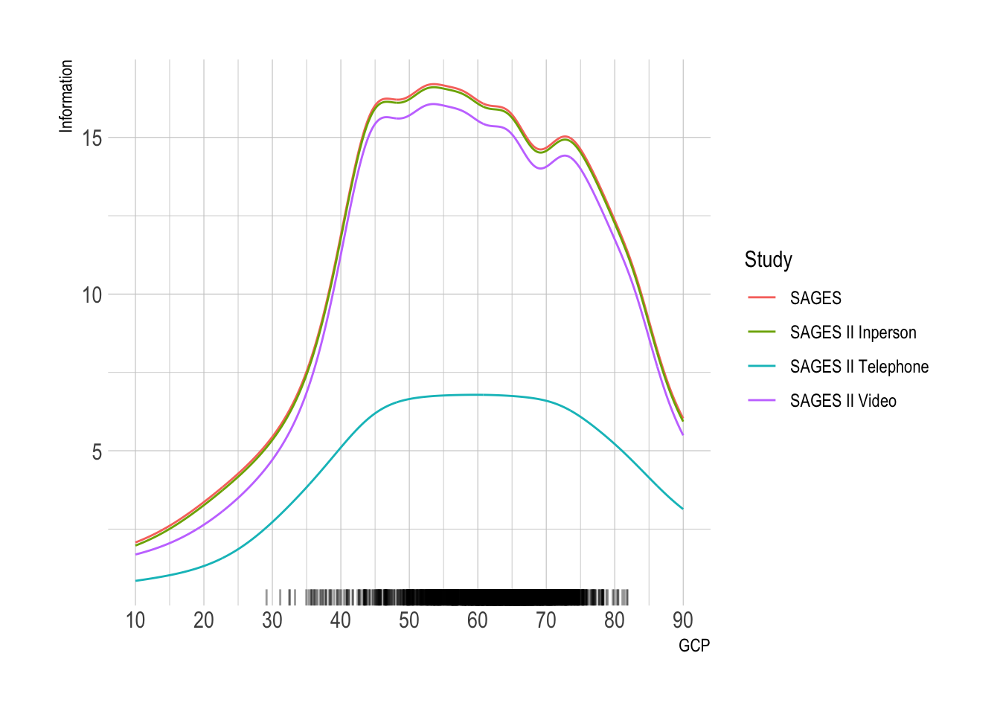

::: {.cell}

:::


::: callout-note
-   We adapted an in-person cognitive assessment battery for administration by two alternative modes: telephone and videoconference, in an on-going observational study of cognitive aging and delirium

-   We administered all three modes (in-person, telephone, videoconference) in an on-going observational study of older surgical patients.

-   We co-calibrated the scores across mode using item response theory (we placed the scores on the same metric)

-   We compare the measurement precision (reliability) by mode:

-   We contrast the external predictive (and postdictive) validity by mode (association with age, education, and mean change after surgery).
:::

# Differences in GCP from the previous version

There were several different ways we considered harmonizing the test batteries to account for some mistakes and questionable assumptions.

The mistake was when we categorized the test scores into bins, the top two categories were combined into the same bin.

-   Tests this issue affected: VSAT, HVLT total, HVLT delayed and Digit symbol substitution

The questionable assumptions were deciding whether measures of letter fluency and semantic fluency were equivalent. For letter fluency there were three options we considered and for semantic fluency there were two options we considered.

-   Letter fluency:

    -   FAS and FCL summed and deemed equivalent

    -   FAS and FCL as individual tests, F are deemed equivalent, the other letters are not deemed equivalent

    -   FAS and FCL summed but **not** deemed equivalent

-   Semantic fluency:

    -   Animal naming and supermarket item naming are deemed equivalent

    -   Animal naming and supermarket item naming are **not** deemed equivalent

With these as the possible choices, we decided to go with the version that fixes the coding mistakes, FAS/FCL summed but not equivalent and animal/supermarket naming not equivalent.


::: {.cell}

:::


# Figure: Timeline of SAGES-II

## @fig-timeline: Timeline of SAGES-II participant interviews


::: {.cell .fig-cap-location-top}
::: {.cell-output-display}
{#fig-timeline width=672}
:::
:::


@fig-timeline shows when different interview modes occurred in SAGES II.

::: callout-note
*   Need the exact dates to use for the two vertical lines. Currently, they are based on the data.
*   Does the COVID data provide useful data? What is the best way to present it? Currently, it only uses Suffolk County data, but it could be expanded to additional counties in the Boston region.
*   Is the color scheme good?
:::

## @fig-timeline-alt1: Timeline of SAGES-II participant interviews


::: {.cell .fig-cap-location-top}
::: {.cell-output-display}
{#fig-timeline-alt1 width=672}
:::
:::


@fig-timeline-alt1 is the same as @fig-timeline but with the color gradient reversed.

## Data quality check

Some of the points in @fig-timeline/@fig-timeline-alt1 appear to have data errors because they are listed as having in-person visits during the shutdown.  The following tables list the studyid and visit date for these participants.  @tbl-data-quality lists the nine records that are listed as being an in-person interview that occurred during the shutdown.  @tbl-data-quality1 - @tbl-data-quality9 lists the all the visit dates for each of the nine participants listed in @tbl-data-quality.

For most of these records it seems like the visit location is incorrect. One of the records seems like the visit date is incorrect.

Update: For the 8 records that are listed as having an in-person visit during the shutdown period, those were the partial in-person visits, so they are correct.

::: {.callout-note collapse=true icon=false}
## Tables of records to check 


::: {.cell}

:::

::: {#tbl-data-quality .cell .tbl-cap-location-top tbl-cap='Data quality check'}
::: {.cell-output-display}

```{=html}
<div id="qouzwbpkgr" style="padding-left:0px;padding-right:0px;padding-top:10px;padding-bottom:10px;overflow-x:auto;overflow-y:auto;width:auto;height:auto;">
<style>#qouzwbpkgr table {
  font-family: system-ui, 'Segoe UI', Roboto, Helvetica, Arial, sans-serif, 'Apple Color Emoji', 'Segoe UI Emoji', 'Segoe UI Symbol', 'Noto Color Emoji';
  -webkit-font-smoothing: antialiased;
  -moz-osx-font-smoothing: grayscale;
}

#qouzwbpkgr thead, #qouzwbpkgr tbody, #qouzwbpkgr tfoot, #qouzwbpkgr tr, #qouzwbpkgr td, #qouzwbpkgr th {
  border-style: none;
}

#qouzwbpkgr p {
  margin: 0;
  padding: 0;
}

#qouzwbpkgr .gt_table {
  display: table;
  border-collapse: collapse;
  line-height: normal;
  margin-left: auto;
  margin-right: auto;
  color: #333333;
  font-size: 16px;
  font-weight: normal;
  font-style: normal;
  background-color: #FFFFFF;
  width: auto;
  border-top-style: solid;
  border-top-width: 2px;
  border-top-color: #A8A8A8;
  border-right-style: none;
  border-right-width: 2px;
  border-right-color: #D3D3D3;
  border-bottom-style: solid;
  border-bottom-width: 2px;
  border-bottom-color: #A8A8A8;
  border-left-style: none;
  border-left-width: 2px;
  border-left-color: #D3D3D3;
}

#qouzwbpkgr .gt_caption {
  padding-top: 4px;
  padding-bottom: 4px;
}

#qouzwbpkgr .gt_title {
  color: #333333;
  font-size: 125%;
  font-weight: initial;
  padding-top: 4px;
  padding-bottom: 4px;
  padding-left: 5px;
  padding-right: 5px;
  border-bottom-color: #FFFFFF;
  border-bottom-width: 0;
}

#qouzwbpkgr .gt_subtitle {
  color: #333333;
  font-size: 85%;
  font-weight: initial;
  padding-top: 3px;
  padding-bottom: 5px;
  padding-left: 5px;
  padding-right: 5px;
  border-top-color: #FFFFFF;
  border-top-width: 0;
}

#qouzwbpkgr .gt_heading {
  background-color: #FFFFFF;
  text-align: center;
  border-bottom-color: #FFFFFF;
  border-left-style: none;
  border-left-width: 1px;
  border-left-color: #D3D3D3;
  border-right-style: none;
  border-right-width: 1px;
  border-right-color: #D3D3D3;
}

#qouzwbpkgr .gt_bottom_border {
  border-bottom-style: solid;
  border-bottom-width: 2px;
  border-bottom-color: #D3D3D3;
}

#qouzwbpkgr .gt_col_headings {
  border-top-style: solid;
  border-top-width: 2px;
  border-top-color: #D3D3D3;
  border-bottom-style: solid;
  border-bottom-width: 2px;
  border-bottom-color: #D3D3D3;
  border-left-style: none;
  border-left-width: 1px;
  border-left-color: #D3D3D3;
  border-right-style: none;
  border-right-width: 1px;
  border-right-color: #D3D3D3;
}

#qouzwbpkgr .gt_col_heading {
  color: #333333;
  background-color: #FFFFFF;
  font-size: 100%;
  font-weight: normal;
  text-transform: inherit;
  border-left-style: none;
  border-left-width: 1px;
  border-left-color: #D3D3D3;
  border-right-style: none;
  border-right-width: 1px;
  border-right-color: #D3D3D3;
  vertical-align: bottom;
  padding-top: 5px;
  padding-bottom: 6px;
  padding-left: 5px;
  padding-right: 5px;
  overflow-x: hidden;
}

#qouzwbpkgr .gt_column_spanner_outer {
  color: #333333;
  background-color: #FFFFFF;
  font-size: 100%;
  font-weight: normal;
  text-transform: inherit;
  padding-top: 0;
  padding-bottom: 0;
  padding-left: 4px;
  padding-right: 4px;
}

#qouzwbpkgr .gt_column_spanner_outer:first-child {
  padding-left: 0;
}

#qouzwbpkgr .gt_column_spanner_outer:last-child {
  padding-right: 0;
}

#qouzwbpkgr .gt_column_spanner {
  border-bottom-style: solid;
  border-bottom-width: 2px;
  border-bottom-color: #D3D3D3;
  vertical-align: bottom;
  padding-top: 5px;
  padding-bottom: 5px;
  overflow-x: hidden;
  display: inline-block;
  width: 100%;
}

#qouzwbpkgr .gt_spanner_row {
  border-bottom-style: hidden;
}

#qouzwbpkgr .gt_group_heading {
  padding-top: 8px;
  padding-bottom: 8px;
  padding-left: 5px;
  padding-right: 5px;
  color: #333333;
  background-color: #FFFFFF;
  font-size: 100%;
  font-weight: initial;
  text-transform: inherit;
  border-top-style: solid;
  border-top-width: 2px;
  border-top-color: #D3D3D3;
  border-bottom-style: solid;
  border-bottom-width: 2px;
  border-bottom-color: #D3D3D3;
  border-left-style: none;
  border-left-width: 1px;
  border-left-color: #D3D3D3;
  border-right-style: none;
  border-right-width: 1px;
  border-right-color: #D3D3D3;
  vertical-align: middle;
  text-align: left;
}

#qouzwbpkgr .gt_empty_group_heading {
  padding: 0.5px;
  color: #333333;
  background-color: #FFFFFF;
  font-size: 100%;
  font-weight: initial;
  border-top-style: solid;
  border-top-width: 2px;
  border-top-color: #D3D3D3;
  border-bottom-style: solid;
  border-bottom-width: 2px;
  border-bottom-color: #D3D3D3;
  vertical-align: middle;
}

#qouzwbpkgr .gt_from_md > :first-child {
  margin-top: 0;
}

#qouzwbpkgr .gt_from_md > :last-child {
  margin-bottom: 0;
}

#qouzwbpkgr .gt_row {
  padding-top: 8px;
  padding-bottom: 8px;
  padding-left: 5px;
  padding-right: 5px;
  margin: 10px;
  border-top-style: solid;
  border-top-width: 1px;
  border-top-color: #D3D3D3;
  border-left-style: none;
  border-left-width: 1px;
  border-left-color: #D3D3D3;
  border-right-style: none;
  border-right-width: 1px;
  border-right-color: #D3D3D3;
  vertical-align: middle;
  overflow-x: hidden;
}

#qouzwbpkgr .gt_stub {
  color: #333333;
  background-color: #FFFFFF;
  font-size: 100%;
  font-weight: initial;
  text-transform: inherit;
  border-right-style: solid;
  border-right-width: 2px;
  border-right-color: #D3D3D3;
  padding-left: 5px;
  padding-right: 5px;
}

#qouzwbpkgr .gt_stub_row_group {
  color: #333333;
  background-color: #FFFFFF;
  font-size: 100%;
  font-weight: initial;
  text-transform: inherit;
  border-right-style: solid;
  border-right-width: 2px;
  border-right-color: #D3D3D3;
  padding-left: 5px;
  padding-right: 5px;
  vertical-align: top;
}

#qouzwbpkgr .gt_row_group_first td {
  border-top-width: 2px;
}

#qouzwbpkgr .gt_row_group_first th {
  border-top-width: 2px;
}

#qouzwbpkgr .gt_summary_row {
  color: #333333;
  background-color: #FFFFFF;
  text-transform: inherit;
  padding-top: 8px;
  padding-bottom: 8px;
  padding-left: 5px;
  padding-right: 5px;
}

#qouzwbpkgr .gt_first_summary_row {
  border-top-style: solid;
  border-top-color: #D3D3D3;
}

#qouzwbpkgr .gt_first_summary_row.thick {
  border-top-width: 2px;
}

#qouzwbpkgr .gt_last_summary_row {
  padding-top: 8px;
  padding-bottom: 8px;
  padding-left: 5px;
  padding-right: 5px;
  border-bottom-style: solid;
  border-bottom-width: 2px;
  border-bottom-color: #D3D3D3;
}

#qouzwbpkgr .gt_grand_summary_row {
  color: #333333;
  background-color: #FFFFFF;
  text-transform: inherit;
  padding-top: 8px;
  padding-bottom: 8px;
  padding-left: 5px;
  padding-right: 5px;
}

#qouzwbpkgr .gt_first_grand_summary_row {
  padding-top: 8px;
  padding-bottom: 8px;
  padding-left: 5px;
  padding-right: 5px;
  border-top-style: double;
  border-top-width: 6px;
  border-top-color: #D3D3D3;
}

#qouzwbpkgr .gt_last_grand_summary_row_top {
  padding-top: 8px;
  padding-bottom: 8px;
  padding-left: 5px;
  padding-right: 5px;
  border-bottom-style: double;
  border-bottom-width: 6px;
  border-bottom-color: #D3D3D3;
}

#qouzwbpkgr .gt_striped {
  background-color: rgba(128, 128, 128, 0.05);
}

#qouzwbpkgr .gt_table_body {
  border-top-style: solid;
  border-top-width: 2px;
  border-top-color: #D3D3D3;
  border-bottom-style: solid;
  border-bottom-width: 2px;
  border-bottom-color: #D3D3D3;
}

#qouzwbpkgr .gt_footnotes {
  color: #333333;
  background-color: #FFFFFF;
  border-bottom-style: none;
  border-bottom-width: 2px;
  border-bottom-color: #D3D3D3;
  border-left-style: none;
  border-left-width: 2px;
  border-left-color: #D3D3D3;
  border-right-style: none;
  border-right-width: 2px;
  border-right-color: #D3D3D3;
}

#qouzwbpkgr .gt_footnote {
  margin: 0px;
  font-size: 90%;
  padding-top: 4px;
  padding-bottom: 4px;
  padding-left: 5px;
  padding-right: 5px;
}

#qouzwbpkgr .gt_sourcenotes {
  color: #333333;
  background-color: #FFFFFF;
  border-bottom-style: none;
  border-bottom-width: 2px;
  border-bottom-color: #D3D3D3;
  border-left-style: none;
  border-left-width: 2px;
  border-left-color: #D3D3D3;
  border-right-style: none;
  border-right-width: 2px;
  border-right-color: #D3D3D3;
}

#qouzwbpkgr .gt_sourcenote {
  font-size: 90%;
  padding-top: 4px;
  padding-bottom: 4px;
  padding-left: 5px;
  padding-right: 5px;
}

#qouzwbpkgr .gt_left {
  text-align: left;
}

#qouzwbpkgr .gt_center {
  text-align: center;
}

#qouzwbpkgr .gt_right {
  text-align: right;
  font-variant-numeric: tabular-nums;
}

#qouzwbpkgr .gt_font_normal {
  font-weight: normal;
}

#qouzwbpkgr .gt_font_bold {
  font-weight: bold;
}

#qouzwbpkgr .gt_font_italic {
  font-style: italic;
}

#qouzwbpkgr .gt_super {
  font-size: 65%;
}

#qouzwbpkgr .gt_footnote_marks {
  font-size: 75%;
  vertical-align: 0.4em;
  position: initial;
}

#qouzwbpkgr .gt_asterisk {
  font-size: 100%;
  vertical-align: 0;
}

#qouzwbpkgr .gt_indent_1 {
  text-indent: 5px;
}

#qouzwbpkgr .gt_indent_2 {
  text-indent: 10px;
}

#qouzwbpkgr .gt_indent_3 {
  text-indent: 15px;
}

#qouzwbpkgr .gt_indent_4 {
  text-indent: 20px;
}

#qouzwbpkgr .gt_indent_5 {
  text-indent: 25px;
}
</style>
<table class="gt_table" data-quarto-disable-processing="false" data-quarto-bootstrap="false">
  <thead>
    
    <tr class="gt_col_headings">
      <th class="gt_col_heading gt_columns_bottom_border gt_left" rowspan="1" colspan="1" scope="col" id="Study ID">Study ID</th>
      <th class="gt_col_heading gt_columns_bottom_border gt_center" rowspan="1" colspan="1" scope="col" id="timefr">timefr</th>
      <th class="gt_col_heading gt_columns_bottom_border gt_right" rowspan="1" colspan="1" scope="col" id="vin_date">vin_date</th>
      <th class="gt_col_heading gt_columns_bottom_border gt_right" rowspan="1" colspan="1" scope="col" id="Visit Location">Visit Location</th>
    </tr>
  </thead>
  <tbody class="gt_table_body">
    <tr><td headers="studyid" class="gt_row gt_left">MF90019</td>
<td headers="timefr" class="gt_row gt_center">0</td>
<td headers="vin_date" class="gt_row gt_right">2020-12-07</td>
<td headers="vin_loc" class="gt_row gt_right">4</td></tr>
    <tr><td headers="studyid" class="gt_row gt_left">PD10385</td>
<td headers="timefr" class="gt_row gt_center">2</td>
<td headers="vin_date" class="gt_row gt_right">2020-11-04</td>
<td headers="vin_loc" class="gt_row gt_right">4</td></tr>
    <tr><td headers="studyid" class="gt_row gt_left">PD10413</td>
<td headers="timefr" class="gt_row gt_center">1</td>
<td headers="vin_date" class="gt_row gt_right">2020-11-13</td>
<td headers="vin_loc" class="gt_row gt_right">4</td></tr>
    <tr><td headers="studyid" class="gt_row gt_left">PF30152</td>
<td headers="timefr" class="gt_row gt_center">12</td>
<td headers="vin_date" class="gt_row gt_right">2020-12-01</td>
<td headers="vin_loc" class="gt_row gt_right">4</td></tr>
    <tr><td headers="studyid" class="gt_row gt_left">PF30582</td>
<td headers="timefr" class="gt_row gt_center">0</td>
<td headers="vin_date" class="gt_row gt_right">2020-11-24</td>
<td headers="vin_loc" class="gt_row gt_right">4</td></tr>
    <tr><td headers="studyid" class="gt_row gt_left">PF30598</td>
<td headers="timefr" class="gt_row gt_center">0</td>
<td headers="vin_date" class="gt_row gt_right">2020-12-04</td>
<td headers="vin_loc" class="gt_row gt_right">4</td></tr>
    <tr><td headers="studyid" class="gt_row gt_left">PF31135</td>
<td headers="timefr" class="gt_row gt_center">1</td>
<td headers="vin_date" class="gt_row gt_right">2021-02-23</td>
<td headers="vin_loc" class="gt_row gt_right">1</td></tr>
    <tr><td headers="studyid" class="gt_row gt_left">PW20173</td>
<td headers="timefr" class="gt_row gt_center">6</td>
<td headers="vin_date" class="gt_row gt_right">2020-12-07</td>
<td headers="vin_loc" class="gt_row gt_right">4</td></tr>
    <tr><td headers="studyid" class="gt_row gt_left">PW20565</td>
<td headers="timefr" class="gt_row gt_center">0</td>
<td headers="vin_date" class="gt_row gt_right">2020-11-27</td>
<td headers="vin_loc" class="gt_row gt_right">4</td></tr>
  </tbody>
  
  
</table>
</div>
```

:::
:::

::: {#tbl-data-quality1 .cell .tbl-cap-location-top tbl-cap='Studyid 1'}
::: {.cell-output-display}

```{=html}
<div id="icrnuhablt" style="padding-left:0px;padding-right:0px;padding-top:10px;padding-bottom:10px;overflow-x:auto;overflow-y:auto;width:auto;height:auto;">
<style>#icrnuhablt table {
  font-family: system-ui, 'Segoe UI', Roboto, Helvetica, Arial, sans-serif, 'Apple Color Emoji', 'Segoe UI Emoji', 'Segoe UI Symbol', 'Noto Color Emoji';
  -webkit-font-smoothing: antialiased;
  -moz-osx-font-smoothing: grayscale;
}

#icrnuhablt thead, #icrnuhablt tbody, #icrnuhablt tfoot, #icrnuhablt tr, #icrnuhablt td, #icrnuhablt th {
  border-style: none;
}

#icrnuhablt p {
  margin: 0;
  padding: 0;
}

#icrnuhablt .gt_table {
  display: table;
  border-collapse: collapse;
  line-height: normal;
  margin-left: auto;
  margin-right: auto;
  color: #333333;
  font-size: 16px;
  font-weight: normal;
  font-style: normal;
  background-color: #FFFFFF;
  width: auto;
  border-top-style: solid;
  border-top-width: 2px;
  border-top-color: #A8A8A8;
  border-right-style: none;
  border-right-width: 2px;
  border-right-color: #D3D3D3;
  border-bottom-style: solid;
  border-bottom-width: 2px;
  border-bottom-color: #A8A8A8;
  border-left-style: none;
  border-left-width: 2px;
  border-left-color: #D3D3D3;
}

#icrnuhablt .gt_caption {
  padding-top: 4px;
  padding-bottom: 4px;
}

#icrnuhablt .gt_title {
  color: #333333;
  font-size: 125%;
  font-weight: initial;
  padding-top: 4px;
  padding-bottom: 4px;
  padding-left: 5px;
  padding-right: 5px;
  border-bottom-color: #FFFFFF;
  border-bottom-width: 0;
}

#icrnuhablt .gt_subtitle {
  color: #333333;
  font-size: 85%;
  font-weight: initial;
  padding-top: 3px;
  padding-bottom: 5px;
  padding-left: 5px;
  padding-right: 5px;
  border-top-color: #FFFFFF;
  border-top-width: 0;
}

#icrnuhablt .gt_heading {
  background-color: #FFFFFF;
  text-align: center;
  border-bottom-color: #FFFFFF;
  border-left-style: none;
  border-left-width: 1px;
  border-left-color: #D3D3D3;
  border-right-style: none;
  border-right-width: 1px;
  border-right-color: #D3D3D3;
}

#icrnuhablt .gt_bottom_border {
  border-bottom-style: solid;
  border-bottom-width: 2px;
  border-bottom-color: #D3D3D3;
}

#icrnuhablt .gt_col_headings {
  border-top-style: solid;
  border-top-width: 2px;
  border-top-color: #D3D3D3;
  border-bottom-style: solid;
  border-bottom-width: 2px;
  border-bottom-color: #D3D3D3;
  border-left-style: none;
  border-left-width: 1px;
  border-left-color: #D3D3D3;
  border-right-style: none;
  border-right-width: 1px;
  border-right-color: #D3D3D3;
}

#icrnuhablt .gt_col_heading {
  color: #333333;
  background-color: #FFFFFF;
  font-size: 100%;
  font-weight: normal;
  text-transform: inherit;
  border-left-style: none;
  border-left-width: 1px;
  border-left-color: #D3D3D3;
  border-right-style: none;
  border-right-width: 1px;
  border-right-color: #D3D3D3;
  vertical-align: bottom;
  padding-top: 5px;
  padding-bottom: 6px;
  padding-left: 5px;
  padding-right: 5px;
  overflow-x: hidden;
}

#icrnuhablt .gt_column_spanner_outer {
  color: #333333;
  background-color: #FFFFFF;
  font-size: 100%;
  font-weight: normal;
  text-transform: inherit;
  padding-top: 0;
  padding-bottom: 0;
  padding-left: 4px;
  padding-right: 4px;
}

#icrnuhablt .gt_column_spanner_outer:first-child {
  padding-left: 0;
}

#icrnuhablt .gt_column_spanner_outer:last-child {
  padding-right: 0;
}

#icrnuhablt .gt_column_spanner {
  border-bottom-style: solid;
  border-bottom-width: 2px;
  border-bottom-color: #D3D3D3;
  vertical-align: bottom;
  padding-top: 5px;
  padding-bottom: 5px;
  overflow-x: hidden;
  display: inline-block;
  width: 100%;
}

#icrnuhablt .gt_spanner_row {
  border-bottom-style: hidden;
}

#icrnuhablt .gt_group_heading {
  padding-top: 8px;
  padding-bottom: 8px;
  padding-left: 5px;
  padding-right: 5px;
  color: #333333;
  background-color: #FFFFFF;
  font-size: 100%;
  font-weight: initial;
  text-transform: inherit;
  border-top-style: solid;
  border-top-width: 2px;
  border-top-color: #D3D3D3;
  border-bottom-style: solid;
  border-bottom-width: 2px;
  border-bottom-color: #D3D3D3;
  border-left-style: none;
  border-left-width: 1px;
  border-left-color: #D3D3D3;
  border-right-style: none;
  border-right-width: 1px;
  border-right-color: #D3D3D3;
  vertical-align: middle;
  text-align: left;
}

#icrnuhablt .gt_empty_group_heading {
  padding: 0.5px;
  color: #333333;
  background-color: #FFFFFF;
  font-size: 100%;
  font-weight: initial;
  border-top-style: solid;
  border-top-width: 2px;
  border-top-color: #D3D3D3;
  border-bottom-style: solid;
  border-bottom-width: 2px;
  border-bottom-color: #D3D3D3;
  vertical-align: middle;
}

#icrnuhablt .gt_from_md > :first-child {
  margin-top: 0;
}

#icrnuhablt .gt_from_md > :last-child {
  margin-bottom: 0;
}

#icrnuhablt .gt_row {
  padding-top: 8px;
  padding-bottom: 8px;
  padding-left: 5px;
  padding-right: 5px;
  margin: 10px;
  border-top-style: solid;
  border-top-width: 1px;
  border-top-color: #D3D3D3;
  border-left-style: none;
  border-left-width: 1px;
  border-left-color: #D3D3D3;
  border-right-style: none;
  border-right-width: 1px;
  border-right-color: #D3D3D3;
  vertical-align: middle;
  overflow-x: hidden;
}

#icrnuhablt .gt_stub {
  color: #333333;
  background-color: #FFFFFF;
  font-size: 100%;
  font-weight: initial;
  text-transform: inherit;
  border-right-style: solid;
  border-right-width: 2px;
  border-right-color: #D3D3D3;
  padding-left: 5px;
  padding-right: 5px;
}

#icrnuhablt .gt_stub_row_group {
  color: #333333;
  background-color: #FFFFFF;
  font-size: 100%;
  font-weight: initial;
  text-transform: inherit;
  border-right-style: solid;
  border-right-width: 2px;
  border-right-color: #D3D3D3;
  padding-left: 5px;
  padding-right: 5px;
  vertical-align: top;
}

#icrnuhablt .gt_row_group_first td {
  border-top-width: 2px;
}

#icrnuhablt .gt_row_group_first th {
  border-top-width: 2px;
}

#icrnuhablt .gt_summary_row {
  color: #333333;
  background-color: #FFFFFF;
  text-transform: inherit;
  padding-top: 8px;
  padding-bottom: 8px;
  padding-left: 5px;
  padding-right: 5px;
}

#icrnuhablt .gt_first_summary_row {
  border-top-style: solid;
  border-top-color: #D3D3D3;
}

#icrnuhablt .gt_first_summary_row.thick {
  border-top-width: 2px;
}

#icrnuhablt .gt_last_summary_row {
  padding-top: 8px;
  padding-bottom: 8px;
  padding-left: 5px;
  padding-right: 5px;
  border-bottom-style: solid;
  border-bottom-width: 2px;
  border-bottom-color: #D3D3D3;
}

#icrnuhablt .gt_grand_summary_row {
  color: #333333;
  background-color: #FFFFFF;
  text-transform: inherit;
  padding-top: 8px;
  padding-bottom: 8px;
  padding-left: 5px;
  padding-right: 5px;
}

#icrnuhablt .gt_first_grand_summary_row {
  padding-top: 8px;
  padding-bottom: 8px;
  padding-left: 5px;
  padding-right: 5px;
  border-top-style: double;
  border-top-width: 6px;
  border-top-color: #D3D3D3;
}

#icrnuhablt .gt_last_grand_summary_row_top {
  padding-top: 8px;
  padding-bottom: 8px;
  padding-left: 5px;
  padding-right: 5px;
  border-bottom-style: double;
  border-bottom-width: 6px;
  border-bottom-color: #D3D3D3;
}

#icrnuhablt .gt_striped {
  background-color: rgba(128, 128, 128, 0.05);
}

#icrnuhablt .gt_table_body {
  border-top-style: solid;
  border-top-width: 2px;
  border-top-color: #D3D3D3;
  border-bottom-style: solid;
  border-bottom-width: 2px;
  border-bottom-color: #D3D3D3;
}

#icrnuhablt .gt_footnotes {
  color: #333333;
  background-color: #FFFFFF;
  border-bottom-style: none;
  border-bottom-width: 2px;
  border-bottom-color: #D3D3D3;
  border-left-style: none;
  border-left-width: 2px;
  border-left-color: #D3D3D3;
  border-right-style: none;
  border-right-width: 2px;
  border-right-color: #D3D3D3;
}

#icrnuhablt .gt_footnote {
  margin: 0px;
  font-size: 90%;
  padding-top: 4px;
  padding-bottom: 4px;
  padding-left: 5px;
  padding-right: 5px;
}

#icrnuhablt .gt_sourcenotes {
  color: #333333;
  background-color: #FFFFFF;
  border-bottom-style: none;
  border-bottom-width: 2px;
  border-bottom-color: #D3D3D3;
  border-left-style: none;
  border-left-width: 2px;
  border-left-color: #D3D3D3;
  border-right-style: none;
  border-right-width: 2px;
  border-right-color: #D3D3D3;
}

#icrnuhablt .gt_sourcenote {
  font-size: 90%;
  padding-top: 4px;
  padding-bottom: 4px;
  padding-left: 5px;
  padding-right: 5px;
}

#icrnuhablt .gt_left {
  text-align: left;
}

#icrnuhablt .gt_center {
  text-align: center;
}

#icrnuhablt .gt_right {
  text-align: right;
  font-variant-numeric: tabular-nums;
}

#icrnuhablt .gt_font_normal {
  font-weight: normal;
}

#icrnuhablt .gt_font_bold {
  font-weight: bold;
}

#icrnuhablt .gt_font_italic {
  font-style: italic;
}

#icrnuhablt .gt_super {
  font-size: 65%;
}

#icrnuhablt .gt_footnote_marks {
  font-size: 75%;
  vertical-align: 0.4em;
  position: initial;
}

#icrnuhablt .gt_asterisk {
  font-size: 100%;
  vertical-align: 0;
}

#icrnuhablt .gt_indent_1 {
  text-indent: 5px;
}

#icrnuhablt .gt_indent_2 {
  text-indent: 10px;
}

#icrnuhablt .gt_indent_3 {
  text-indent: 15px;
}

#icrnuhablt .gt_indent_4 {
  text-indent: 20px;
}

#icrnuhablt .gt_indent_5 {
  text-indent: 25px;
}
</style>
<table class="gt_table" data-quarto-disable-processing="false" data-quarto-bootstrap="false">
  <thead>
    
    <tr class="gt_col_headings">
      <th class="gt_col_heading gt_columns_bottom_border gt_left" rowspan="1" colspan="1" scope="col" id="Study ID">Study ID</th>
      <th class="gt_col_heading gt_columns_bottom_border gt_center" rowspan="1" colspan="1" scope="col" id="timefr">timefr</th>
      <th class="gt_col_heading gt_columns_bottom_border gt_right" rowspan="1" colspan="1" scope="col" id="vin_date">vin_date</th>
      <th class="gt_col_heading gt_columns_bottom_border gt_right" rowspan="1" colspan="1" scope="col" id="Visit Location">Visit Location</th>
    </tr>
  </thead>
  <tbody class="gt_table_body">
    <tr><td headers="studyid" class="gt_row gt_left" style="background-color: #FFFF00;">MF90019</td>
<td headers="timefr" class="gt_row gt_center" style="background-color: #FFFF00;">0</td>
<td headers="vin_date" class="gt_row gt_right" style="background-color: #FFFF00;">2020-12-07</td>
<td headers="vin_loc" class="gt_row gt_right" style="background-color: #FFFF00;">4</td></tr>
    <tr><td headers="studyid" class="gt_row gt_left">MF90019</td>
<td headers="timefr" class="gt_row gt_center">1</td>
<td headers="vin_date" class="gt_row gt_right">2021-01-15</td>
<td headers="vin_loc" class="gt_row gt_right">2</td></tr>
    <tr><td headers="studyid" class="gt_row gt_left">MF90019</td>
<td headers="timefr" class="gt_row gt_center">2</td>
<td headers="vin_date" class="gt_row gt_right">2021-02-16</td>
<td headers="vin_loc" class="gt_row gt_right">3</td></tr>
    <tr><td headers="studyid" class="gt_row gt_left">MF90019</td>
<td headers="timefr" class="gt_row gt_center">6</td>
<td headers="vin_date" class="gt_row gt_right">2021-06-16</td>
<td headers="vin_loc" class="gt_row gt_right">1</td></tr>
    <tr><td headers="studyid" class="gt_row gt_left">MF90019</td>
<td headers="timefr" class="gt_row gt_center">12</td>
<td headers="vin_date" class="gt_row gt_right">2021-12-08</td>
<td headers="vin_loc" class="gt_row gt_right">1</td></tr>
    <tr><td headers="studyid" class="gt_row gt_left">MF90019</td>
<td headers="timefr" class="gt_row gt_center">18</td>
<td headers="vin_date" class="gt_row gt_right">2022-06-23</td>
<td headers="vin_loc" class="gt_row gt_right">1</td></tr>
  </tbody>
  
  
</table>
</div>
```

:::
:::

::: {#tbl-data-quality2 .cell .tbl-cap-location-top tbl-cap='Studyid 2'}
::: {.cell-output-display}

```{=html}
<div id="rfjwzxfiak" style="padding-left:0px;padding-right:0px;padding-top:10px;padding-bottom:10px;overflow-x:auto;overflow-y:auto;width:auto;height:auto;">
<style>#rfjwzxfiak table {
  font-family: system-ui, 'Segoe UI', Roboto, Helvetica, Arial, sans-serif, 'Apple Color Emoji', 'Segoe UI Emoji', 'Segoe UI Symbol', 'Noto Color Emoji';
  -webkit-font-smoothing: antialiased;
  -moz-osx-font-smoothing: grayscale;
}

#rfjwzxfiak thead, #rfjwzxfiak tbody, #rfjwzxfiak tfoot, #rfjwzxfiak tr, #rfjwzxfiak td, #rfjwzxfiak th {
  border-style: none;
}

#rfjwzxfiak p {
  margin: 0;
  padding: 0;
}

#rfjwzxfiak .gt_table {
  display: table;
  border-collapse: collapse;
  line-height: normal;
  margin-left: auto;
  margin-right: auto;
  color: #333333;
  font-size: 16px;
  font-weight: normal;
  font-style: normal;
  background-color: #FFFFFF;
  width: auto;
  border-top-style: solid;
  border-top-width: 2px;
  border-top-color: #A8A8A8;
  border-right-style: none;
  border-right-width: 2px;
  border-right-color: #D3D3D3;
  border-bottom-style: solid;
  border-bottom-width: 2px;
  border-bottom-color: #A8A8A8;
  border-left-style: none;
  border-left-width: 2px;
  border-left-color: #D3D3D3;
}

#rfjwzxfiak .gt_caption {
  padding-top: 4px;
  padding-bottom: 4px;
}

#rfjwzxfiak .gt_title {
  color: #333333;
  font-size: 125%;
  font-weight: initial;
  padding-top: 4px;
  padding-bottom: 4px;
  padding-left: 5px;
  padding-right: 5px;
  border-bottom-color: #FFFFFF;
  border-bottom-width: 0;
}

#rfjwzxfiak .gt_subtitle {
  color: #333333;
  font-size: 85%;
  font-weight: initial;
  padding-top: 3px;
  padding-bottom: 5px;
  padding-left: 5px;
  padding-right: 5px;
  border-top-color: #FFFFFF;
  border-top-width: 0;
}

#rfjwzxfiak .gt_heading {
  background-color: #FFFFFF;
  text-align: center;
  border-bottom-color: #FFFFFF;
  border-left-style: none;
  border-left-width: 1px;
  border-left-color: #D3D3D3;
  border-right-style: none;
  border-right-width: 1px;
  border-right-color: #D3D3D3;
}

#rfjwzxfiak .gt_bottom_border {
  border-bottom-style: solid;
  border-bottom-width: 2px;
  border-bottom-color: #D3D3D3;
}

#rfjwzxfiak .gt_col_headings {
  border-top-style: solid;
  border-top-width: 2px;
  border-top-color: #D3D3D3;
  border-bottom-style: solid;
  border-bottom-width: 2px;
  border-bottom-color: #D3D3D3;
  border-left-style: none;
  border-left-width: 1px;
  border-left-color: #D3D3D3;
  border-right-style: none;
  border-right-width: 1px;
  border-right-color: #D3D3D3;
}

#rfjwzxfiak .gt_col_heading {
  color: #333333;
  background-color: #FFFFFF;
  font-size: 100%;
  font-weight: normal;
  text-transform: inherit;
  border-left-style: none;
  border-left-width: 1px;
  border-left-color: #D3D3D3;
  border-right-style: none;
  border-right-width: 1px;
  border-right-color: #D3D3D3;
  vertical-align: bottom;
  padding-top: 5px;
  padding-bottom: 6px;
  padding-left: 5px;
  padding-right: 5px;
  overflow-x: hidden;
}

#rfjwzxfiak .gt_column_spanner_outer {
  color: #333333;
  background-color: #FFFFFF;
  font-size: 100%;
  font-weight: normal;
  text-transform: inherit;
  padding-top: 0;
  padding-bottom: 0;
  padding-left: 4px;
  padding-right: 4px;
}

#rfjwzxfiak .gt_column_spanner_outer:first-child {
  padding-left: 0;
}

#rfjwzxfiak .gt_column_spanner_outer:last-child {
  padding-right: 0;
}

#rfjwzxfiak .gt_column_spanner {
  border-bottom-style: solid;
  border-bottom-width: 2px;
  border-bottom-color: #D3D3D3;
  vertical-align: bottom;
  padding-top: 5px;
  padding-bottom: 5px;
  overflow-x: hidden;
  display: inline-block;
  width: 100%;
}

#rfjwzxfiak .gt_spanner_row {
  border-bottom-style: hidden;
}

#rfjwzxfiak .gt_group_heading {
  padding-top: 8px;
  padding-bottom: 8px;
  padding-left: 5px;
  padding-right: 5px;
  color: #333333;
  background-color: #FFFFFF;
  font-size: 100%;
  font-weight: initial;
  text-transform: inherit;
  border-top-style: solid;
  border-top-width: 2px;
  border-top-color: #D3D3D3;
  border-bottom-style: solid;
  border-bottom-width: 2px;
  border-bottom-color: #D3D3D3;
  border-left-style: none;
  border-left-width: 1px;
  border-left-color: #D3D3D3;
  border-right-style: none;
  border-right-width: 1px;
  border-right-color: #D3D3D3;
  vertical-align: middle;
  text-align: left;
}

#rfjwzxfiak .gt_empty_group_heading {
  padding: 0.5px;
  color: #333333;
  background-color: #FFFFFF;
  font-size: 100%;
  font-weight: initial;
  border-top-style: solid;
  border-top-width: 2px;
  border-top-color: #D3D3D3;
  border-bottom-style: solid;
  border-bottom-width: 2px;
  border-bottom-color: #D3D3D3;
  vertical-align: middle;
}

#rfjwzxfiak .gt_from_md > :first-child {
  margin-top: 0;
}

#rfjwzxfiak .gt_from_md > :last-child {
  margin-bottom: 0;
}

#rfjwzxfiak .gt_row {
  padding-top: 8px;
  padding-bottom: 8px;
  padding-left: 5px;
  padding-right: 5px;
  margin: 10px;
  border-top-style: solid;
  border-top-width: 1px;
  border-top-color: #D3D3D3;
  border-left-style: none;
  border-left-width: 1px;
  border-left-color: #D3D3D3;
  border-right-style: none;
  border-right-width: 1px;
  border-right-color: #D3D3D3;
  vertical-align: middle;
  overflow-x: hidden;
}

#rfjwzxfiak .gt_stub {
  color: #333333;
  background-color: #FFFFFF;
  font-size: 100%;
  font-weight: initial;
  text-transform: inherit;
  border-right-style: solid;
  border-right-width: 2px;
  border-right-color: #D3D3D3;
  padding-left: 5px;
  padding-right: 5px;
}

#rfjwzxfiak .gt_stub_row_group {
  color: #333333;
  background-color: #FFFFFF;
  font-size: 100%;
  font-weight: initial;
  text-transform: inherit;
  border-right-style: solid;
  border-right-width: 2px;
  border-right-color: #D3D3D3;
  padding-left: 5px;
  padding-right: 5px;
  vertical-align: top;
}

#rfjwzxfiak .gt_row_group_first td {
  border-top-width: 2px;
}

#rfjwzxfiak .gt_row_group_first th {
  border-top-width: 2px;
}

#rfjwzxfiak .gt_summary_row {
  color: #333333;
  background-color: #FFFFFF;
  text-transform: inherit;
  padding-top: 8px;
  padding-bottom: 8px;
  padding-left: 5px;
  padding-right: 5px;
}

#rfjwzxfiak .gt_first_summary_row {
  border-top-style: solid;
  border-top-color: #D3D3D3;
}

#rfjwzxfiak .gt_first_summary_row.thick {
  border-top-width: 2px;
}

#rfjwzxfiak .gt_last_summary_row {
  padding-top: 8px;
  padding-bottom: 8px;
  padding-left: 5px;
  padding-right: 5px;
  border-bottom-style: solid;
  border-bottom-width: 2px;
  border-bottom-color: #D3D3D3;
}

#rfjwzxfiak .gt_grand_summary_row {
  color: #333333;
  background-color: #FFFFFF;
  text-transform: inherit;
  padding-top: 8px;
  padding-bottom: 8px;
  padding-left: 5px;
  padding-right: 5px;
}

#rfjwzxfiak .gt_first_grand_summary_row {
  padding-top: 8px;
  padding-bottom: 8px;
  padding-left: 5px;
  padding-right: 5px;
  border-top-style: double;
  border-top-width: 6px;
  border-top-color: #D3D3D3;
}

#rfjwzxfiak .gt_last_grand_summary_row_top {
  padding-top: 8px;
  padding-bottom: 8px;
  padding-left: 5px;
  padding-right: 5px;
  border-bottom-style: double;
  border-bottom-width: 6px;
  border-bottom-color: #D3D3D3;
}

#rfjwzxfiak .gt_striped {
  background-color: rgba(128, 128, 128, 0.05);
}

#rfjwzxfiak .gt_table_body {
  border-top-style: solid;
  border-top-width: 2px;
  border-top-color: #D3D3D3;
  border-bottom-style: solid;
  border-bottom-width: 2px;
  border-bottom-color: #D3D3D3;
}

#rfjwzxfiak .gt_footnotes {
  color: #333333;
  background-color: #FFFFFF;
  border-bottom-style: none;
  border-bottom-width: 2px;
  border-bottom-color: #D3D3D3;
  border-left-style: none;
  border-left-width: 2px;
  border-left-color: #D3D3D3;
  border-right-style: none;
  border-right-width: 2px;
  border-right-color: #D3D3D3;
}

#rfjwzxfiak .gt_footnote {
  margin: 0px;
  font-size: 90%;
  padding-top: 4px;
  padding-bottom: 4px;
  padding-left: 5px;
  padding-right: 5px;
}

#rfjwzxfiak .gt_sourcenotes {
  color: #333333;
  background-color: #FFFFFF;
  border-bottom-style: none;
  border-bottom-width: 2px;
  border-bottom-color: #D3D3D3;
  border-left-style: none;
  border-left-width: 2px;
  border-left-color: #D3D3D3;
  border-right-style: none;
  border-right-width: 2px;
  border-right-color: #D3D3D3;
}

#rfjwzxfiak .gt_sourcenote {
  font-size: 90%;
  padding-top: 4px;
  padding-bottom: 4px;
  padding-left: 5px;
  padding-right: 5px;
}

#rfjwzxfiak .gt_left {
  text-align: left;
}

#rfjwzxfiak .gt_center {
  text-align: center;
}

#rfjwzxfiak .gt_right {
  text-align: right;
  font-variant-numeric: tabular-nums;
}

#rfjwzxfiak .gt_font_normal {
  font-weight: normal;
}

#rfjwzxfiak .gt_font_bold {
  font-weight: bold;
}

#rfjwzxfiak .gt_font_italic {
  font-style: italic;
}

#rfjwzxfiak .gt_super {
  font-size: 65%;
}

#rfjwzxfiak .gt_footnote_marks {
  font-size: 75%;
  vertical-align: 0.4em;
  position: initial;
}

#rfjwzxfiak .gt_asterisk {
  font-size: 100%;
  vertical-align: 0;
}

#rfjwzxfiak .gt_indent_1 {
  text-indent: 5px;
}

#rfjwzxfiak .gt_indent_2 {
  text-indent: 10px;
}

#rfjwzxfiak .gt_indent_3 {
  text-indent: 15px;
}

#rfjwzxfiak .gt_indent_4 {
  text-indent: 20px;
}

#rfjwzxfiak .gt_indent_5 {
  text-indent: 25px;
}
</style>
<table class="gt_table" data-quarto-disable-processing="false" data-quarto-bootstrap="false">
  <thead>
    
    <tr class="gt_col_headings">
      <th class="gt_col_heading gt_columns_bottom_border gt_left" rowspan="1" colspan="1" scope="col" id="Study ID">Study ID</th>
      <th class="gt_col_heading gt_columns_bottom_border gt_center" rowspan="1" colspan="1" scope="col" id="timefr">timefr</th>
      <th class="gt_col_heading gt_columns_bottom_border gt_right" rowspan="1" colspan="1" scope="col" id="vin_date">vin_date</th>
      <th class="gt_col_heading gt_columns_bottom_border gt_right" rowspan="1" colspan="1" scope="col" id="Visit Location">Visit Location</th>
    </tr>
  </thead>
  <tbody class="gt_table_body">
    <tr><td headers="studyid" class="gt_row gt_left">PD10385</td>
<td headers="timefr" class="gt_row gt_center">0</td>
<td headers="vin_date" class="gt_row gt_right">2020-08-11</td>
<td headers="vin_loc" class="gt_row gt_right">3</td></tr>
    <tr><td headers="studyid" class="gt_row gt_left">PD10385</td>
<td headers="timefr" class="gt_row gt_center">1</td>
<td headers="vin_date" class="gt_row gt_right">2020-09-30</td>
<td headers="vin_loc" class="gt_row gt_right">2</td></tr>
    <tr><td headers="studyid" class="gt_row gt_left" style="background-color: #FFFF00;">PD10385</td>
<td headers="timefr" class="gt_row gt_center" style="background-color: #FFFF00;">2</td>
<td headers="vin_date" class="gt_row gt_right" style="background-color: #FFFF00;">2020-11-04</td>
<td headers="vin_loc" class="gt_row gt_right" style="background-color: #FFFF00;">4</td></tr>
    <tr><td headers="studyid" class="gt_row gt_left">PD10385</td>
<td headers="timefr" class="gt_row gt_center">6</td>
<td headers="vin_date" class="gt_row gt_right">2021-03-09</td>
<td headers="vin_loc" class="gt_row gt_right">3</td></tr>
    <tr><td headers="studyid" class="gt_row gt_left">PD10385</td>
<td headers="timefr" class="gt_row gt_center">12</td>
<td headers="vin_date" class="gt_row gt_right">2021-09-16</td>
<td headers="vin_loc" class="gt_row gt_right">1</td></tr>
    <tr><td headers="studyid" class="gt_row gt_left">PD10385</td>
<td headers="timefr" class="gt_row gt_center">18</td>
<td headers="vin_date" class="gt_row gt_right">2022-03-01</td>
<td headers="vin_loc" class="gt_row gt_right">1</td></tr>
  </tbody>
  
  
</table>
</div>
```

:::
:::

::: {#tbl-data-quality3 .cell .tbl-cap-location-top tbl-cap='Studyid 3'}
::: {.cell-output-display}

```{=html}
<div id="ltliyytsqa" style="padding-left:0px;padding-right:0px;padding-top:10px;padding-bottom:10px;overflow-x:auto;overflow-y:auto;width:auto;height:auto;">
<style>#ltliyytsqa table {
  font-family: system-ui, 'Segoe UI', Roboto, Helvetica, Arial, sans-serif, 'Apple Color Emoji', 'Segoe UI Emoji', 'Segoe UI Symbol', 'Noto Color Emoji';
  -webkit-font-smoothing: antialiased;
  -moz-osx-font-smoothing: grayscale;
}

#ltliyytsqa thead, #ltliyytsqa tbody, #ltliyytsqa tfoot, #ltliyytsqa tr, #ltliyytsqa td, #ltliyytsqa th {
  border-style: none;
}

#ltliyytsqa p {
  margin: 0;
  padding: 0;
}

#ltliyytsqa .gt_table {
  display: table;
  border-collapse: collapse;
  line-height: normal;
  margin-left: auto;
  margin-right: auto;
  color: #333333;
  font-size: 16px;
  font-weight: normal;
  font-style: normal;
  background-color: #FFFFFF;
  width: auto;
  border-top-style: solid;
  border-top-width: 2px;
  border-top-color: #A8A8A8;
  border-right-style: none;
  border-right-width: 2px;
  border-right-color: #D3D3D3;
  border-bottom-style: solid;
  border-bottom-width: 2px;
  border-bottom-color: #A8A8A8;
  border-left-style: none;
  border-left-width: 2px;
  border-left-color: #D3D3D3;
}

#ltliyytsqa .gt_caption {
  padding-top: 4px;
  padding-bottom: 4px;
}

#ltliyytsqa .gt_title {
  color: #333333;
  font-size: 125%;
  font-weight: initial;
  padding-top: 4px;
  padding-bottom: 4px;
  padding-left: 5px;
  padding-right: 5px;
  border-bottom-color: #FFFFFF;
  border-bottom-width: 0;
}

#ltliyytsqa .gt_subtitle {
  color: #333333;
  font-size: 85%;
  font-weight: initial;
  padding-top: 3px;
  padding-bottom: 5px;
  padding-left: 5px;
  padding-right: 5px;
  border-top-color: #FFFFFF;
  border-top-width: 0;
}

#ltliyytsqa .gt_heading {
  background-color: #FFFFFF;
  text-align: center;
  border-bottom-color: #FFFFFF;
  border-left-style: none;
  border-left-width: 1px;
  border-left-color: #D3D3D3;
  border-right-style: none;
  border-right-width: 1px;
  border-right-color: #D3D3D3;
}

#ltliyytsqa .gt_bottom_border {
  border-bottom-style: solid;
  border-bottom-width: 2px;
  border-bottom-color: #D3D3D3;
}

#ltliyytsqa .gt_col_headings {
  border-top-style: solid;
  border-top-width: 2px;
  border-top-color: #D3D3D3;
  border-bottom-style: solid;
  border-bottom-width: 2px;
  border-bottom-color: #D3D3D3;
  border-left-style: none;
  border-left-width: 1px;
  border-left-color: #D3D3D3;
  border-right-style: none;
  border-right-width: 1px;
  border-right-color: #D3D3D3;
}

#ltliyytsqa .gt_col_heading {
  color: #333333;
  background-color: #FFFFFF;
  font-size: 100%;
  font-weight: normal;
  text-transform: inherit;
  border-left-style: none;
  border-left-width: 1px;
  border-left-color: #D3D3D3;
  border-right-style: none;
  border-right-width: 1px;
  border-right-color: #D3D3D3;
  vertical-align: bottom;
  padding-top: 5px;
  padding-bottom: 6px;
  padding-left: 5px;
  padding-right: 5px;
  overflow-x: hidden;
}

#ltliyytsqa .gt_column_spanner_outer {
  color: #333333;
  background-color: #FFFFFF;
  font-size: 100%;
  font-weight: normal;
  text-transform: inherit;
  padding-top: 0;
  padding-bottom: 0;
  padding-left: 4px;
  padding-right: 4px;
}

#ltliyytsqa .gt_column_spanner_outer:first-child {
  padding-left: 0;
}

#ltliyytsqa .gt_column_spanner_outer:last-child {
  padding-right: 0;
}

#ltliyytsqa .gt_column_spanner {
  border-bottom-style: solid;
  border-bottom-width: 2px;
  border-bottom-color: #D3D3D3;
  vertical-align: bottom;
  padding-top: 5px;
  padding-bottom: 5px;
  overflow-x: hidden;
  display: inline-block;
  width: 100%;
}

#ltliyytsqa .gt_spanner_row {
  border-bottom-style: hidden;
}

#ltliyytsqa .gt_group_heading {
  padding-top: 8px;
  padding-bottom: 8px;
  padding-left: 5px;
  padding-right: 5px;
  color: #333333;
  background-color: #FFFFFF;
  font-size: 100%;
  font-weight: initial;
  text-transform: inherit;
  border-top-style: solid;
  border-top-width: 2px;
  border-top-color: #D3D3D3;
  border-bottom-style: solid;
  border-bottom-width: 2px;
  border-bottom-color: #D3D3D3;
  border-left-style: none;
  border-left-width: 1px;
  border-left-color: #D3D3D3;
  border-right-style: none;
  border-right-width: 1px;
  border-right-color: #D3D3D3;
  vertical-align: middle;
  text-align: left;
}

#ltliyytsqa .gt_empty_group_heading {
  padding: 0.5px;
  color: #333333;
  background-color: #FFFFFF;
  font-size: 100%;
  font-weight: initial;
  border-top-style: solid;
  border-top-width: 2px;
  border-top-color: #D3D3D3;
  border-bottom-style: solid;
  border-bottom-width: 2px;
  border-bottom-color: #D3D3D3;
  vertical-align: middle;
}

#ltliyytsqa .gt_from_md > :first-child {
  margin-top: 0;
}

#ltliyytsqa .gt_from_md > :last-child {
  margin-bottom: 0;
}

#ltliyytsqa .gt_row {
  padding-top: 8px;
  padding-bottom: 8px;
  padding-left: 5px;
  padding-right: 5px;
  margin: 10px;
  border-top-style: solid;
  border-top-width: 1px;
  border-top-color: #D3D3D3;
  border-left-style: none;
  border-left-width: 1px;
  border-left-color: #D3D3D3;
  border-right-style: none;
  border-right-width: 1px;
  border-right-color: #D3D3D3;
  vertical-align: middle;
  overflow-x: hidden;
}

#ltliyytsqa .gt_stub {
  color: #333333;
  background-color: #FFFFFF;
  font-size: 100%;
  font-weight: initial;
  text-transform: inherit;
  border-right-style: solid;
  border-right-width: 2px;
  border-right-color: #D3D3D3;
  padding-left: 5px;
  padding-right: 5px;
}

#ltliyytsqa .gt_stub_row_group {
  color: #333333;
  background-color: #FFFFFF;
  font-size: 100%;
  font-weight: initial;
  text-transform: inherit;
  border-right-style: solid;
  border-right-width: 2px;
  border-right-color: #D3D3D3;
  padding-left: 5px;
  padding-right: 5px;
  vertical-align: top;
}

#ltliyytsqa .gt_row_group_first td {
  border-top-width: 2px;
}

#ltliyytsqa .gt_row_group_first th {
  border-top-width: 2px;
}

#ltliyytsqa .gt_summary_row {
  color: #333333;
  background-color: #FFFFFF;
  text-transform: inherit;
  padding-top: 8px;
  padding-bottom: 8px;
  padding-left: 5px;
  padding-right: 5px;
}

#ltliyytsqa .gt_first_summary_row {
  border-top-style: solid;
  border-top-color: #D3D3D3;
}

#ltliyytsqa .gt_first_summary_row.thick {
  border-top-width: 2px;
}

#ltliyytsqa .gt_last_summary_row {
  padding-top: 8px;
  padding-bottom: 8px;
  padding-left: 5px;
  padding-right: 5px;
  border-bottom-style: solid;
  border-bottom-width: 2px;
  border-bottom-color: #D3D3D3;
}

#ltliyytsqa .gt_grand_summary_row {
  color: #333333;
  background-color: #FFFFFF;
  text-transform: inherit;
  padding-top: 8px;
  padding-bottom: 8px;
  padding-left: 5px;
  padding-right: 5px;
}

#ltliyytsqa .gt_first_grand_summary_row {
  padding-top: 8px;
  padding-bottom: 8px;
  padding-left: 5px;
  padding-right: 5px;
  border-top-style: double;
  border-top-width: 6px;
  border-top-color: #D3D3D3;
}

#ltliyytsqa .gt_last_grand_summary_row_top {
  padding-top: 8px;
  padding-bottom: 8px;
  padding-left: 5px;
  padding-right: 5px;
  border-bottom-style: double;
  border-bottom-width: 6px;
  border-bottom-color: #D3D3D3;
}

#ltliyytsqa .gt_striped {
  background-color: rgba(128, 128, 128, 0.05);
}

#ltliyytsqa .gt_table_body {
  border-top-style: solid;
  border-top-width: 2px;
  border-top-color: #D3D3D3;
  border-bottom-style: solid;
  border-bottom-width: 2px;
  border-bottom-color: #D3D3D3;
}

#ltliyytsqa .gt_footnotes {
  color: #333333;
  background-color: #FFFFFF;
  border-bottom-style: none;
  border-bottom-width: 2px;
  border-bottom-color: #D3D3D3;
  border-left-style: none;
  border-left-width: 2px;
  border-left-color: #D3D3D3;
  border-right-style: none;
  border-right-width: 2px;
  border-right-color: #D3D3D3;
}

#ltliyytsqa .gt_footnote {
  margin: 0px;
  font-size: 90%;
  padding-top: 4px;
  padding-bottom: 4px;
  padding-left: 5px;
  padding-right: 5px;
}

#ltliyytsqa .gt_sourcenotes {
  color: #333333;
  background-color: #FFFFFF;
  border-bottom-style: none;
  border-bottom-width: 2px;
  border-bottom-color: #D3D3D3;
  border-left-style: none;
  border-left-width: 2px;
  border-left-color: #D3D3D3;
  border-right-style: none;
  border-right-width: 2px;
  border-right-color: #D3D3D3;
}

#ltliyytsqa .gt_sourcenote {
  font-size: 90%;
  padding-top: 4px;
  padding-bottom: 4px;
  padding-left: 5px;
  padding-right: 5px;
}

#ltliyytsqa .gt_left {
  text-align: left;
}

#ltliyytsqa .gt_center {
  text-align: center;
}

#ltliyytsqa .gt_right {
  text-align: right;
  font-variant-numeric: tabular-nums;
}

#ltliyytsqa .gt_font_normal {
  font-weight: normal;
}

#ltliyytsqa .gt_font_bold {
  font-weight: bold;
}

#ltliyytsqa .gt_font_italic {
  font-style: italic;
}

#ltliyytsqa .gt_super {
  font-size: 65%;
}

#ltliyytsqa .gt_footnote_marks {
  font-size: 75%;
  vertical-align: 0.4em;
  position: initial;
}

#ltliyytsqa .gt_asterisk {
  font-size: 100%;
  vertical-align: 0;
}

#ltliyytsqa .gt_indent_1 {
  text-indent: 5px;
}

#ltliyytsqa .gt_indent_2 {
  text-indent: 10px;
}

#ltliyytsqa .gt_indent_3 {
  text-indent: 15px;
}

#ltliyytsqa .gt_indent_4 {
  text-indent: 20px;
}

#ltliyytsqa .gt_indent_5 {
  text-indent: 25px;
}
</style>
<table class="gt_table" data-quarto-disable-processing="false" data-quarto-bootstrap="false">
  <thead>
    
    <tr class="gt_col_headings">
      <th class="gt_col_heading gt_columns_bottom_border gt_left" rowspan="1" colspan="1" scope="col" id="Study ID">Study ID</th>
      <th class="gt_col_heading gt_columns_bottom_border gt_center" rowspan="1" colspan="1" scope="col" id="timefr">timefr</th>
      <th class="gt_col_heading gt_columns_bottom_border gt_right" rowspan="1" colspan="1" scope="col" id="vin_date">vin_date</th>
      <th class="gt_col_heading gt_columns_bottom_border gt_right" rowspan="1" colspan="1" scope="col" id="Visit Location">Visit Location</th>
    </tr>
  </thead>
  <tbody class="gt_table_body">
    <tr><td headers="studyid" class="gt_row gt_left">PD10413</td>
<td headers="timefr" class="gt_row gt_center">0</td>
<td headers="vin_date" class="gt_row gt_right">2020-09-29</td>
<td headers="vin_loc" class="gt_row gt_right">3</td></tr>
    <tr><td headers="studyid" class="gt_row gt_left" style="background-color: #FFFF00;">PD10413</td>
<td headers="timefr" class="gt_row gt_center" style="background-color: #FFFF00;">1</td>
<td headers="vin_date" class="gt_row gt_right" style="background-color: #FFFF00;">2020-11-13</td>
<td headers="vin_loc" class="gt_row gt_right" style="background-color: #FFFF00;">4</td></tr>
    <tr><td headers="studyid" class="gt_row gt_left">PD10413</td>
<td headers="timefr" class="gt_row gt_center">2</td>
<td headers="vin_date" class="gt_row gt_right">2020-12-11</td>
<td headers="vin_loc" class="gt_row gt_right">2</td></tr>
    <tr><td headers="studyid" class="gt_row gt_left">PD10413</td>
<td headers="timefr" class="gt_row gt_center">6</td>
<td headers="vin_date" class="gt_row gt_right">2021-04-14</td>
<td headers="vin_loc" class="gt_row gt_right">3</td></tr>
    <tr><td headers="studyid" class="gt_row gt_left">PD10413</td>
<td headers="timefr" class="gt_row gt_center">12</td>
<td headers="vin_date" class="gt_row gt_right">2021-10-18</td>
<td headers="vin_loc" class="gt_row gt_right">1</td></tr>
    <tr><td headers="studyid" class="gt_row gt_left">PD10413</td>
<td headers="timefr" class="gt_row gt_center">18</td>
<td headers="vin_date" class="gt_row gt_right">2022-04-12</td>
<td headers="vin_loc" class="gt_row gt_right">1</td></tr>
  </tbody>
  
  
</table>
</div>
```

:::
:::

::: {#tbl-data-quality4 .cell .tbl-cap-location-top tbl-cap='Studyid 4'}
::: {.cell-output-display}

```{=html}
<div id="bqkgjtmglt" style="padding-left:0px;padding-right:0px;padding-top:10px;padding-bottom:10px;overflow-x:auto;overflow-y:auto;width:auto;height:auto;">
<style>#bqkgjtmglt table {
  font-family: system-ui, 'Segoe UI', Roboto, Helvetica, Arial, sans-serif, 'Apple Color Emoji', 'Segoe UI Emoji', 'Segoe UI Symbol', 'Noto Color Emoji';
  -webkit-font-smoothing: antialiased;
  -moz-osx-font-smoothing: grayscale;
}

#bqkgjtmglt thead, #bqkgjtmglt tbody, #bqkgjtmglt tfoot, #bqkgjtmglt tr, #bqkgjtmglt td, #bqkgjtmglt th {
  border-style: none;
}

#bqkgjtmglt p {
  margin: 0;
  padding: 0;
}

#bqkgjtmglt .gt_table {
  display: table;
  border-collapse: collapse;
  line-height: normal;
  margin-left: auto;
  margin-right: auto;
  color: #333333;
  font-size: 16px;
  font-weight: normal;
  font-style: normal;
  background-color: #FFFFFF;
  width: auto;
  border-top-style: solid;
  border-top-width: 2px;
  border-top-color: #A8A8A8;
  border-right-style: none;
  border-right-width: 2px;
  border-right-color: #D3D3D3;
  border-bottom-style: solid;
  border-bottom-width: 2px;
  border-bottom-color: #A8A8A8;
  border-left-style: none;
  border-left-width: 2px;
  border-left-color: #D3D3D3;
}

#bqkgjtmglt .gt_caption {
  padding-top: 4px;
  padding-bottom: 4px;
}

#bqkgjtmglt .gt_title {
  color: #333333;
  font-size: 125%;
  font-weight: initial;
  padding-top: 4px;
  padding-bottom: 4px;
  padding-left: 5px;
  padding-right: 5px;
  border-bottom-color: #FFFFFF;
  border-bottom-width: 0;
}

#bqkgjtmglt .gt_subtitle {
  color: #333333;
  font-size: 85%;
  font-weight: initial;
  padding-top: 3px;
  padding-bottom: 5px;
  padding-left: 5px;
  padding-right: 5px;
  border-top-color: #FFFFFF;
  border-top-width: 0;
}

#bqkgjtmglt .gt_heading {
  background-color: #FFFFFF;
  text-align: center;
  border-bottom-color: #FFFFFF;
  border-left-style: none;
  border-left-width: 1px;
  border-left-color: #D3D3D3;
  border-right-style: none;
  border-right-width: 1px;
  border-right-color: #D3D3D3;
}

#bqkgjtmglt .gt_bottom_border {
  border-bottom-style: solid;
  border-bottom-width: 2px;
  border-bottom-color: #D3D3D3;
}

#bqkgjtmglt .gt_col_headings {
  border-top-style: solid;
  border-top-width: 2px;
  border-top-color: #D3D3D3;
  border-bottom-style: solid;
  border-bottom-width: 2px;
  border-bottom-color: #D3D3D3;
  border-left-style: none;
  border-left-width: 1px;
  border-left-color: #D3D3D3;
  border-right-style: none;
  border-right-width: 1px;
  border-right-color: #D3D3D3;
}

#bqkgjtmglt .gt_col_heading {
  color: #333333;
  background-color: #FFFFFF;
  font-size: 100%;
  font-weight: normal;
  text-transform: inherit;
  border-left-style: none;
  border-left-width: 1px;
  border-left-color: #D3D3D3;
  border-right-style: none;
  border-right-width: 1px;
  border-right-color: #D3D3D3;
  vertical-align: bottom;
  padding-top: 5px;
  padding-bottom: 6px;
  padding-left: 5px;
  padding-right: 5px;
  overflow-x: hidden;
}

#bqkgjtmglt .gt_column_spanner_outer {
  color: #333333;
  background-color: #FFFFFF;
  font-size: 100%;
  font-weight: normal;
  text-transform: inherit;
  padding-top: 0;
  padding-bottom: 0;
  padding-left: 4px;
  padding-right: 4px;
}

#bqkgjtmglt .gt_column_spanner_outer:first-child {
  padding-left: 0;
}

#bqkgjtmglt .gt_column_spanner_outer:last-child {
  padding-right: 0;
}

#bqkgjtmglt .gt_column_spanner {
  border-bottom-style: solid;
  border-bottom-width: 2px;
  border-bottom-color: #D3D3D3;
  vertical-align: bottom;
  padding-top: 5px;
  padding-bottom: 5px;
  overflow-x: hidden;
  display: inline-block;
  width: 100%;
}

#bqkgjtmglt .gt_spanner_row {
  border-bottom-style: hidden;
}

#bqkgjtmglt .gt_group_heading {
  padding-top: 8px;
  padding-bottom: 8px;
  padding-left: 5px;
  padding-right: 5px;
  color: #333333;
  background-color: #FFFFFF;
  font-size: 100%;
  font-weight: initial;
  text-transform: inherit;
  border-top-style: solid;
  border-top-width: 2px;
  border-top-color: #D3D3D3;
  border-bottom-style: solid;
  border-bottom-width: 2px;
  border-bottom-color: #D3D3D3;
  border-left-style: none;
  border-left-width: 1px;
  border-left-color: #D3D3D3;
  border-right-style: none;
  border-right-width: 1px;
  border-right-color: #D3D3D3;
  vertical-align: middle;
  text-align: left;
}

#bqkgjtmglt .gt_empty_group_heading {
  padding: 0.5px;
  color: #333333;
  background-color: #FFFFFF;
  font-size: 100%;
  font-weight: initial;
  border-top-style: solid;
  border-top-width: 2px;
  border-top-color: #D3D3D3;
  border-bottom-style: solid;
  border-bottom-width: 2px;
  border-bottom-color: #D3D3D3;
  vertical-align: middle;
}

#bqkgjtmglt .gt_from_md > :first-child {
  margin-top: 0;
}

#bqkgjtmglt .gt_from_md > :last-child {
  margin-bottom: 0;
}

#bqkgjtmglt .gt_row {
  padding-top: 8px;
  padding-bottom: 8px;
  padding-left: 5px;
  padding-right: 5px;
  margin: 10px;
  border-top-style: solid;
  border-top-width: 1px;
  border-top-color: #D3D3D3;
  border-left-style: none;
  border-left-width: 1px;
  border-left-color: #D3D3D3;
  border-right-style: none;
  border-right-width: 1px;
  border-right-color: #D3D3D3;
  vertical-align: middle;
  overflow-x: hidden;
}

#bqkgjtmglt .gt_stub {
  color: #333333;
  background-color: #FFFFFF;
  font-size: 100%;
  font-weight: initial;
  text-transform: inherit;
  border-right-style: solid;
  border-right-width: 2px;
  border-right-color: #D3D3D3;
  padding-left: 5px;
  padding-right: 5px;
}

#bqkgjtmglt .gt_stub_row_group {
  color: #333333;
  background-color: #FFFFFF;
  font-size: 100%;
  font-weight: initial;
  text-transform: inherit;
  border-right-style: solid;
  border-right-width: 2px;
  border-right-color: #D3D3D3;
  padding-left: 5px;
  padding-right: 5px;
  vertical-align: top;
}

#bqkgjtmglt .gt_row_group_first td {
  border-top-width: 2px;
}

#bqkgjtmglt .gt_row_group_first th {
  border-top-width: 2px;
}

#bqkgjtmglt .gt_summary_row {
  color: #333333;
  background-color: #FFFFFF;
  text-transform: inherit;
  padding-top: 8px;
  padding-bottom: 8px;
  padding-left: 5px;
  padding-right: 5px;
}

#bqkgjtmglt .gt_first_summary_row {
  border-top-style: solid;
  border-top-color: #D3D3D3;
}

#bqkgjtmglt .gt_first_summary_row.thick {
  border-top-width: 2px;
}

#bqkgjtmglt .gt_last_summary_row {
  padding-top: 8px;
  padding-bottom: 8px;
  padding-left: 5px;
  padding-right: 5px;
  border-bottom-style: solid;
  border-bottom-width: 2px;
  border-bottom-color: #D3D3D3;
}

#bqkgjtmglt .gt_grand_summary_row {
  color: #333333;
  background-color: #FFFFFF;
  text-transform: inherit;
  padding-top: 8px;
  padding-bottom: 8px;
  padding-left: 5px;
  padding-right: 5px;
}

#bqkgjtmglt .gt_first_grand_summary_row {
  padding-top: 8px;
  padding-bottom: 8px;
  padding-left: 5px;
  padding-right: 5px;
  border-top-style: double;
  border-top-width: 6px;
  border-top-color: #D3D3D3;
}

#bqkgjtmglt .gt_last_grand_summary_row_top {
  padding-top: 8px;
  padding-bottom: 8px;
  padding-left: 5px;
  padding-right: 5px;
  border-bottom-style: double;
  border-bottom-width: 6px;
  border-bottom-color: #D3D3D3;
}

#bqkgjtmglt .gt_striped {
  background-color: rgba(128, 128, 128, 0.05);
}

#bqkgjtmglt .gt_table_body {
  border-top-style: solid;
  border-top-width: 2px;
  border-top-color: #D3D3D3;
  border-bottom-style: solid;
  border-bottom-width: 2px;
  border-bottom-color: #D3D3D3;
}

#bqkgjtmglt .gt_footnotes {
  color: #333333;
  background-color: #FFFFFF;
  border-bottom-style: none;
  border-bottom-width: 2px;
  border-bottom-color: #D3D3D3;
  border-left-style: none;
  border-left-width: 2px;
  border-left-color: #D3D3D3;
  border-right-style: none;
  border-right-width: 2px;
  border-right-color: #D3D3D3;
}

#bqkgjtmglt .gt_footnote {
  margin: 0px;
  font-size: 90%;
  padding-top: 4px;
  padding-bottom: 4px;
  padding-left: 5px;
  padding-right: 5px;
}

#bqkgjtmglt .gt_sourcenotes {
  color: #333333;
  background-color: #FFFFFF;
  border-bottom-style: none;
  border-bottom-width: 2px;
  border-bottom-color: #D3D3D3;
  border-left-style: none;
  border-left-width: 2px;
  border-left-color: #D3D3D3;
  border-right-style: none;
  border-right-width: 2px;
  border-right-color: #D3D3D3;
}

#bqkgjtmglt .gt_sourcenote {
  font-size: 90%;
  padding-top: 4px;
  padding-bottom: 4px;
  padding-left: 5px;
  padding-right: 5px;
}

#bqkgjtmglt .gt_left {
  text-align: left;
}

#bqkgjtmglt .gt_center {
  text-align: center;
}

#bqkgjtmglt .gt_right {
  text-align: right;
  font-variant-numeric: tabular-nums;
}

#bqkgjtmglt .gt_font_normal {
  font-weight: normal;
}

#bqkgjtmglt .gt_font_bold {
  font-weight: bold;
}

#bqkgjtmglt .gt_font_italic {
  font-style: italic;
}

#bqkgjtmglt .gt_super {
  font-size: 65%;
}

#bqkgjtmglt .gt_footnote_marks {
  font-size: 75%;
  vertical-align: 0.4em;
  position: initial;
}

#bqkgjtmglt .gt_asterisk {
  font-size: 100%;
  vertical-align: 0;
}

#bqkgjtmglt .gt_indent_1 {
  text-indent: 5px;
}

#bqkgjtmglt .gt_indent_2 {
  text-indent: 10px;
}

#bqkgjtmglt .gt_indent_3 {
  text-indent: 15px;
}

#bqkgjtmglt .gt_indent_4 {
  text-indent: 20px;
}

#bqkgjtmglt .gt_indent_5 {
  text-indent: 25px;
}
</style>
<table class="gt_table" data-quarto-disable-processing="false" data-quarto-bootstrap="false">
  <thead>
    
    <tr class="gt_col_headings">
      <th class="gt_col_heading gt_columns_bottom_border gt_left" rowspan="1" colspan="1" scope="col" id="Study ID">Study ID</th>
      <th class="gt_col_heading gt_columns_bottom_border gt_center" rowspan="1" colspan="1" scope="col" id="timefr">timefr</th>
      <th class="gt_col_heading gt_columns_bottom_border gt_right" rowspan="1" colspan="1" scope="col" id="vin_date">vin_date</th>
      <th class="gt_col_heading gt_columns_bottom_border gt_right" rowspan="1" colspan="1" scope="col" id="Visit Location">Visit Location</th>
    </tr>
  </thead>
  <tbody class="gt_table_body">
    <tr><td headers="studyid" class="gt_row gt_left">PF30152</td>
<td headers="timefr" class="gt_row gt_center">0</td>
<td headers="vin_date" class="gt_row gt_right">2019-10-15</td>
<td headers="vin_loc" class="gt_row gt_right">1</td></tr>
    <tr><td headers="studyid" class="gt_row gt_left">PF30152</td>
<td headers="timefr" class="gt_row gt_center">1</td>
<td headers="vin_date" class="gt_row gt_right">2019-12-20</td>
<td headers="vin_loc" class="gt_row gt_right">1</td></tr>
    <tr><td headers="studyid" class="gt_row gt_left">PF30152</td>
<td headers="timefr" class="gt_row gt_center">2</td>
<td headers="vin_date" class="gt_row gt_right">2020-01-17</td>
<td headers="vin_loc" class="gt_row gt_right">1</td></tr>
    <tr><td headers="studyid" class="gt_row gt_left">PF30152</td>
<td headers="timefr" class="gt_row gt_center">6</td>
<td headers="vin_date" class="gt_row gt_right">2020-05-04</td>
<td headers="vin_loc" class="gt_row gt_right">2</td></tr>
    <tr><td headers="studyid" class="gt_row gt_left" style="background-color: #FFFF00;">PF30152</td>
<td headers="timefr" class="gt_row gt_center" style="background-color: #FFFF00;">12</td>
<td headers="vin_date" class="gt_row gt_right" style="background-color: #FFFF00;">2020-12-01</td>
<td headers="vin_loc" class="gt_row gt_right" style="background-color: #FFFF00;">4</td></tr>
    <tr><td headers="studyid" class="gt_row gt_left">PF30152</td>
<td headers="timefr" class="gt_row gt_center">18</td>
<td headers="vin_date" class="gt_row gt_right">2021-06-03</td>
<td headers="vin_loc" class="gt_row gt_right">3</td></tr>
    <tr><td headers="studyid" class="gt_row gt_left">PF30152</td>
<td headers="timefr" class="gt_row gt_center">24</td>
<td headers="vin_date" class="gt_row gt_right">2021-11-29</td>
<td headers="vin_loc" class="gt_row gt_right">1</td></tr>
  </tbody>
  
  
</table>
</div>
```

:::
:::

::: {#tbl-data-quality5 .cell .tbl-cap-location-top tbl-cap='Studyid 5'}
::: {.cell-output-display}

```{=html}
<div id="xavgrddcpv" style="padding-left:0px;padding-right:0px;padding-top:10px;padding-bottom:10px;overflow-x:auto;overflow-y:auto;width:auto;height:auto;">
<style>#xavgrddcpv table {
  font-family: system-ui, 'Segoe UI', Roboto, Helvetica, Arial, sans-serif, 'Apple Color Emoji', 'Segoe UI Emoji', 'Segoe UI Symbol', 'Noto Color Emoji';
  -webkit-font-smoothing: antialiased;
  -moz-osx-font-smoothing: grayscale;
}

#xavgrddcpv thead, #xavgrddcpv tbody, #xavgrddcpv tfoot, #xavgrddcpv tr, #xavgrddcpv td, #xavgrddcpv th {
  border-style: none;
}

#xavgrddcpv p {
  margin: 0;
  padding: 0;
}

#xavgrddcpv .gt_table {
  display: table;
  border-collapse: collapse;
  line-height: normal;
  margin-left: auto;
  margin-right: auto;
  color: #333333;
  font-size: 16px;
  font-weight: normal;
  font-style: normal;
  background-color: #FFFFFF;
  width: auto;
  border-top-style: solid;
  border-top-width: 2px;
  border-top-color: #A8A8A8;
  border-right-style: none;
  border-right-width: 2px;
  border-right-color: #D3D3D3;
  border-bottom-style: solid;
  border-bottom-width: 2px;
  border-bottom-color: #A8A8A8;
  border-left-style: none;
  border-left-width: 2px;
  border-left-color: #D3D3D3;
}

#xavgrddcpv .gt_caption {
  padding-top: 4px;
  padding-bottom: 4px;
}

#xavgrddcpv .gt_title {
  color: #333333;
  font-size: 125%;
  font-weight: initial;
  padding-top: 4px;
  padding-bottom: 4px;
  padding-left: 5px;
  padding-right: 5px;
  border-bottom-color: #FFFFFF;
  border-bottom-width: 0;
}

#xavgrddcpv .gt_subtitle {
  color: #333333;
  font-size: 85%;
  font-weight: initial;
  padding-top: 3px;
  padding-bottom: 5px;
  padding-left: 5px;
  padding-right: 5px;
  border-top-color: #FFFFFF;
  border-top-width: 0;
}

#xavgrddcpv .gt_heading {
  background-color: #FFFFFF;
  text-align: center;
  border-bottom-color: #FFFFFF;
  border-left-style: none;
  border-left-width: 1px;
  border-left-color: #D3D3D3;
  border-right-style: none;
  border-right-width: 1px;
  border-right-color: #D3D3D3;
}

#xavgrddcpv .gt_bottom_border {
  border-bottom-style: solid;
  border-bottom-width: 2px;
  border-bottom-color: #D3D3D3;
}

#xavgrddcpv .gt_col_headings {
  border-top-style: solid;
  border-top-width: 2px;
  border-top-color: #D3D3D3;
  border-bottom-style: solid;
  border-bottom-width: 2px;
  border-bottom-color: #D3D3D3;
  border-left-style: none;
  border-left-width: 1px;
  border-left-color: #D3D3D3;
  border-right-style: none;
  border-right-width: 1px;
  border-right-color: #D3D3D3;
}

#xavgrddcpv .gt_col_heading {
  color: #333333;
  background-color: #FFFFFF;
  font-size: 100%;
  font-weight: normal;
  text-transform: inherit;
  border-left-style: none;
  border-left-width: 1px;
  border-left-color: #D3D3D3;
  border-right-style: none;
  border-right-width: 1px;
  border-right-color: #D3D3D3;
  vertical-align: bottom;
  padding-top: 5px;
  padding-bottom: 6px;
  padding-left: 5px;
  padding-right: 5px;
  overflow-x: hidden;
}

#xavgrddcpv .gt_column_spanner_outer {
  color: #333333;
  background-color: #FFFFFF;
  font-size: 100%;
  font-weight: normal;
  text-transform: inherit;
  padding-top: 0;
  padding-bottom: 0;
  padding-left: 4px;
  padding-right: 4px;
}

#xavgrddcpv .gt_column_spanner_outer:first-child {
  padding-left: 0;
}

#xavgrddcpv .gt_column_spanner_outer:last-child {
  padding-right: 0;
}

#xavgrddcpv .gt_column_spanner {
  border-bottom-style: solid;
  border-bottom-width: 2px;
  border-bottom-color: #D3D3D3;
  vertical-align: bottom;
  padding-top: 5px;
  padding-bottom: 5px;
  overflow-x: hidden;
  display: inline-block;
  width: 100%;
}

#xavgrddcpv .gt_spanner_row {
  border-bottom-style: hidden;
}

#xavgrddcpv .gt_group_heading {
  padding-top: 8px;
  padding-bottom: 8px;
  padding-left: 5px;
  padding-right: 5px;
  color: #333333;
  background-color: #FFFFFF;
  font-size: 100%;
  font-weight: initial;
  text-transform: inherit;
  border-top-style: solid;
  border-top-width: 2px;
  border-top-color: #D3D3D3;
  border-bottom-style: solid;
  border-bottom-width: 2px;
  border-bottom-color: #D3D3D3;
  border-left-style: none;
  border-left-width: 1px;
  border-left-color: #D3D3D3;
  border-right-style: none;
  border-right-width: 1px;
  border-right-color: #D3D3D3;
  vertical-align: middle;
  text-align: left;
}

#xavgrddcpv .gt_empty_group_heading {
  padding: 0.5px;
  color: #333333;
  background-color: #FFFFFF;
  font-size: 100%;
  font-weight: initial;
  border-top-style: solid;
  border-top-width: 2px;
  border-top-color: #D3D3D3;
  border-bottom-style: solid;
  border-bottom-width: 2px;
  border-bottom-color: #D3D3D3;
  vertical-align: middle;
}

#xavgrddcpv .gt_from_md > :first-child {
  margin-top: 0;
}

#xavgrddcpv .gt_from_md > :last-child {
  margin-bottom: 0;
}

#xavgrddcpv .gt_row {
  padding-top: 8px;
  padding-bottom: 8px;
  padding-left: 5px;
  padding-right: 5px;
  margin: 10px;
  border-top-style: solid;
  border-top-width: 1px;
  border-top-color: #D3D3D3;
  border-left-style: none;
  border-left-width: 1px;
  border-left-color: #D3D3D3;
  border-right-style: none;
  border-right-width: 1px;
  border-right-color: #D3D3D3;
  vertical-align: middle;
  overflow-x: hidden;
}

#xavgrddcpv .gt_stub {
  color: #333333;
  background-color: #FFFFFF;
  font-size: 100%;
  font-weight: initial;
  text-transform: inherit;
  border-right-style: solid;
  border-right-width: 2px;
  border-right-color: #D3D3D3;
  padding-left: 5px;
  padding-right: 5px;
}

#xavgrddcpv .gt_stub_row_group {
  color: #333333;
  background-color: #FFFFFF;
  font-size: 100%;
  font-weight: initial;
  text-transform: inherit;
  border-right-style: solid;
  border-right-width: 2px;
  border-right-color: #D3D3D3;
  padding-left: 5px;
  padding-right: 5px;
  vertical-align: top;
}

#xavgrddcpv .gt_row_group_first td {
  border-top-width: 2px;
}

#xavgrddcpv .gt_row_group_first th {
  border-top-width: 2px;
}

#xavgrddcpv .gt_summary_row {
  color: #333333;
  background-color: #FFFFFF;
  text-transform: inherit;
  padding-top: 8px;
  padding-bottom: 8px;
  padding-left: 5px;
  padding-right: 5px;
}

#xavgrddcpv .gt_first_summary_row {
  border-top-style: solid;
  border-top-color: #D3D3D3;
}

#xavgrddcpv .gt_first_summary_row.thick {
  border-top-width: 2px;
}

#xavgrddcpv .gt_last_summary_row {
  padding-top: 8px;
  padding-bottom: 8px;
  padding-left: 5px;
  padding-right: 5px;
  border-bottom-style: solid;
  border-bottom-width: 2px;
  border-bottom-color: #D3D3D3;
}

#xavgrddcpv .gt_grand_summary_row {
  color: #333333;
  background-color: #FFFFFF;
  text-transform: inherit;
  padding-top: 8px;
  padding-bottom: 8px;
  padding-left: 5px;
  padding-right: 5px;
}

#xavgrddcpv .gt_first_grand_summary_row {
  padding-top: 8px;
  padding-bottom: 8px;
  padding-left: 5px;
  padding-right: 5px;
  border-top-style: double;
  border-top-width: 6px;
  border-top-color: #D3D3D3;
}

#xavgrddcpv .gt_last_grand_summary_row_top {
  padding-top: 8px;
  padding-bottom: 8px;
  padding-left: 5px;
  padding-right: 5px;
  border-bottom-style: double;
  border-bottom-width: 6px;
  border-bottom-color: #D3D3D3;
}

#xavgrddcpv .gt_striped {
  background-color: rgba(128, 128, 128, 0.05);
}

#xavgrddcpv .gt_table_body {
  border-top-style: solid;
  border-top-width: 2px;
  border-top-color: #D3D3D3;
  border-bottom-style: solid;
  border-bottom-width: 2px;
  border-bottom-color: #D3D3D3;
}

#xavgrddcpv .gt_footnotes {
  color: #333333;
  background-color: #FFFFFF;
  border-bottom-style: none;
  border-bottom-width: 2px;
  border-bottom-color: #D3D3D3;
  border-left-style: none;
  border-left-width: 2px;
  border-left-color: #D3D3D3;
  border-right-style: none;
  border-right-width: 2px;
  border-right-color: #D3D3D3;
}

#xavgrddcpv .gt_footnote {
  margin: 0px;
  font-size: 90%;
  padding-top: 4px;
  padding-bottom: 4px;
  padding-left: 5px;
  padding-right: 5px;
}

#xavgrddcpv .gt_sourcenotes {
  color: #333333;
  background-color: #FFFFFF;
  border-bottom-style: none;
  border-bottom-width: 2px;
  border-bottom-color: #D3D3D3;
  border-left-style: none;
  border-left-width: 2px;
  border-left-color: #D3D3D3;
  border-right-style: none;
  border-right-width: 2px;
  border-right-color: #D3D3D3;
}

#xavgrddcpv .gt_sourcenote {
  font-size: 90%;
  padding-top: 4px;
  padding-bottom: 4px;
  padding-left: 5px;
  padding-right: 5px;
}

#xavgrddcpv .gt_left {
  text-align: left;
}

#xavgrddcpv .gt_center {
  text-align: center;
}

#xavgrddcpv .gt_right {
  text-align: right;
  font-variant-numeric: tabular-nums;
}

#xavgrddcpv .gt_font_normal {
  font-weight: normal;
}

#xavgrddcpv .gt_font_bold {
  font-weight: bold;
}

#xavgrddcpv .gt_font_italic {
  font-style: italic;
}

#xavgrddcpv .gt_super {
  font-size: 65%;
}

#xavgrddcpv .gt_footnote_marks {
  font-size: 75%;
  vertical-align: 0.4em;
  position: initial;
}

#xavgrddcpv .gt_asterisk {
  font-size: 100%;
  vertical-align: 0;
}

#xavgrddcpv .gt_indent_1 {
  text-indent: 5px;
}

#xavgrddcpv .gt_indent_2 {
  text-indent: 10px;
}

#xavgrddcpv .gt_indent_3 {
  text-indent: 15px;
}

#xavgrddcpv .gt_indent_4 {
  text-indent: 20px;
}

#xavgrddcpv .gt_indent_5 {
  text-indent: 25px;
}
</style>
<table class="gt_table" data-quarto-disable-processing="false" data-quarto-bootstrap="false">
  <thead>
    
    <tr class="gt_col_headings">
      <th class="gt_col_heading gt_columns_bottom_border gt_left" rowspan="1" colspan="1" scope="col" id="Study ID">Study ID</th>
      <th class="gt_col_heading gt_columns_bottom_border gt_center" rowspan="1" colspan="1" scope="col" id="timefr">timefr</th>
      <th class="gt_col_heading gt_columns_bottom_border gt_right" rowspan="1" colspan="1" scope="col" id="vin_date">vin_date</th>
      <th class="gt_col_heading gt_columns_bottom_border gt_right" rowspan="1" colspan="1" scope="col" id="Visit Location">Visit Location</th>
    </tr>
  </thead>
  <tbody class="gt_table_body">
    <tr><td headers="studyid" class="gt_row gt_left" style="background-color: #FFFF00;">PF30582</td>
<td headers="timefr" class="gt_row gt_center" style="background-color: #FFFF00;">0</td>
<td headers="vin_date" class="gt_row gt_right" style="background-color: #FFFF00;">2020-11-24</td>
<td headers="vin_loc" class="gt_row gt_right" style="background-color: #FFFF00;">4</td></tr>
    <tr><td headers="studyid" class="gt_row gt_left">PF30582</td>
<td headers="timefr" class="gt_row gt_center">1</td>
<td headers="vin_date" class="gt_row gt_right">2021-01-06</td>
<td headers="vin_loc" class="gt_row gt_right">2</td></tr>
    <tr><td headers="studyid" class="gt_row gt_left">PF30582</td>
<td headers="timefr" class="gt_row gt_center">2</td>
<td headers="vin_date" class="gt_row gt_right">2021-02-09</td>
<td headers="vin_loc" class="gt_row gt_right">3</td></tr>
    <tr><td headers="studyid" class="gt_row gt_left">PF30582</td>
<td headers="timefr" class="gt_row gt_center">12</td>
<td headers="vin_date" class="gt_row gt_right">2021-12-21</td>
<td headers="vin_loc" class="gt_row gt_right">1</td></tr>
    <tr><td headers="studyid" class="gt_row gt_left">PF30582</td>
<td headers="timefr" class="gt_row gt_center">18</td>
<td headers="vin_date" class="gt_row gt_right">2022-06-13</td>
<td headers="vin_loc" class="gt_row gt_right">1</td></tr>
  </tbody>
  
  
</table>
</div>
```

:::
:::

::: {#tbl-data-quality6 .cell .tbl-cap-location-top tbl-cap='Studyid 6'}
::: {.cell-output-display}

```{=html}
<div id="wusljglyoe" style="padding-left:0px;padding-right:0px;padding-top:10px;padding-bottom:10px;overflow-x:auto;overflow-y:auto;width:auto;height:auto;">
<style>#wusljglyoe table {
  font-family: system-ui, 'Segoe UI', Roboto, Helvetica, Arial, sans-serif, 'Apple Color Emoji', 'Segoe UI Emoji', 'Segoe UI Symbol', 'Noto Color Emoji';
  -webkit-font-smoothing: antialiased;
  -moz-osx-font-smoothing: grayscale;
}

#wusljglyoe thead, #wusljglyoe tbody, #wusljglyoe tfoot, #wusljglyoe tr, #wusljglyoe td, #wusljglyoe th {
  border-style: none;
}

#wusljglyoe p {
  margin: 0;
  padding: 0;
}

#wusljglyoe .gt_table {
  display: table;
  border-collapse: collapse;
  line-height: normal;
  margin-left: auto;
  margin-right: auto;
  color: #333333;
  font-size: 16px;
  font-weight: normal;
  font-style: normal;
  background-color: #FFFFFF;
  width: auto;
  border-top-style: solid;
  border-top-width: 2px;
  border-top-color: #A8A8A8;
  border-right-style: none;
  border-right-width: 2px;
  border-right-color: #D3D3D3;
  border-bottom-style: solid;
  border-bottom-width: 2px;
  border-bottom-color: #A8A8A8;
  border-left-style: none;
  border-left-width: 2px;
  border-left-color: #D3D3D3;
}

#wusljglyoe .gt_caption {
  padding-top: 4px;
  padding-bottom: 4px;
}

#wusljglyoe .gt_title {
  color: #333333;
  font-size: 125%;
  font-weight: initial;
  padding-top: 4px;
  padding-bottom: 4px;
  padding-left: 5px;
  padding-right: 5px;
  border-bottom-color: #FFFFFF;
  border-bottom-width: 0;
}

#wusljglyoe .gt_subtitle {
  color: #333333;
  font-size: 85%;
  font-weight: initial;
  padding-top: 3px;
  padding-bottom: 5px;
  padding-left: 5px;
  padding-right: 5px;
  border-top-color: #FFFFFF;
  border-top-width: 0;
}

#wusljglyoe .gt_heading {
  background-color: #FFFFFF;
  text-align: center;
  border-bottom-color: #FFFFFF;
  border-left-style: none;
  border-left-width: 1px;
  border-left-color: #D3D3D3;
  border-right-style: none;
  border-right-width: 1px;
  border-right-color: #D3D3D3;
}

#wusljglyoe .gt_bottom_border {
  border-bottom-style: solid;
  border-bottom-width: 2px;
  border-bottom-color: #D3D3D3;
}

#wusljglyoe .gt_col_headings {
  border-top-style: solid;
  border-top-width: 2px;
  border-top-color: #D3D3D3;
  border-bottom-style: solid;
  border-bottom-width: 2px;
  border-bottom-color: #D3D3D3;
  border-left-style: none;
  border-left-width: 1px;
  border-left-color: #D3D3D3;
  border-right-style: none;
  border-right-width: 1px;
  border-right-color: #D3D3D3;
}

#wusljglyoe .gt_col_heading {
  color: #333333;
  background-color: #FFFFFF;
  font-size: 100%;
  font-weight: normal;
  text-transform: inherit;
  border-left-style: none;
  border-left-width: 1px;
  border-left-color: #D3D3D3;
  border-right-style: none;
  border-right-width: 1px;
  border-right-color: #D3D3D3;
  vertical-align: bottom;
  padding-top: 5px;
  padding-bottom: 6px;
  padding-left: 5px;
  padding-right: 5px;
  overflow-x: hidden;
}

#wusljglyoe .gt_column_spanner_outer {
  color: #333333;
  background-color: #FFFFFF;
  font-size: 100%;
  font-weight: normal;
  text-transform: inherit;
  padding-top: 0;
  padding-bottom: 0;
  padding-left: 4px;
  padding-right: 4px;
}

#wusljglyoe .gt_column_spanner_outer:first-child {
  padding-left: 0;
}

#wusljglyoe .gt_column_spanner_outer:last-child {
  padding-right: 0;
}

#wusljglyoe .gt_column_spanner {
  border-bottom-style: solid;
  border-bottom-width: 2px;
  border-bottom-color: #D3D3D3;
  vertical-align: bottom;
  padding-top: 5px;
  padding-bottom: 5px;
  overflow-x: hidden;
  display: inline-block;
  width: 100%;
}

#wusljglyoe .gt_spanner_row {
  border-bottom-style: hidden;
}

#wusljglyoe .gt_group_heading {
  padding-top: 8px;
  padding-bottom: 8px;
  padding-left: 5px;
  padding-right: 5px;
  color: #333333;
  background-color: #FFFFFF;
  font-size: 100%;
  font-weight: initial;
  text-transform: inherit;
  border-top-style: solid;
  border-top-width: 2px;
  border-top-color: #D3D3D3;
  border-bottom-style: solid;
  border-bottom-width: 2px;
  border-bottom-color: #D3D3D3;
  border-left-style: none;
  border-left-width: 1px;
  border-left-color: #D3D3D3;
  border-right-style: none;
  border-right-width: 1px;
  border-right-color: #D3D3D3;
  vertical-align: middle;
  text-align: left;
}

#wusljglyoe .gt_empty_group_heading {
  padding: 0.5px;
  color: #333333;
  background-color: #FFFFFF;
  font-size: 100%;
  font-weight: initial;
  border-top-style: solid;
  border-top-width: 2px;
  border-top-color: #D3D3D3;
  border-bottom-style: solid;
  border-bottom-width: 2px;
  border-bottom-color: #D3D3D3;
  vertical-align: middle;
}

#wusljglyoe .gt_from_md > :first-child {
  margin-top: 0;
}

#wusljglyoe .gt_from_md > :last-child {
  margin-bottom: 0;
}

#wusljglyoe .gt_row {
  padding-top: 8px;
  padding-bottom: 8px;
  padding-left: 5px;
  padding-right: 5px;
  margin: 10px;
  border-top-style: solid;
  border-top-width: 1px;
  border-top-color: #D3D3D3;
  border-left-style: none;
  border-left-width: 1px;
  border-left-color: #D3D3D3;
  border-right-style: none;
  border-right-width: 1px;
  border-right-color: #D3D3D3;
  vertical-align: middle;
  overflow-x: hidden;
}

#wusljglyoe .gt_stub {
  color: #333333;
  background-color: #FFFFFF;
  font-size: 100%;
  font-weight: initial;
  text-transform: inherit;
  border-right-style: solid;
  border-right-width: 2px;
  border-right-color: #D3D3D3;
  padding-left: 5px;
  padding-right: 5px;
}

#wusljglyoe .gt_stub_row_group {
  color: #333333;
  background-color: #FFFFFF;
  font-size: 100%;
  font-weight: initial;
  text-transform: inherit;
  border-right-style: solid;
  border-right-width: 2px;
  border-right-color: #D3D3D3;
  padding-left: 5px;
  padding-right: 5px;
  vertical-align: top;
}

#wusljglyoe .gt_row_group_first td {
  border-top-width: 2px;
}

#wusljglyoe .gt_row_group_first th {
  border-top-width: 2px;
}

#wusljglyoe .gt_summary_row {
  color: #333333;
  background-color: #FFFFFF;
  text-transform: inherit;
  padding-top: 8px;
  padding-bottom: 8px;
  padding-left: 5px;
  padding-right: 5px;
}

#wusljglyoe .gt_first_summary_row {
  border-top-style: solid;
  border-top-color: #D3D3D3;
}

#wusljglyoe .gt_first_summary_row.thick {
  border-top-width: 2px;
}

#wusljglyoe .gt_last_summary_row {
  padding-top: 8px;
  padding-bottom: 8px;
  padding-left: 5px;
  padding-right: 5px;
  border-bottom-style: solid;
  border-bottom-width: 2px;
  border-bottom-color: #D3D3D3;
}

#wusljglyoe .gt_grand_summary_row {
  color: #333333;
  background-color: #FFFFFF;
  text-transform: inherit;
  padding-top: 8px;
  padding-bottom: 8px;
  padding-left: 5px;
  padding-right: 5px;
}

#wusljglyoe .gt_first_grand_summary_row {
  padding-top: 8px;
  padding-bottom: 8px;
  padding-left: 5px;
  padding-right: 5px;
  border-top-style: double;
  border-top-width: 6px;
  border-top-color: #D3D3D3;
}

#wusljglyoe .gt_last_grand_summary_row_top {
  padding-top: 8px;
  padding-bottom: 8px;
  padding-left: 5px;
  padding-right: 5px;
  border-bottom-style: double;
  border-bottom-width: 6px;
  border-bottom-color: #D3D3D3;
}

#wusljglyoe .gt_striped {
  background-color: rgba(128, 128, 128, 0.05);
}

#wusljglyoe .gt_table_body {
  border-top-style: solid;
  border-top-width: 2px;
  border-top-color: #D3D3D3;
  border-bottom-style: solid;
  border-bottom-width: 2px;
  border-bottom-color: #D3D3D3;
}

#wusljglyoe .gt_footnotes {
  color: #333333;
  background-color: #FFFFFF;
  border-bottom-style: none;
  border-bottom-width: 2px;
  border-bottom-color: #D3D3D3;
  border-left-style: none;
  border-left-width: 2px;
  border-left-color: #D3D3D3;
  border-right-style: none;
  border-right-width: 2px;
  border-right-color: #D3D3D3;
}

#wusljglyoe .gt_footnote {
  margin: 0px;
  font-size: 90%;
  padding-top: 4px;
  padding-bottom: 4px;
  padding-left: 5px;
  padding-right: 5px;
}

#wusljglyoe .gt_sourcenotes {
  color: #333333;
  background-color: #FFFFFF;
  border-bottom-style: none;
  border-bottom-width: 2px;
  border-bottom-color: #D3D3D3;
  border-left-style: none;
  border-left-width: 2px;
  border-left-color: #D3D3D3;
  border-right-style: none;
  border-right-width: 2px;
  border-right-color: #D3D3D3;
}

#wusljglyoe .gt_sourcenote {
  font-size: 90%;
  padding-top: 4px;
  padding-bottom: 4px;
  padding-left: 5px;
  padding-right: 5px;
}

#wusljglyoe .gt_left {
  text-align: left;
}

#wusljglyoe .gt_center {
  text-align: center;
}

#wusljglyoe .gt_right {
  text-align: right;
  font-variant-numeric: tabular-nums;
}

#wusljglyoe .gt_font_normal {
  font-weight: normal;
}

#wusljglyoe .gt_font_bold {
  font-weight: bold;
}

#wusljglyoe .gt_font_italic {
  font-style: italic;
}

#wusljglyoe .gt_super {
  font-size: 65%;
}

#wusljglyoe .gt_footnote_marks {
  font-size: 75%;
  vertical-align: 0.4em;
  position: initial;
}

#wusljglyoe .gt_asterisk {
  font-size: 100%;
  vertical-align: 0;
}

#wusljglyoe .gt_indent_1 {
  text-indent: 5px;
}

#wusljglyoe .gt_indent_2 {
  text-indent: 10px;
}

#wusljglyoe .gt_indent_3 {
  text-indent: 15px;
}

#wusljglyoe .gt_indent_4 {
  text-indent: 20px;
}

#wusljglyoe .gt_indent_5 {
  text-indent: 25px;
}
</style>
<table class="gt_table" data-quarto-disable-processing="false" data-quarto-bootstrap="false">
  <thead>
    
    <tr class="gt_col_headings">
      <th class="gt_col_heading gt_columns_bottom_border gt_left" rowspan="1" colspan="1" scope="col" id="Study ID">Study ID</th>
      <th class="gt_col_heading gt_columns_bottom_border gt_center" rowspan="1" colspan="1" scope="col" id="timefr">timefr</th>
      <th class="gt_col_heading gt_columns_bottom_border gt_right" rowspan="1" colspan="1" scope="col" id="vin_date">vin_date</th>
      <th class="gt_col_heading gt_columns_bottom_border gt_right" rowspan="1" colspan="1" scope="col" id="Visit Location">Visit Location</th>
    </tr>
  </thead>
  <tbody class="gt_table_body">
    <tr><td headers="studyid" class="gt_row gt_left" style="background-color: #FFFF00;">PF30598</td>
<td headers="timefr" class="gt_row gt_center" style="background-color: #FFFF00;">0</td>
<td headers="vin_date" class="gt_row gt_right" style="background-color: #FFFF00;">2020-12-04</td>
<td headers="vin_loc" class="gt_row gt_right" style="background-color: #FFFF00;">4</td></tr>
    <tr><td headers="studyid" class="gt_row gt_left">PF30598</td>
<td headers="timefr" class="gt_row gt_center">1</td>
<td headers="vin_date" class="gt_row gt_right">2021-01-15</td>
<td headers="vin_loc" class="gt_row gt_right">2</td></tr>
    <tr><td headers="studyid" class="gt_row gt_left">PF30598</td>
<td headers="timefr" class="gt_row gt_center">2</td>
<td headers="vin_date" class="gt_row gt_right">2021-02-18</td>
<td headers="vin_loc" class="gt_row gt_right">3</td></tr>
    <tr><td headers="studyid" class="gt_row gt_left">PF30598</td>
<td headers="timefr" class="gt_row gt_center">6</td>
<td headers="vin_date" class="gt_row gt_right">2021-06-15</td>
<td headers="vin_loc" class="gt_row gt_right">1</td></tr>
    <tr><td headers="studyid" class="gt_row gt_left">PF30598</td>
<td headers="timefr" class="gt_row gt_center">12</td>
<td headers="vin_date" class="gt_row gt_right">2021-12-14</td>
<td headers="vin_loc" class="gt_row gt_right">1</td></tr>
    <tr><td headers="studyid" class="gt_row gt_left">PF30598</td>
<td headers="timefr" class="gt_row gt_center">18</td>
<td headers="vin_date" class="gt_row gt_right">2022-06-06</td>
<td headers="vin_loc" class="gt_row gt_right">1</td></tr>
  </tbody>
  
  
</table>
</div>
```

:::
:::

::: {#tbl-data-quality7 .cell .tbl-cap-location-top tbl-cap='Studyid 7'}
::: {.cell-output-display}

```{=html}
<div id="ubpkwbpmlh" style="padding-left:0px;padding-right:0px;padding-top:10px;padding-bottom:10px;overflow-x:auto;overflow-y:auto;width:auto;height:auto;">
<style>#ubpkwbpmlh table {
  font-family: system-ui, 'Segoe UI', Roboto, Helvetica, Arial, sans-serif, 'Apple Color Emoji', 'Segoe UI Emoji', 'Segoe UI Symbol', 'Noto Color Emoji';
  -webkit-font-smoothing: antialiased;
  -moz-osx-font-smoothing: grayscale;
}

#ubpkwbpmlh thead, #ubpkwbpmlh tbody, #ubpkwbpmlh tfoot, #ubpkwbpmlh tr, #ubpkwbpmlh td, #ubpkwbpmlh th {
  border-style: none;
}

#ubpkwbpmlh p {
  margin: 0;
  padding: 0;
}

#ubpkwbpmlh .gt_table {
  display: table;
  border-collapse: collapse;
  line-height: normal;
  margin-left: auto;
  margin-right: auto;
  color: #333333;
  font-size: 16px;
  font-weight: normal;
  font-style: normal;
  background-color: #FFFFFF;
  width: auto;
  border-top-style: solid;
  border-top-width: 2px;
  border-top-color: #A8A8A8;
  border-right-style: none;
  border-right-width: 2px;
  border-right-color: #D3D3D3;
  border-bottom-style: solid;
  border-bottom-width: 2px;
  border-bottom-color: #A8A8A8;
  border-left-style: none;
  border-left-width: 2px;
  border-left-color: #D3D3D3;
}

#ubpkwbpmlh .gt_caption {
  padding-top: 4px;
  padding-bottom: 4px;
}

#ubpkwbpmlh .gt_title {
  color: #333333;
  font-size: 125%;
  font-weight: initial;
  padding-top: 4px;
  padding-bottom: 4px;
  padding-left: 5px;
  padding-right: 5px;
  border-bottom-color: #FFFFFF;
  border-bottom-width: 0;
}

#ubpkwbpmlh .gt_subtitle {
  color: #333333;
  font-size: 85%;
  font-weight: initial;
  padding-top: 3px;
  padding-bottom: 5px;
  padding-left: 5px;
  padding-right: 5px;
  border-top-color: #FFFFFF;
  border-top-width: 0;
}

#ubpkwbpmlh .gt_heading {
  background-color: #FFFFFF;
  text-align: center;
  border-bottom-color: #FFFFFF;
  border-left-style: none;
  border-left-width: 1px;
  border-left-color: #D3D3D3;
  border-right-style: none;
  border-right-width: 1px;
  border-right-color: #D3D3D3;
}

#ubpkwbpmlh .gt_bottom_border {
  border-bottom-style: solid;
  border-bottom-width: 2px;
  border-bottom-color: #D3D3D3;
}

#ubpkwbpmlh .gt_col_headings {
  border-top-style: solid;
  border-top-width: 2px;
  border-top-color: #D3D3D3;
  border-bottom-style: solid;
  border-bottom-width: 2px;
  border-bottom-color: #D3D3D3;
  border-left-style: none;
  border-left-width: 1px;
  border-left-color: #D3D3D3;
  border-right-style: none;
  border-right-width: 1px;
  border-right-color: #D3D3D3;
}

#ubpkwbpmlh .gt_col_heading {
  color: #333333;
  background-color: #FFFFFF;
  font-size: 100%;
  font-weight: normal;
  text-transform: inherit;
  border-left-style: none;
  border-left-width: 1px;
  border-left-color: #D3D3D3;
  border-right-style: none;
  border-right-width: 1px;
  border-right-color: #D3D3D3;
  vertical-align: bottom;
  padding-top: 5px;
  padding-bottom: 6px;
  padding-left: 5px;
  padding-right: 5px;
  overflow-x: hidden;
}

#ubpkwbpmlh .gt_column_spanner_outer {
  color: #333333;
  background-color: #FFFFFF;
  font-size: 100%;
  font-weight: normal;
  text-transform: inherit;
  padding-top: 0;
  padding-bottom: 0;
  padding-left: 4px;
  padding-right: 4px;
}

#ubpkwbpmlh .gt_column_spanner_outer:first-child {
  padding-left: 0;
}

#ubpkwbpmlh .gt_column_spanner_outer:last-child {
  padding-right: 0;
}

#ubpkwbpmlh .gt_column_spanner {
  border-bottom-style: solid;
  border-bottom-width: 2px;
  border-bottom-color: #D3D3D3;
  vertical-align: bottom;
  padding-top: 5px;
  padding-bottom: 5px;
  overflow-x: hidden;
  display: inline-block;
  width: 100%;
}

#ubpkwbpmlh .gt_spanner_row {
  border-bottom-style: hidden;
}

#ubpkwbpmlh .gt_group_heading {
  padding-top: 8px;
  padding-bottom: 8px;
  padding-left: 5px;
  padding-right: 5px;
  color: #333333;
  background-color: #FFFFFF;
  font-size: 100%;
  font-weight: initial;
  text-transform: inherit;
  border-top-style: solid;
  border-top-width: 2px;
  border-top-color: #D3D3D3;
  border-bottom-style: solid;
  border-bottom-width: 2px;
  border-bottom-color: #D3D3D3;
  border-left-style: none;
  border-left-width: 1px;
  border-left-color: #D3D3D3;
  border-right-style: none;
  border-right-width: 1px;
  border-right-color: #D3D3D3;
  vertical-align: middle;
  text-align: left;
}

#ubpkwbpmlh .gt_empty_group_heading {
  padding: 0.5px;
  color: #333333;
  background-color: #FFFFFF;
  font-size: 100%;
  font-weight: initial;
  border-top-style: solid;
  border-top-width: 2px;
  border-top-color: #D3D3D3;
  border-bottom-style: solid;
  border-bottom-width: 2px;
  border-bottom-color: #D3D3D3;
  vertical-align: middle;
}

#ubpkwbpmlh .gt_from_md > :first-child {
  margin-top: 0;
}

#ubpkwbpmlh .gt_from_md > :last-child {
  margin-bottom: 0;
}

#ubpkwbpmlh .gt_row {
  padding-top: 8px;
  padding-bottom: 8px;
  padding-left: 5px;
  padding-right: 5px;
  margin: 10px;
  border-top-style: solid;
  border-top-width: 1px;
  border-top-color: #D3D3D3;
  border-left-style: none;
  border-left-width: 1px;
  border-left-color: #D3D3D3;
  border-right-style: none;
  border-right-width: 1px;
  border-right-color: #D3D3D3;
  vertical-align: middle;
  overflow-x: hidden;
}

#ubpkwbpmlh .gt_stub {
  color: #333333;
  background-color: #FFFFFF;
  font-size: 100%;
  font-weight: initial;
  text-transform: inherit;
  border-right-style: solid;
  border-right-width: 2px;
  border-right-color: #D3D3D3;
  padding-left: 5px;
  padding-right: 5px;
}

#ubpkwbpmlh .gt_stub_row_group {
  color: #333333;
  background-color: #FFFFFF;
  font-size: 100%;
  font-weight: initial;
  text-transform: inherit;
  border-right-style: solid;
  border-right-width: 2px;
  border-right-color: #D3D3D3;
  padding-left: 5px;
  padding-right: 5px;
  vertical-align: top;
}

#ubpkwbpmlh .gt_row_group_first td {
  border-top-width: 2px;
}

#ubpkwbpmlh .gt_row_group_first th {
  border-top-width: 2px;
}

#ubpkwbpmlh .gt_summary_row {
  color: #333333;
  background-color: #FFFFFF;
  text-transform: inherit;
  padding-top: 8px;
  padding-bottom: 8px;
  padding-left: 5px;
  padding-right: 5px;
}

#ubpkwbpmlh .gt_first_summary_row {
  border-top-style: solid;
  border-top-color: #D3D3D3;
}

#ubpkwbpmlh .gt_first_summary_row.thick {
  border-top-width: 2px;
}

#ubpkwbpmlh .gt_last_summary_row {
  padding-top: 8px;
  padding-bottom: 8px;
  padding-left: 5px;
  padding-right: 5px;
  border-bottom-style: solid;
  border-bottom-width: 2px;
  border-bottom-color: #D3D3D3;
}

#ubpkwbpmlh .gt_grand_summary_row {
  color: #333333;
  background-color: #FFFFFF;
  text-transform: inherit;
  padding-top: 8px;
  padding-bottom: 8px;
  padding-left: 5px;
  padding-right: 5px;
}

#ubpkwbpmlh .gt_first_grand_summary_row {
  padding-top: 8px;
  padding-bottom: 8px;
  padding-left: 5px;
  padding-right: 5px;
  border-top-style: double;
  border-top-width: 6px;
  border-top-color: #D3D3D3;
}

#ubpkwbpmlh .gt_last_grand_summary_row_top {
  padding-top: 8px;
  padding-bottom: 8px;
  padding-left: 5px;
  padding-right: 5px;
  border-bottom-style: double;
  border-bottom-width: 6px;
  border-bottom-color: #D3D3D3;
}

#ubpkwbpmlh .gt_striped {
  background-color: rgba(128, 128, 128, 0.05);
}

#ubpkwbpmlh .gt_table_body {
  border-top-style: solid;
  border-top-width: 2px;
  border-top-color: #D3D3D3;
  border-bottom-style: solid;
  border-bottom-width: 2px;
  border-bottom-color: #D3D3D3;
}

#ubpkwbpmlh .gt_footnotes {
  color: #333333;
  background-color: #FFFFFF;
  border-bottom-style: none;
  border-bottom-width: 2px;
  border-bottom-color: #D3D3D3;
  border-left-style: none;
  border-left-width: 2px;
  border-left-color: #D3D3D3;
  border-right-style: none;
  border-right-width: 2px;
  border-right-color: #D3D3D3;
}

#ubpkwbpmlh .gt_footnote {
  margin: 0px;
  font-size: 90%;
  padding-top: 4px;
  padding-bottom: 4px;
  padding-left: 5px;
  padding-right: 5px;
}

#ubpkwbpmlh .gt_sourcenotes {
  color: #333333;
  background-color: #FFFFFF;
  border-bottom-style: none;
  border-bottom-width: 2px;
  border-bottom-color: #D3D3D3;
  border-left-style: none;
  border-left-width: 2px;
  border-left-color: #D3D3D3;
  border-right-style: none;
  border-right-width: 2px;
  border-right-color: #D3D3D3;
}

#ubpkwbpmlh .gt_sourcenote {
  font-size: 90%;
  padding-top: 4px;
  padding-bottom: 4px;
  padding-left: 5px;
  padding-right: 5px;
}

#ubpkwbpmlh .gt_left {
  text-align: left;
}

#ubpkwbpmlh .gt_center {
  text-align: center;
}

#ubpkwbpmlh .gt_right {
  text-align: right;
  font-variant-numeric: tabular-nums;
}

#ubpkwbpmlh .gt_font_normal {
  font-weight: normal;
}

#ubpkwbpmlh .gt_font_bold {
  font-weight: bold;
}

#ubpkwbpmlh .gt_font_italic {
  font-style: italic;
}

#ubpkwbpmlh .gt_super {
  font-size: 65%;
}

#ubpkwbpmlh .gt_footnote_marks {
  font-size: 75%;
  vertical-align: 0.4em;
  position: initial;
}

#ubpkwbpmlh .gt_asterisk {
  font-size: 100%;
  vertical-align: 0;
}

#ubpkwbpmlh .gt_indent_1 {
  text-indent: 5px;
}

#ubpkwbpmlh .gt_indent_2 {
  text-indent: 10px;
}

#ubpkwbpmlh .gt_indent_3 {
  text-indent: 15px;
}

#ubpkwbpmlh .gt_indent_4 {
  text-indent: 20px;
}

#ubpkwbpmlh .gt_indent_5 {
  text-indent: 25px;
}
</style>
<table class="gt_table" data-quarto-disable-processing="false" data-quarto-bootstrap="false">
  <thead>
    
    <tr class="gt_col_headings">
      <th class="gt_col_heading gt_columns_bottom_border gt_left" rowspan="1" colspan="1" scope="col" id="Study ID">Study ID</th>
      <th class="gt_col_heading gt_columns_bottom_border gt_center" rowspan="1" colspan="1" scope="col" id="timefr">timefr</th>
      <th class="gt_col_heading gt_columns_bottom_border gt_right" rowspan="1" colspan="1" scope="col" id="vin_date">vin_date</th>
      <th class="gt_col_heading gt_columns_bottom_border gt_right" rowspan="1" colspan="1" scope="col" id="Visit Location">Visit Location</th>
    </tr>
  </thead>
  <tbody class="gt_table_body">
    <tr><td headers="studyid" class="gt_row gt_left">PF31135</td>
<td headers="timefr" class="gt_row gt_center">0</td>
<td headers="vin_date" class="gt_row gt_right">2022-01-04</td>
<td headers="vin_loc" class="gt_row gt_right">1</td></tr>
    <tr><td headers="studyid" class="gt_row gt_left" style="background-color: #FFFF00;">PF31135</td>
<td headers="timefr" class="gt_row gt_center" style="background-color: #FFFF00;">1</td>
<td headers="vin_date" class="gt_row gt_right" style="background-color: #FFFF00;">2021-02-23</td>
<td headers="vin_loc" class="gt_row gt_right" style="background-color: #FFFF00;">1</td></tr>
    <tr><td headers="studyid" class="gt_row gt_left">PF31135</td>
<td headers="timefr" class="gt_row gt_center">2</td>
<td headers="vin_date" class="gt_row gt_right">2022-03-25</td>
<td headers="vin_loc" class="gt_row gt_right">1</td></tr>
  </tbody>
  
  
</table>
</div>
```

:::
:::

::: {#tbl-data-quality8 .cell .tbl-cap-location-top tbl-cap='Studyid 8'}
::: {.cell-output-display}

```{=html}
<div id="yesgkpfmet" style="padding-left:0px;padding-right:0px;padding-top:10px;padding-bottom:10px;overflow-x:auto;overflow-y:auto;width:auto;height:auto;">
<style>#yesgkpfmet table {
  font-family: system-ui, 'Segoe UI', Roboto, Helvetica, Arial, sans-serif, 'Apple Color Emoji', 'Segoe UI Emoji', 'Segoe UI Symbol', 'Noto Color Emoji';
  -webkit-font-smoothing: antialiased;
  -moz-osx-font-smoothing: grayscale;
}

#yesgkpfmet thead, #yesgkpfmet tbody, #yesgkpfmet tfoot, #yesgkpfmet tr, #yesgkpfmet td, #yesgkpfmet th {
  border-style: none;
}

#yesgkpfmet p {
  margin: 0;
  padding: 0;
}

#yesgkpfmet .gt_table {
  display: table;
  border-collapse: collapse;
  line-height: normal;
  margin-left: auto;
  margin-right: auto;
  color: #333333;
  font-size: 16px;
  font-weight: normal;
  font-style: normal;
  background-color: #FFFFFF;
  width: auto;
  border-top-style: solid;
  border-top-width: 2px;
  border-top-color: #A8A8A8;
  border-right-style: none;
  border-right-width: 2px;
  border-right-color: #D3D3D3;
  border-bottom-style: solid;
  border-bottom-width: 2px;
  border-bottom-color: #A8A8A8;
  border-left-style: none;
  border-left-width: 2px;
  border-left-color: #D3D3D3;
}

#yesgkpfmet .gt_caption {
  padding-top: 4px;
  padding-bottom: 4px;
}

#yesgkpfmet .gt_title {
  color: #333333;
  font-size: 125%;
  font-weight: initial;
  padding-top: 4px;
  padding-bottom: 4px;
  padding-left: 5px;
  padding-right: 5px;
  border-bottom-color: #FFFFFF;
  border-bottom-width: 0;
}

#yesgkpfmet .gt_subtitle {
  color: #333333;
  font-size: 85%;
  font-weight: initial;
  padding-top: 3px;
  padding-bottom: 5px;
  padding-left: 5px;
  padding-right: 5px;
  border-top-color: #FFFFFF;
  border-top-width: 0;
}

#yesgkpfmet .gt_heading {
  background-color: #FFFFFF;
  text-align: center;
  border-bottom-color: #FFFFFF;
  border-left-style: none;
  border-left-width: 1px;
  border-left-color: #D3D3D3;
  border-right-style: none;
  border-right-width: 1px;
  border-right-color: #D3D3D3;
}

#yesgkpfmet .gt_bottom_border {
  border-bottom-style: solid;
  border-bottom-width: 2px;
  border-bottom-color: #D3D3D3;
}

#yesgkpfmet .gt_col_headings {
  border-top-style: solid;
  border-top-width: 2px;
  border-top-color: #D3D3D3;
  border-bottom-style: solid;
  border-bottom-width: 2px;
  border-bottom-color: #D3D3D3;
  border-left-style: none;
  border-left-width: 1px;
  border-left-color: #D3D3D3;
  border-right-style: none;
  border-right-width: 1px;
  border-right-color: #D3D3D3;
}

#yesgkpfmet .gt_col_heading {
  color: #333333;
  background-color: #FFFFFF;
  font-size: 100%;
  font-weight: normal;
  text-transform: inherit;
  border-left-style: none;
  border-left-width: 1px;
  border-left-color: #D3D3D3;
  border-right-style: none;
  border-right-width: 1px;
  border-right-color: #D3D3D3;
  vertical-align: bottom;
  padding-top: 5px;
  padding-bottom: 6px;
  padding-left: 5px;
  padding-right: 5px;
  overflow-x: hidden;
}

#yesgkpfmet .gt_column_spanner_outer {
  color: #333333;
  background-color: #FFFFFF;
  font-size: 100%;
  font-weight: normal;
  text-transform: inherit;
  padding-top: 0;
  padding-bottom: 0;
  padding-left: 4px;
  padding-right: 4px;
}

#yesgkpfmet .gt_column_spanner_outer:first-child {
  padding-left: 0;
}

#yesgkpfmet .gt_column_spanner_outer:last-child {
  padding-right: 0;
}

#yesgkpfmet .gt_column_spanner {
  border-bottom-style: solid;
  border-bottom-width: 2px;
  border-bottom-color: #D3D3D3;
  vertical-align: bottom;
  padding-top: 5px;
  padding-bottom: 5px;
  overflow-x: hidden;
  display: inline-block;
  width: 100%;
}

#yesgkpfmet .gt_spanner_row {
  border-bottom-style: hidden;
}

#yesgkpfmet .gt_group_heading {
  padding-top: 8px;
  padding-bottom: 8px;
  padding-left: 5px;
  padding-right: 5px;
  color: #333333;
  background-color: #FFFFFF;
  font-size: 100%;
  font-weight: initial;
  text-transform: inherit;
  border-top-style: solid;
  border-top-width: 2px;
  border-top-color: #D3D3D3;
  border-bottom-style: solid;
  border-bottom-width: 2px;
  border-bottom-color: #D3D3D3;
  border-left-style: none;
  border-left-width: 1px;
  border-left-color: #D3D3D3;
  border-right-style: none;
  border-right-width: 1px;
  border-right-color: #D3D3D3;
  vertical-align: middle;
  text-align: left;
}

#yesgkpfmet .gt_empty_group_heading {
  padding: 0.5px;
  color: #333333;
  background-color: #FFFFFF;
  font-size: 100%;
  font-weight: initial;
  border-top-style: solid;
  border-top-width: 2px;
  border-top-color: #D3D3D3;
  border-bottom-style: solid;
  border-bottom-width: 2px;
  border-bottom-color: #D3D3D3;
  vertical-align: middle;
}

#yesgkpfmet .gt_from_md > :first-child {
  margin-top: 0;
}

#yesgkpfmet .gt_from_md > :last-child {
  margin-bottom: 0;
}

#yesgkpfmet .gt_row {
  padding-top: 8px;
  padding-bottom: 8px;
  padding-left: 5px;
  padding-right: 5px;
  margin: 10px;
  border-top-style: solid;
  border-top-width: 1px;
  border-top-color: #D3D3D3;
  border-left-style: none;
  border-left-width: 1px;
  border-left-color: #D3D3D3;
  border-right-style: none;
  border-right-width: 1px;
  border-right-color: #D3D3D3;
  vertical-align: middle;
  overflow-x: hidden;
}

#yesgkpfmet .gt_stub {
  color: #333333;
  background-color: #FFFFFF;
  font-size: 100%;
  font-weight: initial;
  text-transform: inherit;
  border-right-style: solid;
  border-right-width: 2px;
  border-right-color: #D3D3D3;
  padding-left: 5px;
  padding-right: 5px;
}

#yesgkpfmet .gt_stub_row_group {
  color: #333333;
  background-color: #FFFFFF;
  font-size: 100%;
  font-weight: initial;
  text-transform: inherit;
  border-right-style: solid;
  border-right-width: 2px;
  border-right-color: #D3D3D3;
  padding-left: 5px;
  padding-right: 5px;
  vertical-align: top;
}

#yesgkpfmet .gt_row_group_first td {
  border-top-width: 2px;
}

#yesgkpfmet .gt_row_group_first th {
  border-top-width: 2px;
}

#yesgkpfmet .gt_summary_row {
  color: #333333;
  background-color: #FFFFFF;
  text-transform: inherit;
  padding-top: 8px;
  padding-bottom: 8px;
  padding-left: 5px;
  padding-right: 5px;
}

#yesgkpfmet .gt_first_summary_row {
  border-top-style: solid;
  border-top-color: #D3D3D3;
}

#yesgkpfmet .gt_first_summary_row.thick {
  border-top-width: 2px;
}

#yesgkpfmet .gt_last_summary_row {
  padding-top: 8px;
  padding-bottom: 8px;
  padding-left: 5px;
  padding-right: 5px;
  border-bottom-style: solid;
  border-bottom-width: 2px;
  border-bottom-color: #D3D3D3;
}

#yesgkpfmet .gt_grand_summary_row {
  color: #333333;
  background-color: #FFFFFF;
  text-transform: inherit;
  padding-top: 8px;
  padding-bottom: 8px;
  padding-left: 5px;
  padding-right: 5px;
}

#yesgkpfmet .gt_first_grand_summary_row {
  padding-top: 8px;
  padding-bottom: 8px;
  padding-left: 5px;
  padding-right: 5px;
  border-top-style: double;
  border-top-width: 6px;
  border-top-color: #D3D3D3;
}

#yesgkpfmet .gt_last_grand_summary_row_top {
  padding-top: 8px;
  padding-bottom: 8px;
  padding-left: 5px;
  padding-right: 5px;
  border-bottom-style: double;
  border-bottom-width: 6px;
  border-bottom-color: #D3D3D3;
}

#yesgkpfmet .gt_striped {
  background-color: rgba(128, 128, 128, 0.05);
}

#yesgkpfmet .gt_table_body {
  border-top-style: solid;
  border-top-width: 2px;
  border-top-color: #D3D3D3;
  border-bottom-style: solid;
  border-bottom-width: 2px;
  border-bottom-color: #D3D3D3;
}

#yesgkpfmet .gt_footnotes {
  color: #333333;
  background-color: #FFFFFF;
  border-bottom-style: none;
  border-bottom-width: 2px;
  border-bottom-color: #D3D3D3;
  border-left-style: none;
  border-left-width: 2px;
  border-left-color: #D3D3D3;
  border-right-style: none;
  border-right-width: 2px;
  border-right-color: #D3D3D3;
}

#yesgkpfmet .gt_footnote {
  margin: 0px;
  font-size: 90%;
  padding-top: 4px;
  padding-bottom: 4px;
  padding-left: 5px;
  padding-right: 5px;
}

#yesgkpfmet .gt_sourcenotes {
  color: #333333;
  background-color: #FFFFFF;
  border-bottom-style: none;
  border-bottom-width: 2px;
  border-bottom-color: #D3D3D3;
  border-left-style: none;
  border-left-width: 2px;
  border-left-color: #D3D3D3;
  border-right-style: none;
  border-right-width: 2px;
  border-right-color: #D3D3D3;
}

#yesgkpfmet .gt_sourcenote {
  font-size: 90%;
  padding-top: 4px;
  padding-bottom: 4px;
  padding-left: 5px;
  padding-right: 5px;
}

#yesgkpfmet .gt_left {
  text-align: left;
}

#yesgkpfmet .gt_center {
  text-align: center;
}

#yesgkpfmet .gt_right {
  text-align: right;
  font-variant-numeric: tabular-nums;
}

#yesgkpfmet .gt_font_normal {
  font-weight: normal;
}

#yesgkpfmet .gt_font_bold {
  font-weight: bold;
}

#yesgkpfmet .gt_font_italic {
  font-style: italic;
}

#yesgkpfmet .gt_super {
  font-size: 65%;
}

#yesgkpfmet .gt_footnote_marks {
  font-size: 75%;
  vertical-align: 0.4em;
  position: initial;
}

#yesgkpfmet .gt_asterisk {
  font-size: 100%;
  vertical-align: 0;
}

#yesgkpfmet .gt_indent_1 {
  text-indent: 5px;
}

#yesgkpfmet .gt_indent_2 {
  text-indent: 10px;
}

#yesgkpfmet .gt_indent_3 {
  text-indent: 15px;
}

#yesgkpfmet .gt_indent_4 {
  text-indent: 20px;
}

#yesgkpfmet .gt_indent_5 {
  text-indent: 25px;
}
</style>
<table class="gt_table" data-quarto-disable-processing="false" data-quarto-bootstrap="false">
  <thead>
    
    <tr class="gt_col_headings">
      <th class="gt_col_heading gt_columns_bottom_border gt_left" rowspan="1" colspan="1" scope="col" id="Study ID">Study ID</th>
      <th class="gt_col_heading gt_columns_bottom_border gt_center" rowspan="1" colspan="1" scope="col" id="timefr">timefr</th>
      <th class="gt_col_heading gt_columns_bottom_border gt_right" rowspan="1" colspan="1" scope="col" id="vin_date">vin_date</th>
      <th class="gt_col_heading gt_columns_bottom_border gt_right" rowspan="1" colspan="1" scope="col" id="Visit Location">Visit Location</th>
    </tr>
  </thead>
  <tbody class="gt_table_body">
    <tr><td headers="studyid" class="gt_row gt_left">PW20173</td>
<td headers="timefr" class="gt_row gt_center">0</td>
<td headers="vin_date" class="gt_row gt_right">2020-02-10</td>
<td headers="vin_loc" class="gt_row gt_right">1</td></tr>
    <tr><td headers="studyid" class="gt_row gt_left">PW20173</td>
<td headers="timefr" class="gt_row gt_center">1</td>
<td headers="vin_date" class="gt_row gt_right">2020-07-09</td>
<td headers="vin_loc" class="gt_row gt_right">2</td></tr>
    <tr><td headers="studyid" class="gt_row gt_left">PW20173</td>
<td headers="timefr" class="gt_row gt_center">2</td>
<td headers="vin_date" class="gt_row gt_right">2020-08-07</td>
<td headers="vin_loc" class="gt_row gt_right">3</td></tr>
    <tr><td headers="studyid" class="gt_row gt_left" style="background-color: #FFFF00;">PW20173</td>
<td headers="timefr" class="gt_row gt_center" style="background-color: #FFFF00;">6</td>
<td headers="vin_date" class="gt_row gt_right" style="background-color: #FFFF00;">2020-12-07</td>
<td headers="vin_loc" class="gt_row gt_right" style="background-color: #FFFF00;">4</td></tr>
    <tr><td headers="studyid" class="gt_row gt_left">PW20173</td>
<td headers="timefr" class="gt_row gt_center">12</td>
<td headers="vin_date" class="gt_row gt_right">2021-06-09</td>
<td headers="vin_loc" class="gt_row gt_right">3</td></tr>
  </tbody>
  
  
</table>
</div>
```

:::
:::

::: {#tbl-data-quality9 .cell .tbl-cap-location-top tbl-cap='Studyid 9'}
::: {.cell-output-display}

```{=html}
<div id="wkbbkesahs" style="padding-left:0px;padding-right:0px;padding-top:10px;padding-bottom:10px;overflow-x:auto;overflow-y:auto;width:auto;height:auto;">
<style>#wkbbkesahs table {
  font-family: system-ui, 'Segoe UI', Roboto, Helvetica, Arial, sans-serif, 'Apple Color Emoji', 'Segoe UI Emoji', 'Segoe UI Symbol', 'Noto Color Emoji';
  -webkit-font-smoothing: antialiased;
  -moz-osx-font-smoothing: grayscale;
}

#wkbbkesahs thead, #wkbbkesahs tbody, #wkbbkesahs tfoot, #wkbbkesahs tr, #wkbbkesahs td, #wkbbkesahs th {
  border-style: none;
}

#wkbbkesahs p {
  margin: 0;
  padding: 0;
}

#wkbbkesahs .gt_table {
  display: table;
  border-collapse: collapse;
  line-height: normal;
  margin-left: auto;
  margin-right: auto;
  color: #333333;
  font-size: 16px;
  font-weight: normal;
  font-style: normal;
  background-color: #FFFFFF;
  width: auto;
  border-top-style: solid;
  border-top-width: 2px;
  border-top-color: #A8A8A8;
  border-right-style: none;
  border-right-width: 2px;
  border-right-color: #D3D3D3;
  border-bottom-style: solid;
  border-bottom-width: 2px;
  border-bottom-color: #A8A8A8;
  border-left-style: none;
  border-left-width: 2px;
  border-left-color: #D3D3D3;
}

#wkbbkesahs .gt_caption {
  padding-top: 4px;
  padding-bottom: 4px;
}

#wkbbkesahs .gt_title {
  color: #333333;
  font-size: 125%;
  font-weight: initial;
  padding-top: 4px;
  padding-bottom: 4px;
  padding-left: 5px;
  padding-right: 5px;
  border-bottom-color: #FFFFFF;
  border-bottom-width: 0;
}

#wkbbkesahs .gt_subtitle {
  color: #333333;
  font-size: 85%;
  font-weight: initial;
  padding-top: 3px;
  padding-bottom: 5px;
  padding-left: 5px;
  padding-right: 5px;
  border-top-color: #FFFFFF;
  border-top-width: 0;
}

#wkbbkesahs .gt_heading {
  background-color: #FFFFFF;
  text-align: center;
  border-bottom-color: #FFFFFF;
  border-left-style: none;
  border-left-width: 1px;
  border-left-color: #D3D3D3;
  border-right-style: none;
  border-right-width: 1px;
  border-right-color: #D3D3D3;
}

#wkbbkesahs .gt_bottom_border {
  border-bottom-style: solid;
  border-bottom-width: 2px;
  border-bottom-color: #D3D3D3;
}

#wkbbkesahs .gt_col_headings {
  border-top-style: solid;
  border-top-width: 2px;
  border-top-color: #D3D3D3;
  border-bottom-style: solid;
  border-bottom-width: 2px;
  border-bottom-color: #D3D3D3;
  border-left-style: none;
  border-left-width: 1px;
  border-left-color: #D3D3D3;
  border-right-style: none;
  border-right-width: 1px;
  border-right-color: #D3D3D3;
}

#wkbbkesahs .gt_col_heading {
  color: #333333;
  background-color: #FFFFFF;
  font-size: 100%;
  font-weight: normal;
  text-transform: inherit;
  border-left-style: none;
  border-left-width: 1px;
  border-left-color: #D3D3D3;
  border-right-style: none;
  border-right-width: 1px;
  border-right-color: #D3D3D3;
  vertical-align: bottom;
  padding-top: 5px;
  padding-bottom: 6px;
  padding-left: 5px;
  padding-right: 5px;
  overflow-x: hidden;
}

#wkbbkesahs .gt_column_spanner_outer {
  color: #333333;
  background-color: #FFFFFF;
  font-size: 100%;
  font-weight: normal;
  text-transform: inherit;
  padding-top: 0;
  padding-bottom: 0;
  padding-left: 4px;
  padding-right: 4px;
}

#wkbbkesahs .gt_column_spanner_outer:first-child {
  padding-left: 0;
}

#wkbbkesahs .gt_column_spanner_outer:last-child {
  padding-right: 0;
}

#wkbbkesahs .gt_column_spanner {
  border-bottom-style: solid;
  border-bottom-width: 2px;
  border-bottom-color: #D3D3D3;
  vertical-align: bottom;
  padding-top: 5px;
  padding-bottom: 5px;
  overflow-x: hidden;
  display: inline-block;
  width: 100%;
}

#wkbbkesahs .gt_spanner_row {
  border-bottom-style: hidden;
}

#wkbbkesahs .gt_group_heading {
  padding-top: 8px;
  padding-bottom: 8px;
  padding-left: 5px;
  padding-right: 5px;
  color: #333333;
  background-color: #FFFFFF;
  font-size: 100%;
  font-weight: initial;
  text-transform: inherit;
  border-top-style: solid;
  border-top-width: 2px;
  border-top-color: #D3D3D3;
  border-bottom-style: solid;
  border-bottom-width: 2px;
  border-bottom-color: #D3D3D3;
  border-left-style: none;
  border-left-width: 1px;
  border-left-color: #D3D3D3;
  border-right-style: none;
  border-right-width: 1px;
  border-right-color: #D3D3D3;
  vertical-align: middle;
  text-align: left;
}

#wkbbkesahs .gt_empty_group_heading {
  padding: 0.5px;
  color: #333333;
  background-color: #FFFFFF;
  font-size: 100%;
  font-weight: initial;
  border-top-style: solid;
  border-top-width: 2px;
  border-top-color: #D3D3D3;
  border-bottom-style: solid;
  border-bottom-width: 2px;
  border-bottom-color: #D3D3D3;
  vertical-align: middle;
}

#wkbbkesahs .gt_from_md > :first-child {
  margin-top: 0;
}

#wkbbkesahs .gt_from_md > :last-child {
  margin-bottom: 0;
}

#wkbbkesahs .gt_row {
  padding-top: 8px;
  padding-bottom: 8px;
  padding-left: 5px;
  padding-right: 5px;
  margin: 10px;
  border-top-style: solid;
  border-top-width: 1px;
  border-top-color: #D3D3D3;
  border-left-style: none;
  border-left-width: 1px;
  border-left-color: #D3D3D3;
  border-right-style: none;
  border-right-width: 1px;
  border-right-color: #D3D3D3;
  vertical-align: middle;
  overflow-x: hidden;
}

#wkbbkesahs .gt_stub {
  color: #333333;
  background-color: #FFFFFF;
  font-size: 100%;
  font-weight: initial;
  text-transform: inherit;
  border-right-style: solid;
  border-right-width: 2px;
  border-right-color: #D3D3D3;
  padding-left: 5px;
  padding-right: 5px;
}

#wkbbkesahs .gt_stub_row_group {
  color: #333333;
  background-color: #FFFFFF;
  font-size: 100%;
  font-weight: initial;
  text-transform: inherit;
  border-right-style: solid;
  border-right-width: 2px;
  border-right-color: #D3D3D3;
  padding-left: 5px;
  padding-right: 5px;
  vertical-align: top;
}

#wkbbkesahs .gt_row_group_first td {
  border-top-width: 2px;
}

#wkbbkesahs .gt_row_group_first th {
  border-top-width: 2px;
}

#wkbbkesahs .gt_summary_row {
  color: #333333;
  background-color: #FFFFFF;
  text-transform: inherit;
  padding-top: 8px;
  padding-bottom: 8px;
  padding-left: 5px;
  padding-right: 5px;
}

#wkbbkesahs .gt_first_summary_row {
  border-top-style: solid;
  border-top-color: #D3D3D3;
}

#wkbbkesahs .gt_first_summary_row.thick {
  border-top-width: 2px;
}

#wkbbkesahs .gt_last_summary_row {
  padding-top: 8px;
  padding-bottom: 8px;
  padding-left: 5px;
  padding-right: 5px;
  border-bottom-style: solid;
  border-bottom-width: 2px;
  border-bottom-color: #D3D3D3;
}

#wkbbkesahs .gt_grand_summary_row {
  color: #333333;
  background-color: #FFFFFF;
  text-transform: inherit;
  padding-top: 8px;
  padding-bottom: 8px;
  padding-left: 5px;
  padding-right: 5px;
}

#wkbbkesahs .gt_first_grand_summary_row {
  padding-top: 8px;
  padding-bottom: 8px;
  padding-left: 5px;
  padding-right: 5px;
  border-top-style: double;
  border-top-width: 6px;
  border-top-color: #D3D3D3;
}

#wkbbkesahs .gt_last_grand_summary_row_top {
  padding-top: 8px;
  padding-bottom: 8px;
  padding-left: 5px;
  padding-right: 5px;
  border-bottom-style: double;
  border-bottom-width: 6px;
  border-bottom-color: #D3D3D3;
}

#wkbbkesahs .gt_striped {
  background-color: rgba(128, 128, 128, 0.05);
}

#wkbbkesahs .gt_table_body {
  border-top-style: solid;
  border-top-width: 2px;
  border-top-color: #D3D3D3;
  border-bottom-style: solid;
  border-bottom-width: 2px;
  border-bottom-color: #D3D3D3;
}

#wkbbkesahs .gt_footnotes {
  color: #333333;
  background-color: #FFFFFF;
  border-bottom-style: none;
  border-bottom-width: 2px;
  border-bottom-color: #D3D3D3;
  border-left-style: none;
  border-left-width: 2px;
  border-left-color: #D3D3D3;
  border-right-style: none;
  border-right-width: 2px;
  border-right-color: #D3D3D3;
}

#wkbbkesahs .gt_footnote {
  margin: 0px;
  font-size: 90%;
  padding-top: 4px;
  padding-bottom: 4px;
  padding-left: 5px;
  padding-right: 5px;
}

#wkbbkesahs .gt_sourcenotes {
  color: #333333;
  background-color: #FFFFFF;
  border-bottom-style: none;
  border-bottom-width: 2px;
  border-bottom-color: #D3D3D3;
  border-left-style: none;
  border-left-width: 2px;
  border-left-color: #D3D3D3;
  border-right-style: none;
  border-right-width: 2px;
  border-right-color: #D3D3D3;
}

#wkbbkesahs .gt_sourcenote {
  font-size: 90%;
  padding-top: 4px;
  padding-bottom: 4px;
  padding-left: 5px;
  padding-right: 5px;
}

#wkbbkesahs .gt_left {
  text-align: left;
}

#wkbbkesahs .gt_center {
  text-align: center;
}

#wkbbkesahs .gt_right {
  text-align: right;
  font-variant-numeric: tabular-nums;
}

#wkbbkesahs .gt_font_normal {
  font-weight: normal;
}

#wkbbkesahs .gt_font_bold {
  font-weight: bold;
}

#wkbbkesahs .gt_font_italic {
  font-style: italic;
}

#wkbbkesahs .gt_super {
  font-size: 65%;
}

#wkbbkesahs .gt_footnote_marks {
  font-size: 75%;
  vertical-align: 0.4em;
  position: initial;
}

#wkbbkesahs .gt_asterisk {
  font-size: 100%;
  vertical-align: 0;
}

#wkbbkesahs .gt_indent_1 {
  text-indent: 5px;
}

#wkbbkesahs .gt_indent_2 {
  text-indent: 10px;
}

#wkbbkesahs .gt_indent_3 {
  text-indent: 15px;
}

#wkbbkesahs .gt_indent_4 {
  text-indent: 20px;
}

#wkbbkesahs .gt_indent_5 {
  text-indent: 25px;
}
</style>
<table class="gt_table" data-quarto-disable-processing="false" data-quarto-bootstrap="false">
  <thead>
    
    <tr class="gt_col_headings">
      <th class="gt_col_heading gt_columns_bottom_border gt_left" rowspan="1" colspan="1" scope="col" id="Study ID">Study ID</th>
      <th class="gt_col_heading gt_columns_bottom_border gt_center" rowspan="1" colspan="1" scope="col" id="timefr">timefr</th>
      <th class="gt_col_heading gt_columns_bottom_border gt_right" rowspan="1" colspan="1" scope="col" id="vin_date">vin_date</th>
      <th class="gt_col_heading gt_columns_bottom_border gt_right" rowspan="1" colspan="1" scope="col" id="Visit Location">Visit Location</th>
    </tr>
  </thead>
  <tbody class="gt_table_body">
    <tr><td headers="studyid" class="gt_row gt_left" style="background-color: #FFFF00;">PW20565</td>
<td headers="timefr" class="gt_row gt_center" style="background-color: #FFFF00;">0</td>
<td headers="vin_date" class="gt_row gt_right" style="background-color: #FFFF00;">2020-11-27</td>
<td headers="vin_loc" class="gt_row gt_right" style="background-color: #FFFF00;">4</td></tr>
    <tr><td headers="studyid" class="gt_row gt_left">PW20565</td>
<td headers="timefr" class="gt_row gt_center">1</td>
<td headers="vin_date" class="gt_row gt_right">2020-12-29</td>
<td headers="vin_loc" class="gt_row gt_right">2</td></tr>
    <tr><td headers="studyid" class="gt_row gt_left">PW20565</td>
<td headers="timefr" class="gt_row gt_center">2</td>
<td headers="vin_date" class="gt_row gt_right">2021-02-04</td>
<td headers="vin_loc" class="gt_row gt_right">2</td></tr>
  </tbody>
  
  
</table>
</div>
```

:::
:::

:::

## Patterns of interview type

These are the frequencies of the different pattern of interview type for the first four visits.


::: {#tbl-interview-pattern .cell .tbl-cap-location-top tbl-cap='Pattern of interview type for the first four visits'}
::: {.cell-output-display}

```{=html}
<div id="mebylgvozk" style="padding-left:0px;padding-right:0px;padding-top:10px;padding-bottom:10px;overflow-x:auto;overflow-y:auto;width:auto;height:auto;">
<style>#mebylgvozk table {
  font-family: system-ui, 'Segoe UI', Roboto, Helvetica, Arial, sans-serif, 'Apple Color Emoji', 'Segoe UI Emoji', 'Segoe UI Symbol', 'Noto Color Emoji';
  -webkit-font-smoothing: antialiased;
  -moz-osx-font-smoothing: grayscale;
}

#mebylgvozk thead, #mebylgvozk tbody, #mebylgvozk tfoot, #mebylgvozk tr, #mebylgvozk td, #mebylgvozk th {
  border-style: none;
}

#mebylgvozk p {
  margin: 0;
  padding: 0;
}

#mebylgvozk .gt_table {
  display: table;
  border-collapse: collapse;
  line-height: normal;
  margin-left: auto;
  margin-right: auto;
  color: #333333;
  font-size: 16px;
  font-weight: normal;
  font-style: normal;
  background-color: #FFFFFF;
  width: auto;
  border-top-style: solid;
  border-top-width: 2px;
  border-top-color: #A8A8A8;
  border-right-style: none;
  border-right-width: 2px;
  border-right-color: #D3D3D3;
  border-bottom-style: solid;
  border-bottom-width: 2px;
  border-bottom-color: #A8A8A8;
  border-left-style: none;
  border-left-width: 2px;
  border-left-color: #D3D3D3;
}

#mebylgvozk .gt_caption {
  padding-top: 4px;
  padding-bottom: 4px;
}

#mebylgvozk .gt_title {
  color: #333333;
  font-size: 125%;
  font-weight: initial;
  padding-top: 4px;
  padding-bottom: 4px;
  padding-left: 5px;
  padding-right: 5px;
  border-bottom-color: #FFFFFF;
  border-bottom-width: 0;
}

#mebylgvozk .gt_subtitle {
  color: #333333;
  font-size: 85%;
  font-weight: initial;
  padding-top: 3px;
  padding-bottom: 5px;
  padding-left: 5px;
  padding-right: 5px;
  border-top-color: #FFFFFF;
  border-top-width: 0;
}

#mebylgvozk .gt_heading {
  background-color: #FFFFFF;
  text-align: center;
  border-bottom-color: #FFFFFF;
  border-left-style: none;
  border-left-width: 1px;
  border-left-color: #D3D3D3;
  border-right-style: none;
  border-right-width: 1px;
  border-right-color: #D3D3D3;
}

#mebylgvozk .gt_bottom_border {
  border-bottom-style: solid;
  border-bottom-width: 2px;
  border-bottom-color: #D3D3D3;
}

#mebylgvozk .gt_col_headings {
  border-top-style: solid;
  border-top-width: 2px;
  border-top-color: #D3D3D3;
  border-bottom-style: solid;
  border-bottom-width: 2px;
  border-bottom-color: #D3D3D3;
  border-left-style: none;
  border-left-width: 1px;
  border-left-color: #D3D3D3;
  border-right-style: none;
  border-right-width: 1px;
  border-right-color: #D3D3D3;
}

#mebylgvozk .gt_col_heading {
  color: #333333;
  background-color: #FFFFFF;
  font-size: 100%;
  font-weight: normal;
  text-transform: inherit;
  border-left-style: none;
  border-left-width: 1px;
  border-left-color: #D3D3D3;
  border-right-style: none;
  border-right-width: 1px;
  border-right-color: #D3D3D3;
  vertical-align: bottom;
  padding-top: 5px;
  padding-bottom: 6px;
  padding-left: 5px;
  padding-right: 5px;
  overflow-x: hidden;
}

#mebylgvozk .gt_column_spanner_outer {
  color: #333333;
  background-color: #FFFFFF;
  font-size: 100%;
  font-weight: normal;
  text-transform: inherit;
  padding-top: 0;
  padding-bottom: 0;
  padding-left: 4px;
  padding-right: 4px;
}

#mebylgvozk .gt_column_spanner_outer:first-child {
  padding-left: 0;
}

#mebylgvozk .gt_column_spanner_outer:last-child {
  padding-right: 0;
}

#mebylgvozk .gt_column_spanner {
  border-bottom-style: solid;
  border-bottom-width: 2px;
  border-bottom-color: #D3D3D3;
  vertical-align: bottom;
  padding-top: 5px;
  padding-bottom: 5px;
  overflow-x: hidden;
  display: inline-block;
  width: 100%;
}

#mebylgvozk .gt_spanner_row {
  border-bottom-style: hidden;
}

#mebylgvozk .gt_group_heading {
  padding-top: 8px;
  padding-bottom: 8px;
  padding-left: 5px;
  padding-right: 5px;
  color: #333333;
  background-color: #FFFFFF;
  font-size: 100%;
  font-weight: initial;
  text-transform: inherit;
  border-top-style: solid;
  border-top-width: 2px;
  border-top-color: #D3D3D3;
  border-bottom-style: solid;
  border-bottom-width: 2px;
  border-bottom-color: #D3D3D3;
  border-left-style: none;
  border-left-width: 1px;
  border-left-color: #D3D3D3;
  border-right-style: none;
  border-right-width: 1px;
  border-right-color: #D3D3D3;
  vertical-align: middle;
  text-align: left;
}

#mebylgvozk .gt_empty_group_heading {
  padding: 0.5px;
  color: #333333;
  background-color: #FFFFFF;
  font-size: 100%;
  font-weight: initial;
  border-top-style: solid;
  border-top-width: 2px;
  border-top-color: #D3D3D3;
  border-bottom-style: solid;
  border-bottom-width: 2px;
  border-bottom-color: #D3D3D3;
  vertical-align: middle;
}

#mebylgvozk .gt_from_md > :first-child {
  margin-top: 0;
}

#mebylgvozk .gt_from_md > :last-child {
  margin-bottom: 0;
}

#mebylgvozk .gt_row {
  padding-top: 8px;
  padding-bottom: 8px;
  padding-left: 5px;
  padding-right: 5px;
  margin: 10px;
  border-top-style: solid;
  border-top-width: 1px;
  border-top-color: #D3D3D3;
  border-left-style: none;
  border-left-width: 1px;
  border-left-color: #D3D3D3;
  border-right-style: none;
  border-right-width: 1px;
  border-right-color: #D3D3D3;
  vertical-align: middle;
  overflow-x: hidden;
}

#mebylgvozk .gt_stub {
  color: #333333;
  background-color: #FFFFFF;
  font-size: 100%;
  font-weight: initial;
  text-transform: inherit;
  border-right-style: solid;
  border-right-width: 2px;
  border-right-color: #D3D3D3;
  padding-left: 5px;
  padding-right: 5px;
}

#mebylgvozk .gt_stub_row_group {
  color: #333333;
  background-color: #FFFFFF;
  font-size: 100%;
  font-weight: initial;
  text-transform: inherit;
  border-right-style: solid;
  border-right-width: 2px;
  border-right-color: #D3D3D3;
  padding-left: 5px;
  padding-right: 5px;
  vertical-align: top;
}

#mebylgvozk .gt_row_group_first td {
  border-top-width: 2px;
}

#mebylgvozk .gt_row_group_first th {
  border-top-width: 2px;
}

#mebylgvozk .gt_summary_row {
  color: #333333;
  background-color: #FFFFFF;
  text-transform: inherit;
  padding-top: 8px;
  padding-bottom: 8px;
  padding-left: 5px;
  padding-right: 5px;
}

#mebylgvozk .gt_first_summary_row {
  border-top-style: solid;
  border-top-color: #D3D3D3;
}

#mebylgvozk .gt_first_summary_row.thick {
  border-top-width: 2px;
}

#mebylgvozk .gt_last_summary_row {
  padding-top: 8px;
  padding-bottom: 8px;
  padding-left: 5px;
  padding-right: 5px;
  border-bottom-style: solid;
  border-bottom-width: 2px;
  border-bottom-color: #D3D3D3;
}

#mebylgvozk .gt_grand_summary_row {
  color: #333333;
  background-color: #FFFFFF;
  text-transform: inherit;
  padding-top: 8px;
  padding-bottom: 8px;
  padding-left: 5px;
  padding-right: 5px;
}

#mebylgvozk .gt_first_grand_summary_row {
  padding-top: 8px;
  padding-bottom: 8px;
  padding-left: 5px;
  padding-right: 5px;
  border-top-style: double;
  border-top-width: 6px;
  border-top-color: #D3D3D3;
}

#mebylgvozk .gt_last_grand_summary_row_top {
  padding-top: 8px;
  padding-bottom: 8px;
  padding-left: 5px;
  padding-right: 5px;
  border-bottom-style: double;
  border-bottom-width: 6px;
  border-bottom-color: #D3D3D3;
}

#mebylgvozk .gt_striped {
  background-color: rgba(128, 128, 128, 0.05);
}

#mebylgvozk .gt_table_body {
  border-top-style: solid;
  border-top-width: 2px;
  border-top-color: #D3D3D3;
  border-bottom-style: solid;
  border-bottom-width: 2px;
  border-bottom-color: #D3D3D3;
}

#mebylgvozk .gt_footnotes {
  color: #333333;
  background-color: #FFFFFF;
  border-bottom-style: none;
  border-bottom-width: 2px;
  border-bottom-color: #D3D3D3;
  border-left-style: none;
  border-left-width: 2px;
  border-left-color: #D3D3D3;
  border-right-style: none;
  border-right-width: 2px;
  border-right-color: #D3D3D3;
}

#mebylgvozk .gt_footnote {
  margin: 0px;
  font-size: 90%;
  padding-top: 4px;
  padding-bottom: 4px;
  padding-left: 5px;
  padding-right: 5px;
}

#mebylgvozk .gt_sourcenotes {
  color: #333333;
  background-color: #FFFFFF;
  border-bottom-style: none;
  border-bottom-width: 2px;
  border-bottom-color: #D3D3D3;
  border-left-style: none;
  border-left-width: 2px;
  border-left-color: #D3D3D3;
  border-right-style: none;
  border-right-width: 2px;
  border-right-color: #D3D3D3;
}

#mebylgvozk .gt_sourcenote {
  font-size: 90%;
  padding-top: 4px;
  padding-bottom: 4px;
  padding-left: 5px;
  padding-right: 5px;
}

#mebylgvozk .gt_left {
  text-align: left;
}

#mebylgvozk .gt_center {
  text-align: center;
}

#mebylgvozk .gt_right {
  text-align: right;
  font-variant-numeric: tabular-nums;
}

#mebylgvozk .gt_font_normal {
  font-weight: normal;
}

#mebylgvozk .gt_font_bold {
  font-weight: bold;
}

#mebylgvozk .gt_font_italic {
  font-style: italic;
}

#mebylgvozk .gt_super {
  font-size: 65%;
}

#mebylgvozk .gt_footnote_marks {
  font-size: 75%;
  vertical-align: 0.4em;
  position: initial;
}

#mebylgvozk .gt_asterisk {
  font-size: 100%;
  vertical-align: 0;
}

#mebylgvozk .gt_indent_1 {
  text-indent: 5px;
}

#mebylgvozk .gt_indent_2 {
  text-indent: 10px;
}

#mebylgvozk .gt_indent_3 {
  text-indent: 15px;
}

#mebylgvozk .gt_indent_4 {
  text-indent: 20px;
}

#mebylgvozk .gt_indent_5 {
  text-indent: 25px;
}
</style>
<table class="gt_table" data-quarto-disable-processing="false" data-quarto-bootstrap="false">
  <thead>
    
    <tr class="gt_col_headings">
      <th class="gt_col_heading gt_columns_bottom_border gt_center" rowspan="1" colspan="1" scope="col" id="M0">M0</th>
      <th class="gt_col_heading gt_columns_bottom_border gt_center" rowspan="1" colspan="1" scope="col" id="M1">M1</th>
      <th class="gt_col_heading gt_columns_bottom_border gt_center" rowspan="1" colspan="1" scope="col" id="M2">M2</th>
      <th class="gt_col_heading gt_columns_bottom_border gt_center" rowspan="1" colspan="1" scope="col" id="M6">M6</th>
      <th class="gt_col_heading gt_columns_bottom_border gt_right" rowspan="1" colspan="1" scope="col" id="n">n</th>
    </tr>
  </thead>
  <tbody class="gt_table_body">
    <tr><td headers="M0" class="gt_row gt_center">In-person</td>
<td headers="M1" class="gt_row gt_center">In-person</td>
<td headers="M2" class="gt_row gt_center">In-person</td>
<td headers="M6" class="gt_row gt_center">In-person</td>
<td headers="n" class="gt_row gt_right">100</td></tr>
    <tr><td headers="M0" class="gt_row gt_center">In-person</td>
<td headers="M1" class="gt_row gt_center">In-person</td>
<td headers="M2" class="gt_row gt_center">In-person</td>
<td headers="M6" class="gt_row gt_center">Telephone</td>
<td headers="n" class="gt_row gt_right">56</td></tr>
    <tr><td headers="M0" class="gt_row gt_center">In-person</td>
<td headers="M1" class="gt_row gt_center">In-person</td>
<td headers="M2" class="gt_row gt_center">In-person</td>
<td headers="M6" class="gt_row gt_center">NA</td>
<td headers="n" class="gt_row gt_right">37</td></tr>
    <tr><td headers="M0" class="gt_row gt_center">In-person</td>
<td headers="M1" class="gt_row gt_center">In-person</td>
<td headers="M2" class="gt_row gt_center">Telephone</td>
<td headers="M6" class="gt_row gt_center">Telephone</td>
<td headers="n" class="gt_row gt_right">17</td></tr>
    <tr><td headers="M0" class="gt_row gt_center">In-person</td>
<td headers="M1" class="gt_row gt_center">In-person</td>
<td headers="M2" class="gt_row gt_center">Telephone</td>
<td headers="M6" class="gt_row gt_center">Video</td>
<td headers="n" class="gt_row gt_right">3</td></tr>
    <tr><td headers="M0" class="gt_row gt_center">In-person</td>
<td headers="M1" class="gt_row gt_center">In-person</td>
<td headers="M2" class="gt_row gt_center">Telephone</td>
<td headers="M6" class="gt_row gt_center">NA</td>
<td headers="n" class="gt_row gt_right">1</td></tr>
    <tr><td headers="M0" class="gt_row gt_center">In-person</td>
<td headers="M1" class="gt_row gt_center">In-person</td>
<td headers="M2" class="gt_row gt_center">NA</td>
<td headers="M6" class="gt_row gt_center">In-person</td>
<td headers="n" class="gt_row gt_right">1</td></tr>
    <tr><td headers="M0" class="gt_row gt_center">In-person</td>
<td headers="M1" class="gt_row gt_center">In-person</td>
<td headers="M2" class="gt_row gt_center">NA</td>
<td headers="M6" class="gt_row gt_center">Telephone</td>
<td headers="n" class="gt_row gt_right">1</td></tr>
    <tr><td headers="M0" class="gt_row gt_center">In-person</td>
<td headers="M1" class="gt_row gt_center">In-person</td>
<td headers="M2" class="gt_row gt_center">NA</td>
<td headers="M6" class="gt_row gt_center">NA</td>
<td headers="n" class="gt_row gt_right">15</td></tr>
    <tr><td headers="M0" class="gt_row gt_center">In-person</td>
<td headers="M1" class="gt_row gt_center">Telephone</td>
<td headers="M2" class="gt_row gt_center">In-person</td>
<td headers="M6" class="gt_row gt_center">In-person</td>
<td headers="n" class="gt_row gt_right">1</td></tr>
    <tr><td headers="M0" class="gt_row gt_center">In-person</td>
<td headers="M1" class="gt_row gt_center">Telephone</td>
<td headers="M2" class="gt_row gt_center">Telephone</td>
<td headers="M6" class="gt_row gt_center">Telephone</td>
<td headers="n" class="gt_row gt_right">21</td></tr>
    <tr><td headers="M0" class="gt_row gt_center">In-person</td>
<td headers="M1" class="gt_row gt_center">Telephone</td>
<td headers="M2" class="gt_row gt_center">Telephone</td>
<td headers="M6" class="gt_row gt_center">Video</td>
<td headers="n" class="gt_row gt_right">13</td></tr>
    <tr><td headers="M0" class="gt_row gt_center">In-person</td>
<td headers="M1" class="gt_row gt_center">Telephone</td>
<td headers="M2" class="gt_row gt_center">Telephone</td>
<td headers="M6" class="gt_row gt_center">NA</td>
<td headers="n" class="gt_row gt_right">1</td></tr>
    <tr><td headers="M0" class="gt_row gt_center">In-person</td>
<td headers="M1" class="gt_row gt_center">Telephone</td>
<td headers="M2" class="gt_row gt_center">Video</td>
<td headers="M6" class="gt_row gt_center">In-person</td>
<td headers="n" class="gt_row gt_right">3</td></tr>
    <tr><td headers="M0" class="gt_row gt_center">In-person</td>
<td headers="M1" class="gt_row gt_center">Telephone</td>
<td headers="M2" class="gt_row gt_center">Video</td>
<td headers="M6" class="gt_row gt_center">Video</td>
<td headers="n" class="gt_row gt_right">5</td></tr>
    <tr><td headers="M0" class="gt_row gt_center">In-person</td>
<td headers="M1" class="gt_row gt_center">Telephone</td>
<td headers="M2" class="gt_row gt_center">Video</td>
<td headers="M6" class="gt_row gt_center">NA</td>
<td headers="n" class="gt_row gt_right">1</td></tr>
    <tr><td headers="M0" class="gt_row gt_center">In-person</td>
<td headers="M1" class="gt_row gt_center">Telephone</td>
<td headers="M2" class="gt_row gt_center">NA</td>
<td headers="M6" class="gt_row gt_center">Video</td>
<td headers="n" class="gt_row gt_right">1</td></tr>
    <tr><td headers="M0" class="gt_row gt_center">In-person</td>
<td headers="M1" class="gt_row gt_center">Telephone</td>
<td headers="M2" class="gt_row gt_center">NA</td>
<td headers="M6" class="gt_row gt_center">NA</td>
<td headers="n" class="gt_row gt_right">1</td></tr>
    <tr><td headers="M0" class="gt_row gt_center">In-person</td>
<td headers="M1" class="gt_row gt_center">NA</td>
<td headers="M2" class="gt_row gt_center">In-person</td>
<td headers="M6" class="gt_row gt_center">In-person</td>
<td headers="n" class="gt_row gt_right">1</td></tr>
    <tr><td headers="M0" class="gt_row gt_center">In-person</td>
<td headers="M1" class="gt_row gt_center">NA</td>
<td headers="M2" class="gt_row gt_center">Telephone</td>
<td headers="M6" class="gt_row gt_center">NA</td>
<td headers="n" class="gt_row gt_right">1</td></tr>
    <tr><td headers="M0" class="gt_row gt_center">In-person</td>
<td headers="M1" class="gt_row gt_center">NA</td>
<td headers="M2" class="gt_row gt_center">NA</td>
<td headers="M6" class="gt_row gt_center">NA</td>
<td headers="n" class="gt_row gt_right">16</td></tr>
    <tr><td headers="M0" class="gt_row gt_center">Telephone</td>
<td headers="M1" class="gt_row gt_center">Telephone</td>
<td headers="M2" class="gt_row gt_center">Telephone</td>
<td headers="M6" class="gt_row gt_center">Telephone</td>
<td headers="n" class="gt_row gt_right">3</td></tr>
    <tr><td headers="M0" class="gt_row gt_center">Telephone</td>
<td headers="M1" class="gt_row gt_center">Telephone</td>
<td headers="M2" class="gt_row gt_center">Telephone</td>
<td headers="M6" class="gt_row gt_center">Video</td>
<td headers="n" class="gt_row gt_right">2</td></tr>
    <tr><td headers="M0" class="gt_row gt_center">Telephone</td>
<td headers="M1" class="gt_row gt_center">Telephone</td>
<td headers="M2" class="gt_row gt_center">Video</td>
<td headers="M6" class="gt_row gt_center">In-person</td>
<td headers="n" class="gt_row gt_right">2</td></tr>
    <tr><td headers="M0" class="gt_row gt_center">Telephone</td>
<td headers="M1" class="gt_row gt_center">Telephone</td>
<td headers="M2" class="gt_row gt_center">Video</td>
<td headers="M6" class="gt_row gt_center">Video</td>
<td headers="n" class="gt_row gt_right">1</td></tr>
    <tr><td headers="M0" class="gt_row gt_center">Telephone</td>
<td headers="M1" class="gt_row gt_center">NA</td>
<td headers="M2" class="gt_row gt_center">NA</td>
<td headers="M6" class="gt_row gt_center">Telephone</td>
<td headers="n" class="gt_row gt_right">1</td></tr>
    <tr><td headers="M0" class="gt_row gt_center">Video</td>
<td headers="M1" class="gt_row gt_center">In-person</td>
<td headers="M2" class="gt_row gt_center">In-person</td>
<td headers="M6" class="gt_row gt_center">In-person</td>
<td headers="n" class="gt_row gt_right">14</td></tr>
    <tr><td headers="M0" class="gt_row gt_center">Video</td>
<td headers="M1" class="gt_row gt_center">In-person</td>
<td headers="M2" class="gt_row gt_center">In-person</td>
<td headers="M6" class="gt_row gt_center">Telephone</td>
<td headers="n" class="gt_row gt_right">1</td></tr>
    <tr><td headers="M0" class="gt_row gt_center">Video</td>
<td headers="M1" class="gt_row gt_center">In-person</td>
<td headers="M2" class="gt_row gt_center">In-person</td>
<td headers="M6" class="gt_row gt_center">Video</td>
<td headers="n" class="gt_row gt_right">1</td></tr>
    <tr><td headers="M0" class="gt_row gt_center">Video</td>
<td headers="M1" class="gt_row gt_center">In-person</td>
<td headers="M2" class="gt_row gt_center">In-person</td>
<td headers="M6" class="gt_row gt_center">NA</td>
<td headers="n" class="gt_row gt_right">3</td></tr>
    <tr><td headers="M0" class="gt_row gt_center">Video</td>
<td headers="M1" class="gt_row gt_center">In-person</td>
<td headers="M2" class="gt_row gt_center">Telephone</td>
<td headers="M6" class="gt_row gt_center">In-person</td>
<td headers="n" class="gt_row gt_right">1</td></tr>
    <tr><td headers="M0" class="gt_row gt_center">Video</td>
<td headers="M1" class="gt_row gt_center">In-person</td>
<td headers="M2" class="gt_row gt_center">Telephone</td>
<td headers="M6" class="gt_row gt_center">Video</td>
<td headers="n" class="gt_row gt_right">1</td></tr>
    <tr><td headers="M0" class="gt_row gt_center">Video</td>
<td headers="M1" class="gt_row gt_center">Telephone</td>
<td headers="M2" class="gt_row gt_center">In-person</td>
<td headers="M6" class="gt_row gt_center">In-person</td>
<td headers="n" class="gt_row gt_right">11</td></tr>
    <tr><td headers="M0" class="gt_row gt_center">Video</td>
<td headers="M1" class="gt_row gt_center">Telephone</td>
<td headers="M2" class="gt_row gt_center">In-person</td>
<td headers="M6" class="gt_row gt_center">Video</td>
<td headers="n" class="gt_row gt_right">1</td></tr>
    <tr><td headers="M0" class="gt_row gt_center">Video</td>
<td headers="M1" class="gt_row gt_center">Telephone</td>
<td headers="M2" class="gt_row gt_center">In-person</td>
<td headers="M6" class="gt_row gt_center">NA</td>
<td headers="n" class="gt_row gt_right">1</td></tr>
    <tr><td headers="M0" class="gt_row gt_center">Video</td>
<td headers="M1" class="gt_row gt_center">Telephone</td>
<td headers="M2" class="gt_row gt_center">Telephone</td>
<td headers="M6" class="gt_row gt_center">In-person</td>
<td headers="n" class="gt_row gt_right">3</td></tr>
    <tr><td headers="M0" class="gt_row gt_center">Video</td>
<td headers="M1" class="gt_row gt_center">Telephone</td>
<td headers="M2" class="gt_row gt_center">Telephone</td>
<td headers="M6" class="gt_row gt_center">Telephone</td>
<td headers="n" class="gt_row gt_right">1</td></tr>
    <tr><td headers="M0" class="gt_row gt_center">Video</td>
<td headers="M1" class="gt_row gt_center">Telephone</td>
<td headers="M2" class="gt_row gt_center">Telephone</td>
<td headers="M6" class="gt_row gt_center">Video</td>
<td headers="n" class="gt_row gt_right">11</td></tr>
    <tr><td headers="M0" class="gt_row gt_center">Video</td>
<td headers="M1" class="gt_row gt_center">Telephone</td>
<td headers="M2" class="gt_row gt_center">Telephone</td>
<td headers="M6" class="gt_row gt_center">NA</td>
<td headers="n" class="gt_row gt_right">3</td></tr>
    <tr><td headers="M0" class="gt_row gt_center">Video</td>
<td headers="M1" class="gt_row gt_center">Telephone</td>
<td headers="M2" class="gt_row gt_center">Video</td>
<td headers="M6" class="gt_row gt_center">In-person</td>
<td headers="n" class="gt_row gt_right">23</td></tr>
    <tr><td headers="M0" class="gt_row gt_center">Video</td>
<td headers="M1" class="gt_row gt_center">Telephone</td>
<td headers="M2" class="gt_row gt_center">Video</td>
<td headers="M6" class="gt_row gt_center">Video</td>
<td headers="n" class="gt_row gt_right">11</td></tr>
    <tr><td headers="M0" class="gt_row gt_center">Video</td>
<td headers="M1" class="gt_row gt_center">Telephone</td>
<td headers="M2" class="gt_row gt_center">Video</td>
<td headers="M6" class="gt_row gt_center">NA</td>
<td headers="n" class="gt_row gt_right">4</td></tr>
    <tr><td headers="M0" class="gt_row gt_center">Video</td>
<td headers="M1" class="gt_row gt_center">Telephone</td>
<td headers="M2" class="gt_row gt_center">NA</td>
<td headers="M6" class="gt_row gt_center">NA</td>
<td headers="n" class="gt_row gt_right">5</td></tr>
    <tr><td headers="M0" class="gt_row gt_center">Video</td>
<td headers="M1" class="gt_row gt_center">Video</td>
<td headers="M2" class="gt_row gt_center">In-person</td>
<td headers="M6" class="gt_row gt_center">In-person</td>
<td headers="n" class="gt_row gt_right">1</td></tr>
    <tr><td headers="M0" class="gt_row gt_center">Video</td>
<td headers="M1" class="gt_row gt_center">Video</td>
<td headers="M2" class="gt_row gt_center">Telephone</td>
<td headers="M6" class="gt_row gt_center">Video</td>
<td headers="n" class="gt_row gt_right">6</td></tr>
    <tr><td headers="M0" class="gt_row gt_center">Video</td>
<td headers="M1" class="gt_row gt_center">Video</td>
<td headers="M2" class="gt_row gt_center">Telephone</td>
<td headers="M6" class="gt_row gt_center">NA</td>
<td headers="n" class="gt_row gt_right">1</td></tr>
    <tr><td headers="M0" class="gt_row gt_center">Video</td>
<td headers="M1" class="gt_row gt_center">Video</td>
<td headers="M2" class="gt_row gt_center">Video</td>
<td headers="M6" class="gt_row gt_center">Video</td>
<td headers="n" class="gt_row gt_right">3</td></tr>
    <tr><td headers="M0" class="gt_row gt_center">Video</td>
<td headers="M1" class="gt_row gt_center">NA</td>
<td headers="M2" class="gt_row gt_center">In-person</td>
<td headers="M6" class="gt_row gt_center">In-person</td>
<td headers="n" class="gt_row gt_right">2</td></tr>
    <tr><td headers="M0" class="gt_row gt_center">Video</td>
<td headers="M1" class="gt_row gt_center">NA</td>
<td headers="M2" class="gt_row gt_center">NA</td>
<td headers="M6" class="gt_row gt_center">In-person</td>
<td headers="n" class="gt_row gt_right">1</td></tr>
    <tr><td headers="M0" class="gt_row gt_center">Video</td>
<td headers="M1" class="gt_row gt_center">NA</td>
<td headers="M2" class="gt_row gt_center">NA</td>
<td headers="M6" class="gt_row gt_center">NA</td>
<td headers="n" class="gt_row gt_right">6</td></tr>
  </tbody>
  
  
</table>
</div>
```

:::
:::


# Sample characteristics

## @tbl-descriptives: Sample characteristics - SAGES II baseline


::: {#tbl-descriptives .cell .tbl-cap-location-top tbl-cap='Sample characteristics'}
::: {.cell-output-display}

```{=html}
<div id="ckwraijhzw" style="padding-left:0px;padding-right:0px;padding-top:10px;padding-bottom:10px;overflow-x:auto;overflow-y:auto;width:auto;height:auto;">
<style>#ckwraijhzw table {
  font-family: system-ui, 'Segoe UI', Roboto, Helvetica, Arial, sans-serif, 'Apple Color Emoji', 'Segoe UI Emoji', 'Segoe UI Symbol', 'Noto Color Emoji';
  -webkit-font-smoothing: antialiased;
  -moz-osx-font-smoothing: grayscale;
}

#ckwraijhzw thead, #ckwraijhzw tbody, #ckwraijhzw tfoot, #ckwraijhzw tr, #ckwraijhzw td, #ckwraijhzw th {
  border-style: none;
}

#ckwraijhzw p {
  margin: 0;
  padding: 0;
}

#ckwraijhzw .gt_table {
  display: table;
  border-collapse: collapse;
  line-height: normal;
  margin-left: auto;
  margin-right: auto;
  color: #333333;
  font-size: 16px;
  font-weight: normal;
  font-style: normal;
  background-color: #FFFFFF;
  width: auto;
  border-top-style: solid;
  border-top-width: 2px;
  border-top-color: #A8A8A8;
  border-right-style: none;
  border-right-width: 2px;
  border-right-color: #D3D3D3;
  border-bottom-style: solid;
  border-bottom-width: 2px;
  border-bottom-color: #A8A8A8;
  border-left-style: none;
  border-left-width: 2px;
  border-left-color: #D3D3D3;
}

#ckwraijhzw .gt_caption {
  padding-top: 4px;
  padding-bottom: 4px;
}

#ckwraijhzw .gt_title {
  color: #333333;
  font-size: 125%;
  font-weight: initial;
  padding-top: 4px;
  padding-bottom: 4px;
  padding-left: 5px;
  padding-right: 5px;
  border-bottom-color: #FFFFFF;
  border-bottom-width: 0;
}

#ckwraijhzw .gt_subtitle {
  color: #333333;
  font-size: 85%;
  font-weight: initial;
  padding-top: 3px;
  padding-bottom: 5px;
  padding-left: 5px;
  padding-right: 5px;
  border-top-color: #FFFFFF;
  border-top-width: 0;
}

#ckwraijhzw .gt_heading {
  background-color: #FFFFFF;
  text-align: center;
  border-bottom-color: #FFFFFF;
  border-left-style: none;
  border-left-width: 1px;
  border-left-color: #D3D3D3;
  border-right-style: none;
  border-right-width: 1px;
  border-right-color: #D3D3D3;
}

#ckwraijhzw .gt_bottom_border {
  border-bottom-style: solid;
  border-bottom-width: 2px;
  border-bottom-color: #D3D3D3;
}

#ckwraijhzw .gt_col_headings {
  border-top-style: solid;
  border-top-width: 2px;
  border-top-color: #D3D3D3;
  border-bottom-style: solid;
  border-bottom-width: 2px;
  border-bottom-color: #D3D3D3;
  border-left-style: none;
  border-left-width: 1px;
  border-left-color: #D3D3D3;
  border-right-style: none;
  border-right-width: 1px;
  border-right-color: #D3D3D3;
}

#ckwraijhzw .gt_col_heading {
  color: #333333;
  background-color: #FFFFFF;
  font-size: 100%;
  font-weight: normal;
  text-transform: inherit;
  border-left-style: none;
  border-left-width: 1px;
  border-left-color: #D3D3D3;
  border-right-style: none;
  border-right-width: 1px;
  border-right-color: #D3D3D3;
  vertical-align: bottom;
  padding-top: 5px;
  padding-bottom: 6px;
  padding-left: 5px;
  padding-right: 5px;
  overflow-x: hidden;
}

#ckwraijhzw .gt_column_spanner_outer {
  color: #333333;
  background-color: #FFFFFF;
  font-size: 100%;
  font-weight: normal;
  text-transform: inherit;
  padding-top: 0;
  padding-bottom: 0;
  padding-left: 4px;
  padding-right: 4px;
}

#ckwraijhzw .gt_column_spanner_outer:first-child {
  padding-left: 0;
}

#ckwraijhzw .gt_column_spanner_outer:last-child {
  padding-right: 0;
}

#ckwraijhzw .gt_column_spanner {
  border-bottom-style: solid;
  border-bottom-width: 2px;
  border-bottom-color: #D3D3D3;
  vertical-align: bottom;
  padding-top: 5px;
  padding-bottom: 5px;
  overflow-x: hidden;
  display: inline-block;
  width: 100%;
}

#ckwraijhzw .gt_spanner_row {
  border-bottom-style: hidden;
}

#ckwraijhzw .gt_group_heading {
  padding-top: 8px;
  padding-bottom: 8px;
  padding-left: 5px;
  padding-right: 5px;
  color: #333333;
  background-color: #FFFFFF;
  font-size: 100%;
  font-weight: initial;
  text-transform: inherit;
  border-top-style: solid;
  border-top-width: 2px;
  border-top-color: #D3D3D3;
  border-bottom-style: solid;
  border-bottom-width: 2px;
  border-bottom-color: #D3D3D3;
  border-left-style: none;
  border-left-width: 1px;
  border-left-color: #D3D3D3;
  border-right-style: none;
  border-right-width: 1px;
  border-right-color: #D3D3D3;
  vertical-align: middle;
  text-align: left;
}

#ckwraijhzw .gt_empty_group_heading {
  padding: 0.5px;
  color: #333333;
  background-color: #FFFFFF;
  font-size: 100%;
  font-weight: initial;
  border-top-style: solid;
  border-top-width: 2px;
  border-top-color: #D3D3D3;
  border-bottom-style: solid;
  border-bottom-width: 2px;
  border-bottom-color: #D3D3D3;
  vertical-align: middle;
}

#ckwraijhzw .gt_from_md > :first-child {
  margin-top: 0;
}

#ckwraijhzw .gt_from_md > :last-child {
  margin-bottom: 0;
}

#ckwraijhzw .gt_row {
  padding-top: 8px;
  padding-bottom: 8px;
  padding-left: 5px;
  padding-right: 5px;
  margin: 10px;
  border-top-style: solid;
  border-top-width: 1px;
  border-top-color: #D3D3D3;
  border-left-style: none;
  border-left-width: 1px;
  border-left-color: #D3D3D3;
  border-right-style: none;
  border-right-width: 1px;
  border-right-color: #D3D3D3;
  vertical-align: middle;
  overflow-x: hidden;
}

#ckwraijhzw .gt_stub {
  color: #333333;
  background-color: #FFFFFF;
  font-size: 100%;
  font-weight: initial;
  text-transform: inherit;
  border-right-style: solid;
  border-right-width: 2px;
  border-right-color: #D3D3D3;
  padding-left: 5px;
  padding-right: 5px;
}

#ckwraijhzw .gt_stub_row_group {
  color: #333333;
  background-color: #FFFFFF;
  font-size: 100%;
  font-weight: initial;
  text-transform: inherit;
  border-right-style: solid;
  border-right-width: 2px;
  border-right-color: #D3D3D3;
  padding-left: 5px;
  padding-right: 5px;
  vertical-align: top;
}

#ckwraijhzw .gt_row_group_first td {
  border-top-width: 2px;
}

#ckwraijhzw .gt_row_group_first th {
  border-top-width: 2px;
}

#ckwraijhzw .gt_summary_row {
  color: #333333;
  background-color: #FFFFFF;
  text-transform: inherit;
  padding-top: 8px;
  padding-bottom: 8px;
  padding-left: 5px;
  padding-right: 5px;
}

#ckwraijhzw .gt_first_summary_row {
  border-top-style: solid;
  border-top-color: #D3D3D3;
}

#ckwraijhzw .gt_first_summary_row.thick {
  border-top-width: 2px;
}

#ckwraijhzw .gt_last_summary_row {
  padding-top: 8px;
  padding-bottom: 8px;
  padding-left: 5px;
  padding-right: 5px;
  border-bottom-style: solid;
  border-bottom-width: 2px;
  border-bottom-color: #D3D3D3;
}

#ckwraijhzw .gt_grand_summary_row {
  color: #333333;
  background-color: #FFFFFF;
  text-transform: inherit;
  padding-top: 8px;
  padding-bottom: 8px;
  padding-left: 5px;
  padding-right: 5px;
}

#ckwraijhzw .gt_first_grand_summary_row {
  padding-top: 8px;
  padding-bottom: 8px;
  padding-left: 5px;
  padding-right: 5px;
  border-top-style: double;
  border-top-width: 6px;
  border-top-color: #D3D3D3;
}

#ckwraijhzw .gt_last_grand_summary_row_top {
  padding-top: 8px;
  padding-bottom: 8px;
  padding-left: 5px;
  padding-right: 5px;
  border-bottom-style: double;
  border-bottom-width: 6px;
  border-bottom-color: #D3D3D3;
}

#ckwraijhzw .gt_striped {
  background-color: rgba(128, 128, 128, 0.05);
}

#ckwraijhzw .gt_table_body {
  border-top-style: solid;
  border-top-width: 2px;
  border-top-color: #D3D3D3;
  border-bottom-style: solid;
  border-bottom-width: 2px;
  border-bottom-color: #D3D3D3;
}

#ckwraijhzw .gt_footnotes {
  color: #333333;
  background-color: #FFFFFF;
  border-bottom-style: none;
  border-bottom-width: 2px;
  border-bottom-color: #D3D3D3;
  border-left-style: none;
  border-left-width: 2px;
  border-left-color: #D3D3D3;
  border-right-style: none;
  border-right-width: 2px;
  border-right-color: #D3D3D3;
}

#ckwraijhzw .gt_footnote {
  margin: 0px;
  font-size: 90%;
  padding-top: 4px;
  padding-bottom: 4px;
  padding-left: 5px;
  padding-right: 5px;
}

#ckwraijhzw .gt_sourcenotes {
  color: #333333;
  background-color: #FFFFFF;
  border-bottom-style: none;
  border-bottom-width: 2px;
  border-bottom-color: #D3D3D3;
  border-left-style: none;
  border-left-width: 2px;
  border-left-color: #D3D3D3;
  border-right-style: none;
  border-right-width: 2px;
  border-right-color: #D3D3D3;
}

#ckwraijhzw .gt_sourcenote {
  font-size: 90%;
  padding-top: 4px;
  padding-bottom: 4px;
  padding-left: 5px;
  padding-right: 5px;
}

#ckwraijhzw .gt_left {
  text-align: left;
}

#ckwraijhzw .gt_center {
  text-align: center;
}

#ckwraijhzw .gt_right {
  text-align: right;
  font-variant-numeric: tabular-nums;
}

#ckwraijhzw .gt_font_normal {
  font-weight: normal;
}

#ckwraijhzw .gt_font_bold {
  font-weight: bold;
}

#ckwraijhzw .gt_font_italic {
  font-style: italic;
}

#ckwraijhzw .gt_super {
  font-size: 65%;
}

#ckwraijhzw .gt_footnote_marks {
  font-size: 75%;
  vertical-align: 0.4em;
  position: initial;
}

#ckwraijhzw .gt_asterisk {
  font-size: 100%;
  vertical-align: 0;
}

#ckwraijhzw .gt_indent_1 {
  text-indent: 5px;
}

#ckwraijhzw .gt_indent_2 {
  text-indent: 10px;
}

#ckwraijhzw .gt_indent_3 {
  text-indent: 15px;
}

#ckwraijhzw .gt_indent_4 {
  text-indent: 20px;
}

#ckwraijhzw .gt_indent_5 {
  text-indent: 25px;
}
</style>
<table class="gt_table" data-quarto-disable-processing="false" data-quarto-bootstrap="false">
  <caption>SAGES II - Baseline interview</caption>
  <thead>
    
    <tr class="gt_col_headings">
      <th class="gt_col_heading gt_columns_bottom_border gt_left" rowspan="1" colspan="1" scope="col" id="&lt;strong&gt;Characteristic&lt;/strong&gt;"><strong>Characteristic</strong></th>
      <th class="gt_col_heading gt_columns_bottom_border gt_center" rowspan="1" colspan="1" scope="col" id="&lt;strong&gt;N&lt;/strong&gt;"><strong>N</strong></th>
      <th class="gt_col_heading gt_columns_bottom_border gt_center" rowspan="1" colspan="1" scope="col" id="&lt;strong&gt;N = 420&lt;/strong&gt;&lt;span class=&quot;gt_footnote_marks&quot; style=&quot;white-space:nowrap;font-style:italic;font-weight:normal;&quot;&gt;&lt;sup&gt;1&lt;/sup&gt;&lt;/span&gt;"><strong>N = 420</strong><span class="gt_footnote_marks" style="white-space:nowrap;font-style:italic;font-weight:normal;"><sup>1</sup></span></th>
    </tr>
  </thead>
  <tbody class="gt_table_body">
    <tr><td headers="label" class="gt_row gt_left">Female Sex</td>
<td headers="n" class="gt_row gt_center">420</td>
<td headers="stat_0" class="gt_row gt_center">271 / 420 (65%)</td></tr>
    <tr><td headers="label" class="gt_row gt_left">Non white</td>
<td headers="n" class="gt_row gt_center">420</td>
<td headers="stat_0" class="gt_row gt_center">55 / 420 (13%)</td></tr>
    <tr><td headers="label" class="gt_row gt_left">vdeduc_r</td>
<td headers="n" class="gt_row gt_center">419</td>
<td headers="stat_0" class="gt_row gt_center">16.25 (2.67)</td></tr>
    <tr><td headers="label" class="gt_row gt_left">    Unknown</td>
<td headers="n" class="gt_row gt_center"></td>
<td headers="stat_0" class="gt_row gt_center">1</td></tr>
    <tr><td headers="label" class="gt_row gt_left">vdsurg</td>
<td headers="n" class="gt_row gt_center">420</td>
<td headers="stat_0" class="gt_row gt_center"></td></tr>
    <tr><td headers="label" class="gt_row gt_left">    1: Knee Replacement</td>
<td headers="n" class="gt_row gt_center"></td>
<td headers="stat_0" class="gt_row gt_center">210 / 420 (50%)</td></tr>
    <tr><td headers="label" class="gt_row gt_left">    2: Hip Replacement</td>
<td headers="n" class="gt_row gt_center"></td>
<td headers="stat_0" class="gt_row gt_center">160 / 420 (38%)</td></tr>
    <tr><td headers="label" class="gt_row gt_left">    3: Cervical laminectomy</td>
<td headers="n" class="gt_row gt_center"></td>
<td headers="stat_0" class="gt_row gt_center">1 / 420 (0.2%)</td></tr>
    <tr><td headers="label" class="gt_row gt_left">    4: Thoracic or lumbar laminectomy</td>
<td headers="n" class="gt_row gt_center"></td>
<td headers="stat_0" class="gt_row gt_center">0 / 420 (0%)</td></tr>
    <tr><td headers="label" class="gt_row gt_left">    5: Spine Surgery</td>
<td headers="n" class="gt_row gt_center"></td>
<td headers="stat_0" class="gt_row gt_center">27 / 420 (6.4%)</td></tr>
    <tr><td headers="label" class="gt_row gt_left">    6: Major General Surgery</td>
<td headers="n" class="gt_row gt_center"></td>
<td headers="stat_0" class="gt_row gt_center">10 / 420 (2.4%)</td></tr>
    <tr><td headers="label" class="gt_row gt_left">    7: Major Vascular Surgery</td>
<td headers="n" class="gt_row gt_center"></td>
<td headers="stat_0" class="gt_row gt_center">3 / 420 (0.7%)</td></tr>
    <tr><td headers="label" class="gt_row gt_left">    8: Major Urology Surgery</td>
<td headers="n" class="gt_row gt_center"></td>
<td headers="stat_0" class="gt_row gt_center">9 / 420 (2.1%)</td></tr>
    <tr><td headers="label" class="gt_row gt_left">Geriatric Depression Scale Score [0-15]</td>
<td headers="n" class="gt_row gt_center">420</td>
<td headers="stat_0" class="gt_row gt_center">2.48 (2.31)</td></tr>
    <tr><td headers="label" class="gt_row gt_left">Charlson Comorbidity Index-Categorized</td>
<td headers="n" class="gt_row gt_center">420</td>
<td headers="stat_0" class="gt_row gt_center"></td></tr>
    <tr><td headers="label" class="gt_row gt_left">    0</td>
<td headers="n" class="gt_row gt_center"></td>
<td headers="stat_0" class="gt_row gt_center">232 / 420 (55%)</td></tr>
    <tr><td headers="label" class="gt_row gt_left">    1</td>
<td headers="n" class="gt_row gt_center"></td>
<td headers="stat_0" class="gt_row gt_center">85 / 420 (20%)</td></tr>
    <tr><td headers="label" class="gt_row gt_left">    2</td>
<td headers="n" class="gt_row gt_center"></td>
<td headers="stat_0" class="gt_row gt_center">103 / 420 (25%)</td></tr>
  </tbody>
  
  <tfoot class="gt_footnotes">
    <tr>
      <td class="gt_footnote" colspan="3"><span class="gt_footnote_marks" style="white-space:nowrap;font-style:italic;font-weight:normal;"><sup>1</sup></span> n / N (%); Mean (SD)</td>
    </tr>
  </tfoot>
</table>
</div>
```

:::
:::


::: callout-note
This is the descriptive statistics for SAGES II at the baseline interview. In the harmonization analysis, for the telephone/video samples the interviews came (mostly) from the follow-up interviews.
:::

## @tbl-descriptives_split: Sample characteristics - SAGES II at first interview mode


::: {#tbl-descriptives_split .cell .tbl-cap-location-top tbl-cap='Sample characteristics by interview mode'}
::: {.cell-output-display}

```{=html}
<div id="zgfzqnahcb" style="padding-left:0px;padding-right:0px;padding-top:10px;padding-bottom:10px;overflow-x:auto;overflow-y:auto;width:auto;height:auto;">
<style>#zgfzqnahcb table {
  font-family: system-ui, 'Segoe UI', Roboto, Helvetica, Arial, sans-serif, 'Apple Color Emoji', 'Segoe UI Emoji', 'Segoe UI Symbol', 'Noto Color Emoji';
  -webkit-font-smoothing: antialiased;
  -moz-osx-font-smoothing: grayscale;
}

#zgfzqnahcb thead, #zgfzqnahcb tbody, #zgfzqnahcb tfoot, #zgfzqnahcb tr, #zgfzqnahcb td, #zgfzqnahcb th {
  border-style: none;
}

#zgfzqnahcb p {
  margin: 0;
  padding: 0;
}

#zgfzqnahcb .gt_table {
  display: table;
  border-collapse: collapse;
  line-height: normal;
  margin-left: auto;
  margin-right: auto;
  color: #333333;
  font-size: 16px;
  font-weight: normal;
  font-style: normal;
  background-color: #FFFFFF;
  width: auto;
  border-top-style: solid;
  border-top-width: 2px;
  border-top-color: #A8A8A8;
  border-right-style: none;
  border-right-width: 2px;
  border-right-color: #D3D3D3;
  border-bottom-style: solid;
  border-bottom-width: 2px;
  border-bottom-color: #A8A8A8;
  border-left-style: none;
  border-left-width: 2px;
  border-left-color: #D3D3D3;
}

#zgfzqnahcb .gt_caption {
  padding-top: 4px;
  padding-bottom: 4px;
}

#zgfzqnahcb .gt_title {
  color: #333333;
  font-size: 125%;
  font-weight: initial;
  padding-top: 4px;
  padding-bottom: 4px;
  padding-left: 5px;
  padding-right: 5px;
  border-bottom-color: #FFFFFF;
  border-bottom-width: 0;
}

#zgfzqnahcb .gt_subtitle {
  color: #333333;
  font-size: 85%;
  font-weight: initial;
  padding-top: 3px;
  padding-bottom: 5px;
  padding-left: 5px;
  padding-right: 5px;
  border-top-color: #FFFFFF;
  border-top-width: 0;
}

#zgfzqnahcb .gt_heading {
  background-color: #FFFFFF;
  text-align: center;
  border-bottom-color: #FFFFFF;
  border-left-style: none;
  border-left-width: 1px;
  border-left-color: #D3D3D3;
  border-right-style: none;
  border-right-width: 1px;
  border-right-color: #D3D3D3;
}

#zgfzqnahcb .gt_bottom_border {
  border-bottom-style: solid;
  border-bottom-width: 2px;
  border-bottom-color: #D3D3D3;
}

#zgfzqnahcb .gt_col_headings {
  border-top-style: solid;
  border-top-width: 2px;
  border-top-color: #D3D3D3;
  border-bottom-style: solid;
  border-bottom-width: 2px;
  border-bottom-color: #D3D3D3;
  border-left-style: none;
  border-left-width: 1px;
  border-left-color: #D3D3D3;
  border-right-style: none;
  border-right-width: 1px;
  border-right-color: #D3D3D3;
}

#zgfzqnahcb .gt_col_heading {
  color: #333333;
  background-color: #FFFFFF;
  font-size: 100%;
  font-weight: normal;
  text-transform: inherit;
  border-left-style: none;
  border-left-width: 1px;
  border-left-color: #D3D3D3;
  border-right-style: none;
  border-right-width: 1px;
  border-right-color: #D3D3D3;
  vertical-align: bottom;
  padding-top: 5px;
  padding-bottom: 6px;
  padding-left: 5px;
  padding-right: 5px;
  overflow-x: hidden;
}

#zgfzqnahcb .gt_column_spanner_outer {
  color: #333333;
  background-color: #FFFFFF;
  font-size: 100%;
  font-weight: normal;
  text-transform: inherit;
  padding-top: 0;
  padding-bottom: 0;
  padding-left: 4px;
  padding-right: 4px;
}

#zgfzqnahcb .gt_column_spanner_outer:first-child {
  padding-left: 0;
}

#zgfzqnahcb .gt_column_spanner_outer:last-child {
  padding-right: 0;
}

#zgfzqnahcb .gt_column_spanner {
  border-bottom-style: solid;
  border-bottom-width: 2px;
  border-bottom-color: #D3D3D3;
  vertical-align: bottom;
  padding-top: 5px;
  padding-bottom: 5px;
  overflow-x: hidden;
  display: inline-block;
  width: 100%;
}

#zgfzqnahcb .gt_spanner_row {
  border-bottom-style: hidden;
}

#zgfzqnahcb .gt_group_heading {
  padding-top: 8px;
  padding-bottom: 8px;
  padding-left: 5px;
  padding-right: 5px;
  color: #333333;
  background-color: #FFFFFF;
  font-size: 100%;
  font-weight: initial;
  text-transform: inherit;
  border-top-style: solid;
  border-top-width: 2px;
  border-top-color: #D3D3D3;
  border-bottom-style: solid;
  border-bottom-width: 2px;
  border-bottom-color: #D3D3D3;
  border-left-style: none;
  border-left-width: 1px;
  border-left-color: #D3D3D3;
  border-right-style: none;
  border-right-width: 1px;
  border-right-color: #D3D3D3;
  vertical-align: middle;
  text-align: left;
}

#zgfzqnahcb .gt_empty_group_heading {
  padding: 0.5px;
  color: #333333;
  background-color: #FFFFFF;
  font-size: 100%;
  font-weight: initial;
  border-top-style: solid;
  border-top-width: 2px;
  border-top-color: #D3D3D3;
  border-bottom-style: solid;
  border-bottom-width: 2px;
  border-bottom-color: #D3D3D3;
  vertical-align: middle;
}

#zgfzqnahcb .gt_from_md > :first-child {
  margin-top: 0;
}

#zgfzqnahcb .gt_from_md > :last-child {
  margin-bottom: 0;
}

#zgfzqnahcb .gt_row {
  padding-top: 8px;
  padding-bottom: 8px;
  padding-left: 5px;
  padding-right: 5px;
  margin: 10px;
  border-top-style: solid;
  border-top-width: 1px;
  border-top-color: #D3D3D3;
  border-left-style: none;
  border-left-width: 1px;
  border-left-color: #D3D3D3;
  border-right-style: none;
  border-right-width: 1px;
  border-right-color: #D3D3D3;
  vertical-align: middle;
  overflow-x: hidden;
}

#zgfzqnahcb .gt_stub {
  color: #333333;
  background-color: #FFFFFF;
  font-size: 100%;
  font-weight: initial;
  text-transform: inherit;
  border-right-style: solid;
  border-right-width: 2px;
  border-right-color: #D3D3D3;
  padding-left: 5px;
  padding-right: 5px;
}

#zgfzqnahcb .gt_stub_row_group {
  color: #333333;
  background-color: #FFFFFF;
  font-size: 100%;
  font-weight: initial;
  text-transform: inherit;
  border-right-style: solid;
  border-right-width: 2px;
  border-right-color: #D3D3D3;
  padding-left: 5px;
  padding-right: 5px;
  vertical-align: top;
}

#zgfzqnahcb .gt_row_group_first td {
  border-top-width: 2px;
}

#zgfzqnahcb .gt_row_group_first th {
  border-top-width: 2px;
}

#zgfzqnahcb .gt_summary_row {
  color: #333333;
  background-color: #FFFFFF;
  text-transform: inherit;
  padding-top: 8px;
  padding-bottom: 8px;
  padding-left: 5px;
  padding-right: 5px;
}

#zgfzqnahcb .gt_first_summary_row {
  border-top-style: solid;
  border-top-color: #D3D3D3;
}

#zgfzqnahcb .gt_first_summary_row.thick {
  border-top-width: 2px;
}

#zgfzqnahcb .gt_last_summary_row {
  padding-top: 8px;
  padding-bottom: 8px;
  padding-left: 5px;
  padding-right: 5px;
  border-bottom-style: solid;
  border-bottom-width: 2px;
  border-bottom-color: #D3D3D3;
}

#zgfzqnahcb .gt_grand_summary_row {
  color: #333333;
  background-color: #FFFFFF;
  text-transform: inherit;
  padding-top: 8px;
  padding-bottom: 8px;
  padding-left: 5px;
  padding-right: 5px;
}

#zgfzqnahcb .gt_first_grand_summary_row {
  padding-top: 8px;
  padding-bottom: 8px;
  padding-left: 5px;
  padding-right: 5px;
  border-top-style: double;
  border-top-width: 6px;
  border-top-color: #D3D3D3;
}

#zgfzqnahcb .gt_last_grand_summary_row_top {
  padding-top: 8px;
  padding-bottom: 8px;
  padding-left: 5px;
  padding-right: 5px;
  border-bottom-style: double;
  border-bottom-width: 6px;
  border-bottom-color: #D3D3D3;
}

#zgfzqnahcb .gt_striped {
  background-color: rgba(128, 128, 128, 0.05);
}

#zgfzqnahcb .gt_table_body {
  border-top-style: solid;
  border-top-width: 2px;
  border-top-color: #D3D3D3;
  border-bottom-style: solid;
  border-bottom-width: 2px;
  border-bottom-color: #D3D3D3;
}

#zgfzqnahcb .gt_footnotes {
  color: #333333;
  background-color: #FFFFFF;
  border-bottom-style: none;
  border-bottom-width: 2px;
  border-bottom-color: #D3D3D3;
  border-left-style: none;
  border-left-width: 2px;
  border-left-color: #D3D3D3;
  border-right-style: none;
  border-right-width: 2px;
  border-right-color: #D3D3D3;
}

#zgfzqnahcb .gt_footnote {
  margin: 0px;
  font-size: 90%;
  padding-top: 4px;
  padding-bottom: 4px;
  padding-left: 5px;
  padding-right: 5px;
}

#zgfzqnahcb .gt_sourcenotes {
  color: #333333;
  background-color: #FFFFFF;
  border-bottom-style: none;
  border-bottom-width: 2px;
  border-bottom-color: #D3D3D3;
  border-left-style: none;
  border-left-width: 2px;
  border-left-color: #D3D3D3;
  border-right-style: none;
  border-right-width: 2px;
  border-right-color: #D3D3D3;
}

#zgfzqnahcb .gt_sourcenote {
  font-size: 90%;
  padding-top: 4px;
  padding-bottom: 4px;
  padding-left: 5px;
  padding-right: 5px;
}

#zgfzqnahcb .gt_left {
  text-align: left;
}

#zgfzqnahcb .gt_center {
  text-align: center;
}

#zgfzqnahcb .gt_right {
  text-align: right;
  font-variant-numeric: tabular-nums;
}

#zgfzqnahcb .gt_font_normal {
  font-weight: normal;
}

#zgfzqnahcb .gt_font_bold {
  font-weight: bold;
}

#zgfzqnahcb .gt_font_italic {
  font-style: italic;
}

#zgfzqnahcb .gt_super {
  font-size: 65%;
}

#zgfzqnahcb .gt_footnote_marks {
  font-size: 75%;
  vertical-align: 0.4em;
  position: initial;
}

#zgfzqnahcb .gt_asterisk {
  font-size: 100%;
  vertical-align: 0;
}

#zgfzqnahcb .gt_indent_1 {
  text-indent: 5px;
}

#zgfzqnahcb .gt_indent_2 {
  text-indent: 10px;
}

#zgfzqnahcb .gt_indent_3 {
  text-indent: 15px;
}

#zgfzqnahcb .gt_indent_4 {
  text-indent: 20px;
}

#zgfzqnahcb .gt_indent_5 {
  text-indent: 25px;
}
</style>
<table class="gt_table" data-quarto-disable-processing="false" data-quarto-bootstrap="false">
  <caption>SAGES II - First interview at different assessment modes</caption>
  <thead>
    
    <tr class="gt_col_headings">
      <th class="gt_col_heading gt_columns_bottom_border gt_left" rowspan="1" colspan="1" scope="col" id="&lt;strong&gt;Characteristic&lt;/strong&gt;"><strong>Characteristic</strong></th>
      <th class="gt_col_heading gt_columns_bottom_border gt_center" rowspan="1" colspan="1" scope="col" id="&lt;strong&gt;N&lt;/strong&gt;"><strong>N</strong></th>
      <th class="gt_col_heading gt_columns_bottom_border gt_center" rowspan="1" colspan="1" scope="col" id="&lt;strong&gt;In-person&lt;/strong&gt;, N = 391&lt;span class=&quot;gt_footnote_marks&quot; style=&quot;white-space:nowrap;font-style:italic;font-weight:normal;&quot;&gt;&lt;sup&gt;1&lt;/sup&gt;&lt;/span&gt;"><strong>In-person</strong>, N = 391<span class="gt_footnote_marks" style="white-space:nowrap;font-style:italic;font-weight:normal;"><sup>1</sup></span></th>
      <th class="gt_col_heading gt_columns_bottom_border gt_center" rowspan="1" colspan="1" scope="col" id="&lt;strong&gt;Telephone&lt;/strong&gt;, N = 239&lt;span class=&quot;gt_footnote_marks&quot; style=&quot;white-space:nowrap;font-style:italic;font-weight:normal;&quot;&gt;&lt;sup&gt;1&lt;/sup&gt;&lt;/span&gt;"><strong>Telephone</strong>, N = 239<span class="gt_footnote_marks" style="white-space:nowrap;font-style:italic;font-weight:normal;"><sup>1</sup></span></th>
      <th class="gt_col_heading gt_columns_bottom_border gt_center" rowspan="1" colspan="1" scope="col" id="&lt;strong&gt;Video&lt;/strong&gt;, N = 208&lt;span class=&quot;gt_footnote_marks&quot; style=&quot;white-space:nowrap;font-style:italic;font-weight:normal;&quot;&gt;&lt;sup&gt;1&lt;/sup&gt;&lt;/span&gt;"><strong>Video</strong>, N = 208<span class="gt_footnote_marks" style="white-space:nowrap;font-style:italic;font-weight:normal;"><sup>1</sup></span></th>
    </tr>
  </thead>
  <tbody class="gt_table_body">
    <tr><td headers="label" class="gt_row gt_left">timefr</td>
<td headers="n" class="gt_row gt_center">838</td>
<td headers="stat_1" class="gt_row gt_center"></td>
<td headers="stat_2" class="gt_row gt_center"></td>
<td headers="stat_3" class="gt_row gt_center"></td></tr>
    <tr><td headers="label" class="gt_row gt_left">    0</td>
<td headers="n" class="gt_row gt_center"></td>
<td headers="stat_1" class="gt_row gt_center">296 / 391 (76%)</td>
<td headers="stat_2" class="gt_row gt_center">9 / 239 (3.8%)</td>
<td headers="stat_3" class="gt_row gt_center">115 / 208 (55%)</td></tr>
    <tr><td headers="label" class="gt_row gt_left">    1</td>
<td headers="n" class="gt_row gt_center"></td>
<td headers="stat_1" class="gt_row gt_center">21 / 391 (5.4%)</td>
<td headers="stat_2" class="gt_row gt_center">121 / 239 (51%)</td>
<td headers="stat_3" class="gt_row gt_center">0 / 208 (0%)</td></tr>
    <tr><td headers="label" class="gt_row gt_left">    2</td>
<td headers="n" class="gt_row gt_center"></td>
<td headers="stat_1" class="gt_row gt_center">16 / 391 (4.1%)</td>
<td headers="stat_2" class="gt_row gt_center">31 / 239 (13%)</td>
<td headers="stat_3" class="gt_row gt_center">12 / 208 (5.8%)</td></tr>
    <tr><td headers="label" class="gt_row gt_left">    6</td>
<td headers="n" class="gt_row gt_center"></td>
<td headers="stat_1" class="gt_row gt_center">29 / 391 (7.4%)</td>
<td headers="stat_2" class="gt_row gt_center">58 / 239 (24%)</td>
<td headers="stat_3" class="gt_row gt_center">19 / 208 (9.1%)</td></tr>
    <tr><td headers="label" class="gt_row gt_left">    12</td>
<td headers="n" class="gt_row gt_center"></td>
<td headers="stat_1" class="gt_row gt_center">27 / 391 (6.9%)</td>
<td headers="stat_2" class="gt_row gt_center">19 / 239 (7.9%)</td>
<td headers="stat_3" class="gt_row gt_center">48 / 208 (23%)</td></tr>
    <tr><td headers="label" class="gt_row gt_left">    18</td>
<td headers="n" class="gt_row gt_center"></td>
<td headers="stat_1" class="gt_row gt_center">2 / 391 (0.5%)</td>
<td headers="stat_2" class="gt_row gt_center">0 / 239 (0%)</td>
<td headers="stat_3" class="gt_row gt_center">14 / 208 (6.7%)</td></tr>
    <tr><td headers="label" class="gt_row gt_left">    24</td>
<td headers="n" class="gt_row gt_center"></td>
<td headers="stat_1" class="gt_row gt_center">0 / 391 (0%)</td>
<td headers="stat_2" class="gt_row gt_center">1 / 239 (0.4%)</td>
<td headers="stat_3" class="gt_row gt_center">0 / 208 (0%)</td></tr>
    <tr><td headers="label" class="gt_row gt_left">visit_number_overall</td>
<td headers="n" class="gt_row gt_center">838</td>
<td headers="stat_1" class="gt_row gt_center"></td>
<td headers="stat_2" class="gt_row gt_center"></td>
<td headers="stat_3" class="gt_row gt_center"></td></tr>
    <tr><td headers="label" class="gt_row gt_left">    1</td>
<td headers="n" class="gt_row gt_center"></td>
<td headers="stat_1" class="gt_row gt_center">296 / 391 (76%)</td>
<td headers="stat_2" class="gt_row gt_center">9 / 239 (3.8%)</td>
<td headers="stat_3" class="gt_row gt_center">115 / 208 (55%)</td></tr>
    <tr><td headers="label" class="gt_row gt_left">    2</td>
<td headers="n" class="gt_row gt_center"></td>
<td headers="stat_1" class="gt_row gt_center">24 / 391 (6.1%)</td>
<td headers="stat_2" class="gt_row gt_center">123 / 239 (51%)</td>
<td headers="stat_3" class="gt_row gt_center">0 / 208 (0%)</td></tr>
    <tr><td headers="label" class="gt_row gt_left">    3</td>
<td headers="n" class="gt_row gt_center"></td>
<td headers="stat_1" class="gt_row gt_center">14 / 391 (3.6%)</td>
<td headers="stat_2" class="gt_row gt_center">31 / 239 (13%)</td>
<td headers="stat_3" class="gt_row gt_center">13 / 208 (6.3%)</td></tr>
    <tr><td headers="label" class="gt_row gt_left">    4</td>
<td headers="n" class="gt_row gt_center"></td>
<td headers="stat_1" class="gt_row gt_center">29 / 391 (7.4%)</td>
<td headers="stat_2" class="gt_row gt_center">59 / 239 (25%)</td>
<td headers="stat_3" class="gt_row gt_center">18 / 208 (8.7%)</td></tr>
    <tr><td headers="label" class="gt_row gt_left">    5</td>
<td headers="n" class="gt_row gt_center"></td>
<td headers="stat_1" class="gt_row gt_center">26 / 391 (6.6%)</td>
<td headers="stat_2" class="gt_row gt_center">17 / 239 (7.1%)</td>
<td headers="stat_3" class="gt_row gt_center">48 / 208 (23%)</td></tr>
    <tr><td headers="label" class="gt_row gt_left">    6</td>
<td headers="n" class="gt_row gt_center"></td>
<td headers="stat_1" class="gt_row gt_center">2 / 391 (0.5%)</td>
<td headers="stat_2" class="gt_row gt_center">0 / 239 (0%)</td>
<td headers="stat_3" class="gt_row gt_center">14 / 208 (6.7%)</td></tr>
    <tr><td headers="label" class="gt_row gt_left">Female Sex</td>
<td headers="n" class="gt_row gt_center">838</td>
<td headers="stat_1" class="gt_row gt_center">250 / 391 (64%)</td>
<td headers="stat_2" class="gt_row gt_center">149 / 239 (62%)</td>
<td headers="stat_3" class="gt_row gt_center">131 / 208 (63%)</td></tr>
    <tr><td headers="label" class="gt_row gt_left">Non white</td>
<td headers="n" class="gt_row gt_center">838</td>
<td headers="stat_1" class="gt_row gt_center">128 / 391 (33%)</td>
<td headers="stat_2" class="gt_row gt_center">234 / 239 (98%)</td>
<td headers="stat_3" class="gt_row gt_center">111 / 208 (53%)</td></tr>
    <tr><td headers="label" class="gt_row gt_left">vdeduc_r</td>
<td headers="n" class="gt_row gt_center">419</td>
<td headers="stat_1" class="gt_row gt_center">16.32 (2.70)</td>
<td headers="stat_2" class="gt_row gt_center">14.44 (1.88)</td>
<td headers="stat_3" class="gt_row gt_center">16.22 (2.63)</td></tr>
    <tr><td headers="label" class="gt_row gt_left">    Unknown</td>
<td headers="n" class="gt_row gt_center"></td>
<td headers="stat_1" class="gt_row gt_center">95</td>
<td headers="stat_2" class="gt_row gt_center">230</td>
<td headers="stat_3" class="gt_row gt_center">94</td></tr>
    <tr><td headers="label" class="gt_row gt_left">vdsurg</td>
<td headers="n" class="gt_row gt_center">838</td>
<td headers="stat_1" class="gt_row gt_center"></td>
<td headers="stat_2" class="gt_row gt_center"></td>
<td headers="stat_3" class="gt_row gt_center"></td></tr>
    <tr><td headers="label" class="gt_row gt_left">    1: Knee Replacement</td>
<td headers="n" class="gt_row gt_center"></td>
<td headers="stat_1" class="gt_row gt_center">198 / 391 (51%)</td>
<td headers="stat_2" class="gt_row gt_center">119 / 239 (50%)</td>
<td headers="stat_3" class="gt_row gt_center">96 / 208 (46%)</td></tr>
    <tr><td headers="label" class="gt_row gt_left">    2: Hip Replacement</td>
<td headers="n" class="gt_row gt_center"></td>
<td headers="stat_1" class="gt_row gt_center">145 / 391 (37%)</td>
<td headers="stat_2" class="gt_row gt_center">99 / 239 (41%)</td>
<td headers="stat_3" class="gt_row gt_center">90 / 208 (43%)</td></tr>
    <tr><td headers="label" class="gt_row gt_left">    3: Cervical laminectomy</td>
<td headers="n" class="gt_row gt_center"></td>
<td headers="stat_1" class="gt_row gt_center">1 / 391 (0.3%)</td>
<td headers="stat_2" class="gt_row gt_center">0 / 239 (0%)</td>
<td headers="stat_3" class="gt_row gt_center">0 / 208 (0%)</td></tr>
    <tr><td headers="label" class="gt_row gt_left">    4: Thoracic or lumbar laminectomy</td>
<td headers="n" class="gt_row gt_center"></td>
<td headers="stat_1" class="gt_row gt_center">0 / 391 (0%)</td>
<td headers="stat_2" class="gt_row gt_center">0 / 239 (0%)</td>
<td headers="stat_3" class="gt_row gt_center">0 / 208 (0%)</td></tr>
    <tr><td headers="label" class="gt_row gt_left">    5: Spine Surgery</td>
<td headers="n" class="gt_row gt_center"></td>
<td headers="stat_1" class="gt_row gt_center">26 / 391 (6.6%)</td>
<td headers="stat_2" class="gt_row gt_center">14 / 239 (5.9%)</td>
<td headers="stat_3" class="gt_row gt_center">12 / 208 (5.8%)</td></tr>
    <tr><td headers="label" class="gt_row gt_left">    6: Major General Surgery</td>
<td headers="n" class="gt_row gt_center"></td>
<td headers="stat_1" class="gt_row gt_center">9 / 391 (2.3%)</td>
<td headers="stat_2" class="gt_row gt_center">3 / 239 (1.3%)</td>
<td headers="stat_3" class="gt_row gt_center">5 / 208 (2.4%)</td></tr>
    <tr><td headers="label" class="gt_row gt_left">    7: Major Vascular Surgery</td>
<td headers="n" class="gt_row gt_center"></td>
<td headers="stat_1" class="gt_row gt_center">3 / 391 (0.8%)</td>
<td headers="stat_2" class="gt_row gt_center">1 / 239 (0.4%)</td>
<td headers="stat_3" class="gt_row gt_center">1 / 208 (0.5%)</td></tr>
    <tr><td headers="label" class="gt_row gt_left">    8: Major Urology Surgery</td>
<td headers="n" class="gt_row gt_center"></td>
<td headers="stat_1" class="gt_row gt_center">9 / 391 (2.3%)</td>
<td headers="stat_2" class="gt_row gt_center">3 / 239 (1.3%)</td>
<td headers="stat_3" class="gt_row gt_center">4 / 208 (1.9%)</td></tr>
    <tr><td headers="label" class="gt_row gt_left">Geriatric Depression Scale Score [0-15]</td>
<td headers="n" class="gt_row gt_center">696</td>
<td headers="stat_1" class="gt_row gt_center">2.31 (2.22)</td>
<td headers="stat_2" class="gt_row gt_center">2.25 (2.03)</td>
<td headers="stat_3" class="gt_row gt_center">2.52 (2.36)</td></tr>
    <tr><td headers="label" class="gt_row gt_left">    Unknown</td>
<td headers="n" class="gt_row gt_center"></td>
<td headers="stat_1" class="gt_row gt_center">21</td>
<td headers="stat_2" class="gt_row gt_center">121</td>
<td headers="stat_3" class="gt_row gt_center">0</td></tr>
    <tr><td headers="label" class="gt_row gt_left">Charlson Comorbidity Index-Categorized</td>
<td headers="n" class="gt_row gt_center">838</td>
<td headers="stat_1" class="gt_row gt_center"></td>
<td headers="stat_2" class="gt_row gt_center"></td>
<td headers="stat_3" class="gt_row gt_center"></td></tr>
    <tr><td headers="label" class="gt_row gt_left">    0</td>
<td headers="n" class="gt_row gt_center"></td>
<td headers="stat_1" class="gt_row gt_center">216 / 391 (55%)</td>
<td headers="stat_2" class="gt_row gt_center">137 / 239 (57%)</td>
<td headers="stat_3" class="gt_row gt_center">112 / 208 (54%)</td></tr>
    <tr><td headers="label" class="gt_row gt_left">    1</td>
<td headers="n" class="gt_row gt_center"></td>
<td headers="stat_1" class="gt_row gt_center">79 / 391 (20%)</td>
<td headers="stat_2" class="gt_row gt_center">40 / 239 (17%)</td>
<td headers="stat_3" class="gt_row gt_center">40 / 208 (19%)</td></tr>
    <tr><td headers="label" class="gt_row gt_left">    2</td>
<td headers="n" class="gt_row gt_center"></td>
<td headers="stat_1" class="gt_row gt_center">96 / 391 (25%)</td>
<td headers="stat_2" class="gt_row gt_center">62 / 239 (26%)</td>
<td headers="stat_3" class="gt_row gt_center">56 / 208 (27%)</td></tr>
  </tbody>
  
  <tfoot class="gt_footnotes">
    <tr>
      <td class="gt_footnote" colspan="5"><span class="gt_footnote_marks" style="white-space:nowrap;font-style:italic;font-weight:normal;"><sup>1</sup></span> n / N (%); Mean (SD)</td>
    </tr>
  </tfoot>
</table>
</div>
```

:::
:::


::: callout-note
This table is somewhat tricky to interpret.  It includes the first time a participant had a particular interview mode. So a participant could have had an in-person interview, a telephone interview and video interview. That participant would be listed in all the columns.

The reason this table might be useful is that it describes the samples used to harmonize the GCP across interview types.

* Of the participants' first in-person interview, 76% had their first in-person interview at baseline.

* Of the participants' first telephone interview, 51% had their first telephone interview at 1-month and 24% had their first telephone interview at 6-month.

* Of the participants' first video interview, 55% had their first video interview at baseline, and 23% had their first video interview at 12-month.
:::

## @tbl-descriptives_validation: Sample characteristics - SAGES II validation sample


::: {#tbl-descriptives_validation .cell .tbl-cap-location-top tbl-cap='Sample characteristics for the validation sample'}
::: {.cell-output-display}

```{=html}
<div id="lidxzmgzvx" style="padding-left:0px;padding-right:0px;padding-top:10px;padding-bottom:10px;overflow-x:auto;overflow-y:auto;width:auto;height:auto;">
<style>#lidxzmgzvx table {
  font-family: system-ui, 'Segoe UI', Roboto, Helvetica, Arial, sans-serif, 'Apple Color Emoji', 'Segoe UI Emoji', 'Segoe UI Symbol', 'Noto Color Emoji';
  -webkit-font-smoothing: antialiased;
  -moz-osx-font-smoothing: grayscale;
}

#lidxzmgzvx thead, #lidxzmgzvx tbody, #lidxzmgzvx tfoot, #lidxzmgzvx tr, #lidxzmgzvx td, #lidxzmgzvx th {
  border-style: none;
}

#lidxzmgzvx p {
  margin: 0;
  padding: 0;
}

#lidxzmgzvx .gt_table {
  display: table;
  border-collapse: collapse;
  line-height: normal;
  margin-left: auto;
  margin-right: auto;
  color: #333333;
  font-size: 16px;
  font-weight: normal;
  font-style: normal;
  background-color: #FFFFFF;
  width: auto;
  border-top-style: solid;
  border-top-width: 2px;
  border-top-color: #A8A8A8;
  border-right-style: none;
  border-right-width: 2px;
  border-right-color: #D3D3D3;
  border-bottom-style: solid;
  border-bottom-width: 2px;
  border-bottom-color: #A8A8A8;
  border-left-style: none;
  border-left-width: 2px;
  border-left-color: #D3D3D3;
}

#lidxzmgzvx .gt_caption {
  padding-top: 4px;
  padding-bottom: 4px;
}

#lidxzmgzvx .gt_title {
  color: #333333;
  font-size: 125%;
  font-weight: initial;
  padding-top: 4px;
  padding-bottom: 4px;
  padding-left: 5px;
  padding-right: 5px;
  border-bottom-color: #FFFFFF;
  border-bottom-width: 0;
}

#lidxzmgzvx .gt_subtitle {
  color: #333333;
  font-size: 85%;
  font-weight: initial;
  padding-top: 3px;
  padding-bottom: 5px;
  padding-left: 5px;
  padding-right: 5px;
  border-top-color: #FFFFFF;
  border-top-width: 0;
}

#lidxzmgzvx .gt_heading {
  background-color: #FFFFFF;
  text-align: center;
  border-bottom-color: #FFFFFF;
  border-left-style: none;
  border-left-width: 1px;
  border-left-color: #D3D3D3;
  border-right-style: none;
  border-right-width: 1px;
  border-right-color: #D3D3D3;
}

#lidxzmgzvx .gt_bottom_border {
  border-bottom-style: solid;
  border-bottom-width: 2px;
  border-bottom-color: #D3D3D3;
}

#lidxzmgzvx .gt_col_headings {
  border-top-style: solid;
  border-top-width: 2px;
  border-top-color: #D3D3D3;
  border-bottom-style: solid;
  border-bottom-width: 2px;
  border-bottom-color: #D3D3D3;
  border-left-style: none;
  border-left-width: 1px;
  border-left-color: #D3D3D3;
  border-right-style: none;
  border-right-width: 1px;
  border-right-color: #D3D3D3;
}

#lidxzmgzvx .gt_col_heading {
  color: #333333;
  background-color: #FFFFFF;
  font-size: 100%;
  font-weight: normal;
  text-transform: inherit;
  border-left-style: none;
  border-left-width: 1px;
  border-left-color: #D3D3D3;
  border-right-style: none;
  border-right-width: 1px;
  border-right-color: #D3D3D3;
  vertical-align: bottom;
  padding-top: 5px;
  padding-bottom: 6px;
  padding-left: 5px;
  padding-right: 5px;
  overflow-x: hidden;
}

#lidxzmgzvx .gt_column_spanner_outer {
  color: #333333;
  background-color: #FFFFFF;
  font-size: 100%;
  font-weight: normal;
  text-transform: inherit;
  padding-top: 0;
  padding-bottom: 0;
  padding-left: 4px;
  padding-right: 4px;
}

#lidxzmgzvx .gt_column_spanner_outer:first-child {
  padding-left: 0;
}

#lidxzmgzvx .gt_column_spanner_outer:last-child {
  padding-right: 0;
}

#lidxzmgzvx .gt_column_spanner {
  border-bottom-style: solid;
  border-bottom-width: 2px;
  border-bottom-color: #D3D3D3;
  vertical-align: bottom;
  padding-top: 5px;
  padding-bottom: 5px;
  overflow-x: hidden;
  display: inline-block;
  width: 100%;
}

#lidxzmgzvx .gt_spanner_row {
  border-bottom-style: hidden;
}

#lidxzmgzvx .gt_group_heading {
  padding-top: 8px;
  padding-bottom: 8px;
  padding-left: 5px;
  padding-right: 5px;
  color: #333333;
  background-color: #FFFFFF;
  font-size: 100%;
  font-weight: initial;
  text-transform: inherit;
  border-top-style: solid;
  border-top-width: 2px;
  border-top-color: #D3D3D3;
  border-bottom-style: solid;
  border-bottom-width: 2px;
  border-bottom-color: #D3D3D3;
  border-left-style: none;
  border-left-width: 1px;
  border-left-color: #D3D3D3;
  border-right-style: none;
  border-right-width: 1px;
  border-right-color: #D3D3D3;
  vertical-align: middle;
  text-align: left;
}

#lidxzmgzvx .gt_empty_group_heading {
  padding: 0.5px;
  color: #333333;
  background-color: #FFFFFF;
  font-size: 100%;
  font-weight: initial;
  border-top-style: solid;
  border-top-width: 2px;
  border-top-color: #D3D3D3;
  border-bottom-style: solid;
  border-bottom-width: 2px;
  border-bottom-color: #D3D3D3;
  vertical-align: middle;
}

#lidxzmgzvx .gt_from_md > :first-child {
  margin-top: 0;
}

#lidxzmgzvx .gt_from_md > :last-child {
  margin-bottom: 0;
}

#lidxzmgzvx .gt_row {
  padding-top: 8px;
  padding-bottom: 8px;
  padding-left: 5px;
  padding-right: 5px;
  margin: 10px;
  border-top-style: solid;
  border-top-width: 1px;
  border-top-color: #D3D3D3;
  border-left-style: none;
  border-left-width: 1px;
  border-left-color: #D3D3D3;
  border-right-style: none;
  border-right-width: 1px;
  border-right-color: #D3D3D3;
  vertical-align: middle;
  overflow-x: hidden;
}

#lidxzmgzvx .gt_stub {
  color: #333333;
  background-color: #FFFFFF;
  font-size: 100%;
  font-weight: initial;
  text-transform: inherit;
  border-right-style: solid;
  border-right-width: 2px;
  border-right-color: #D3D3D3;
  padding-left: 5px;
  padding-right: 5px;
}

#lidxzmgzvx .gt_stub_row_group {
  color: #333333;
  background-color: #FFFFFF;
  font-size: 100%;
  font-weight: initial;
  text-transform: inherit;
  border-right-style: solid;
  border-right-width: 2px;
  border-right-color: #D3D3D3;
  padding-left: 5px;
  padding-right: 5px;
  vertical-align: top;
}

#lidxzmgzvx .gt_row_group_first td {
  border-top-width: 2px;
}

#lidxzmgzvx .gt_row_group_first th {
  border-top-width: 2px;
}

#lidxzmgzvx .gt_summary_row {
  color: #333333;
  background-color: #FFFFFF;
  text-transform: inherit;
  padding-top: 8px;
  padding-bottom: 8px;
  padding-left: 5px;
  padding-right: 5px;
}

#lidxzmgzvx .gt_first_summary_row {
  border-top-style: solid;
  border-top-color: #D3D3D3;
}

#lidxzmgzvx .gt_first_summary_row.thick {
  border-top-width: 2px;
}

#lidxzmgzvx .gt_last_summary_row {
  padding-top: 8px;
  padding-bottom: 8px;
  padding-left: 5px;
  padding-right: 5px;
  border-bottom-style: solid;
  border-bottom-width: 2px;
  border-bottom-color: #D3D3D3;
}

#lidxzmgzvx .gt_grand_summary_row {
  color: #333333;
  background-color: #FFFFFF;
  text-transform: inherit;
  padding-top: 8px;
  padding-bottom: 8px;
  padding-left: 5px;
  padding-right: 5px;
}

#lidxzmgzvx .gt_first_grand_summary_row {
  padding-top: 8px;
  padding-bottom: 8px;
  padding-left: 5px;
  padding-right: 5px;
  border-top-style: double;
  border-top-width: 6px;
  border-top-color: #D3D3D3;
}

#lidxzmgzvx .gt_last_grand_summary_row_top {
  padding-top: 8px;
  padding-bottom: 8px;
  padding-left: 5px;
  padding-right: 5px;
  border-bottom-style: double;
  border-bottom-width: 6px;
  border-bottom-color: #D3D3D3;
}

#lidxzmgzvx .gt_striped {
  background-color: rgba(128, 128, 128, 0.05);
}

#lidxzmgzvx .gt_table_body {
  border-top-style: solid;
  border-top-width: 2px;
  border-top-color: #D3D3D3;
  border-bottom-style: solid;
  border-bottom-width: 2px;
  border-bottom-color: #D3D3D3;
}

#lidxzmgzvx .gt_footnotes {
  color: #333333;
  background-color: #FFFFFF;
  border-bottom-style: none;
  border-bottom-width: 2px;
  border-bottom-color: #D3D3D3;
  border-left-style: none;
  border-left-width: 2px;
  border-left-color: #D3D3D3;
  border-right-style: none;
  border-right-width: 2px;
  border-right-color: #D3D3D3;
}

#lidxzmgzvx .gt_footnote {
  margin: 0px;
  font-size: 90%;
  padding-top: 4px;
  padding-bottom: 4px;
  padding-left: 5px;
  padding-right: 5px;
}

#lidxzmgzvx .gt_sourcenotes {
  color: #333333;
  background-color: #FFFFFF;
  border-bottom-style: none;
  border-bottom-width: 2px;
  border-bottom-color: #D3D3D3;
  border-left-style: none;
  border-left-width: 2px;
  border-left-color: #D3D3D3;
  border-right-style: none;
  border-right-width: 2px;
  border-right-color: #D3D3D3;
}

#lidxzmgzvx .gt_sourcenote {
  font-size: 90%;
  padding-top: 4px;
  padding-bottom: 4px;
  padding-left: 5px;
  padding-right: 5px;
}

#lidxzmgzvx .gt_left {
  text-align: left;
}

#lidxzmgzvx .gt_center {
  text-align: center;
}

#lidxzmgzvx .gt_right {
  text-align: right;
  font-variant-numeric: tabular-nums;
}

#lidxzmgzvx .gt_font_normal {
  font-weight: normal;
}

#lidxzmgzvx .gt_font_bold {
  font-weight: bold;
}

#lidxzmgzvx .gt_font_italic {
  font-style: italic;
}

#lidxzmgzvx .gt_super {
  font-size: 65%;
}

#lidxzmgzvx .gt_footnote_marks {
  font-size: 75%;
  vertical-align: 0.4em;
  position: initial;
}

#lidxzmgzvx .gt_asterisk {
  font-size: 100%;
  vertical-align: 0;
}

#lidxzmgzvx .gt_indent_1 {
  text-indent: 5px;
}

#lidxzmgzvx .gt_indent_2 {
  text-indent: 10px;
}

#lidxzmgzvx .gt_indent_3 {
  text-indent: 15px;
}

#lidxzmgzvx .gt_indent_4 {
  text-indent: 20px;
}

#lidxzmgzvx .gt_indent_5 {
  text-indent: 25px;
}
</style>
<table class="gt_table" data-quarto-disable-processing="false" data-quarto-bootstrap="false">
  <caption>SAGES II - validation sample</caption>
  <thead>
    
    <tr class="gt_col_headings">
      <th class="gt_col_heading gt_columns_bottom_border gt_left" rowspan="1" colspan="1" scope="col" id="&lt;strong&gt;Characteristic&lt;/strong&gt;"><strong>Characteristic</strong></th>
      <th class="gt_col_heading gt_columns_bottom_border gt_center" rowspan="1" colspan="1" scope="col" id="&lt;strong&gt;N&lt;/strong&gt;"><strong>N</strong></th>
      <th class="gt_col_heading gt_columns_bottom_border gt_center" rowspan="1" colspan="1" scope="col" id="&lt;strong&gt;N = 100&lt;/strong&gt;&lt;span class=&quot;gt_footnote_marks&quot; style=&quot;white-space:nowrap;font-style:italic;font-weight:normal;&quot;&gt;&lt;sup&gt;1&lt;/sup&gt;&lt;/span&gt;"><strong>N = 100</strong><span class="gt_footnote_marks" style="white-space:nowrap;font-style:italic;font-weight:normal;"><sup>1</sup></span></th>
    </tr>
  </thead>
  <tbody class="gt_table_body">
    <tr><td headers="label" class="gt_row gt_left">Female Sex</td>
<td headers="n" class="gt_row gt_center">100</td>
<td headers="stat_0" class="gt_row gt_center">62 / 100 (62%)</td></tr>
    <tr><td headers="label" class="gt_row gt_left">Non white</td>
<td headers="n" class="gt_row gt_center">100</td>
<td headers="stat_0" class="gt_row gt_center">8 / 100 (8.0%)</td></tr>
    <tr><td headers="label" class="gt_row gt_left">vdeduc_r</td>
<td headers="n" class="gt_row gt_center">99</td>
<td headers="stat_0" class="gt_row gt_center"></td></tr>
    <tr><td headers="label" class="gt_row gt_left">    12</td>
<td headers="n" class="gt_row gt_center"></td>
<td headers="stat_0" class="gt_row gt_center">8 / 99 (8.1%)</td></tr>
    <tr><td headers="label" class="gt_row gt_left">    13</td>
<td headers="n" class="gt_row gt_center"></td>
<td headers="stat_0" class="gt_row gt_center">6 / 99 (6.1%)</td></tr>
    <tr><td headers="label" class="gt_row gt_left">    14</td>
<td headers="n" class="gt_row gt_center"></td>
<td headers="stat_0" class="gt_row gt_center">13 / 99 (13%)</td></tr>
    <tr><td headers="label" class="gt_row gt_left">    15</td>
<td headers="n" class="gt_row gt_center"></td>
<td headers="stat_0" class="gt_row gt_center">3 / 99 (3.0%)</td></tr>
    <tr><td headers="label" class="gt_row gt_left">    16</td>
<td headers="n" class="gt_row gt_center"></td>
<td headers="stat_0" class="gt_row gt_center">21 / 99 (21%)</td></tr>
    <tr><td headers="label" class="gt_row gt_left">    18</td>
<td headers="n" class="gt_row gt_center"></td>
<td headers="stat_0" class="gt_row gt_center">30 / 99 (30%)</td></tr>
    <tr><td headers="label" class="gt_row gt_left">    20</td>
<td headers="n" class="gt_row gt_center"></td>
<td headers="stat_0" class="gt_row gt_center">18 / 99 (18%)</td></tr>
    <tr><td headers="label" class="gt_row gt_left">    Unknown</td>
<td headers="n" class="gt_row gt_center"></td>
<td headers="stat_0" class="gt_row gt_center">1</td></tr>
    <tr><td headers="label" class="gt_row gt_left">vdsurg</td>
<td headers="n" class="gt_row gt_center">100</td>
<td headers="stat_0" class="gt_row gt_center"></td></tr>
    <tr><td headers="label" class="gt_row gt_left">    1: Knee Replacement</td>
<td headers="n" class="gt_row gt_center"></td>
<td headers="stat_0" class="gt_row gt_center">50 / 100 (50%)</td></tr>
    <tr><td headers="label" class="gt_row gt_left">    2: Hip Replacement</td>
<td headers="n" class="gt_row gt_center"></td>
<td headers="stat_0" class="gt_row gt_center">46 / 100 (46%)</td></tr>
    <tr><td headers="label" class="gt_row gt_left">    3: Cervical laminectomy</td>
<td headers="n" class="gt_row gt_center"></td>
<td headers="stat_0" class="gt_row gt_center">0 / 100 (0%)</td></tr>
    <tr><td headers="label" class="gt_row gt_left">    4: Thoracic or lumbar laminectomy</td>
<td headers="n" class="gt_row gt_center"></td>
<td headers="stat_0" class="gt_row gt_center">0 / 100 (0%)</td></tr>
    <tr><td headers="label" class="gt_row gt_left">    5: Spine Surgery</td>
<td headers="n" class="gt_row gt_center"></td>
<td headers="stat_0" class="gt_row gt_center">2 / 100 (2.0%)</td></tr>
    <tr><td headers="label" class="gt_row gt_left">    6: Major General Surgery</td>
<td headers="n" class="gt_row gt_center"></td>
<td headers="stat_0" class="gt_row gt_center">1 / 100 (1.0%)</td></tr>
    <tr><td headers="label" class="gt_row gt_left">    7: Major Vascular Surgery</td>
<td headers="n" class="gt_row gt_center"></td>
<td headers="stat_0" class="gt_row gt_center">0 / 100 (0%)</td></tr>
    <tr><td headers="label" class="gt_row gt_left">    8: Major Urology Surgery</td>
<td headers="n" class="gt_row gt_center"></td>
<td headers="stat_0" class="gt_row gt_center">1 / 100 (1.0%)</td></tr>
    <tr><td headers="label" class="gt_row gt_left">Geriatric Depression Scale Score [0-15]</td>
<td headers="n" class="gt_row gt_center">100</td>
<td headers="stat_0" class="gt_row gt_center"></td></tr>
    <tr><td headers="label" class="gt_row gt_left">    0</td>
<td headers="n" class="gt_row gt_center"></td>
<td headers="stat_0" class="gt_row gt_center">22 / 100 (22%)</td></tr>
    <tr><td headers="label" class="gt_row gt_left">    1</td>
<td headers="n" class="gt_row gt_center"></td>
<td headers="stat_0" class="gt_row gt_center">20 / 100 (20%)</td></tr>
    <tr><td headers="label" class="gt_row gt_left">    2</td>
<td headers="n" class="gt_row gt_center"></td>
<td headers="stat_0" class="gt_row gt_center">24 / 100 (24%)</td></tr>
    <tr><td headers="label" class="gt_row gt_left">    3</td>
<td headers="n" class="gt_row gt_center"></td>
<td headers="stat_0" class="gt_row gt_center">13 / 100 (13%)</td></tr>
    <tr><td headers="label" class="gt_row gt_left">    4</td>
<td headers="n" class="gt_row gt_center"></td>
<td headers="stat_0" class="gt_row gt_center">7 / 100 (7.0%)</td></tr>
    <tr><td headers="label" class="gt_row gt_left">    5</td>
<td headers="n" class="gt_row gt_center"></td>
<td headers="stat_0" class="gt_row gt_center">4 / 100 (4.0%)</td></tr>
    <tr><td headers="label" class="gt_row gt_left">    6</td>
<td headers="n" class="gt_row gt_center"></td>
<td headers="stat_0" class="gt_row gt_center">5 / 100 (5.0%)</td></tr>
    <tr><td headers="label" class="gt_row gt_left">    7</td>
<td headers="n" class="gt_row gt_center"></td>
<td headers="stat_0" class="gt_row gt_center">3 / 100 (3.0%)</td></tr>
    <tr><td headers="label" class="gt_row gt_left">    8</td>
<td headers="n" class="gt_row gt_center"></td>
<td headers="stat_0" class="gt_row gt_center">2 / 100 (2.0%)</td></tr>
    <tr><td headers="label" class="gt_row gt_left">Charlson Comorbidity Index-Categorized</td>
<td headers="n" class="gt_row gt_center">100</td>
<td headers="stat_0" class="gt_row gt_center"></td></tr>
    <tr><td headers="label" class="gt_row gt_left">    0</td>
<td headers="n" class="gt_row gt_center"></td>
<td headers="stat_0" class="gt_row gt_center">56 / 100 (56%)</td></tr>
    <tr><td headers="label" class="gt_row gt_left">    1</td>
<td headers="n" class="gt_row gt_center"></td>
<td headers="stat_0" class="gt_row gt_center">18 / 100 (18%)</td></tr>
    <tr><td headers="label" class="gt_row gt_left">    2</td>
<td headers="n" class="gt_row gt_center"></td>
<td headers="stat_0" class="gt_row gt_center">26 / 100 (26%)</td></tr>
  </tbody>
  
  <tfoot class="gt_footnotes">
    <tr>
      <td class="gt_footnote" colspan="3"><span class="gt_footnote_marks" style="white-space:nowrap;font-style:italic;font-weight:normal;"><sup>1</sup></span> n / N (%)</td>
    </tr>
  </tfoot>
</table>
</div>
```

:::
:::


This table should be merged with whichever of @tbl-descriptives or @tbl-descriptives_split that gets used.


::: {.cell}
::: {.cell-output-display}

```{=html}
<div id="prlhbuvgmr" style="padding-left:0px;padding-right:0px;padding-top:10px;padding-bottom:10px;overflow-x:auto;overflow-y:auto;width:auto;height:auto;">
<style>#prlhbuvgmr table {
  font-family: system-ui, 'Segoe UI', Roboto, Helvetica, Arial, sans-serif, 'Apple Color Emoji', 'Segoe UI Emoji', 'Segoe UI Symbol', 'Noto Color Emoji';
  -webkit-font-smoothing: antialiased;
  -moz-osx-font-smoothing: grayscale;
}

#prlhbuvgmr thead, #prlhbuvgmr tbody, #prlhbuvgmr tfoot, #prlhbuvgmr tr, #prlhbuvgmr td, #prlhbuvgmr th {
  border-style: none;
}

#prlhbuvgmr p {
  margin: 0;
  padding: 0;
}

#prlhbuvgmr .gt_table {
  display: table;
  border-collapse: collapse;
  line-height: normal;
  margin-left: auto;
  margin-right: auto;
  color: #333333;
  font-size: 16px;
  font-weight: normal;
  font-style: normal;
  background-color: #FFFFFF;
  width: auto;
  border-top-style: solid;
  border-top-width: 2px;
  border-top-color: #A8A8A8;
  border-right-style: none;
  border-right-width: 2px;
  border-right-color: #D3D3D3;
  border-bottom-style: solid;
  border-bottom-width: 2px;
  border-bottom-color: #A8A8A8;
  border-left-style: none;
  border-left-width: 2px;
  border-left-color: #D3D3D3;
}

#prlhbuvgmr .gt_caption {
  padding-top: 4px;
  padding-bottom: 4px;
}

#prlhbuvgmr .gt_title {
  color: #333333;
  font-size: 125%;
  font-weight: initial;
  padding-top: 4px;
  padding-bottom: 4px;
  padding-left: 5px;
  padding-right: 5px;
  border-bottom-color: #FFFFFF;
  border-bottom-width: 0;
}

#prlhbuvgmr .gt_subtitle {
  color: #333333;
  font-size: 85%;
  font-weight: initial;
  padding-top: 3px;
  padding-bottom: 5px;
  padding-left: 5px;
  padding-right: 5px;
  border-top-color: #FFFFFF;
  border-top-width: 0;
}

#prlhbuvgmr .gt_heading {
  background-color: #FFFFFF;
  text-align: center;
  border-bottom-color: #FFFFFF;
  border-left-style: none;
  border-left-width: 1px;
  border-left-color: #D3D3D3;
  border-right-style: none;
  border-right-width: 1px;
  border-right-color: #D3D3D3;
}

#prlhbuvgmr .gt_bottom_border {
  border-bottom-style: solid;
  border-bottom-width: 2px;
  border-bottom-color: #D3D3D3;
}

#prlhbuvgmr .gt_col_headings {
  border-top-style: solid;
  border-top-width: 2px;
  border-top-color: #D3D3D3;
  border-bottom-style: solid;
  border-bottom-width: 2px;
  border-bottom-color: #D3D3D3;
  border-left-style: none;
  border-left-width: 1px;
  border-left-color: #D3D3D3;
  border-right-style: none;
  border-right-width: 1px;
  border-right-color: #D3D3D3;
}

#prlhbuvgmr .gt_col_heading {
  color: #333333;
  background-color: #FFFFFF;
  font-size: 100%;
  font-weight: normal;
  text-transform: inherit;
  border-left-style: none;
  border-left-width: 1px;
  border-left-color: #D3D3D3;
  border-right-style: none;
  border-right-width: 1px;
  border-right-color: #D3D3D3;
  vertical-align: bottom;
  padding-top: 5px;
  padding-bottom: 6px;
  padding-left: 5px;
  padding-right: 5px;
  overflow-x: hidden;
}

#prlhbuvgmr .gt_column_spanner_outer {
  color: #333333;
  background-color: #FFFFFF;
  font-size: 100%;
  font-weight: normal;
  text-transform: inherit;
  padding-top: 0;
  padding-bottom: 0;
  padding-left: 4px;
  padding-right: 4px;
}

#prlhbuvgmr .gt_column_spanner_outer:first-child {
  padding-left: 0;
}

#prlhbuvgmr .gt_column_spanner_outer:last-child {
  padding-right: 0;
}

#prlhbuvgmr .gt_column_spanner {
  border-bottom-style: solid;
  border-bottom-width: 2px;
  border-bottom-color: #D3D3D3;
  vertical-align: bottom;
  padding-top: 5px;
  padding-bottom: 5px;
  overflow-x: hidden;
  display: inline-block;
  width: 100%;
}

#prlhbuvgmr .gt_spanner_row {
  border-bottom-style: hidden;
}

#prlhbuvgmr .gt_group_heading {
  padding-top: 8px;
  padding-bottom: 8px;
  padding-left: 5px;
  padding-right: 5px;
  color: #333333;
  background-color: #FFFFFF;
  font-size: 100%;
  font-weight: initial;
  text-transform: inherit;
  border-top-style: solid;
  border-top-width: 2px;
  border-top-color: #D3D3D3;
  border-bottom-style: solid;
  border-bottom-width: 2px;
  border-bottom-color: #D3D3D3;
  border-left-style: none;
  border-left-width: 1px;
  border-left-color: #D3D3D3;
  border-right-style: none;
  border-right-width: 1px;
  border-right-color: #D3D3D3;
  vertical-align: middle;
  text-align: left;
}

#prlhbuvgmr .gt_empty_group_heading {
  padding: 0.5px;
  color: #333333;
  background-color: #FFFFFF;
  font-size: 100%;
  font-weight: initial;
  border-top-style: solid;
  border-top-width: 2px;
  border-top-color: #D3D3D3;
  border-bottom-style: solid;
  border-bottom-width: 2px;
  border-bottom-color: #D3D3D3;
  vertical-align: middle;
}

#prlhbuvgmr .gt_from_md > :first-child {
  margin-top: 0;
}

#prlhbuvgmr .gt_from_md > :last-child {
  margin-bottom: 0;
}

#prlhbuvgmr .gt_row {
  padding-top: 8px;
  padding-bottom: 8px;
  padding-left: 5px;
  padding-right: 5px;
  margin: 10px;
  border-top-style: solid;
  border-top-width: 1px;
  border-top-color: #D3D3D3;
  border-left-style: none;
  border-left-width: 1px;
  border-left-color: #D3D3D3;
  border-right-style: none;
  border-right-width: 1px;
  border-right-color: #D3D3D3;
  vertical-align: middle;
  overflow-x: hidden;
}

#prlhbuvgmr .gt_stub {
  color: #333333;
  background-color: #FFFFFF;
  font-size: 100%;
  font-weight: initial;
  text-transform: inherit;
  border-right-style: solid;
  border-right-width: 2px;
  border-right-color: #D3D3D3;
  padding-left: 5px;
  padding-right: 5px;
}

#prlhbuvgmr .gt_stub_row_group {
  color: #333333;
  background-color: #FFFFFF;
  font-size: 100%;
  font-weight: initial;
  text-transform: inherit;
  border-right-style: solid;
  border-right-width: 2px;
  border-right-color: #D3D3D3;
  padding-left: 5px;
  padding-right: 5px;
  vertical-align: top;
}

#prlhbuvgmr .gt_row_group_first td {
  border-top-width: 2px;
}

#prlhbuvgmr .gt_row_group_first th {
  border-top-width: 2px;
}

#prlhbuvgmr .gt_summary_row {
  color: #333333;
  background-color: #FFFFFF;
  text-transform: inherit;
  padding-top: 8px;
  padding-bottom: 8px;
  padding-left: 5px;
  padding-right: 5px;
}

#prlhbuvgmr .gt_first_summary_row {
  border-top-style: solid;
  border-top-color: #D3D3D3;
}

#prlhbuvgmr .gt_first_summary_row.thick {
  border-top-width: 2px;
}

#prlhbuvgmr .gt_last_summary_row {
  padding-top: 8px;
  padding-bottom: 8px;
  padding-left: 5px;
  padding-right: 5px;
  border-bottom-style: solid;
  border-bottom-width: 2px;
  border-bottom-color: #D3D3D3;
}

#prlhbuvgmr .gt_grand_summary_row {
  color: #333333;
  background-color: #FFFFFF;
  text-transform: inherit;
  padding-top: 8px;
  padding-bottom: 8px;
  padding-left: 5px;
  padding-right: 5px;
}

#prlhbuvgmr .gt_first_grand_summary_row {
  padding-top: 8px;
  padding-bottom: 8px;
  padding-left: 5px;
  padding-right: 5px;
  border-top-style: double;
  border-top-width: 6px;
  border-top-color: #D3D3D3;
}

#prlhbuvgmr .gt_last_grand_summary_row_top {
  padding-top: 8px;
  padding-bottom: 8px;
  padding-left: 5px;
  padding-right: 5px;
  border-bottom-style: double;
  border-bottom-width: 6px;
  border-bottom-color: #D3D3D3;
}

#prlhbuvgmr .gt_striped {
  background-color: rgba(128, 128, 128, 0.05);
}

#prlhbuvgmr .gt_table_body {
  border-top-style: solid;
  border-top-width: 2px;
  border-top-color: #D3D3D3;
  border-bottom-style: solid;
  border-bottom-width: 2px;
  border-bottom-color: #D3D3D3;
}

#prlhbuvgmr .gt_footnotes {
  color: #333333;
  background-color: #FFFFFF;
  border-bottom-style: none;
  border-bottom-width: 2px;
  border-bottom-color: #D3D3D3;
  border-left-style: none;
  border-left-width: 2px;
  border-left-color: #D3D3D3;
  border-right-style: none;
  border-right-width: 2px;
  border-right-color: #D3D3D3;
}

#prlhbuvgmr .gt_footnote {
  margin: 0px;
  font-size: 90%;
  padding-top: 4px;
  padding-bottom: 4px;
  padding-left: 5px;
  padding-right: 5px;
}

#prlhbuvgmr .gt_sourcenotes {
  color: #333333;
  background-color: #FFFFFF;
  border-bottom-style: none;
  border-bottom-width: 2px;
  border-bottom-color: #D3D3D3;
  border-left-style: none;
  border-left-width: 2px;
  border-left-color: #D3D3D3;
  border-right-style: none;
  border-right-width: 2px;
  border-right-color: #D3D3D3;
}

#prlhbuvgmr .gt_sourcenote {
  font-size: 90%;
  padding-top: 4px;
  padding-bottom: 4px;
  padding-left: 5px;
  padding-right: 5px;
}

#prlhbuvgmr .gt_left {
  text-align: left;
}

#prlhbuvgmr .gt_center {
  text-align: center;
}

#prlhbuvgmr .gt_right {
  text-align: right;
  font-variant-numeric: tabular-nums;
}

#prlhbuvgmr .gt_font_normal {
  font-weight: normal;
}

#prlhbuvgmr .gt_font_bold {
  font-weight: bold;
}

#prlhbuvgmr .gt_font_italic {
  font-style: italic;
}

#prlhbuvgmr .gt_super {
  font-size: 65%;
}

#prlhbuvgmr .gt_footnote_marks {
  font-size: 75%;
  vertical-align: 0.4em;
  position: initial;
}

#prlhbuvgmr .gt_asterisk {
  font-size: 100%;
  vertical-align: 0;
}

#prlhbuvgmr .gt_indent_1 {
  text-indent: 5px;
}

#prlhbuvgmr .gt_indent_2 {
  text-indent: 10px;
}

#prlhbuvgmr .gt_indent_3 {
  text-indent: 15px;
}

#prlhbuvgmr .gt_indent_4 {
  text-indent: 20px;
}

#prlhbuvgmr .gt_indent_5 {
  text-indent: 25px;
}
</style>
<table class="gt_table" data-quarto-disable-processing="false" data-quarto-bootstrap="false">
  <thead>
    
    <tr class="gt_col_headings">
      <th class="gt_col_heading gt_columns_bottom_border gt_left" rowspan="1" colspan="1" scope="col" id="&lt;strong&gt;Characteristic&lt;/strong&gt;"><strong>Characteristic</strong></th>
      <th class="gt_col_heading gt_columns_bottom_border gt_center" rowspan="1" colspan="1" scope="col" id="&lt;strong&gt;SAGESII_Telephone_validation&lt;/strong&gt;, N = 100&lt;span class=&quot;gt_footnote_marks&quot; style=&quot;white-space:nowrap;font-style:italic;font-weight:normal;&quot;&gt;&lt;sup&gt;1&lt;/sup&gt;&lt;/span&gt;"><strong>SAGESII_Telephone_validation</strong>, N = 100<span class="gt_footnote_marks" style="white-space:nowrap;font-style:italic;font-weight:normal;"><sup>1</sup></span></th>
      <th class="gt_col_heading gt_columns_bottom_border gt_center" rowspan="1" colspan="1" scope="col" id="&lt;strong&gt;SAGESII_Video_validation&lt;/strong&gt;, N = 100&lt;span class=&quot;gt_footnote_marks&quot; style=&quot;white-space:nowrap;font-style:italic;font-weight:normal;&quot;&gt;&lt;sup&gt;1&lt;/sup&gt;&lt;/span&gt;"><strong>SAGESII_Video_validation</strong>, N = 100<span class="gt_footnote_marks" style="white-space:nowrap;font-style:italic;font-weight:normal;"><sup>1</sup></span></th>
      <th class="gt_col_heading gt_columns_bottom_border gt_center" rowspan="1" colspan="1" scope="col" id="&lt;strong&gt;Difference&lt;/strong&gt;&lt;span class=&quot;gt_footnote_marks&quot; style=&quot;white-space:nowrap;font-style:italic;font-weight:normal;&quot;&gt;&lt;sup&gt;2&lt;/sup&gt;&lt;/span&gt;"><strong>Difference</strong><span class="gt_footnote_marks" style="white-space:nowrap;font-style:italic;font-weight:normal;"><sup>2</sup></span></th>
      <th class="gt_col_heading gt_columns_bottom_border gt_center" rowspan="1" colspan="1" scope="col" id="&lt;strong&gt;95% CI&lt;/strong&gt;&lt;span class=&quot;gt_footnote_marks&quot; style=&quot;white-space:nowrap;font-style:italic;font-weight:normal;&quot;&gt;&lt;sup&gt;2,3&lt;/sup&gt;&lt;/span&gt;"><strong>95% CI</strong><span class="gt_footnote_marks" style="white-space:nowrap;font-style:italic;font-weight:normal;"><sup>2,3</sup></span></th>
      <th class="gt_col_heading gt_columns_bottom_border gt_center" rowspan="1" colspan="1" scope="col" id="&lt;strong&gt;p-value&lt;/strong&gt;&lt;span class=&quot;gt_footnote_marks&quot; style=&quot;white-space:nowrap;font-style:italic;font-weight:normal;&quot;&gt;&lt;sup&gt;2&lt;/sup&gt;&lt;/span&gt;"><strong>p-value</strong><span class="gt_footnote_marks" style="white-space:nowrap;font-style:italic;font-weight:normal;"><sup>2</sup></span></th>
    </tr>
  </thead>
  <tbody class="gt_table_body">
    <tr><td headers="label" class="gt_row gt_left">Digit Span Forwards</td>
<td headers="stat_1" class="gt_row gt_center">7.32 (1.22)</td>
<td headers="stat_2" class="gt_row gt_center">7.23 (1.14)</td>
<td headers="estimate" class="gt_row gt_center">0.09</td>
<td headers="ci" class="gt_row gt_center">-0.24, 0.42</td>
<td headers="p.value" class="gt_row gt_center">0.6</td></tr>
    <tr><td headers="label" class="gt_row gt_left">Digit Span Backwards</td>
<td headers="stat_1" class="gt_row gt_center">6.67 (1.55)</td>
<td headers="stat_2" class="gt_row gt_center">6.49 (1.53)</td>
<td headers="estimate" class="gt_row gt_center">0.18</td>
<td headers="ci" class="gt_row gt_center">-0.25, 0.61</td>
<td headers="p.value" class="gt_row gt_center">0.4</td></tr>
    <tr><td headers="label" class="gt_row gt_left">HVLT</td>
<td headers="stat_1" class="gt_row gt_center">5.85 (1.77)</td>
<td headers="stat_2" class="gt_row gt_center">5.95 (1.74)</td>
<td headers="estimate" class="gt_row gt_center">-0.10</td>
<td headers="ci" class="gt_row gt_center">-0.59, 0.39</td>
<td headers="p.value" class="gt_row gt_center">0.7</td></tr>
    <tr><td headers="label" class="gt_row gt_left">HVLT - Delayed</td>
<td headers="stat_1" class="gt_row gt_center">4.84 (1.07)</td>
<td headers="stat_2" class="gt_row gt_center">4.85 (0.88)</td>
<td headers="estimate" class="gt_row gt_center">-0.01</td>
<td headers="ci" class="gt_row gt_center">-0.28, 0.26</td>
<td headers="p.value" class="gt_row gt_center">>0.9</td></tr>
    <tr><td headers="label" class="gt_row gt_left">Fluency - Supermarket</td>
<td headers="stat_1" class="gt_row gt_center">5.39 (1.73)</td>
<td headers="stat_2" class="gt_row gt_center">5.66 (1.65)</td>
<td headers="estimate" class="gt_row gt_center">-0.27</td>
<td headers="ci" class="gt_row gt_center">-0.74, 0.20</td>
<td headers="p.value" class="gt_row gt_center">0.3</td></tr>
    <tr><td headers="label" class="gt_row gt_left">FAS</td>
<td headers="stat_1" class="gt_row gt_center">7.86 (2.25)</td>
<td headers="stat_2" class="gt_row gt_center">7.96 (2.21)</td>
<td headers="estimate" class="gt_row gt_center">-0.10</td>
<td headers="ci" class="gt_row gt_center">-0.72, 0.52</td>
<td headers="p.value" class="gt_row gt_center">0.8</td></tr>
  </tbody>
  
  <tfoot class="gt_footnotes">
    <tr>
      <td class="gt_footnote" colspan="6"><span class="gt_footnote_marks" style="white-space:nowrap;font-style:italic;font-weight:normal;"><sup>1</sup></span> Mean (SD)</td>
    </tr>
    <tr>
      <td class="gt_footnote" colspan="6"><span class="gt_footnote_marks" style="white-space:nowrap;font-style:italic;font-weight:normal;"><sup>2</sup></span> Welch Two Sample t-test</td>
    </tr>
    <tr>
      <td class="gt_footnote" colspan="6"><span class="gt_footnote_marks" style="white-space:nowrap;font-style:italic;font-weight:normal;"><sup>3</sup></span> CI = Confidence Interval</td>
    </tr>
  </tfoot>
</table>
</div>
```

:::
:::


# Cognitive battery

## @tbl-battery: Cognitive tests by mode and study

As a result of a DIF analysis, we found that the digit span tests and hvlt were different between in-person and telephone interviews, and that digit span backwards was different between in-person and video interviews. So in the table below those tests will be listed twice indicating they are not linked in the harmonization process.


::: {#tbl-battery .cell .tbl-cap-location-top tbl-cap='Cognitive tests by mode and study'}
::: {.cell-output-display}

```{=html}
<div id="irgpkwzslg" style="padding-left:0px;padding-right:0px;padding-top:10px;padding-bottom:10px;overflow-x:auto;overflow-y:auto;width:auto;height:auto;">
<style>#irgpkwzslg table {
  font-family: system-ui, 'Segoe UI', Roboto, Helvetica, Arial, sans-serif, 'Apple Color Emoji', 'Segoe UI Emoji', 'Segoe UI Symbol', 'Noto Color Emoji';
  -webkit-font-smoothing: antialiased;
  -moz-osx-font-smoothing: grayscale;
}

#irgpkwzslg thead, #irgpkwzslg tbody, #irgpkwzslg tfoot, #irgpkwzslg tr, #irgpkwzslg td, #irgpkwzslg th {
  border-style: none;
}

#irgpkwzslg p {
  margin: 0;
  padding: 0;
}

#irgpkwzslg .gt_table {
  display: table;
  border-collapse: collapse;
  line-height: normal;
  margin-left: auto;
  margin-right: auto;
  color: #333333;
  font-size: 16px;
  font-weight: normal;
  font-style: normal;
  background-color: #FFFFFF;
  width: auto;
  border-top-style: solid;
  border-top-width: 2px;
  border-top-color: #A8A8A8;
  border-right-style: none;
  border-right-width: 2px;
  border-right-color: #D3D3D3;
  border-bottom-style: solid;
  border-bottom-width: 2px;
  border-bottom-color: #A8A8A8;
  border-left-style: none;
  border-left-width: 2px;
  border-left-color: #D3D3D3;
}

#irgpkwzslg .gt_caption {
  padding-top: 4px;
  padding-bottom: 4px;
}

#irgpkwzslg .gt_title {
  color: #333333;
  font-size: 125%;
  font-weight: initial;
  padding-top: 4px;
  padding-bottom: 4px;
  padding-left: 5px;
  padding-right: 5px;
  border-bottom-color: #FFFFFF;
  border-bottom-width: 0;
}

#irgpkwzslg .gt_subtitle {
  color: #333333;
  font-size: 85%;
  font-weight: initial;
  padding-top: 3px;
  padding-bottom: 5px;
  padding-left: 5px;
  padding-right: 5px;
  border-top-color: #FFFFFF;
  border-top-width: 0;
}

#irgpkwzslg .gt_heading {
  background-color: #FFFFFF;
  text-align: center;
  border-bottom-color: #FFFFFF;
  border-left-style: none;
  border-left-width: 1px;
  border-left-color: #D3D3D3;
  border-right-style: none;
  border-right-width: 1px;
  border-right-color: #D3D3D3;
}

#irgpkwzslg .gt_bottom_border {
  border-bottom-style: solid;
  border-bottom-width: 2px;
  border-bottom-color: #D3D3D3;
}

#irgpkwzslg .gt_col_headings {
  border-top-style: solid;
  border-top-width: 2px;
  border-top-color: #D3D3D3;
  border-bottom-style: solid;
  border-bottom-width: 2px;
  border-bottom-color: #D3D3D3;
  border-left-style: none;
  border-left-width: 1px;
  border-left-color: #D3D3D3;
  border-right-style: none;
  border-right-width: 1px;
  border-right-color: #D3D3D3;
}

#irgpkwzslg .gt_col_heading {
  color: #333333;
  background-color: #FFFFFF;
  font-size: 100%;
  font-weight: normal;
  text-transform: inherit;
  border-left-style: none;
  border-left-width: 1px;
  border-left-color: #D3D3D3;
  border-right-style: none;
  border-right-width: 1px;
  border-right-color: #D3D3D3;
  vertical-align: bottom;
  padding-top: 5px;
  padding-bottom: 6px;
  padding-left: 5px;
  padding-right: 5px;
  overflow-x: hidden;
}

#irgpkwzslg .gt_column_spanner_outer {
  color: #333333;
  background-color: #FFFFFF;
  font-size: 100%;
  font-weight: normal;
  text-transform: inherit;
  padding-top: 0;
  padding-bottom: 0;
  padding-left: 4px;
  padding-right: 4px;
}

#irgpkwzslg .gt_column_spanner_outer:first-child {
  padding-left: 0;
}

#irgpkwzslg .gt_column_spanner_outer:last-child {
  padding-right: 0;
}

#irgpkwzslg .gt_column_spanner {
  border-bottom-style: solid;
  border-bottom-width: 2px;
  border-bottom-color: #D3D3D3;
  vertical-align: bottom;
  padding-top: 5px;
  padding-bottom: 5px;
  overflow-x: hidden;
  display: inline-block;
  width: 100%;
}

#irgpkwzslg .gt_spanner_row {
  border-bottom-style: hidden;
}

#irgpkwzslg .gt_group_heading {
  padding-top: 8px;
  padding-bottom: 8px;
  padding-left: 5px;
  padding-right: 5px;
  color: #333333;
  background-color: #FFFFFF;
  font-size: 100%;
  font-weight: initial;
  text-transform: inherit;
  border-top-style: solid;
  border-top-width: 2px;
  border-top-color: #D3D3D3;
  border-bottom-style: solid;
  border-bottom-width: 2px;
  border-bottom-color: #D3D3D3;
  border-left-style: none;
  border-left-width: 1px;
  border-left-color: #D3D3D3;
  border-right-style: none;
  border-right-width: 1px;
  border-right-color: #D3D3D3;
  vertical-align: middle;
  text-align: left;
}

#irgpkwzslg .gt_empty_group_heading {
  padding: 0.5px;
  color: #333333;
  background-color: #FFFFFF;
  font-size: 100%;
  font-weight: initial;
  border-top-style: solid;
  border-top-width: 2px;
  border-top-color: #D3D3D3;
  border-bottom-style: solid;
  border-bottom-width: 2px;
  border-bottom-color: #D3D3D3;
  vertical-align: middle;
}

#irgpkwzslg .gt_from_md > :first-child {
  margin-top: 0;
}

#irgpkwzslg .gt_from_md > :last-child {
  margin-bottom: 0;
}

#irgpkwzslg .gt_row {
  padding-top: 8px;
  padding-bottom: 8px;
  padding-left: 5px;
  padding-right: 5px;
  margin: 10px;
  border-top-style: solid;
  border-top-width: 1px;
  border-top-color: #D3D3D3;
  border-left-style: none;
  border-left-width: 1px;
  border-left-color: #D3D3D3;
  border-right-style: none;
  border-right-width: 1px;
  border-right-color: #D3D3D3;
  vertical-align: middle;
  overflow-x: hidden;
}

#irgpkwzslg .gt_stub {
  color: #333333;
  background-color: #FFFFFF;
  font-size: 100%;
  font-weight: initial;
  text-transform: inherit;
  border-right-style: solid;
  border-right-width: 2px;
  border-right-color: #D3D3D3;
  padding-left: 5px;
  padding-right: 5px;
}

#irgpkwzslg .gt_stub_row_group {
  color: #333333;
  background-color: #FFFFFF;
  font-size: 100%;
  font-weight: initial;
  text-transform: inherit;
  border-right-style: solid;
  border-right-width: 2px;
  border-right-color: #D3D3D3;
  padding-left: 5px;
  padding-right: 5px;
  vertical-align: top;
}

#irgpkwzslg .gt_row_group_first td {
  border-top-width: 2px;
}

#irgpkwzslg .gt_row_group_first th {
  border-top-width: 2px;
}

#irgpkwzslg .gt_summary_row {
  color: #333333;
  background-color: #FFFFFF;
  text-transform: inherit;
  padding-top: 8px;
  padding-bottom: 8px;
  padding-left: 5px;
  padding-right: 5px;
}

#irgpkwzslg .gt_first_summary_row {
  border-top-style: solid;
  border-top-color: #D3D3D3;
}

#irgpkwzslg .gt_first_summary_row.thick {
  border-top-width: 2px;
}

#irgpkwzslg .gt_last_summary_row {
  padding-top: 8px;
  padding-bottom: 8px;
  padding-left: 5px;
  padding-right: 5px;
  border-bottom-style: solid;
  border-bottom-width: 2px;
  border-bottom-color: #D3D3D3;
}

#irgpkwzslg .gt_grand_summary_row {
  color: #333333;
  background-color: #FFFFFF;
  text-transform: inherit;
  padding-top: 8px;
  padding-bottom: 8px;
  padding-left: 5px;
  padding-right: 5px;
}

#irgpkwzslg .gt_first_grand_summary_row {
  padding-top: 8px;
  padding-bottom: 8px;
  padding-left: 5px;
  padding-right: 5px;
  border-top-style: double;
  border-top-width: 6px;
  border-top-color: #D3D3D3;
}

#irgpkwzslg .gt_last_grand_summary_row_top {
  padding-top: 8px;
  padding-bottom: 8px;
  padding-left: 5px;
  padding-right: 5px;
  border-bottom-style: double;
  border-bottom-width: 6px;
  border-bottom-color: #D3D3D3;
}

#irgpkwzslg .gt_striped {
  background-color: rgba(128, 128, 128, 0.05);
}

#irgpkwzslg .gt_table_body {
  border-top-style: solid;
  border-top-width: 2px;
  border-top-color: #D3D3D3;
  border-bottom-style: solid;
  border-bottom-width: 2px;
  border-bottom-color: #D3D3D3;
}

#irgpkwzslg .gt_footnotes {
  color: #333333;
  background-color: #FFFFFF;
  border-bottom-style: none;
  border-bottom-width: 2px;
  border-bottom-color: #D3D3D3;
  border-left-style: none;
  border-left-width: 2px;
  border-left-color: #D3D3D3;
  border-right-style: none;
  border-right-width: 2px;
  border-right-color: #D3D3D3;
}

#irgpkwzslg .gt_footnote {
  margin: 0px;
  font-size: 90%;
  padding-top: 4px;
  padding-bottom: 4px;
  padding-left: 5px;
  padding-right: 5px;
}

#irgpkwzslg .gt_sourcenotes {
  color: #333333;
  background-color: #FFFFFF;
  border-bottom-style: none;
  border-bottom-width: 2px;
  border-bottom-color: #D3D3D3;
  border-left-style: none;
  border-left-width: 2px;
  border-left-color: #D3D3D3;
  border-right-style: none;
  border-right-width: 2px;
  border-right-color: #D3D3D3;
}

#irgpkwzslg .gt_sourcenote {
  font-size: 90%;
  padding-top: 4px;
  padding-bottom: 4px;
  padding-left: 5px;
  padding-right: 5px;
}

#irgpkwzslg .gt_left {
  text-align: left;
}

#irgpkwzslg .gt_center {
  text-align: center;
}

#irgpkwzslg .gt_right {
  text-align: right;
  font-variant-numeric: tabular-nums;
}

#irgpkwzslg .gt_font_normal {
  font-weight: normal;
}

#irgpkwzslg .gt_font_bold {
  font-weight: bold;
}

#irgpkwzslg .gt_font_italic {
  font-style: italic;
}

#irgpkwzslg .gt_super {
  font-size: 65%;
}

#irgpkwzslg .gt_footnote_marks {
  font-size: 75%;
  vertical-align: 0.4em;
  position: initial;
}

#irgpkwzslg .gt_asterisk {
  font-size: 100%;
  vertical-align: 0;
}

#irgpkwzslg .gt_indent_1 {
  text-indent: 5px;
}

#irgpkwzslg .gt_indent_2 {
  text-indent: 10px;
}

#irgpkwzslg .gt_indent_3 {
  text-indent: 15px;
}

#irgpkwzslg .gt_indent_4 {
  text-indent: 20px;
}

#irgpkwzslg .gt_indent_5 {
  text-indent: 25px;
}
</style>
<table class="gt_table" data-quarto-disable-processing="false" data-quarto-bootstrap="false">
  <thead>
    
    <tr class="gt_col_headings gt_spanner_row">
      <th class="gt_col_heading gt_columns_bottom_border gt_center" rowspan="2" colspan="1" scope="col" id="item_label">item_label</th>
      <th class="gt_center gt_columns_top_border gt_column_spanner_outer" rowspan="1" colspan="5" scope="colgroup" id="Study/Mode">
        <span class="gt_column_spanner">Study/Mode</span>
      </th>
    </tr>
    <tr class="gt_col_headings">
      <th class="gt_col_heading gt_columns_bottom_border gt_center" rowspan="1" colspan="1" scope="col" id="HRS_ADAMS">HRS_ADAMS</th>
      <th class="gt_col_heading gt_columns_bottom_border gt_center" rowspan="1" colspan="1" scope="col" id="SAGES">SAGES</th>
      <th class="gt_col_heading gt_columns_bottom_border gt_center" rowspan="1" colspan="1" scope="col" id="SAGESII_Inperson">SAGESII_Inperson</th>
      <th class="gt_col_heading gt_columns_bottom_border gt_center" rowspan="1" colspan="1" scope="col" id="SAGESII_Telephone">SAGESII_Telephone</th>
      <th class="gt_col_heading gt_columns_bottom_border gt_center" rowspan="1" colspan="1" scope="col" id="SAGESII_Video">SAGESII_Video</th>
    </tr>
  </thead>
  <tbody class="gt_table_body">
    <tr class="gt_group_heading_row">
      <th colspan="6" class="gt_group_heading" scope="colgroup" id="Attention/Executive Function">Attention/Executive Function</th>
    </tr>
    <tr class="gt_row_group_first"><td headers="Attention/Executive Function  item_label" class="gt_row gt_center">Trails A (time, deciles)</td>
<td headers="Attention/Executive Function  HRS_ADAMS" class="gt_row gt_center">X</td>
<td headers="Attention/Executive Function  SAGES" class="gt_row gt_center">X</td>
<td headers="Attention/Executive Function  SAGESII_Inperson" class="gt_row gt_center">X</td>
<td headers="Attention/Executive Function  SAGESII_Telephone" class="gt_row gt_center"></td>
<td headers="Attention/Executive Function  SAGESII_Video" class="gt_row gt_center">X</td></tr>
    <tr><td headers="Attention/Executive Function  item_label" class="gt_row gt_center">Digit Span Forward</td>
<td headers="Attention/Executive Function  HRS_ADAMS" class="gt_row gt_center">X</td>
<td headers="Attention/Executive Function  SAGES" class="gt_row gt_center">X</td>
<td headers="Attention/Executive Function  SAGESII_Inperson" class="gt_row gt_center">X</td>
<td headers="Attention/Executive Function  SAGESII_Telephone" class="gt_row gt_center"></td>
<td headers="Attention/Executive Function  SAGESII_Video" class="gt_row gt_center">X</td></tr>
    <tr><td headers="Attention/Executive Function  item_label" class="gt_row gt_center">Digit Span Backward</td>
<td headers="Attention/Executive Function  HRS_ADAMS" class="gt_row gt_center">X</td>
<td headers="Attention/Executive Function  SAGES" class="gt_row gt_center">X</td>
<td headers="Attention/Executive Function  SAGESII_Inperson" class="gt_row gt_center">X</td>
<td headers="Attention/Executive Function  SAGESII_Telephone" class="gt_row gt_center"></td>
<td headers="Attention/Executive Function  SAGESII_Video" class="gt_row gt_center"></td></tr>
    <tr><td headers="Attention/Executive Function  item_label" class="gt_row gt_center">Symbol Digit Modalities</td>
<td headers="Attention/Executive Function  HRS_ADAMS" class="gt_row gt_center">X</td>
<td headers="Attention/Executive Function  SAGES" class="gt_row gt_center"></td>
<td headers="Attention/Executive Function  SAGESII_Inperson" class="gt_row gt_center"></td>
<td headers="Attention/Executive Function  SAGESII_Telephone" class="gt_row gt_center"></td>
<td headers="Attention/Executive Function  SAGESII_Video" class="gt_row gt_center"></td></tr>
    <tr><td headers="Attention/Executive Function  item_label" class="gt_row gt_center">Visual Search and Attention Task (VSAT) number of targets (octile)</td>
<td headers="Attention/Executive Function  HRS_ADAMS" class="gt_row gt_center"></td>
<td headers="Attention/Executive Function  SAGES" class="gt_row gt_center">X</td>
<td headers="Attention/Executive Function  SAGESII_Inperson" class="gt_row gt_center">X</td>
<td headers="Attention/Executive Function  SAGESII_Telephone" class="gt_row gt_center"></td>
<td headers="Attention/Executive Function  SAGESII_Video" class="gt_row gt_center">X</td></tr>
    <tr><td headers="Attention/Executive Function  item_label" class="gt_row gt_center">Digit Symbol Substitution (aka rbans) (octile)</td>
<td headers="Attention/Executive Function  HRS_ADAMS" class="gt_row gt_center"></td>
<td headers="Attention/Executive Function  SAGES" class="gt_row gt_center">X</td>
<td headers="Attention/Executive Function  SAGESII_Inperson" class="gt_row gt_center">X</td>
<td headers="Attention/Executive Function  SAGESII_Telephone" class="gt_row gt_center"></td>
<td headers="Attention/Executive Function  SAGESII_Video" class="gt_row gt_center">X</td></tr>
    <tr><td headers="Attention/Executive Function  item_label" class="gt_row gt_center">Digit Span Forwards (decile)</td>
<td headers="Attention/Executive Function  HRS_ADAMS" class="gt_row gt_center"></td>
<td headers="Attention/Executive Function  SAGES" class="gt_row gt_center"></td>
<td headers="Attention/Executive Function  SAGESII_Inperson" class="gt_row gt_center"></td>
<td headers="Attention/Executive Function  SAGESII_Telephone" class="gt_row gt_center">X</td>
<td headers="Attention/Executive Function  SAGESII_Video" class="gt_row gt_center"></td></tr>
    <tr><td headers="Attention/Executive Function  item_label" class="gt_row gt_center">Digit Span Backwards (decile)</td>
<td headers="Attention/Executive Function  HRS_ADAMS" class="gt_row gt_center"></td>
<td headers="Attention/Executive Function  SAGES" class="gt_row gt_center"></td>
<td headers="Attention/Executive Function  SAGESII_Inperson" class="gt_row gt_center"></td>
<td headers="Attention/Executive Function  SAGESII_Telephone" class="gt_row gt_center">X</td>
<td headers="Attention/Executive Function  SAGESII_Video" class="gt_row gt_center"></td></tr>
    <tr><td headers="Attention/Executive Function  item_label" class="gt_row gt_center">Digit Span Backwards (decile)</td>
<td headers="Attention/Executive Function  HRS_ADAMS" class="gt_row gt_center"></td>
<td headers="Attention/Executive Function  SAGES" class="gt_row gt_center"></td>
<td headers="Attention/Executive Function  SAGESII_Inperson" class="gt_row gt_center"></td>
<td headers="Attention/Executive Function  SAGESII_Telephone" class="gt_row gt_center"></td>
<td headers="Attention/Executive Function  SAGESII_Video" class="gt_row gt_center">X</td></tr>
    <tr><td headers="Attention/Executive Function  item_label" class="gt_row gt_center">Trails B (time, deciles)</td>
<td headers="Attention/Executive Function  HRS_ADAMS" class="gt_row gt_center">X</td>
<td headers="Attention/Executive Function  SAGES" class="gt_row gt_center">X</td>
<td headers="Attention/Executive Function  SAGESII_Inperson" class="gt_row gt_center">X</td>
<td headers="Attention/Executive Function  SAGESII_Telephone" class="gt_row gt_center"></td>
<td headers="Attention/Executive Function  SAGESII_Video" class="gt_row gt_center">X</td></tr>
    <tr><td headers="Attention/Executive Function  item_label" class="gt_row gt_center">Oral Trails B Telephone Time to complete</td>
<td headers="Attention/Executive Function  HRS_ADAMS" class="gt_row gt_center"></td>
<td headers="Attention/Executive Function  SAGES" class="gt_row gt_center"></td>
<td headers="Attention/Executive Function  SAGESII_Inperson" class="gt_row gt_center"></td>
<td headers="Attention/Executive Function  SAGESII_Telephone" class="gt_row gt_center">X</td>
<td headers="Attention/Executive Function  SAGESII_Video" class="gt_row gt_center"></td></tr>
    <tr class="gt_group_heading_row">
      <th colspan="6" class="gt_group_heading" scope="colgroup" id="Language">Language</th>
    </tr>
    <tr class="gt_row_group_first"><td headers="Language  item_label" class="gt_row gt_center">CERAD Animal Fluency</td>
<td headers="Language  HRS_ADAMS" class="gt_row gt_center">X</td>
<td headers="Language  SAGES" class="gt_row gt_center"></td>
<td headers="Language  SAGESII_Inperson" class="gt_row gt_center"></td>
<td headers="Language  SAGESII_Telephone" class="gt_row gt_center"></td>
<td headers="Language  SAGESII_Video" class="gt_row gt_center"></td></tr>
    <tr><td headers="Language  item_label" class="gt_row gt_center">Boston Naming Test, 15 Items</td>
<td headers="Language  HRS_ADAMS" class="gt_row gt_center">X</td>
<td headers="Language  SAGES" class="gt_row gt_center">X</td>
<td headers="Language  SAGESII_Inperson" class="gt_row gt_center">X</td>
<td headers="Language  SAGESII_Telephone" class="gt_row gt_center"></td>
<td headers="Language  SAGESII_Video" class="gt_row gt_center">X</td></tr>
    <tr><td headers="Language  item_label" class="gt_row gt_center">Letter fluency CFL (Controlled Oral Word Association Test (COWAT))</td>
<td headers="Language  HRS_ADAMS" class="gt_row gt_center">X</td>
<td headers="Language  SAGES" class="gt_row gt_center"></td>
<td headers="Language  SAGESII_Inperson" class="gt_row gt_center"></td>
<td headers="Language  SAGESII_Telephone" class="gt_row gt_center"></td>
<td headers="Language  SAGESII_Video" class="gt_row gt_center"></td></tr>
    <tr><td headers="Language  item_label" class="gt_row gt_center">Semantic fluency - supermarket (SAGES deciles)</td>
<td headers="Language  HRS_ADAMS" class="gt_row gt_center"></td>
<td headers="Language  SAGES" class="gt_row gt_center">X</td>
<td headers="Language  SAGESII_Inperson" class="gt_row gt_center">X</td>
<td headers="Language  SAGESII_Telephone" class="gt_row gt_center">X</td>
<td headers="Language  SAGESII_Video" class="gt_row gt_center">X</td></tr>
    <tr><td headers="Language  item_label" class="gt_row gt_center">Letter Fluency (FAS) (Sages deciles)</td>
<td headers="Language  HRS_ADAMS" class="gt_row gt_center"></td>
<td headers="Language  SAGES" class="gt_row gt_center">X</td>
<td headers="Language  SAGESII_Inperson" class="gt_row gt_center">X</td>
<td headers="Language  SAGESII_Telephone" class="gt_row gt_center">X</td>
<td headers="Language  SAGESII_Video" class="gt_row gt_center">X</td></tr>
    <tr><td headers="Language  item_label" class="gt_row gt_center">Category switching (Total number of correct switches)</td>
<td headers="Language  HRS_ADAMS" class="gt_row gt_center"></td>
<td headers="Language  SAGES" class="gt_row gt_center"></td>
<td headers="Language  SAGESII_Inperson" class="gt_row gt_center"></td>
<td headers="Language  SAGESII_Telephone" class="gt_row gt_center">X</td>
<td headers="Language  SAGESII_Video" class="gt_row gt_center"></td></tr>
    <tr class="gt_group_heading_row">
      <th colspan="6" class="gt_group_heading" scope="colgroup" id="Memory">Memory</th>
    </tr>
    <tr class="gt_row_group_first"><td headers="Memory  item_label" class="gt_row gt_center">CERAD sum of learning trials nonile</td>
<td headers="Memory  HRS_ADAMS" class="gt_row gt_center">X</td>
<td headers="Memory  SAGES" class="gt_row gt_center"></td>
<td headers="Memory  SAGESII_Inperson" class="gt_row gt_center"></td>
<td headers="Memory  SAGESII_Telephone" class="gt_row gt_center"></td>
<td headers="Memory  SAGESII_Video" class="gt_row gt_center"></td></tr>
    <tr><td headers="Memory  item_label" class="gt_row gt_center">CERAD Delayed Word Recall, percent nonile</td>
<td headers="Memory  HRS_ADAMS" class="gt_row gt_center">X</td>
<td headers="Memory  SAGES" class="gt_row gt_center"></td>
<td headers="Memory  SAGESII_Inperson" class="gt_row gt_center"></td>
<td headers="Memory  SAGESII_Telephone" class="gt_row gt_center"></td>
<td headers="Memory  SAGESII_Video" class="gt_row gt_center"></td></tr>
    <tr><td headers="Memory  item_label" class="gt_row gt_center">HVLT Trial 1-3 nonile (not nonile)</td>
<td headers="Memory  HRS_ADAMS" class="gt_row gt_center"></td>
<td headers="Memory  SAGES" class="gt_row gt_center">X</td>
<td headers="Memory  SAGESII_Inperson" class="gt_row gt_center">X</td>
<td headers="Memory  SAGESII_Telephone" class="gt_row gt_center"></td>
<td headers="Memory  SAGESII_Video" class="gt_row gt_center">X</td></tr>
    <tr><td headers="Memory  item_label" class="gt_row gt_center">HVLT Delayed Recall Percent (octile)</td>
<td headers="Memory  HRS_ADAMS" class="gt_row gt_center"></td>
<td headers="Memory  SAGES" class="gt_row gt_center">X</td>
<td headers="Memory  SAGESII_Inperson" class="gt_row gt_center">X</td>
<td headers="Memory  SAGESII_Telephone" class="gt_row gt_center">X</td>
<td headers="Memory  SAGESII_Video" class="gt_row gt_center">X</td></tr>
    <tr><td headers="Memory  item_label" class="gt_row gt_center">HVLT Trial 1-3 nonile (not nonile)</td>
<td headers="Memory  HRS_ADAMS" class="gt_row gt_center"></td>
<td headers="Memory  SAGES" class="gt_row gt_center"></td>
<td headers="Memory  SAGESII_Inperson" class="gt_row gt_center"></td>
<td headers="Memory  SAGESII_Telephone" class="gt_row gt_center">X</td>
<td headers="Memory  SAGESII_Video" class="gt_row gt_center"></td></tr>
  </tbody>
  
  
</table>
</div>
```

:::
:::


@tbl-battery shows the neuropsych tests used in the different studies/modes.


::: {.cell}

:::

::: {#tbl-cog-desc .cell .tbl-cap-location-top tbl-cap='Descriptive statistics of cognitive battery'}
::: {.cell-output-display}

```{=html}
<div id="nnqqeyfpfh" style="padding-left:0px;padding-right:0px;padding-top:10px;padding-bottom:10px;overflow-x:auto;overflow-y:auto;width:auto;height:auto;">
<style>#nnqqeyfpfh table {
  font-family: system-ui, 'Segoe UI', Roboto, Helvetica, Arial, sans-serif, 'Apple Color Emoji', 'Segoe UI Emoji', 'Segoe UI Symbol', 'Noto Color Emoji';
  -webkit-font-smoothing: antialiased;
  -moz-osx-font-smoothing: grayscale;
}

#nnqqeyfpfh thead, #nnqqeyfpfh tbody, #nnqqeyfpfh tfoot, #nnqqeyfpfh tr, #nnqqeyfpfh td, #nnqqeyfpfh th {
  border-style: none;
}

#nnqqeyfpfh p {
  margin: 0;
  padding: 0;
}

#nnqqeyfpfh .gt_table {
  display: table;
  border-collapse: collapse;
  line-height: normal;
  margin-left: auto;
  margin-right: auto;
  color: #333333;
  font-size: 16px;
  font-weight: normal;
  font-style: normal;
  background-color: #FFFFFF;
  width: auto;
  border-top-style: solid;
  border-top-width: 2px;
  border-top-color: #A8A8A8;
  border-right-style: none;
  border-right-width: 2px;
  border-right-color: #D3D3D3;
  border-bottom-style: solid;
  border-bottom-width: 2px;
  border-bottom-color: #A8A8A8;
  border-left-style: none;
  border-left-width: 2px;
  border-left-color: #D3D3D3;
}

#nnqqeyfpfh .gt_caption {
  padding-top: 4px;
  padding-bottom: 4px;
}

#nnqqeyfpfh .gt_title {
  color: #333333;
  font-size: 125%;
  font-weight: initial;
  padding-top: 4px;
  padding-bottom: 4px;
  padding-left: 5px;
  padding-right: 5px;
  border-bottom-color: #FFFFFF;
  border-bottom-width: 0;
}

#nnqqeyfpfh .gt_subtitle {
  color: #333333;
  font-size: 85%;
  font-weight: initial;
  padding-top: 3px;
  padding-bottom: 5px;
  padding-left: 5px;
  padding-right: 5px;
  border-top-color: #FFFFFF;
  border-top-width: 0;
}

#nnqqeyfpfh .gt_heading {
  background-color: #FFFFFF;
  text-align: center;
  border-bottom-color: #FFFFFF;
  border-left-style: none;
  border-left-width: 1px;
  border-left-color: #D3D3D3;
  border-right-style: none;
  border-right-width: 1px;
  border-right-color: #D3D3D3;
}

#nnqqeyfpfh .gt_bottom_border {
  border-bottom-style: solid;
  border-bottom-width: 2px;
  border-bottom-color: #D3D3D3;
}

#nnqqeyfpfh .gt_col_headings {
  border-top-style: solid;
  border-top-width: 2px;
  border-top-color: #D3D3D3;
  border-bottom-style: solid;
  border-bottom-width: 2px;
  border-bottom-color: #D3D3D3;
  border-left-style: none;
  border-left-width: 1px;
  border-left-color: #D3D3D3;
  border-right-style: none;
  border-right-width: 1px;
  border-right-color: #D3D3D3;
}

#nnqqeyfpfh .gt_col_heading {
  color: #333333;
  background-color: #FFFFFF;
  font-size: 100%;
  font-weight: normal;
  text-transform: inherit;
  border-left-style: none;
  border-left-width: 1px;
  border-left-color: #D3D3D3;
  border-right-style: none;
  border-right-width: 1px;
  border-right-color: #D3D3D3;
  vertical-align: bottom;
  padding-top: 5px;
  padding-bottom: 6px;
  padding-left: 5px;
  padding-right: 5px;
  overflow-x: hidden;
}

#nnqqeyfpfh .gt_column_spanner_outer {
  color: #333333;
  background-color: #FFFFFF;
  font-size: 100%;
  font-weight: normal;
  text-transform: inherit;
  padding-top: 0;
  padding-bottom: 0;
  padding-left: 4px;
  padding-right: 4px;
}

#nnqqeyfpfh .gt_column_spanner_outer:first-child {
  padding-left: 0;
}

#nnqqeyfpfh .gt_column_spanner_outer:last-child {
  padding-right: 0;
}

#nnqqeyfpfh .gt_column_spanner {
  border-bottom-style: solid;
  border-bottom-width: 2px;
  border-bottom-color: #D3D3D3;
  vertical-align: bottom;
  padding-top: 5px;
  padding-bottom: 5px;
  overflow-x: hidden;
  display: inline-block;
  width: 100%;
}

#nnqqeyfpfh .gt_spanner_row {
  border-bottom-style: hidden;
}

#nnqqeyfpfh .gt_group_heading {
  padding-top: 8px;
  padding-bottom: 8px;
  padding-left: 5px;
  padding-right: 5px;
  color: #333333;
  background-color: #FFFFFF;
  font-size: 100%;
  font-weight: initial;
  text-transform: inherit;
  border-top-style: solid;
  border-top-width: 2px;
  border-top-color: #D3D3D3;
  border-bottom-style: solid;
  border-bottom-width: 2px;
  border-bottom-color: #D3D3D3;
  border-left-style: none;
  border-left-width: 1px;
  border-left-color: #D3D3D3;
  border-right-style: none;
  border-right-width: 1px;
  border-right-color: #D3D3D3;
  vertical-align: middle;
  text-align: left;
}

#nnqqeyfpfh .gt_empty_group_heading {
  padding: 0.5px;
  color: #333333;
  background-color: #FFFFFF;
  font-size: 100%;
  font-weight: initial;
  border-top-style: solid;
  border-top-width: 2px;
  border-top-color: #D3D3D3;
  border-bottom-style: solid;
  border-bottom-width: 2px;
  border-bottom-color: #D3D3D3;
  vertical-align: middle;
}

#nnqqeyfpfh .gt_from_md > :first-child {
  margin-top: 0;
}

#nnqqeyfpfh .gt_from_md > :last-child {
  margin-bottom: 0;
}

#nnqqeyfpfh .gt_row {
  padding-top: 8px;
  padding-bottom: 8px;
  padding-left: 5px;
  padding-right: 5px;
  margin: 10px;
  border-top-style: solid;
  border-top-width: 1px;
  border-top-color: #D3D3D3;
  border-left-style: none;
  border-left-width: 1px;
  border-left-color: #D3D3D3;
  border-right-style: none;
  border-right-width: 1px;
  border-right-color: #D3D3D3;
  vertical-align: middle;
  overflow-x: hidden;
}

#nnqqeyfpfh .gt_stub {
  color: #333333;
  background-color: #FFFFFF;
  font-size: 100%;
  font-weight: initial;
  text-transform: inherit;
  border-right-style: solid;
  border-right-width: 2px;
  border-right-color: #D3D3D3;
  padding-left: 5px;
  padding-right: 5px;
}

#nnqqeyfpfh .gt_stub_row_group {
  color: #333333;
  background-color: #FFFFFF;
  font-size: 100%;
  font-weight: initial;
  text-transform: inherit;
  border-right-style: solid;
  border-right-width: 2px;
  border-right-color: #D3D3D3;
  padding-left: 5px;
  padding-right: 5px;
  vertical-align: top;
}

#nnqqeyfpfh .gt_row_group_first td {
  border-top-width: 2px;
}

#nnqqeyfpfh .gt_row_group_first th {
  border-top-width: 2px;
}

#nnqqeyfpfh .gt_summary_row {
  color: #333333;
  background-color: #FFFFFF;
  text-transform: inherit;
  padding-top: 8px;
  padding-bottom: 8px;
  padding-left: 5px;
  padding-right: 5px;
}

#nnqqeyfpfh .gt_first_summary_row {
  border-top-style: solid;
  border-top-color: #D3D3D3;
}

#nnqqeyfpfh .gt_first_summary_row.thick {
  border-top-width: 2px;
}

#nnqqeyfpfh .gt_last_summary_row {
  padding-top: 8px;
  padding-bottom: 8px;
  padding-left: 5px;
  padding-right: 5px;
  border-bottom-style: solid;
  border-bottom-width: 2px;
  border-bottom-color: #D3D3D3;
}

#nnqqeyfpfh .gt_grand_summary_row {
  color: #333333;
  background-color: #FFFFFF;
  text-transform: inherit;
  padding-top: 8px;
  padding-bottom: 8px;
  padding-left: 5px;
  padding-right: 5px;
}

#nnqqeyfpfh .gt_first_grand_summary_row {
  padding-top: 8px;
  padding-bottom: 8px;
  padding-left: 5px;
  padding-right: 5px;
  border-top-style: double;
  border-top-width: 6px;
  border-top-color: #D3D3D3;
}

#nnqqeyfpfh .gt_last_grand_summary_row_top {
  padding-top: 8px;
  padding-bottom: 8px;
  padding-left: 5px;
  padding-right: 5px;
  border-bottom-style: double;
  border-bottom-width: 6px;
  border-bottom-color: #D3D3D3;
}

#nnqqeyfpfh .gt_striped {
  background-color: rgba(128, 128, 128, 0.05);
}

#nnqqeyfpfh .gt_table_body {
  border-top-style: solid;
  border-top-width: 2px;
  border-top-color: #D3D3D3;
  border-bottom-style: solid;
  border-bottom-width: 2px;
  border-bottom-color: #D3D3D3;
}

#nnqqeyfpfh .gt_footnotes {
  color: #333333;
  background-color: #FFFFFF;
  border-bottom-style: none;
  border-bottom-width: 2px;
  border-bottom-color: #D3D3D3;
  border-left-style: none;
  border-left-width: 2px;
  border-left-color: #D3D3D3;
  border-right-style: none;
  border-right-width: 2px;
  border-right-color: #D3D3D3;
}

#nnqqeyfpfh .gt_footnote {
  margin: 0px;
  font-size: 90%;
  padding-top: 4px;
  padding-bottom: 4px;
  padding-left: 5px;
  padding-right: 5px;
}

#nnqqeyfpfh .gt_sourcenotes {
  color: #333333;
  background-color: #FFFFFF;
  border-bottom-style: none;
  border-bottom-width: 2px;
  border-bottom-color: #D3D3D3;
  border-left-style: none;
  border-left-width: 2px;
  border-left-color: #D3D3D3;
  border-right-style: none;
  border-right-width: 2px;
  border-right-color: #D3D3D3;
}

#nnqqeyfpfh .gt_sourcenote {
  font-size: 90%;
  padding-top: 4px;
  padding-bottom: 4px;
  padding-left: 5px;
  padding-right: 5px;
}

#nnqqeyfpfh .gt_left {
  text-align: left;
}

#nnqqeyfpfh .gt_center {
  text-align: center;
}

#nnqqeyfpfh .gt_right {
  text-align: right;
  font-variant-numeric: tabular-nums;
}

#nnqqeyfpfh .gt_font_normal {
  font-weight: normal;
}

#nnqqeyfpfh .gt_font_bold {
  font-weight: bold;
}

#nnqqeyfpfh .gt_font_italic {
  font-style: italic;
}

#nnqqeyfpfh .gt_super {
  font-size: 65%;
}

#nnqqeyfpfh .gt_footnote_marks {
  font-size: 75%;
  vertical-align: 0.4em;
  position: initial;
}

#nnqqeyfpfh .gt_asterisk {
  font-size: 100%;
  vertical-align: 0;
}

#nnqqeyfpfh .gt_indent_1 {
  text-indent: 5px;
}

#nnqqeyfpfh .gt_indent_2 {
  text-indent: 10px;
}

#nnqqeyfpfh .gt_indent_3 {
  text-indent: 15px;
}

#nnqqeyfpfh .gt_indent_4 {
  text-indent: 20px;
}

#nnqqeyfpfh .gt_indent_5 {
  text-indent: 25px;
}
</style>
<table class="gt_table" data-quarto-disable-processing="false" data-quarto-bootstrap="false">
  <thead>
    
    <tr class="gt_col_headings">
      <th class="gt_col_heading gt_columns_bottom_border gt_left" rowspan="1" colspan="1" scope="col" id="&lt;strong&gt;Characteristic&lt;/strong&gt;"><strong>Characteristic</strong></th>
      <th class="gt_col_heading gt_columns_bottom_border gt_center" rowspan="1" colspan="1" scope="col" id="&lt;strong&gt;SAGESII_Inperson&lt;/strong&gt;, N = 391&lt;span class=&quot;gt_footnote_marks&quot; style=&quot;white-space:nowrap;font-style:italic;font-weight:normal;&quot;&gt;&lt;sup&gt;1&lt;/sup&gt;&lt;/span&gt;"><strong>SAGESII_Inperson</strong>, N = 391<span class="gt_footnote_marks" style="white-space:nowrap;font-style:italic;font-weight:normal;"><sup>1</sup></span></th>
      <th class="gt_col_heading gt_columns_bottom_border gt_center" rowspan="1" colspan="1" scope="col" id="&lt;strong&gt;SAGESII_Telephone&lt;/strong&gt;, N = 239&lt;span class=&quot;gt_footnote_marks&quot; style=&quot;white-space:nowrap;font-style:italic;font-weight:normal;&quot;&gt;&lt;sup&gt;1&lt;/sup&gt;&lt;/span&gt;"><strong>SAGESII_Telephone</strong>, N = 239<span class="gt_footnote_marks" style="white-space:nowrap;font-style:italic;font-weight:normal;"><sup>1</sup></span></th>
      <th class="gt_col_heading gt_columns_bottom_border gt_center" rowspan="1" colspan="1" scope="col" id="&lt;strong&gt;SAGESII_Video&lt;/strong&gt;, N = 208&lt;span class=&quot;gt_footnote_marks&quot; style=&quot;white-space:nowrap;font-style:italic;font-weight:normal;&quot;&gt;&lt;sup&gt;1&lt;/sup&gt;&lt;/span&gt;"><strong>SAGESII_Video</strong>, N = 208<span class="gt_footnote_marks" style="white-space:nowrap;font-style:italic;font-weight:normal;"><sup>1</sup></span></th>
    </tr>
  </thead>
  <tbody class="gt_table_body">
    <tr class="gt_group_heading_row">
      <th colspan="4" class="gt_group_heading" scope="colgroup" id="Attention/Executive Function">Attention/Executive Function</th>
    </tr>
    <tr class="gt_row_group_first"><td headers="Attention/Executive Function  label" class="gt_row gt_left">Q103: Digit Span Backward</td>
<td headers="Attention/Executive Function  stat_1" class="gt_row gt_center">5.76 (1.75)</td>
<td headers="Attention/Executive Function  stat_2" class="gt_row gt_center">NA (NA)</td>
<td headers="Attention/Executive Function  stat_3" class="gt_row gt_center">NA (NA)</td></tr>
    <tr><td headers="Attention/Executive Function  label" class="gt_row gt_left">    Unknown</td>
<td headers="Attention/Executive Function  stat_1" class="gt_row gt_center">4</td>
<td headers="Attention/Executive Function  stat_2" class="gt_row gt_center">239</td>
<td headers="Attention/Executive Function  stat_3" class="gt_row gt_center">208</td></tr>
    <tr><td headers="Attention/Executive Function  label" class="gt_row gt_left">Q102: Digit Span Forward</td>
<td headers="Attention/Executive Function  stat_1" class="gt_row gt_center">6.93 (1.30)</td>
<td headers="Attention/Executive Function  stat_2" class="gt_row gt_center">NA (NA)</td>
<td headers="Attention/Executive Function  stat_3" class="gt_row gt_center">7.02 (1.30)</td></tr>
    <tr><td headers="Attention/Executive Function  label" class="gt_row gt_left">    Unknown</td>
<td headers="Attention/Executive Function  stat_1" class="gt_row gt_center">1</td>
<td headers="Attention/Executive Function  stat_2" class="gt_row gt_center">239</td>
<td headers="Attention/Executive Function  stat_3" class="gt_row gt_center">0</td></tr>
    <tr><td headers="Attention/Executive Function  label" class="gt_row gt_left">Q101: Trails A (time, deciles)</td>
<td headers="Attention/Executive Function  stat_1" class="gt_row gt_center">8.35 (0.83)</td>
<td headers="Attention/Executive Function  stat_2" class="gt_row gt_center">NA (NA)</td>
<td headers="Attention/Executive Function  stat_3" class="gt_row gt_center">8.42 (0.94)</td></tr>
    <tr><td headers="Attention/Executive Function  label" class="gt_row gt_left">    Unknown</td>
<td headers="Attention/Executive Function  stat_1" class="gt_row gt_center">2</td>
<td headers="Attention/Executive Function  stat_2" class="gt_row gt_center">239</td>
<td headers="Attention/Executive Function  stat_3" class="gt_row gt_center">1</td></tr>
    <tr><td headers="Attention/Executive Function  label" class="gt_row gt_left">Q100: Trails B (time, deciles)</td>
<td headers="Attention/Executive Function  stat_1" class="gt_row gt_center">7.84 (1.90)</td>
<td headers="Attention/Executive Function  stat_2" class="gt_row gt_center">NA (NA)</td>
<td headers="Attention/Executive Function  stat_3" class="gt_row gt_center">7.87 (2.07)</td></tr>
    <tr><td headers="Attention/Executive Function  label" class="gt_row gt_left">    Unknown</td>
<td headers="Attention/Executive Function  stat_1" class="gt_row gt_center">7</td>
<td headers="Attention/Executive Function  stat_2" class="gt_row gt_center">239</td>
<td headers="Attention/Executive Function  stat_3" class="gt_row gt_center">4</td></tr>
    <tr><td headers="Attention/Executive Function  label" class="gt_row gt_left">Q225: Visual Search and Attention Task (VSAT) number of targets (octile)</td>
<td headers="Attention/Executive Function  stat_1" class="gt_row gt_center">4.04 (1.36)</td>
<td headers="Attention/Executive Function  stat_2" class="gt_row gt_center">NA (NA)</td>
<td headers="Attention/Executive Function  stat_3" class="gt_row gt_center">4.11 (1.44)</td></tr>
    <tr><td headers="Attention/Executive Function  label" class="gt_row gt_left">    Unknown</td>
<td headers="Attention/Executive Function  stat_1" class="gt_row gt_center">4</td>
<td headers="Attention/Executive Function  stat_2" class="gt_row gt_center">239</td>
<td headers="Attention/Executive Function  stat_3" class="gt_row gt_center">0</td></tr>
    <tr><td headers="Attention/Executive Function  label" class="gt_row gt_left">Q242: Digit Symbol Substitution (aka rbans) (octile)</td>
<td headers="Attention/Executive Function  stat_1" class="gt_row gt_center">4.07 (1.28)</td>
<td headers="Attention/Executive Function  stat_2" class="gt_row gt_center">NA (NA)</td>
<td headers="Attention/Executive Function  stat_3" class="gt_row gt_center">4.20 (1.39)</td></tr>
    <tr><td headers="Attention/Executive Function  label" class="gt_row gt_left">    Unknown</td>
<td headers="Attention/Executive Function  stat_1" class="gt_row gt_center">3</td>
<td headers="Attention/Executive Function  stat_2" class="gt_row gt_center">239</td>
<td headers="Attention/Executive Function  stat_3" class="gt_row gt_center">1</td></tr>
    <tr><td headers="Attention/Executive Function  label" class="gt_row gt_left">Q534: Oral Trails B Telephone Time to complete</td>
<td headers="Attention/Executive Function  stat_1" class="gt_row gt_center">NA (NA)</td>
<td headers="Attention/Executive Function  stat_2" class="gt_row gt_center">5.45 (2.91)</td>
<td headers="Attention/Executive Function  stat_3" class="gt_row gt_center">NA (NA)</td></tr>
    <tr><td headers="Attention/Executive Function  label" class="gt_row gt_left">    Unknown</td>
<td headers="Attention/Executive Function  stat_1" class="gt_row gt_center">391</td>
<td headers="Attention/Executive Function  stat_2" class="gt_row gt_center">18</td>
<td headers="Attention/Executive Function  stat_3" class="gt_row gt_center">208</td></tr>
    <tr><td headers="Attention/Executive Function  label" class="gt_row gt_left">Q571: Digit Span Forwards (decile)</td>
<td headers="Attention/Executive Function  stat_1" class="gt_row gt_center">NA (NA)</td>
<td headers="Attention/Executive Function  stat_2" class="gt_row gt_center">7.22 (1.36)</td>
<td headers="Attention/Executive Function  stat_3" class="gt_row gt_center">NA (NA)</td></tr>
    <tr><td headers="Attention/Executive Function  label" class="gt_row gt_left">    Unknown</td>
<td headers="Attention/Executive Function  stat_1" class="gt_row gt_center">391</td>
<td headers="Attention/Executive Function  stat_2" class="gt_row gt_center">1</td>
<td headers="Attention/Executive Function  stat_3" class="gt_row gt_center">208</td></tr>
    <tr><td headers="Attention/Executive Function  label" class="gt_row gt_left">Q572: Digit Span Backwards (decile)</td>
<td headers="Attention/Executive Function  stat_1" class="gt_row gt_center">NA (NA)</td>
<td headers="Attention/Executive Function  stat_2" class="gt_row gt_center">6.79 (1.86)</td>
<td headers="Attention/Executive Function  stat_3" class="gt_row gt_center">NA (NA)</td></tr>
    <tr><td headers="Attention/Executive Function  label" class="gt_row gt_left">    Unknown</td>
<td headers="Attention/Executive Function  stat_1" class="gt_row gt_center">391</td>
<td headers="Attention/Executive Function  stat_2" class="gt_row gt_center">1</td>
<td headers="Attention/Executive Function  stat_3" class="gt_row gt_center">208</td></tr>
    <tr><td headers="Attention/Executive Function  label" class="gt_row gt_left">Q672: Digit Span Backwards (decile)</td>
<td headers="Attention/Executive Function  stat_1" class="gt_row gt_center">NA (NA)</td>
<td headers="Attention/Executive Function  stat_2" class="gt_row gt_center">NA (NA)</td>
<td headers="Attention/Executive Function  stat_3" class="gt_row gt_center">6.00 (1.82)</td></tr>
    <tr><td headers="Attention/Executive Function  label" class="gt_row gt_left">    Unknown</td>
<td headers="Attention/Executive Function  stat_1" class="gt_row gt_center">391</td>
<td headers="Attention/Executive Function  stat_2" class="gt_row gt_center">239</td>
<td headers="Attention/Executive Function  stat_3" class="gt_row gt_center">0</td></tr>
    <tr class="gt_group_heading_row">
      <th colspan="4" class="gt_group_heading" scope="colgroup" id="Language">Language</th>
    </tr>
    <tr class="gt_row_group_first"><td headers="Language  label" class="gt_row gt_left">Q115: Boston Naming Test, 15 Items</td>
<td headers="Language  stat_1" class="gt_row gt_center">9.70 (0.75)</td>
<td headers="Language  stat_2" class="gt_row gt_center">NA (NA)</td>
<td headers="Language  stat_3" class="gt_row gt_center">9.73 (0.68)</td></tr>
    <tr><td headers="Language  label" class="gt_row gt_left">    Unknown</td>
<td headers="Language  stat_1" class="gt_row gt_center">2</td>
<td headers="Language  stat_2" class="gt_row gt_center">239</td>
<td headers="Language  stat_3" class="gt_row gt_center">2</td></tr>
    <tr><td headers="Language  label" class="gt_row gt_left">Q285: Letter Fluency (FAS) (Sages deciles)</td>
<td headers="Language  stat_1" class="gt_row gt_center">6.77 (2.71)</td>
<td headers="Language  stat_2" class="gt_row gt_center">6.59 (2.95)</td>
<td headers="Language  stat_3" class="gt_row gt_center">7.11 (2.71)</td></tr>
    <tr><td headers="Language  label" class="gt_row gt_left">    Unknown</td>
<td headers="Language  stat_1" class="gt_row gt_center">3</td>
<td headers="Language  stat_2" class="gt_row gt_center">3</td>
<td headers="Language  stat_3" class="gt_row gt_center">1</td></tr>
    <tr><td headers="Language  label" class="gt_row gt_left">Q266: Semantic fluency - supermarket (SAGES deciles)</td>
<td headers="Language  stat_1" class="gt_row gt_center">5.04 (1.76)</td>
<td headers="Language  stat_2" class="gt_row gt_center">4.99 (1.83)</td>
<td headers="Language  stat_3" class="gt_row gt_center">5.33 (1.77)</td></tr>
    <tr><td headers="Language  label" class="gt_row gt_left">    Unknown</td>
<td headers="Language  stat_1" class="gt_row gt_center">0</td>
<td headers="Language  stat_2" class="gt_row gt_center">2</td>
<td headers="Language  stat_3" class="gt_row gt_center">1</td></tr>
    <tr><td headers="Language  label" class="gt_row gt_left">Q526: HVLT Trial 1-3 nonile (not nonile)</td>
<td headers="Language  stat_1" class="gt_row gt_center">NA (NA)</td>
<td headers="Language  stat_2" class="gt_row gt_center">5.17 (1.86)</td>
<td headers="Language  stat_3" class="gt_row gt_center">NA (NA)</td></tr>
    <tr><td headers="Language  label" class="gt_row gt_left">    Unknown</td>
<td headers="Language  stat_1" class="gt_row gt_center">391</td>
<td headers="Language  stat_2" class="gt_row gt_center">1</td>
<td headers="Language  stat_3" class="gt_row gt_center">208</td></tr>
    <tr><td headers="Language  label" class="gt_row gt_left">Q587: Category switching (Total number of correct switches)</td>
<td headers="Language  stat_1" class="gt_row gt_center">NA (NA)</td>
<td headers="Language  stat_2" class="gt_row gt_center">5.33 (2.56)</td>
<td headers="Language  stat_3" class="gt_row gt_center">NA (NA)</td></tr>
    <tr><td headers="Language  label" class="gt_row gt_left">    Unknown</td>
<td headers="Language  stat_1" class="gt_row gt_center">391</td>
<td headers="Language  stat_2" class="gt_row gt_center">2</td>
<td headers="Language  stat_3" class="gt_row gt_center">208</td></tr>
    <tr class="gt_group_heading_row">
      <th colspan="4" class="gt_group_heading" scope="colgroup" id="Memory">Memory</th>
    </tr>
    <tr class="gt_row_group_first"><td headers="Memory  label" class="gt_row gt_left">Q226: HVLT Trial 1-3 nonile (not nonile)</td>
<td headers="Memory  stat_1" class="gt_row gt_center">4.72 (1.80)</td>
<td headers="Memory  stat_2" class="gt_row gt_center">NA (NA)</td>
<td headers="Memory  stat_3" class="gt_row gt_center">4.93 (1.82)</td></tr>
    <tr><td headers="Memory  label" class="gt_row gt_left">    Unknown</td>
<td headers="Memory  stat_1" class="gt_row gt_center">1</td>
<td headers="Memory  stat_2" class="gt_row gt_center">239</td>
<td headers="Memory  stat_3" class="gt_row gt_center">0</td></tr>
    <tr><td headers="Memory  label" class="gt_row gt_left">Q228: HVLT Delayed Recall Percent (octile)</td>
<td headers="Memory  stat_1" class="gt_row gt_center">4.39 (1.28)</td>
<td headers="Memory  stat_2" class="gt_row gt_center">4.51 (1.07)</td>
<td headers="Memory  stat_3" class="gt_row gt_center">4.52 (1.15)</td></tr>
    <tr><td headers="Memory  label" class="gt_row gt_left">    Unknown</td>
<td headers="Memory  stat_1" class="gt_row gt_center">1</td>
<td headers="Memory  stat_2" class="gt_row gt_center">1</td>
<td headers="Memory  stat_3" class="gt_row gt_center">0</td></tr>
  </tbody>
  
  <tfoot class="gt_footnotes">
    <tr>
      <td class="gt_footnote" colspan="4"><span class="gt_footnote_marks" style="white-space:nowrap;font-style:italic;font-weight:normal;"><sup>1</sup></span> Mean (SD)</td>
    </tr>
  </tfoot>
</table>
</div>
```

:::
:::


@tbl-cog-desc shows descriptive statistics of the cognitive battery by the different modes.


::: {#tbl-cog-desc-validation .cell .tbl-cap-location-top tbl-cap='Descriptive statistics of cognitive battery in validation sample'}
::: {.cell-output-display}

```{=html}
<div id="cjqyrnftcz" style="padding-left:0px;padding-right:0px;padding-top:10px;padding-bottom:10px;overflow-x:auto;overflow-y:auto;width:auto;height:auto;">
<style>#cjqyrnftcz table {
  font-family: system-ui, 'Segoe UI', Roboto, Helvetica, Arial, sans-serif, 'Apple Color Emoji', 'Segoe UI Emoji', 'Segoe UI Symbol', 'Noto Color Emoji';
  -webkit-font-smoothing: antialiased;
  -moz-osx-font-smoothing: grayscale;
}

#cjqyrnftcz thead, #cjqyrnftcz tbody, #cjqyrnftcz tfoot, #cjqyrnftcz tr, #cjqyrnftcz td, #cjqyrnftcz th {
  border-style: none;
}

#cjqyrnftcz p {
  margin: 0;
  padding: 0;
}

#cjqyrnftcz .gt_table {
  display: table;
  border-collapse: collapse;
  line-height: normal;
  margin-left: auto;
  margin-right: auto;
  color: #333333;
  font-size: 16px;
  font-weight: normal;
  font-style: normal;
  background-color: #FFFFFF;
  width: auto;
  border-top-style: solid;
  border-top-width: 2px;
  border-top-color: #A8A8A8;
  border-right-style: none;
  border-right-width: 2px;
  border-right-color: #D3D3D3;
  border-bottom-style: solid;
  border-bottom-width: 2px;
  border-bottom-color: #A8A8A8;
  border-left-style: none;
  border-left-width: 2px;
  border-left-color: #D3D3D3;
}

#cjqyrnftcz .gt_caption {
  padding-top: 4px;
  padding-bottom: 4px;
}

#cjqyrnftcz .gt_title {
  color: #333333;
  font-size: 125%;
  font-weight: initial;
  padding-top: 4px;
  padding-bottom: 4px;
  padding-left: 5px;
  padding-right: 5px;
  border-bottom-color: #FFFFFF;
  border-bottom-width: 0;
}

#cjqyrnftcz .gt_subtitle {
  color: #333333;
  font-size: 85%;
  font-weight: initial;
  padding-top: 3px;
  padding-bottom: 5px;
  padding-left: 5px;
  padding-right: 5px;
  border-top-color: #FFFFFF;
  border-top-width: 0;
}

#cjqyrnftcz .gt_heading {
  background-color: #FFFFFF;
  text-align: center;
  border-bottom-color: #FFFFFF;
  border-left-style: none;
  border-left-width: 1px;
  border-left-color: #D3D3D3;
  border-right-style: none;
  border-right-width: 1px;
  border-right-color: #D3D3D3;
}

#cjqyrnftcz .gt_bottom_border {
  border-bottom-style: solid;
  border-bottom-width: 2px;
  border-bottom-color: #D3D3D3;
}

#cjqyrnftcz .gt_col_headings {
  border-top-style: solid;
  border-top-width: 2px;
  border-top-color: #D3D3D3;
  border-bottom-style: solid;
  border-bottom-width: 2px;
  border-bottom-color: #D3D3D3;
  border-left-style: none;
  border-left-width: 1px;
  border-left-color: #D3D3D3;
  border-right-style: none;
  border-right-width: 1px;
  border-right-color: #D3D3D3;
}

#cjqyrnftcz .gt_col_heading {
  color: #333333;
  background-color: #FFFFFF;
  font-size: 100%;
  font-weight: normal;
  text-transform: inherit;
  border-left-style: none;
  border-left-width: 1px;
  border-left-color: #D3D3D3;
  border-right-style: none;
  border-right-width: 1px;
  border-right-color: #D3D3D3;
  vertical-align: bottom;
  padding-top: 5px;
  padding-bottom: 6px;
  padding-left: 5px;
  padding-right: 5px;
  overflow-x: hidden;
}

#cjqyrnftcz .gt_column_spanner_outer {
  color: #333333;
  background-color: #FFFFFF;
  font-size: 100%;
  font-weight: normal;
  text-transform: inherit;
  padding-top: 0;
  padding-bottom: 0;
  padding-left: 4px;
  padding-right: 4px;
}

#cjqyrnftcz .gt_column_spanner_outer:first-child {
  padding-left: 0;
}

#cjqyrnftcz .gt_column_spanner_outer:last-child {
  padding-right: 0;
}

#cjqyrnftcz .gt_column_spanner {
  border-bottom-style: solid;
  border-bottom-width: 2px;
  border-bottom-color: #D3D3D3;
  vertical-align: bottom;
  padding-top: 5px;
  padding-bottom: 5px;
  overflow-x: hidden;
  display: inline-block;
  width: 100%;
}

#cjqyrnftcz .gt_spanner_row {
  border-bottom-style: hidden;
}

#cjqyrnftcz .gt_group_heading {
  padding-top: 8px;
  padding-bottom: 8px;
  padding-left: 5px;
  padding-right: 5px;
  color: #333333;
  background-color: #FFFFFF;
  font-size: 100%;
  font-weight: initial;
  text-transform: inherit;
  border-top-style: solid;
  border-top-width: 2px;
  border-top-color: #D3D3D3;
  border-bottom-style: solid;
  border-bottom-width: 2px;
  border-bottom-color: #D3D3D3;
  border-left-style: none;
  border-left-width: 1px;
  border-left-color: #D3D3D3;
  border-right-style: none;
  border-right-width: 1px;
  border-right-color: #D3D3D3;
  vertical-align: middle;
  text-align: left;
}

#cjqyrnftcz .gt_empty_group_heading {
  padding: 0.5px;
  color: #333333;
  background-color: #FFFFFF;
  font-size: 100%;
  font-weight: initial;
  border-top-style: solid;
  border-top-width: 2px;
  border-top-color: #D3D3D3;
  border-bottom-style: solid;
  border-bottom-width: 2px;
  border-bottom-color: #D3D3D3;
  vertical-align: middle;
}

#cjqyrnftcz .gt_from_md > :first-child {
  margin-top: 0;
}

#cjqyrnftcz .gt_from_md > :last-child {
  margin-bottom: 0;
}

#cjqyrnftcz .gt_row {
  padding-top: 8px;
  padding-bottom: 8px;
  padding-left: 5px;
  padding-right: 5px;
  margin: 10px;
  border-top-style: solid;
  border-top-width: 1px;
  border-top-color: #D3D3D3;
  border-left-style: none;
  border-left-width: 1px;
  border-left-color: #D3D3D3;
  border-right-style: none;
  border-right-width: 1px;
  border-right-color: #D3D3D3;
  vertical-align: middle;
  overflow-x: hidden;
}

#cjqyrnftcz .gt_stub {
  color: #333333;
  background-color: #FFFFFF;
  font-size: 100%;
  font-weight: initial;
  text-transform: inherit;
  border-right-style: solid;
  border-right-width: 2px;
  border-right-color: #D3D3D3;
  padding-left: 5px;
  padding-right: 5px;
}

#cjqyrnftcz .gt_stub_row_group {
  color: #333333;
  background-color: #FFFFFF;
  font-size: 100%;
  font-weight: initial;
  text-transform: inherit;
  border-right-style: solid;
  border-right-width: 2px;
  border-right-color: #D3D3D3;
  padding-left: 5px;
  padding-right: 5px;
  vertical-align: top;
}

#cjqyrnftcz .gt_row_group_first td {
  border-top-width: 2px;
}

#cjqyrnftcz .gt_row_group_first th {
  border-top-width: 2px;
}

#cjqyrnftcz .gt_summary_row {
  color: #333333;
  background-color: #FFFFFF;
  text-transform: inherit;
  padding-top: 8px;
  padding-bottom: 8px;
  padding-left: 5px;
  padding-right: 5px;
}

#cjqyrnftcz .gt_first_summary_row {
  border-top-style: solid;
  border-top-color: #D3D3D3;
}

#cjqyrnftcz .gt_first_summary_row.thick {
  border-top-width: 2px;
}

#cjqyrnftcz .gt_last_summary_row {
  padding-top: 8px;
  padding-bottom: 8px;
  padding-left: 5px;
  padding-right: 5px;
  border-bottom-style: solid;
  border-bottom-width: 2px;
  border-bottom-color: #D3D3D3;
}

#cjqyrnftcz .gt_grand_summary_row {
  color: #333333;
  background-color: #FFFFFF;
  text-transform: inherit;
  padding-top: 8px;
  padding-bottom: 8px;
  padding-left: 5px;
  padding-right: 5px;
}

#cjqyrnftcz .gt_first_grand_summary_row {
  padding-top: 8px;
  padding-bottom: 8px;
  padding-left: 5px;
  padding-right: 5px;
  border-top-style: double;
  border-top-width: 6px;
  border-top-color: #D3D3D3;
}

#cjqyrnftcz .gt_last_grand_summary_row_top {
  padding-top: 8px;
  padding-bottom: 8px;
  padding-left: 5px;
  padding-right: 5px;
  border-bottom-style: double;
  border-bottom-width: 6px;
  border-bottom-color: #D3D3D3;
}

#cjqyrnftcz .gt_striped {
  background-color: rgba(128, 128, 128, 0.05);
}

#cjqyrnftcz .gt_table_body {
  border-top-style: solid;
  border-top-width: 2px;
  border-top-color: #D3D3D3;
  border-bottom-style: solid;
  border-bottom-width: 2px;
  border-bottom-color: #D3D3D3;
}

#cjqyrnftcz .gt_footnotes {
  color: #333333;
  background-color: #FFFFFF;
  border-bottom-style: none;
  border-bottom-width: 2px;
  border-bottom-color: #D3D3D3;
  border-left-style: none;
  border-left-width: 2px;
  border-left-color: #D3D3D3;
  border-right-style: none;
  border-right-width: 2px;
  border-right-color: #D3D3D3;
}

#cjqyrnftcz .gt_footnote {
  margin: 0px;
  font-size: 90%;
  padding-top: 4px;
  padding-bottom: 4px;
  padding-left: 5px;
  padding-right: 5px;
}

#cjqyrnftcz .gt_sourcenotes {
  color: #333333;
  background-color: #FFFFFF;
  border-bottom-style: none;
  border-bottom-width: 2px;
  border-bottom-color: #D3D3D3;
  border-left-style: none;
  border-left-width: 2px;
  border-left-color: #D3D3D3;
  border-right-style: none;
  border-right-width: 2px;
  border-right-color: #D3D3D3;
}

#cjqyrnftcz .gt_sourcenote {
  font-size: 90%;
  padding-top: 4px;
  padding-bottom: 4px;
  padding-left: 5px;
  padding-right: 5px;
}

#cjqyrnftcz .gt_left {
  text-align: left;
}

#cjqyrnftcz .gt_center {
  text-align: center;
}

#cjqyrnftcz .gt_right {
  text-align: right;
  font-variant-numeric: tabular-nums;
}

#cjqyrnftcz .gt_font_normal {
  font-weight: normal;
}

#cjqyrnftcz .gt_font_bold {
  font-weight: bold;
}

#cjqyrnftcz .gt_font_italic {
  font-style: italic;
}

#cjqyrnftcz .gt_super {
  font-size: 65%;
}

#cjqyrnftcz .gt_footnote_marks {
  font-size: 75%;
  vertical-align: 0.4em;
  position: initial;
}

#cjqyrnftcz .gt_asterisk {
  font-size: 100%;
  vertical-align: 0;
}

#cjqyrnftcz .gt_indent_1 {
  text-indent: 5px;
}

#cjqyrnftcz .gt_indent_2 {
  text-indent: 10px;
}

#cjqyrnftcz .gt_indent_3 {
  text-indent: 15px;
}

#cjqyrnftcz .gt_indent_4 {
  text-indent: 20px;
}

#cjqyrnftcz .gt_indent_5 {
  text-indent: 25px;
}
</style>
<table class="gt_table" data-quarto-disable-processing="false" data-quarto-bootstrap="false">
  <thead>
    
    <tr class="gt_col_headings">
      <th class="gt_col_heading gt_columns_bottom_border gt_left" rowspan="1" colspan="1" scope="col" id="&lt;strong&gt;Characteristic&lt;/strong&gt;"><strong>Characteristic</strong></th>
      <th class="gt_col_heading gt_columns_bottom_border gt_center" rowspan="1" colspan="1" scope="col" id="&lt;strong&gt;SAGESII_Telephone_validation&lt;/strong&gt;, N = 100&lt;span class=&quot;gt_footnote_marks&quot; style=&quot;white-space:nowrap;font-style:italic;font-weight:normal;&quot;&gt;&lt;sup&gt;1&lt;/sup&gt;&lt;/span&gt;"><strong>SAGESII_Telephone_validation</strong>, N = 100<span class="gt_footnote_marks" style="white-space:nowrap;font-style:italic;font-weight:normal;"><sup>1</sup></span></th>
      <th class="gt_col_heading gt_columns_bottom_border gt_center" rowspan="1" colspan="1" scope="col" id="&lt;strong&gt;SAGESII_Video_validation&lt;/strong&gt;, N = 100&lt;span class=&quot;gt_footnote_marks&quot; style=&quot;white-space:nowrap;font-style:italic;font-weight:normal;&quot;&gt;&lt;sup&gt;1&lt;/sup&gt;&lt;/span&gt;"><strong>SAGESII_Video_validation</strong>, N = 100<span class="gt_footnote_marks" style="white-space:nowrap;font-style:italic;font-weight:normal;"><sup>1</sup></span></th>
      <th class="gt_col_heading gt_columns_bottom_border gt_center" rowspan="1" colspan="1" scope="col" id="&lt;strong&gt;Difference&lt;/strong&gt;, N = 100&lt;span class=&quot;gt_footnote_marks&quot; style=&quot;white-space:nowrap;font-style:italic;font-weight:normal;&quot;&gt;&lt;sup&gt;1&lt;/sup&gt;&lt;/span&gt;"><strong>Difference</strong>, N = 100<span class="gt_footnote_marks" style="white-space:nowrap;font-style:italic;font-weight:normal;"><sup>1</sup></span></th>
    </tr>
  </thead>
  <tbody class="gt_table_body">
    <tr class="gt_group_heading_row">
      <th colspan="4" class="gt_group_heading" scope="colgroup" id="Attention/Executive Function">Attention/Executive Function</th>
    </tr>
    <tr class="gt_row_group_first"><td headers="Attention/Executive Function  label" class="gt_row gt_left">Q103: Digit Span Backward</td>
<td headers="Attention/Executive Function  stat_1" class="gt_row gt_center">6.7 (1.6)</td>
<td headers="Attention/Executive Function  stat_2" class="gt_row gt_center">6.5 (1.5)</td>
<td headers="Attention/Executive Function  stat_3" class="gt_row gt_center">-0.2 (1.7)</td></tr>
    <tr><td headers="Attention/Executive Function  label" class="gt_row gt_left">Q102: Digit Span Forward</td>
<td headers="Attention/Executive Function  stat_1" class="gt_row gt_center">7.3 (1.2)</td>
<td headers="Attention/Executive Function  stat_2" class="gt_row gt_center">7.2 (1.1)</td>
<td headers="Attention/Executive Function  stat_3" class="gt_row gt_center">-0.1 (1.2)</td></tr>
    <tr><td headers="Attention/Executive Function  label" class="gt_row gt_left">Q534: Oral Trails B Telephone Time to complete</td>
<td headers="Attention/Executive Function  stat_1" class="gt_row gt_center">6.06 (2.77)</td>
<td headers="Attention/Executive Function  stat_2" class="gt_row gt_center">NA (NA)</td>
<td headers="Attention/Executive Function  stat_3" class="gt_row gt_center">NA (NA)</td></tr>
    <tr><td headers="Attention/Executive Function  label" class="gt_row gt_left">    Unknown</td>
<td headers="Attention/Executive Function  stat_1" class="gt_row gt_center">1</td>
<td headers="Attention/Executive Function  stat_2" class="gt_row gt_center">100</td>
<td headers="Attention/Executive Function  stat_3" class="gt_row gt_center">100</td></tr>
    <tr><td headers="Attention/Executive Function  label" class="gt_row gt_left">Q101: Trails A (time, deciles)</td>
<td headers="Attention/Executive Function  stat_1" class="gt_row gt_center">NA (NA)</td>
<td headers="Attention/Executive Function  stat_2" class="gt_row gt_center">8.56 (0.64)</td>
<td headers="Attention/Executive Function  stat_3" class="gt_row gt_center">NA (NA)</td></tr>
    <tr><td headers="Attention/Executive Function  label" class="gt_row gt_left">    Unknown</td>
<td headers="Attention/Executive Function  stat_1" class="gt_row gt_center">100</td>
<td headers="Attention/Executive Function  stat_2" class="gt_row gt_center">0</td>
<td headers="Attention/Executive Function  stat_3" class="gt_row gt_center">100</td></tr>
    <tr><td headers="Attention/Executive Function  label" class="gt_row gt_left">Q100: Trails B (time, deciles)</td>
<td headers="Attention/Executive Function  stat_1" class="gt_row gt_center">NA (NA)</td>
<td headers="Attention/Executive Function  stat_2" class="gt_row gt_center">8.30 (1.67)</td>
<td headers="Attention/Executive Function  stat_3" class="gt_row gt_center">NA (NA)</td></tr>
    <tr><td headers="Attention/Executive Function  label" class="gt_row gt_left">    Unknown</td>
<td headers="Attention/Executive Function  stat_1" class="gt_row gt_center">100</td>
<td headers="Attention/Executive Function  stat_2" class="gt_row gt_center">1</td>
<td headers="Attention/Executive Function  stat_3" class="gt_row gt_center">100</td></tr>
    <tr><td headers="Attention/Executive Function  label" class="gt_row gt_left">Q225: Visual Search and Attention Task (VSAT) number of targets (octile)</td>
<td headers="Attention/Executive Function  stat_1" class="gt_row gt_center">NA (NA)</td>
<td headers="Attention/Executive Function  stat_2" class="gt_row gt_center">5.03 (7.51)</td>
<td headers="Attention/Executive Function  stat_3" class="gt_row gt_center">NA (NA)</td></tr>
    <tr><td headers="Attention/Executive Function  label" class="gt_row gt_left">    Unknown</td>
<td headers="Attention/Executive Function  stat_1" class="gt_row gt_center">100</td>
<td headers="Attention/Executive Function  stat_2" class="gt_row gt_center">1</td>
<td headers="Attention/Executive Function  stat_3" class="gt_row gt_center">100</td></tr>
    <tr><td headers="Attention/Executive Function  label" class="gt_row gt_left">Q242: Digit Symbol Substitution (aka rbans) (octile)</td>
<td headers="Attention/Executive Function  stat_1" class="gt_row gt_center">NA (NA)</td>
<td headers="Attention/Executive Function  stat_2" class="gt_row gt_center">4.58 (1.26)</td>
<td headers="Attention/Executive Function  stat_3" class="gt_row gt_center">NA (NA)</td></tr>
    <tr><td headers="Attention/Executive Function  label" class="gt_row gt_left">    Unknown</td>
<td headers="Attention/Executive Function  stat_1" class="gt_row gt_center">100</td>
<td headers="Attention/Executive Function  stat_2" class="gt_row gt_center">0</td>
<td headers="Attention/Executive Function  stat_3" class="gt_row gt_center">100</td></tr>
    <tr class="gt_group_heading_row">
      <th colspan="4" class="gt_group_heading" scope="colgroup" id="Language">Language</th>
    </tr>
    <tr class="gt_row_group_first"><td headers="Language  label" class="gt_row gt_left">Q285: Letter Fluency (FAS) (Sages deciles)</td>
<td headers="Language  stat_1" class="gt_row gt_center">7.9 (2.3)</td>
<td headers="Language  stat_2" class="gt_row gt_center">8.0 (2.2)</td>
<td headers="Language  stat_3" class="gt_row gt_center">0.1 (1.2)</td></tr>
    <tr><td headers="Language  label" class="gt_row gt_left">Q266: Semantic fluency - supermarket (SAGES deciles)</td>
<td headers="Language  stat_1" class="gt_row gt_center">5.39 (1.73)</td>
<td headers="Language  stat_2" class="gt_row gt_center">5.66 (1.65)</td>
<td headers="Language  stat_3" class="gt_row gt_center">0.27 (1.16)</td></tr>
    <tr><td headers="Language  label" class="gt_row gt_left">Q587: Category switching (Total number of correct switches)</td>
<td headers="Language  stat_1" class="gt_row gt_center">4.88 (3.09)</td>
<td headers="Language  stat_2" class="gt_row gt_center">NA (NA)</td>
<td headers="Language  stat_3" class="gt_row gt_center">NA (NA)</td></tr>
    <tr><td headers="Language  label" class="gt_row gt_left">    Unknown</td>
<td headers="Language  stat_1" class="gt_row gt_center">0</td>
<td headers="Language  stat_2" class="gt_row gt_center">100</td>
<td headers="Language  stat_3" class="gt_row gt_center">100</td></tr>
    <tr><td headers="Language  label" class="gt_row gt_left">Q115: Boston Naming Test, 15 Items</td>
<td headers="Language  stat_1" class="gt_row gt_center">NA (NA)</td>
<td headers="Language  stat_2" class="gt_row gt_center">9.910 (0.452)</td>
<td headers="Language  stat_3" class="gt_row gt_center">NA (NA)</td></tr>
    <tr><td headers="Language  label" class="gt_row gt_left">    Unknown</td>
<td headers="Language  stat_1" class="gt_row gt_center">100</td>
<td headers="Language  stat_2" class="gt_row gt_center">0</td>
<td headers="Language  stat_3" class="gt_row gt_center">100</td></tr>
    <tr class="gt_group_heading_row">
      <th colspan="4" class="gt_group_heading" scope="colgroup" id="Memory">Memory</th>
    </tr>
    <tr class="gt_row_group_first"><td headers="Memory  label" class="gt_row gt_left">Q226: HVLT Trial 1-3 nonile (not nonile)</td>
<td headers="Memory  stat_1" class="gt_row gt_center">5.9 (1.8)</td>
<td headers="Memory  stat_2" class="gt_row gt_center">6.0 (1.7)</td>
<td headers="Memory  stat_3" class="gt_row gt_center">0.1 (1.4)</td></tr>
    <tr><td headers="Memory  label" class="gt_row gt_left">Q228: HVLT Delayed Recall Percent (octile)</td>
<td headers="Memory  stat_1" class="gt_row gt_center">4.84 (1.07)</td>
<td headers="Memory  stat_2" class="gt_row gt_center">4.85 (0.88)</td>
<td headers="Memory  stat_3" class="gt_row gt_center">0.01 (1.28)</td></tr>
  </tbody>
  
  <tfoot class="gt_footnotes">
    <tr>
      <td class="gt_footnote" colspan="4"><span class="gt_footnote_marks" style="white-space:nowrap;font-style:italic;font-weight:normal;"><sup>1</sup></span> Mean (SD)</td>
    </tr>
  </tfoot>
</table>
</div>
```

:::
:::


@tbl-cog-desc-validation shows descriptive statistics of the cognitive battery in the validation sample.

# GCP Information

## @fig-info: Test Information by mode and study


::: {.cell .fig-cap-location-top}
::: {.cell-output-display}
{#fig-info width=672}
:::
:::

::: {.cell .fig-cap-location-top}
::: {.cell-output-display}
{#fig-info-rug width=672}
:::
:::


@fig-info and @fig-info-rug shows the information plot.

::: callout-note
The cognitive test battery was the same for SAGES I - In-person, SAGES II - In-person, and SAGES II - Video. This means their Information curves would overlap. I shifted the curves by a small amount so they would be distinct.
:::

# Validation


## @fig-video-vs-telephone: Agreement by mode


::: {.cell}

:::

::: {.cell}

:::

::: {.cell .fig-cap-location-top}
::: {.cell-output-display}
{#fig-video-vs-telephone width=672}
:::
:::


The correlation of GCP between telephone and video interviews is: 0.75.


::: {.cell .fig-cap-location-top}
::: {.cell-output-display}
{#fig-bland-altman width=672}
:::
:::


The limits of agreement of the difference between mode of assessment is -9.73, 8.79.

## (Table 3): Validation study results

## @fig-gcp-boxplots: GCP by study


::: {.cell .fig-cap-location-top}
::: {.cell-output-display}
{#fig-gcp-boxplots width=672}
:::
:::

::: {.cell}

:::


::: {.callout-note collapse="true"}
## Expand to see the R session information


::: {.cell}
::: {.cell-output .cell-output-stdout}
```
R version 4.3.1 (2023-06-16)
Platform: x86_64-apple-darwin20 (64-bit)
Running under: macOS Ventura 13.4.1

Matrix products: default
BLAS:   /Library/Frameworks/R.framework/Versions/4.3-x86_64/Resources/lib/libRblas.0.dylib 
LAPACK: /Library/Frameworks/R.framework/Versions/4.3-x86_64/Resources/lib/libRlapack.dylib;  LAPACK version 3.11.0

locale:
[1] en_US.UTF-8/en_US.UTF-8/en_US.UTF-8/C/en_US.UTF-8/en_US.UTF-8

time zone: America/New_York
tzcode source: internal

attached base packages:
[1] stats     graphics  grDevices utils     datasets  methods   base     

other attached packages:
 [1] car_3.1-2           carData_3.0-5       ggsci_3.0.0        
 [4] ggrepel_0.9.3       googlesheets4_1.1.1 here_1.0.1         
 [7] fs_1.6.3            kableExtra_1.3.4    knitr_1.43         
[10] haven_2.5.3         readxl_1.4.3        lubridate_1.9.2    
[13] forcats_1.0.0       stringr_1.5.0       dplyr_1.1.2        
[16] purrr_1.0.1         readr_2.1.4         tidyr_1.3.0        
[19] tibble_3.2.1        ggplot2_3.4.2       tidyverse_2.0.0    

loaded via a namespace (and not attached):
 [1] bitops_1.0-7            rlang_1.1.1             magrittr_2.0.3         
 [4] hrbrthemes_0.8.0        compiler_4.3.1          systemfonts_1.0.4      
 [7] vctrs_0.6.3             rvest_1.0.3             httpcode_0.3.0         
[10] pkgconfig_2.0.3         crayon_1.5.2            fastmap_1.1.1          
[13] backports_1.4.1         ellipsis_0.3.2          labeling_0.4.2         
[16] utf8_1.2.3              promises_1.2.0.1        rmarkdown_2.23         
[19] markdown_1.7            tzdb_0.4.0              bit_4.0.5              
[22] xfun_0.39               labelled_2.12.0         jsonlite_1.8.7         
[25] later_1.3.1             broom_1.0.5             parallel_4.3.1         
[28] R6_2.5.1                stringi_1.7.12          extrafontdb_1.0        
[31] cellranger_1.1.0        Rcpp_1.0.11             extrafont_0.19         
[34] httpuv_1.6.11           timechange_0.2.0        tidyselect_1.2.0       
[37] rstudioapi_0.15.0       abind_1.4-5             yaml_2.3.7             
[40] curl_5.0.1              shiny_1.7.4.1           withr_2.5.0            
[43] evaluate_0.21           xml2_1.3.5              pillar_1.9.0           
[46] generics_0.1.3          vroom_1.6.3             rprojroot_2.0.3        
[49] RCurl_1.98-1.12         hms_1.1.3               commonmark_1.9.0       
[52] munsell_0.5.0           scales_1.2.1            xtable_1.8-4           
[55] glue_1.6.2              gdtools_0.3.3           tools_4.3.1            
[58] gfonts_0.2.0            webshot_0.5.5           grid_4.3.1             
[61] Rttf2pt1_1.3.12         colorspace_2.1-0        QSPworkflow_0.1.0      
[64] googledrive_2.1.1       cli_3.6.1               gtsummary_1.7.2        
[67] fontBitstreamVera_0.1.1 fansi_1.0.4             gargle_1.5.2           
[70] broom.helpers_1.14.0    viridisLite_0.4.2       svglite_2.1.1          
[73] gt_0.9.0                gtable_0.3.3            sass_0.4.7             
[76] digest_0.6.33           fontquiver_0.2.1        crul_1.4.0             
[79] htmlwidgets_1.6.2       farver_2.1.1            htmltools_0.5.5        
[82] lifecycle_1.0.3         httr_1.4.6              mime_0.12              
[85] fontLiberation_0.1.0    bit64_4.0.5            
```
:::
:::

:::
