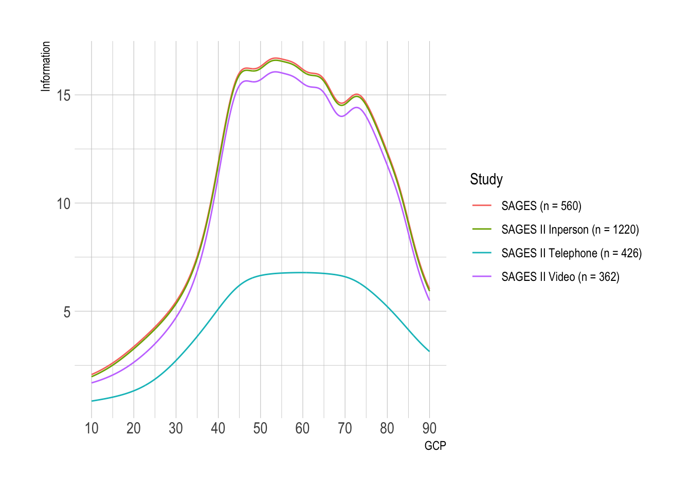
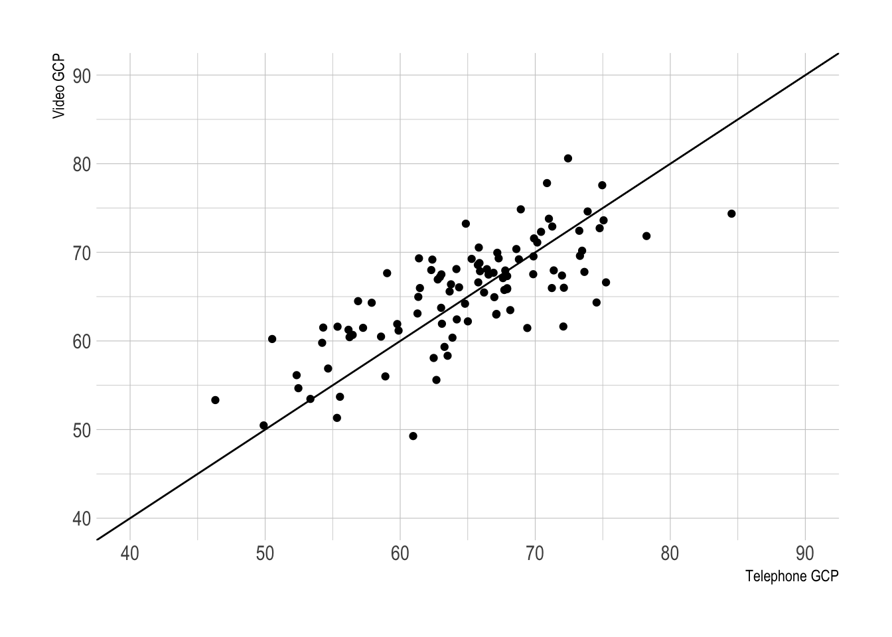
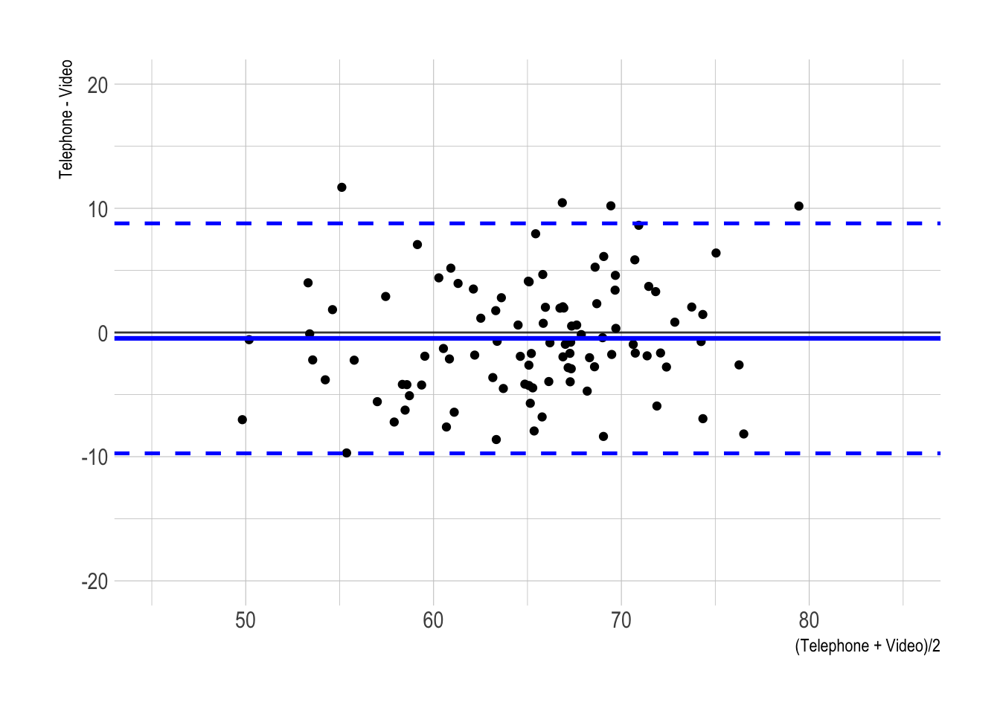
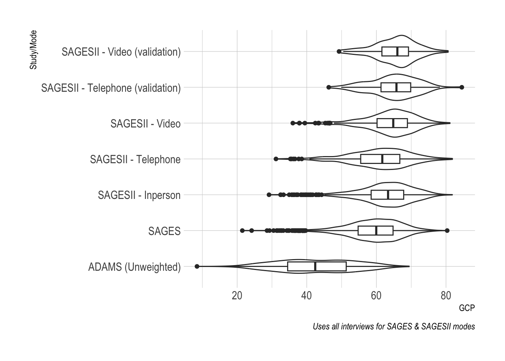

::: {.cell}

:::


::: callout-note
-   We adapted an in-person cognitive assessment battery for administration by two alternative modes: telephone and videoconference, in an on-going observational study of cognitive aging and delirium

-   We administered all three modes (in-person, telephone, videoconference) in an on-going observational study of older surgical patients.

-   We co-calibrated the scores across mode using item response theory (we placed the scores on the same metric)

-   We compare the measurement precision (reliability) by mode:

-   We contrast the external predictive (and postdictive) validity by mode (association with age, education, and mean change after surgery).
:::

# Differences in GCP from the previous version

There were several different ways we considered harmonizing the test batteries to account for some mistakes and questionable assumptions.

The mistake was when we categorized the test scores into bins, the top two categories were combined into the same bin.

-   Tests this issue affected: VSAT, HVLT total, HVLT delayed and Digit symbol substitution

The questionable assumptions were deciding whether measures of letter fluency and semantic fluency were equivalent. For letter fluency there were three options we considered and for semantic fluency there were two options we considered.

-   Letter fluency:

    -   FAS and FCL summed and deemed equivalent

    -   FAS and FCL as individual tests, F are deemed equivalent, the other letters are not deemed equivalent

    -   FAS and FCL summed but **not** deemed equivalent

-   Semantic fluency:

    -   Animal naming and supermarket item naming are deemed equivalent

    -   Animal naming and supermarket item naming are **not** deemed equivalent

With these as the possible choices, we decided to go with the version that fixes the coding mistakes, FAS/FCL summed but not equivalent and animal/supermarket naming not equivalent.

## @fig-timeline: Timeline of SAGES-I and SAGES-II


:::{.cell .fig-cap-location-top}

:::{.cell-output-display}

:::{#fig-timeline}

<p >

<pre class="mermaid" data-tooltip-selector="#mermaid-tooltip-1">
sequenceDiagram
  participant Before times
  participant After times
  Before times ->>After times: COVID
  Note left of Before times: SAGES II starts enrollment
  Note right of After times: Neuropsych testing procedures updated
</pre>

<div id="mermaid-tooltip-1" class="mermaidTooltip"></div>
</p>


Timeline of SAGES-I and SAGES-II and the development/roll-out of novel assessment modes
:::
:::
:::


@fig-timeline is meant to show the development/refinement of the neuropsych testing procedures due to COVID.

::: callout-note
This needs to be sketched out by Eva/Tamara/Field staff.
:::

## @tbl-descriptives: Sample characteristics


::: {#tbl-descriptives .cell .tbl-cap-location-top tbl-cap='Sample characteristics'}
::: {.cell-output-display}

```{=html}
<div id="qaecgdaxnk" style="overflow-x:auto;overflow-y:auto;width:auto;height:auto;">
<style>html {
  font-family: -apple-system, BlinkMacSystemFont, 'Segoe UI', Roboto, Oxygen, Ubuntu, Cantarell, 'Helvetica Neue', 'Fira Sans', 'Droid Sans', Arial, sans-serif;
}

#qaecgdaxnk .gt_table {
  display: table;
  border-collapse: collapse;
  margin-left: auto;
  margin-right: auto;
  color: #333333;
  font-size: 16px;
  font-weight: normal;
  font-style: normal;
  background-color: #FFFFFF;
  width: auto;
  border-top-style: solid;
  border-top-width: 2px;
  border-top-color: #A8A8A8;
  border-right-style: none;
  border-right-width: 2px;
  border-right-color: #D3D3D3;
  border-bottom-style: solid;
  border-bottom-width: 2px;
  border-bottom-color: #A8A8A8;
  border-left-style: none;
  border-left-width: 2px;
  border-left-color: #D3D3D3;
}

#qaecgdaxnk .gt_heading {
  background-color: #FFFFFF;
  text-align: center;
  border-bottom-color: #FFFFFF;
  border-left-style: none;
  border-left-width: 1px;
  border-left-color: #D3D3D3;
  border-right-style: none;
  border-right-width: 1px;
  border-right-color: #D3D3D3;
}

#qaecgdaxnk .gt_title {
  color: #333333;
  font-size: 125%;
  font-weight: initial;
  padding-top: 4px;
  padding-bottom: 4px;
  padding-left: 5px;
  padding-right: 5px;
  border-bottom-color: #FFFFFF;
  border-bottom-width: 0;
}

#qaecgdaxnk .gt_subtitle {
  color: #333333;
  font-size: 85%;
  font-weight: initial;
  padding-top: 0;
  padding-bottom: 6px;
  padding-left: 5px;
  padding-right: 5px;
  border-top-color: #FFFFFF;
  border-top-width: 0;
}

#qaecgdaxnk .gt_bottom_border {
  border-bottom-style: solid;
  border-bottom-width: 2px;
  border-bottom-color: #D3D3D3;
}

#qaecgdaxnk .gt_col_headings {
  border-top-style: solid;
  border-top-width: 2px;
  border-top-color: #D3D3D3;
  border-bottom-style: solid;
  border-bottom-width: 2px;
  border-bottom-color: #D3D3D3;
  border-left-style: none;
  border-left-width: 1px;
  border-left-color: #D3D3D3;
  border-right-style: none;
  border-right-width: 1px;
  border-right-color: #D3D3D3;
}

#qaecgdaxnk .gt_col_heading {
  color: #333333;
  background-color: #FFFFFF;
  font-size: 100%;
  font-weight: normal;
  text-transform: inherit;
  border-left-style: none;
  border-left-width: 1px;
  border-left-color: #D3D3D3;
  border-right-style: none;
  border-right-width: 1px;
  border-right-color: #D3D3D3;
  vertical-align: bottom;
  padding-top: 5px;
  padding-bottom: 6px;
  padding-left: 5px;
  padding-right: 5px;
  overflow-x: hidden;
}

#qaecgdaxnk .gt_column_spanner_outer {
  color: #333333;
  background-color: #FFFFFF;
  font-size: 100%;
  font-weight: normal;
  text-transform: inherit;
  padding-top: 0;
  padding-bottom: 0;
  padding-left: 4px;
  padding-right: 4px;
}

#qaecgdaxnk .gt_column_spanner_outer:first-child {
  padding-left: 0;
}

#qaecgdaxnk .gt_column_spanner_outer:last-child {
  padding-right: 0;
}

#qaecgdaxnk .gt_column_spanner {
  border-bottom-style: solid;
  border-bottom-width: 2px;
  border-bottom-color: #D3D3D3;
  vertical-align: bottom;
  padding-top: 5px;
  padding-bottom: 5px;
  overflow-x: hidden;
  display: inline-block;
  width: 100%;
}

#qaecgdaxnk .gt_group_heading {
  padding-top: 8px;
  padding-bottom: 8px;
  padding-left: 5px;
  padding-right: 5px;
  color: #333333;
  background-color: #FFFFFF;
  font-size: 100%;
  font-weight: initial;
  text-transform: inherit;
  border-top-style: solid;
  border-top-width: 2px;
  border-top-color: #D3D3D3;
  border-bottom-style: solid;
  border-bottom-width: 2px;
  border-bottom-color: #D3D3D3;
  border-left-style: none;
  border-left-width: 1px;
  border-left-color: #D3D3D3;
  border-right-style: none;
  border-right-width: 1px;
  border-right-color: #D3D3D3;
  vertical-align: middle;
}

#qaecgdaxnk .gt_empty_group_heading {
  padding: 0.5px;
  color: #333333;
  background-color: #FFFFFF;
  font-size: 100%;
  font-weight: initial;
  border-top-style: solid;
  border-top-width: 2px;
  border-top-color: #D3D3D3;
  border-bottom-style: solid;
  border-bottom-width: 2px;
  border-bottom-color: #D3D3D3;
  vertical-align: middle;
}

#qaecgdaxnk .gt_from_md > :first-child {
  margin-top: 0;
}

#qaecgdaxnk .gt_from_md > :last-child {
  margin-bottom: 0;
}

#qaecgdaxnk .gt_row {
  padding-top: 8px;
  padding-bottom: 8px;
  padding-left: 5px;
  padding-right: 5px;
  margin: 10px;
  border-top-style: solid;
  border-top-width: 1px;
  border-top-color: #D3D3D3;
  border-left-style: none;
  border-left-width: 1px;
  border-left-color: #D3D3D3;
  border-right-style: none;
  border-right-width: 1px;
  border-right-color: #D3D3D3;
  vertical-align: middle;
  overflow-x: hidden;
}

#qaecgdaxnk .gt_stub {
  color: #333333;
  background-color: #FFFFFF;
  font-size: 100%;
  font-weight: initial;
  text-transform: inherit;
  border-right-style: solid;
  border-right-width: 2px;
  border-right-color: #D3D3D3;
  padding-left: 5px;
  padding-right: 5px;
}

#qaecgdaxnk .gt_stub_row_group {
  color: #333333;
  background-color: #FFFFFF;
  font-size: 100%;
  font-weight: initial;
  text-transform: inherit;
  border-right-style: solid;
  border-right-width: 2px;
  border-right-color: #D3D3D3;
  padding-left: 5px;
  padding-right: 5px;
  vertical-align: top;
}

#qaecgdaxnk .gt_row_group_first td {
  border-top-width: 2px;
}

#qaecgdaxnk .gt_summary_row {
  color: #333333;
  background-color: #FFFFFF;
  text-transform: inherit;
  padding-top: 8px;
  padding-bottom: 8px;
  padding-left: 5px;
  padding-right: 5px;
}

#qaecgdaxnk .gt_first_summary_row {
  border-top-style: solid;
  border-top-color: #D3D3D3;
}

#qaecgdaxnk .gt_first_summary_row.thick {
  border-top-width: 2px;
}

#qaecgdaxnk .gt_last_summary_row {
  padding-top: 8px;
  padding-bottom: 8px;
  padding-left: 5px;
  padding-right: 5px;
  border-bottom-style: solid;
  border-bottom-width: 2px;
  border-bottom-color: #D3D3D3;
}

#qaecgdaxnk .gt_grand_summary_row {
  color: #333333;
  background-color: #FFFFFF;
  text-transform: inherit;
  padding-top: 8px;
  padding-bottom: 8px;
  padding-left: 5px;
  padding-right: 5px;
}

#qaecgdaxnk .gt_first_grand_summary_row {
  padding-top: 8px;
  padding-bottom: 8px;
  padding-left: 5px;
  padding-right: 5px;
  border-top-style: double;
  border-top-width: 6px;
  border-top-color: #D3D3D3;
}

#qaecgdaxnk .gt_striped {
  background-color: rgba(128, 128, 128, 0.05);
}

#qaecgdaxnk .gt_table_body {
  border-top-style: solid;
  border-top-width: 2px;
  border-top-color: #D3D3D3;
  border-bottom-style: solid;
  border-bottom-width: 2px;
  border-bottom-color: #D3D3D3;
}

#qaecgdaxnk .gt_footnotes {
  color: #333333;
  background-color: #FFFFFF;
  border-bottom-style: none;
  border-bottom-width: 2px;
  border-bottom-color: #D3D3D3;
  border-left-style: none;
  border-left-width: 2px;
  border-left-color: #D3D3D3;
  border-right-style: none;
  border-right-width: 2px;
  border-right-color: #D3D3D3;
}

#qaecgdaxnk .gt_footnote {
  margin: 0px;
  font-size: 90%;
  padding-left: 4px;
  padding-right: 4px;
  padding-left: 5px;
  padding-right: 5px;
}

#qaecgdaxnk .gt_sourcenotes {
  color: #333333;
  background-color: #FFFFFF;
  border-bottom-style: none;
  border-bottom-width: 2px;
  border-bottom-color: #D3D3D3;
  border-left-style: none;
  border-left-width: 2px;
  border-left-color: #D3D3D3;
  border-right-style: none;
  border-right-width: 2px;
  border-right-color: #D3D3D3;
}

#qaecgdaxnk .gt_sourcenote {
  font-size: 90%;
  padding-top: 4px;
  padding-bottom: 4px;
  padding-left: 5px;
  padding-right: 5px;
}

#qaecgdaxnk .gt_left {
  text-align: left;
}

#qaecgdaxnk .gt_center {
  text-align: center;
}

#qaecgdaxnk .gt_right {
  text-align: right;
  font-variant-numeric: tabular-nums;
}

#qaecgdaxnk .gt_font_normal {
  font-weight: normal;
}

#qaecgdaxnk .gt_font_bold {
  font-weight: bold;
}

#qaecgdaxnk .gt_font_italic {
  font-style: italic;
}

#qaecgdaxnk .gt_super {
  font-size: 65%;
}

#qaecgdaxnk .gt_two_val_uncert {
  display: inline-block;
  line-height: 1em;
  text-align: right;
  font-size: 60%;
  vertical-align: -0.25em;
  margin-left: 0.1em;
}

#qaecgdaxnk .gt_footnote_marks {
  font-style: italic;
  font-weight: normal;
  font-size: 75%;
  vertical-align: 0.4em;
}

#qaecgdaxnk .gt_asterisk {
  font-size: 100%;
  vertical-align: 0;
}

#qaecgdaxnk .gt_slash_mark {
  font-size: 0.7em;
  line-height: 0.7em;
  vertical-align: 0.15em;
}

#qaecgdaxnk .gt_fraction_numerator {
  font-size: 0.6em;
  line-height: 0.6em;
  vertical-align: 0.45em;
}

#qaecgdaxnk .gt_fraction_denominator {
  font-size: 0.6em;
  line-height: 0.6em;
  vertical-align: -0.05em;
}
</style>
<table class="gt_table">
  <caption>SAGES II - Baseline interview</caption>
  
  <thead class="gt_col_headings">
    <tr>
      <th class="gt_col_heading gt_columns_bottom_border gt_left" rowspan="1" colspan="1"><strong>Characteristic</strong></th>
      <th class="gt_col_heading gt_columns_bottom_border gt_center" rowspan="1" colspan="1"><strong>N = 420</strong><sup class="gt_footnote_marks">1</sup></th>
    </tr>
  </thead>
  <tbody class="gt_table_body">
    <tr><td class="gt_row gt_left">Female Sex</td>
<td class="gt_row gt_center">271 / 420 (65%)</td></tr>
    <tr><td class="gt_row gt_left">Non white</td>
<td class="gt_row gt_center">52 / 418 (12%)</td></tr>
    <tr><td class="gt_row gt_left" style="text-align: left; text-indent: 10px;">Unknown</td>
<td class="gt_row gt_center">2</td></tr>
    <tr><td class="gt_row gt_left">vdeduc_r</td>
<td class="gt_row gt_center">16.25 (2.67)</td></tr>
    <tr><td class="gt_row gt_left" style="text-align: left; text-indent: 10px;">Unknown</td>
<td class="gt_row gt_center">1</td></tr>
    <tr><td class="gt_row gt_left">Surgery Type</td>
<td class="gt_row gt_center"></td></tr>
    <tr><td class="gt_row gt_left" style="text-align: left; text-indent: 10px;">1</td>
<td class="gt_row gt_center">210 / 419 (50%)</td></tr>
    <tr><td class="gt_row gt_left" style="text-align: left; text-indent: 10px;">2</td>
<td class="gt_row gt_center">160 / 419 (38%)</td></tr>
    <tr><td class="gt_row gt_left" style="text-align: left; text-indent: 10px;">3</td>
<td class="gt_row gt_center">1 / 419 (0.2%)</td></tr>
    <tr><td class="gt_row gt_left" style="text-align: left; text-indent: 10px;">5</td>
<td class="gt_row gt_center">27 / 419 (6.4%)</td></tr>
    <tr><td class="gt_row gt_left" style="text-align: left; text-indent: 10px;">6</td>
<td class="gt_row gt_center">10 / 419 (2.4%)</td></tr>
    <tr><td class="gt_row gt_left" style="text-align: left; text-indent: 10px;">7</td>
<td class="gt_row gt_center">3 / 419 (0.7%)</td></tr>
    <tr><td class="gt_row gt_left" style="text-align: left; text-indent: 10px;">8</td>
<td class="gt_row gt_center">8 / 419 (1.9%)</td></tr>
    <tr><td class="gt_row gt_left" style="text-align: left; text-indent: 10px;">Unknown</td>
<td class="gt_row gt_center">1</td></tr>
    <tr><td class="gt_row gt_left">Geriatric Depression Scale Score [0-15]</td>
<td class="gt_row gt_center">2.47 (2.31)</td></tr>
    <tr><td class="gt_row gt_left">Charlson Comorbidity Index</td>
<td class="gt_row gt_center"></td></tr>
    <tr><td class="gt_row gt_left" style="text-align: left; text-indent: 10px;">0</td>
<td class="gt_row gt_center">160 / 284 (56%)</td></tr>
    <tr><td class="gt_row gt_left" style="text-align: left; text-indent: 10px;">1</td>
<td class="gt_row gt_center">51 / 284 (18%)</td></tr>
    <tr><td class="gt_row gt_left" style="text-align: left; text-indent: 10px;">2</td>
<td class="gt_row gt_center">38 / 284 (13%)</td></tr>
    <tr><td class="gt_row gt_left" style="text-align: left; text-indent: 10px;">3</td>
<td class="gt_row gt_center">17 / 284 (6.0%)</td></tr>
    <tr><td class="gt_row gt_left" style="text-align: left; text-indent: 10px;">4</td>
<td class="gt_row gt_center">6 / 284 (2.1%)</td></tr>
    <tr><td class="gt_row gt_left" style="text-align: left; text-indent: 10px;">5</td>
<td class="gt_row gt_center">7 / 284 (2.5%)</td></tr>
    <tr><td class="gt_row gt_left" style="text-align: left; text-indent: 10px;">6</td>
<td class="gt_row gt_center">1 / 284 (0.4%)</td></tr>
    <tr><td class="gt_row gt_left" style="text-align: left; text-indent: 10px;">8</td>
<td class="gt_row gt_center">2 / 284 (0.7%)</td></tr>
    <tr><td class="gt_row gt_left" style="text-align: left; text-indent: 10px;">9</td>
<td class="gt_row gt_center">2 / 284 (0.7%)</td></tr>
    <tr><td class="gt_row gt_left" style="text-align: left; text-indent: 10px;">Unknown</td>
<td class="gt_row gt_center">136</td></tr>
  </tbody>
  
  <tfoot class="gt_footnotes">
    <tr>
      <td class="gt_footnote" colspan="2"><sup class="gt_footnote_marks">1</sup> n / N (%); Mean (SD)</td>
    </tr>
  </tfoot>
</table>
</div>
```

:::
:::


::: callout-note
This is the descriptive statistics for SAGES II at the baseline interview. In the harmonization analysis, for the telephone/video samples the interviews came (mostly) from the follow-up interviews.
:::

## @tbl-battery: Cognitive tests by mode and study


::: {#tbl-battery .cell .tbl-cap-location-top tbl-cap='Cognitive tests by mode and study'}
::: {.cell-output-display}

```{=html}
<div id="jdtwubuarh" style="overflow-x:auto;overflow-y:auto;width:auto;height:auto;">
<style>html {
  font-family: -apple-system, BlinkMacSystemFont, 'Segoe UI', Roboto, Oxygen, Ubuntu, Cantarell, 'Helvetica Neue', 'Fira Sans', 'Droid Sans', Arial, sans-serif;
}

#jdtwubuarh .gt_table {
  display: table;
  border-collapse: collapse;
  margin-left: auto;
  margin-right: auto;
  color: #333333;
  font-size: 16px;
  font-weight: normal;
  font-style: normal;
  background-color: #FFFFFF;
  width: auto;
  border-top-style: solid;
  border-top-width: 2px;
  border-top-color: #A8A8A8;
  border-right-style: none;
  border-right-width: 2px;
  border-right-color: #D3D3D3;
  border-bottom-style: solid;
  border-bottom-width: 2px;
  border-bottom-color: #A8A8A8;
  border-left-style: none;
  border-left-width: 2px;
  border-left-color: #D3D3D3;
}

#jdtwubuarh .gt_heading {
  background-color: #FFFFFF;
  text-align: center;
  border-bottom-color: #FFFFFF;
  border-left-style: none;
  border-left-width: 1px;
  border-left-color: #D3D3D3;
  border-right-style: none;
  border-right-width: 1px;
  border-right-color: #D3D3D3;
}

#jdtwubuarh .gt_title {
  color: #333333;
  font-size: 125%;
  font-weight: initial;
  padding-top: 4px;
  padding-bottom: 4px;
  padding-left: 5px;
  padding-right: 5px;
  border-bottom-color: #FFFFFF;
  border-bottom-width: 0;
}

#jdtwubuarh .gt_subtitle {
  color: #333333;
  font-size: 85%;
  font-weight: initial;
  padding-top: 0;
  padding-bottom: 6px;
  padding-left: 5px;
  padding-right: 5px;
  border-top-color: #FFFFFF;
  border-top-width: 0;
}

#jdtwubuarh .gt_bottom_border {
  border-bottom-style: solid;
  border-bottom-width: 2px;
  border-bottom-color: #D3D3D3;
}

#jdtwubuarh .gt_col_headings {
  border-top-style: solid;
  border-top-width: 2px;
  border-top-color: #D3D3D3;
  border-bottom-style: solid;
  border-bottom-width: 2px;
  border-bottom-color: #D3D3D3;
  border-left-style: none;
  border-left-width: 1px;
  border-left-color: #D3D3D3;
  border-right-style: none;
  border-right-width: 1px;
  border-right-color: #D3D3D3;
}

#jdtwubuarh .gt_col_heading {
  color: #333333;
  background-color: #FFFFFF;
  font-size: 100%;
  font-weight: normal;
  text-transform: inherit;
  border-left-style: none;
  border-left-width: 1px;
  border-left-color: #D3D3D3;
  border-right-style: none;
  border-right-width: 1px;
  border-right-color: #D3D3D3;
  vertical-align: bottom;
  padding-top: 5px;
  padding-bottom: 6px;
  padding-left: 5px;
  padding-right: 5px;
  overflow-x: hidden;
}

#jdtwubuarh .gt_column_spanner_outer {
  color: #333333;
  background-color: #FFFFFF;
  font-size: 100%;
  font-weight: normal;
  text-transform: inherit;
  padding-top: 0;
  padding-bottom: 0;
  padding-left: 4px;
  padding-right: 4px;
}

#jdtwubuarh .gt_column_spanner_outer:first-child {
  padding-left: 0;
}

#jdtwubuarh .gt_column_spanner_outer:last-child {
  padding-right: 0;
}

#jdtwubuarh .gt_column_spanner {
  border-bottom-style: solid;
  border-bottom-width: 2px;
  border-bottom-color: #D3D3D3;
  vertical-align: bottom;
  padding-top: 5px;
  padding-bottom: 5px;
  overflow-x: hidden;
  display: inline-block;
  width: 100%;
}

#jdtwubuarh .gt_group_heading {
  padding-top: 8px;
  padding-bottom: 8px;
  padding-left: 5px;
  padding-right: 5px;
  color: #333333;
  background-color: #FFFFFF;
  font-size: 100%;
  font-weight: initial;
  text-transform: inherit;
  border-top-style: solid;
  border-top-width: 2px;
  border-top-color: #D3D3D3;
  border-bottom-style: solid;
  border-bottom-width: 2px;
  border-bottom-color: #D3D3D3;
  border-left-style: none;
  border-left-width: 1px;
  border-left-color: #D3D3D3;
  border-right-style: none;
  border-right-width: 1px;
  border-right-color: #D3D3D3;
  vertical-align: middle;
}

#jdtwubuarh .gt_empty_group_heading {
  padding: 0.5px;
  color: #333333;
  background-color: #FFFFFF;
  font-size: 100%;
  font-weight: initial;
  border-top-style: solid;
  border-top-width: 2px;
  border-top-color: #D3D3D3;
  border-bottom-style: solid;
  border-bottom-width: 2px;
  border-bottom-color: #D3D3D3;
  vertical-align: middle;
}

#jdtwubuarh .gt_from_md > :first-child {
  margin-top: 0;
}

#jdtwubuarh .gt_from_md > :last-child {
  margin-bottom: 0;
}

#jdtwubuarh .gt_row {
  padding-top: 8px;
  padding-bottom: 8px;
  padding-left: 5px;
  padding-right: 5px;
  margin: 10px;
  border-top-style: solid;
  border-top-width: 1px;
  border-top-color: #D3D3D3;
  border-left-style: none;
  border-left-width: 1px;
  border-left-color: #D3D3D3;
  border-right-style: none;
  border-right-width: 1px;
  border-right-color: #D3D3D3;
  vertical-align: middle;
  overflow-x: hidden;
}

#jdtwubuarh .gt_stub {
  color: #333333;
  background-color: #FFFFFF;
  font-size: 100%;
  font-weight: initial;
  text-transform: inherit;
  border-right-style: solid;
  border-right-width: 2px;
  border-right-color: #D3D3D3;
  padding-left: 5px;
  padding-right: 5px;
}

#jdtwubuarh .gt_stub_row_group {
  color: #333333;
  background-color: #FFFFFF;
  font-size: 100%;
  font-weight: initial;
  text-transform: inherit;
  border-right-style: solid;
  border-right-width: 2px;
  border-right-color: #D3D3D3;
  padding-left: 5px;
  padding-right: 5px;
  vertical-align: top;
}

#jdtwubuarh .gt_row_group_first td {
  border-top-width: 2px;
}

#jdtwubuarh .gt_summary_row {
  color: #333333;
  background-color: #FFFFFF;
  text-transform: inherit;
  padding-top: 8px;
  padding-bottom: 8px;
  padding-left: 5px;
  padding-right: 5px;
}

#jdtwubuarh .gt_first_summary_row {
  border-top-style: solid;
  border-top-color: #D3D3D3;
}

#jdtwubuarh .gt_first_summary_row.thick {
  border-top-width: 2px;
}

#jdtwubuarh .gt_last_summary_row {
  padding-top: 8px;
  padding-bottom: 8px;
  padding-left: 5px;
  padding-right: 5px;
  border-bottom-style: solid;
  border-bottom-width: 2px;
  border-bottom-color: #D3D3D3;
}

#jdtwubuarh .gt_grand_summary_row {
  color: #333333;
  background-color: #FFFFFF;
  text-transform: inherit;
  padding-top: 8px;
  padding-bottom: 8px;
  padding-left: 5px;
  padding-right: 5px;
}

#jdtwubuarh .gt_first_grand_summary_row {
  padding-top: 8px;
  padding-bottom: 8px;
  padding-left: 5px;
  padding-right: 5px;
  border-top-style: double;
  border-top-width: 6px;
  border-top-color: #D3D3D3;
}

#jdtwubuarh .gt_striped {
  background-color: rgba(128, 128, 128, 0.05);
}

#jdtwubuarh .gt_table_body {
  border-top-style: solid;
  border-top-width: 2px;
  border-top-color: #D3D3D3;
  border-bottom-style: solid;
  border-bottom-width: 2px;
  border-bottom-color: #D3D3D3;
}

#jdtwubuarh .gt_footnotes {
  color: #333333;
  background-color: #FFFFFF;
  border-bottom-style: none;
  border-bottom-width: 2px;
  border-bottom-color: #D3D3D3;
  border-left-style: none;
  border-left-width: 2px;
  border-left-color: #D3D3D3;
  border-right-style: none;
  border-right-width: 2px;
  border-right-color: #D3D3D3;
}

#jdtwubuarh .gt_footnote {
  margin: 0px;
  font-size: 90%;
  padding-left: 4px;
  padding-right: 4px;
  padding-left: 5px;
  padding-right: 5px;
}

#jdtwubuarh .gt_sourcenotes {
  color: #333333;
  background-color: #FFFFFF;
  border-bottom-style: none;
  border-bottom-width: 2px;
  border-bottom-color: #D3D3D3;
  border-left-style: none;
  border-left-width: 2px;
  border-left-color: #D3D3D3;
  border-right-style: none;
  border-right-width: 2px;
  border-right-color: #D3D3D3;
}

#jdtwubuarh .gt_sourcenote {
  font-size: 90%;
  padding-top: 4px;
  padding-bottom: 4px;
  padding-left: 5px;
  padding-right: 5px;
}

#jdtwubuarh .gt_left {
  text-align: left;
}

#jdtwubuarh .gt_center {
  text-align: center;
}

#jdtwubuarh .gt_right {
  text-align: right;
  font-variant-numeric: tabular-nums;
}

#jdtwubuarh .gt_font_normal {
  font-weight: normal;
}

#jdtwubuarh .gt_font_bold {
  font-weight: bold;
}

#jdtwubuarh .gt_font_italic {
  font-style: italic;
}

#jdtwubuarh .gt_super {
  font-size: 65%;
}

#jdtwubuarh .gt_two_val_uncert {
  display: inline-block;
  line-height: 1em;
  text-align: right;
  font-size: 60%;
  vertical-align: -0.25em;
  margin-left: 0.1em;
}

#jdtwubuarh .gt_footnote_marks {
  font-style: italic;
  font-weight: normal;
  font-size: 75%;
  vertical-align: 0.4em;
}

#jdtwubuarh .gt_asterisk {
  font-size: 100%;
  vertical-align: 0;
}

#jdtwubuarh .gt_slash_mark {
  font-size: 0.7em;
  line-height: 0.7em;
  vertical-align: 0.15em;
}

#jdtwubuarh .gt_fraction_numerator {
  font-size: 0.6em;
  line-height: 0.6em;
  vertical-align: 0.45em;
}

#jdtwubuarh .gt_fraction_denominator {
  font-size: 0.6em;
  line-height: 0.6em;
  vertical-align: -0.05em;
}
</style>
<table class="gt_table">
  
  <thead class="gt_col_headings">
    <tr>
      <th class="gt_col_heading gt_columns_bottom_border gt_center" rowspan="2" colspan="1">item_label</th>
      <th class="gt_center gt_columns_top_border gt_column_spanner_outer" rowspan="1" colspan="5">
        <span class="gt_column_spanner">Study/Mode</span>
      </th>
    </tr>
    <tr>
      <th class="gt_col_heading gt_columns_bottom_border gt_center" rowspan="1" colspan="1">HRS_ADAMS</th>
      <th class="gt_col_heading gt_columns_bottom_border gt_center" rowspan="1" colspan="1">SAGES</th>
      <th class="gt_col_heading gt_columns_bottom_border gt_center" rowspan="1" colspan="1">SAGESII_Inperson</th>
      <th class="gt_col_heading gt_columns_bottom_border gt_center" rowspan="1" colspan="1">SAGESII_Telephone</th>
      <th class="gt_col_heading gt_columns_bottom_border gt_center" rowspan="1" colspan="1">SAGESII_Video</th>
    </tr>
  </thead>
  <tbody class="gt_table_body">
    <tr class="gt_group_heading_row">
      <td colspan="6" class="gt_group_heading">Attention/Executive Function</td>
    </tr>
    <tr class="gt_row_group_first"><td class="gt_row gt_center">Trails A (time, deciles)</td>
<td class="gt_row gt_center">X</td>
<td class="gt_row gt_center">X</td>
<td class="gt_row gt_center">X</td>
<td class="gt_row gt_center"></td>
<td class="gt_row gt_center">X</td></tr>
    <tr><td class="gt_row gt_center">Digit Span Forward</td>
<td class="gt_row gt_center">X</td>
<td class="gt_row gt_center">X</td>
<td class="gt_row gt_center">X</td>
<td class="gt_row gt_center">X</td>
<td class="gt_row gt_center">X</td></tr>
    <tr><td class="gt_row gt_center">Digit Span Backward</td>
<td class="gt_row gt_center">X</td>
<td class="gt_row gt_center">X</td>
<td class="gt_row gt_center">X</td>
<td class="gt_row gt_center">X</td>
<td class="gt_row gt_center">X</td></tr>
    <tr><td class="gt_row gt_center">Symbol Digit Modalities</td>
<td class="gt_row gt_center">X</td>
<td class="gt_row gt_center"></td>
<td class="gt_row gt_center"></td>
<td class="gt_row gt_center"></td>
<td class="gt_row gt_center"></td></tr>
    <tr><td class="gt_row gt_center">Visual Search and Attention Task (VSAT) number of targets (octile)</td>
<td class="gt_row gt_center"></td>
<td class="gt_row gt_center">X</td>
<td class="gt_row gt_center">X</td>
<td class="gt_row gt_center"></td>
<td class="gt_row gt_center">X</td></tr>
    <tr><td class="gt_row gt_center">Digit Symbol Substitution (aka rbans) (octile)</td>
<td class="gt_row gt_center"></td>
<td class="gt_row gt_center">X</td>
<td class="gt_row gt_center">X</td>
<td class="gt_row gt_center"></td>
<td class="gt_row gt_center">X</td></tr>
    <tr><td class="gt_row gt_center">Oral Trails A Telephone Time to complete</td>
<td class="gt_row gt_center"></td>
<td class="gt_row gt_center"></td>
<td class="gt_row gt_center"></td>
<td class="gt_row gt_center">X</td>
<td class="gt_row gt_center"></td></tr>
    <tr><td class="gt_row gt_center">Trails B (time, deciles)</td>
<td class="gt_row gt_center">X</td>
<td class="gt_row gt_center">X</td>
<td class="gt_row gt_center">X</td>
<td class="gt_row gt_center"></td>
<td class="gt_row gt_center">X</td></tr>
    <tr><td class="gt_row gt_center">Oral Trails B Telephone Time to complete</td>
<td class="gt_row gt_center"></td>
<td class="gt_row gt_center"></td>
<td class="gt_row gt_center"></td>
<td class="gt_row gt_center">X</td>
<td class="gt_row gt_center"></td></tr>
    <tr class="gt_group_heading_row">
      <td colspan="6" class="gt_group_heading">Language</td>
    </tr>
    <tr class="gt_row_group_first"><td class="gt_row gt_center">CERAD Animal Fluency</td>
<td class="gt_row gt_center">X</td>
<td class="gt_row gt_center"></td>
<td class="gt_row gt_center"></td>
<td class="gt_row gt_center"></td>
<td class="gt_row gt_center"></td></tr>
    <tr><td class="gt_row gt_center">Boston Naming Test, 15 Items</td>
<td class="gt_row gt_center">X</td>
<td class="gt_row gt_center">X</td>
<td class="gt_row gt_center">X</td>
<td class="gt_row gt_center"></td>
<td class="gt_row gt_center">X</td></tr>
    <tr><td class="gt_row gt_center">Letter fluency CFL (Controlled Oral Word Association Test (COWAT))</td>
<td class="gt_row gt_center">X</td>
<td class="gt_row gt_center"></td>
<td class="gt_row gt_center"></td>
<td class="gt_row gt_center"></td>
<td class="gt_row gt_center"></td></tr>
    <tr><td class="gt_row gt_center">Semantic fluency - supermarket (SAGES deciles)</td>
<td class="gt_row gt_center"></td>
<td class="gt_row gt_center">X</td>
<td class="gt_row gt_center">X</td>
<td class="gt_row gt_center">X</td>
<td class="gt_row gt_center">X</td></tr>
    <tr><td class="gt_row gt_center">Letter Fluency (FAS) (Sages deciles)</td>
<td class="gt_row gt_center"></td>
<td class="gt_row gt_center">X</td>
<td class="gt_row gt_center">X</td>
<td class="gt_row gt_center">X</td>
<td class="gt_row gt_center">X</td></tr>
    <tr><td class="gt_row gt_center">Category switching (Total number of correct switches)</td>
<td class="gt_row gt_center"></td>
<td class="gt_row gt_center"></td>
<td class="gt_row gt_center"></td>
<td class="gt_row gt_center">X</td>
<td class="gt_row gt_center"></td></tr>
    <tr class="gt_group_heading_row">
      <td colspan="6" class="gt_group_heading">Memory</td>
    </tr>
    <tr class="gt_row_group_first"><td class="gt_row gt_center">CERAD sum of learning trials nonile</td>
<td class="gt_row gt_center">X</td>
<td class="gt_row gt_center"></td>
<td class="gt_row gt_center"></td>
<td class="gt_row gt_center"></td>
<td class="gt_row gt_center"></td></tr>
    <tr><td class="gt_row gt_center">CERAD Delayed Word Recall, percent nonile</td>
<td class="gt_row gt_center">X</td>
<td class="gt_row gt_center"></td>
<td class="gt_row gt_center"></td>
<td class="gt_row gt_center"></td>
<td class="gt_row gt_center"></td></tr>
    <tr><td class="gt_row gt_center">HVLT Trial 1-3 nonile (not nonile)</td>
<td class="gt_row gt_center"></td>
<td class="gt_row gt_center">X</td>
<td class="gt_row gt_center">X</td>
<td class="gt_row gt_center">X</td>
<td class="gt_row gt_center">X</td></tr>
    <tr><td class="gt_row gt_center">HVLT Delayed Recall Percent (octile)</td>
<td class="gt_row gt_center"></td>
<td class="gt_row gt_center">X</td>
<td class="gt_row gt_center">X</td>
<td class="gt_row gt_center">X</td>
<td class="gt_row gt_center">X</td></tr>
  </tbody>
  
  
</table>
</div>
```

:::
:::


@tbl-battery shows the neuropsych tests used in the different studys/modes.

## @fig-info: Test Information by mode and study


::: {.cell .fig-cap-location-top}
::: {.cell-output-display}
{#fig-info width=672}
:::
:::


@fig-info shows the information plot.

::: callout-note
The cognitive test battery was the same for SAGES I - In-person, SAGES II - In-person, and SAGES II - Video. This means their Information curves would overlap. I shifted the curves by a small amount so they would be distinct.
:::

## @fig-video-vs-telephone: Agreement by mode


::: {.cell}

:::


@tbl-Deming-regression shows the results of Deming regression of telephone and video interview modes.


::: {#tbl-Deming-regression .cell .tbl-cap-location-top tbl-cap='Deming regression results'}
::: {.cell-output-display}

```{=html}
<div id="godptlndak" style="overflow-x:auto;overflow-y:auto;width:auto;height:auto;">
<style>html {
  font-family: -apple-system, BlinkMacSystemFont, 'Segoe UI', Roboto, Oxygen, Ubuntu, Cantarell, 'Helvetica Neue', 'Fira Sans', 'Droid Sans', Arial, sans-serif;
}

#godptlndak .gt_table {
  display: table;
  border-collapse: collapse;
  margin-left: auto;
  margin-right: auto;
  color: #333333;
  font-size: 16px;
  font-weight: normal;
  font-style: normal;
  background-color: #FFFFFF;
  width: auto;
  border-top-style: solid;
  border-top-width: 2px;
  border-top-color: #A8A8A8;
  border-right-style: none;
  border-right-width: 2px;
  border-right-color: #D3D3D3;
  border-bottom-style: solid;
  border-bottom-width: 2px;
  border-bottom-color: #A8A8A8;
  border-left-style: none;
  border-left-width: 2px;
  border-left-color: #D3D3D3;
}

#godptlndak .gt_heading {
  background-color: #FFFFFF;
  text-align: center;
  border-bottom-color: #FFFFFF;
  border-left-style: none;
  border-left-width: 1px;
  border-left-color: #D3D3D3;
  border-right-style: none;
  border-right-width: 1px;
  border-right-color: #D3D3D3;
}

#godptlndak .gt_title {
  color: #333333;
  font-size: 125%;
  font-weight: initial;
  padding-top: 4px;
  padding-bottom: 4px;
  padding-left: 5px;
  padding-right: 5px;
  border-bottom-color: #FFFFFF;
  border-bottom-width: 0;
}

#godptlndak .gt_subtitle {
  color: #333333;
  font-size: 85%;
  font-weight: initial;
  padding-top: 0;
  padding-bottom: 6px;
  padding-left: 5px;
  padding-right: 5px;
  border-top-color: #FFFFFF;
  border-top-width: 0;
}

#godptlndak .gt_bottom_border {
  border-bottom-style: solid;
  border-bottom-width: 2px;
  border-bottom-color: #D3D3D3;
}

#godptlndak .gt_col_headings {
  border-top-style: solid;
  border-top-width: 2px;
  border-top-color: #D3D3D3;
  border-bottom-style: solid;
  border-bottom-width: 2px;
  border-bottom-color: #D3D3D3;
  border-left-style: none;
  border-left-width: 1px;
  border-left-color: #D3D3D3;
  border-right-style: none;
  border-right-width: 1px;
  border-right-color: #D3D3D3;
}

#godptlndak .gt_col_heading {
  color: #333333;
  background-color: #FFFFFF;
  font-size: 100%;
  font-weight: normal;
  text-transform: inherit;
  border-left-style: none;
  border-left-width: 1px;
  border-left-color: #D3D3D3;
  border-right-style: none;
  border-right-width: 1px;
  border-right-color: #D3D3D3;
  vertical-align: bottom;
  padding-top: 5px;
  padding-bottom: 6px;
  padding-left: 5px;
  padding-right: 5px;
  overflow-x: hidden;
}

#godptlndak .gt_column_spanner_outer {
  color: #333333;
  background-color: #FFFFFF;
  font-size: 100%;
  font-weight: normal;
  text-transform: inherit;
  padding-top: 0;
  padding-bottom: 0;
  padding-left: 4px;
  padding-right: 4px;
}

#godptlndak .gt_column_spanner_outer:first-child {
  padding-left: 0;
}

#godptlndak .gt_column_spanner_outer:last-child {
  padding-right: 0;
}

#godptlndak .gt_column_spanner {
  border-bottom-style: solid;
  border-bottom-width: 2px;
  border-bottom-color: #D3D3D3;
  vertical-align: bottom;
  padding-top: 5px;
  padding-bottom: 5px;
  overflow-x: hidden;
  display: inline-block;
  width: 100%;
}

#godptlndak .gt_group_heading {
  padding-top: 8px;
  padding-bottom: 8px;
  padding-left: 5px;
  padding-right: 5px;
  color: #333333;
  background-color: #FFFFFF;
  font-size: 100%;
  font-weight: initial;
  text-transform: inherit;
  border-top-style: solid;
  border-top-width: 2px;
  border-top-color: #D3D3D3;
  border-bottom-style: solid;
  border-bottom-width: 2px;
  border-bottom-color: #D3D3D3;
  border-left-style: none;
  border-left-width: 1px;
  border-left-color: #D3D3D3;
  border-right-style: none;
  border-right-width: 1px;
  border-right-color: #D3D3D3;
  vertical-align: middle;
}

#godptlndak .gt_empty_group_heading {
  padding: 0.5px;
  color: #333333;
  background-color: #FFFFFF;
  font-size: 100%;
  font-weight: initial;
  border-top-style: solid;
  border-top-width: 2px;
  border-top-color: #D3D3D3;
  border-bottom-style: solid;
  border-bottom-width: 2px;
  border-bottom-color: #D3D3D3;
  vertical-align: middle;
}

#godptlndak .gt_from_md > :first-child {
  margin-top: 0;
}

#godptlndak .gt_from_md > :last-child {
  margin-bottom: 0;
}

#godptlndak .gt_row {
  padding-top: 8px;
  padding-bottom: 8px;
  padding-left: 5px;
  padding-right: 5px;
  margin: 10px;
  border-top-style: solid;
  border-top-width: 1px;
  border-top-color: #D3D3D3;
  border-left-style: none;
  border-left-width: 1px;
  border-left-color: #D3D3D3;
  border-right-style: none;
  border-right-width: 1px;
  border-right-color: #D3D3D3;
  vertical-align: middle;
  overflow-x: hidden;
}

#godptlndak .gt_stub {
  color: #333333;
  background-color: #FFFFFF;
  font-size: 100%;
  font-weight: initial;
  text-transform: inherit;
  border-right-style: solid;
  border-right-width: 2px;
  border-right-color: #D3D3D3;
  padding-left: 5px;
  padding-right: 5px;
}

#godptlndak .gt_stub_row_group {
  color: #333333;
  background-color: #FFFFFF;
  font-size: 100%;
  font-weight: initial;
  text-transform: inherit;
  border-right-style: solid;
  border-right-width: 2px;
  border-right-color: #D3D3D3;
  padding-left: 5px;
  padding-right: 5px;
  vertical-align: top;
}

#godptlndak .gt_row_group_first td {
  border-top-width: 2px;
}

#godptlndak .gt_summary_row {
  color: #333333;
  background-color: #FFFFFF;
  text-transform: inherit;
  padding-top: 8px;
  padding-bottom: 8px;
  padding-left: 5px;
  padding-right: 5px;
}

#godptlndak .gt_first_summary_row {
  border-top-style: solid;
  border-top-color: #D3D3D3;
}

#godptlndak .gt_first_summary_row.thick {
  border-top-width: 2px;
}

#godptlndak .gt_last_summary_row {
  padding-top: 8px;
  padding-bottom: 8px;
  padding-left: 5px;
  padding-right: 5px;
  border-bottom-style: solid;
  border-bottom-width: 2px;
  border-bottom-color: #D3D3D3;
}

#godptlndak .gt_grand_summary_row {
  color: #333333;
  background-color: #FFFFFF;
  text-transform: inherit;
  padding-top: 8px;
  padding-bottom: 8px;
  padding-left: 5px;
  padding-right: 5px;
}

#godptlndak .gt_first_grand_summary_row {
  padding-top: 8px;
  padding-bottom: 8px;
  padding-left: 5px;
  padding-right: 5px;
  border-top-style: double;
  border-top-width: 6px;
  border-top-color: #D3D3D3;
}

#godptlndak .gt_striped {
  background-color: rgba(128, 128, 128, 0.05);
}

#godptlndak .gt_table_body {
  border-top-style: solid;
  border-top-width: 2px;
  border-top-color: #D3D3D3;
  border-bottom-style: solid;
  border-bottom-width: 2px;
  border-bottom-color: #D3D3D3;
}

#godptlndak .gt_footnotes {
  color: #333333;
  background-color: #FFFFFF;
  border-bottom-style: none;
  border-bottom-width: 2px;
  border-bottom-color: #D3D3D3;
  border-left-style: none;
  border-left-width: 2px;
  border-left-color: #D3D3D3;
  border-right-style: none;
  border-right-width: 2px;
  border-right-color: #D3D3D3;
}

#godptlndak .gt_footnote {
  margin: 0px;
  font-size: 90%;
  padding-left: 4px;
  padding-right: 4px;
  padding-left: 5px;
  padding-right: 5px;
}

#godptlndak .gt_sourcenotes {
  color: #333333;
  background-color: #FFFFFF;
  border-bottom-style: none;
  border-bottom-width: 2px;
  border-bottom-color: #D3D3D3;
  border-left-style: none;
  border-left-width: 2px;
  border-left-color: #D3D3D3;
  border-right-style: none;
  border-right-width: 2px;
  border-right-color: #D3D3D3;
}

#godptlndak .gt_sourcenote {
  font-size: 90%;
  padding-top: 4px;
  padding-bottom: 4px;
  padding-left: 5px;
  padding-right: 5px;
}

#godptlndak .gt_left {
  text-align: left;
}

#godptlndak .gt_center {
  text-align: center;
}

#godptlndak .gt_right {
  text-align: right;
  font-variant-numeric: tabular-nums;
}

#godptlndak .gt_font_normal {
  font-weight: normal;
}

#godptlndak .gt_font_bold {
  font-weight: bold;
}

#godptlndak .gt_font_italic {
  font-style: italic;
}

#godptlndak .gt_super {
  font-size: 65%;
}

#godptlndak .gt_two_val_uncert {
  display: inline-block;
  line-height: 1em;
  text-align: right;
  font-size: 60%;
  vertical-align: -0.25em;
  margin-left: 0.1em;
}

#godptlndak .gt_footnote_marks {
  font-style: italic;
  font-weight: normal;
  font-size: 75%;
  vertical-align: 0.4em;
}

#godptlndak .gt_asterisk {
  font-size: 100%;
  vertical-align: 0;
}

#godptlndak .gt_slash_mark {
  font-size: 0.7em;
  line-height: 0.7em;
  vertical-align: 0.15em;
}

#godptlndak .gt_fraction_numerator {
  font-size: 0.6em;
  line-height: 0.6em;
  vertical-align: 0.45em;
}

#godptlndak .gt_fraction_denominator {
  font-size: 0.6em;
  line-height: 0.6em;
  vertical-align: -0.05em;
}
</style>
<table class="gt_table">
  
  <thead class="gt_col_headings">
    <tr>
      <th class="gt_col_heading gt_columns_bottom_border gt_right" rowspan="1" colspan="1">EST</th>
      <th class="gt_col_heading gt_columns_bottom_border gt_right" rowspan="1" colspan="1">LCI</th>
      <th class="gt_col_heading gt_columns_bottom_border gt_right" rowspan="1" colspan="1">UCI</th>
    </tr>
  </thead>
  <tbody class="gt_table_body">
    <tr><td class="gt_row gt_right">11.44</td>
<td class="gt_row gt_right">&minus;0.03</td>
<td class="gt_row gt_right">21.48</td></tr>
    <tr><td class="gt_row gt_right">0.83</td>
<td class="gt_row gt_right">0.67</td>
<td class="gt_row gt_right">1.00</td></tr>
  </tbody>
  
  
</table>
</div>
```

:::
:::

::: {.cell .fig-cap-location-top}
::: {.cell-output-display}
{#fig-video-vs-telephone width=672}
:::
:::


The correlation of GCP between telephone and video interviews is: 0.75.


::: {.cell .fig-cap-location-top}
::: {.cell-output-display}
{#fig-bland-altman width=672}
:::
:::


## (Table 3): Validation study results

## @fig-gcp-boxplots: GCP by study


::: {.cell .fig-cap-location-top}
::: {.cell-output-display}
{#fig-gcp-boxplots width=672}
:::
:::


::: {.callout-note collapse="true"}
## Expand to see the R session information


::: {.cell}
::: {.cell-output .cell-output-stdout}
```
R version 4.0.3 (2020-10-10)
Platform: x86_64-apple-darwin17.0 (64-bit)
Running under: macOS Big Sur 10.16

Matrix products: default
BLAS:   /Library/Frameworks/R.framework/Versions/4.0/Resources/lib/libRblas.dylib
LAPACK: /Library/Frameworks/R.framework/Versions/4.0/Resources/lib/libRlapack.dylib

locale:
[1] en_US.UTF-8/en_US.UTF-8/en_US.UTF-8/C/en_US.UTF-8/en_US.UTF-8

attached base packages:
[1] stats     graphics  grDevices utils     datasets  methods   base     

other attached packages:
 [1] QSPthemes_0.1.0     ggsci_2.9           ggrepel_0.9.1      
 [4] googlesheets4_1.0.0 here_1.0.1          fs_1.5.2           
 [7] kableExtra_1.3.4    knitr_1.37          haven_2.5.0        
[10] readxl_1.3.1        forcats_0.5.1       stringr_1.4.0      
[13] dplyr_1.0.9         purrr_0.3.4         readr_2.1.2        
[16] tidyr_1.1.4         tibble_3.1.6        ggplot2_3.3.5      
[19] tidyverse_1.3.2    

loaded via a namespace (and not attached):
 [1] nlme_3.1-152        lubridate_1.8.0     webshot_0.5.2      
 [4] httr_1.4.2          rprojroot_2.0.2     tools_4.0.3        
 [7] backports_1.2.1     utf8_1.1.4          R6_2.5.1           
[10] DBI_1.1.1           mgcv_1.8-34         colorspace_2.0-0   
[13] withr_2.4.1         tidyselect_1.1.2    compiler_4.0.3     
[16] extrafontdb_1.0     cli_3.3.0           mcr_1.2.2          
[19] rvest_1.0.2         gt_0.6.0            xml2_1.3.3         
[22] labeling_0.4.2      sass_0.4.1          scales_1.2.0       
[25] checkmate_2.0.0     commonmark_1.7      systemfonts_1.0.1  
[28] digest_0.6.29       rmarkdown_2.14      svglite_2.0.0      
[31] pkgconfig_2.0.3     htmltools_0.5.3     extrafont_0.17     
[34] dbplyr_2.2.1        fastmap_1.1.0       htmlwidgets_1.5.3  
[37] rlang_1.0.4         rstudioapi_0.13     generics_0.1.0     
[40] farver_2.1.0        jsonlite_1.7.2      magrittr_2.0.3     
[43] Matrix_1.3-2        Rcpp_1.0.8          munsell_0.5.0      
[46] fansi_0.4.2         gdtools_0.2.3       lifecycle_1.0.1    
[49] stringi_1.5.3       yaml_2.2.1          gtsummary_1.6.1    
[52] QSPworkflow_0.1.0   grid_4.0.3          hrbrthemes_0.8.0   
[55] crayon_1.5.1        lattice_0.20-41     splines_4.0.3      
[58] hms_1.1.1           pillar_1.6.5        reprex_2.0.1       
[61] glue_1.6.1          evaluate_0.14       broom.helpers_1.8.0
[64] modelr_0.1.8        vctrs_0.4.1         tzdb_0.3.0         
[67] Rttf2pt1_1.3.8      cellranger_1.1.0    gtable_0.3.0       
[70] assertthat_0.2.1    xfun_0.31           broom_1.0.0        
[73] googledrive_2.0.0   viridisLite_0.3.0   gargle_1.2.0       
[76] ellipsis_0.3.2     
```
:::
:::

:::
