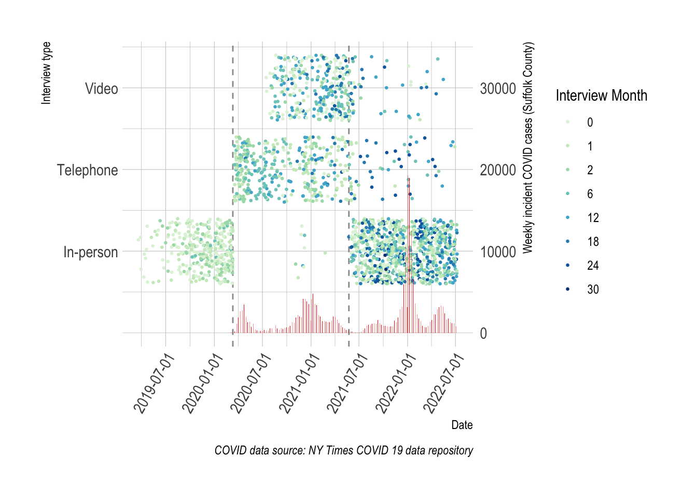
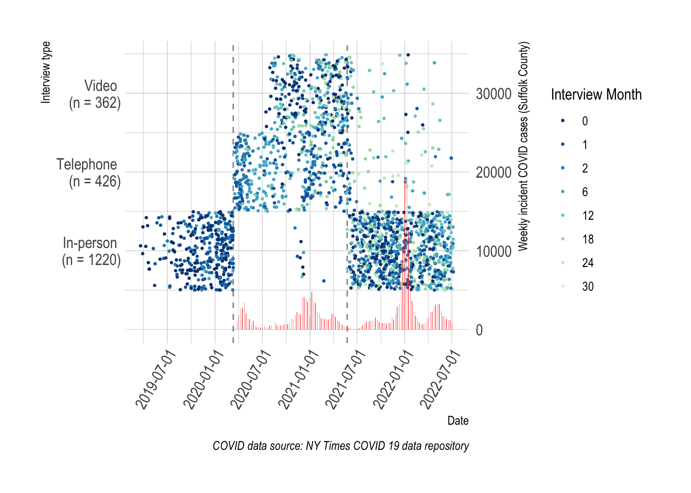

::: {.cell}

:::


::: callout-note
-   We adapted an in-person cognitive assessment battery for administration by two alternative modes: telephone and videoconference, in an on-going observational study of cognitive aging and delirium

-   We administered all three modes (in-person, telephone, videoconference) in an on-going observational study of older surgical patients.

-   We co-calibrated the scores across mode using item response theory (we placed the scores on the same metric)

-   We compare the measurement precision (reliability) by mode:

-   We contrast the external predictive (and postdictive) validity by mode (association with age, education, and mean change after surgery).
:::

# Differences in GCP from the previous version

There were several different ways we considered harmonizing the test batteries to account for some mistakes and questionable assumptions.

The mistake was when we categorized the test scores into bins, the top two categories were combined into the same bin.

-   Tests this issue affected: VSAT, HVLT total, HVLT delayed and Digit symbol substitution

The questionable assumptions were deciding whether measures of letter fluency and semantic fluency were equivalent. For letter fluency there were three options we considered and for semantic fluency there were two options we considered.

-   Letter fluency:

    -   FAS and FCL summed and deemed equivalent

    -   FAS and FCL as individual tests, F are deemed equivalent, the other letters are not deemed equivalent

    -   FAS and FCL summed but **not** deemed equivalent

-   Semantic fluency:

    -   Animal naming and supermarket item naming are deemed equivalent

    -   Animal naming and supermarket item naming are **not** deemed equivalent

With these as the possible choices, we decided to go with the version that fixes the coding mistakes, FAS/FCL summed but not equivalent and animal/supermarket naming not equivalent.

# Figure: Timeline of SAGES-II

## @fig-timeline: Timeline of SAGES-II participant interviews


::: {.cell .fig-cap-location-top}
::: {.cell-output-display}
{#fig-timeline width=672}
:::
:::


@fig-timeline shows when different interview modes occurred in SAGES II.

::: callout-note
*   Need the exact dates to use for the two vertical lines. Currently, they are based on the data.
*   Does the COVID data provide useful data? What is the best way to present it? Currently, it only uses Suffolk County data, but it could be expanded to additional counties in the Boston region.
*   Is the color scheme good?
:::

## @fig-timeline-alt1: Timeline of SAGES-II participant interviews


::: {.cell .fig-cap-location-top}
::: {.cell-output-display}
{#fig-timeline-alt1 width=672}
:::
:::


@fig-timeline-alt1 is the same as @fig-timeline but with the color gradient reversed.

## Data quality check

Some of the points in @fig-timeline/@fig-timeline-alt1 appear to have data errors because they are listed as having in-person visits during the shutdown.  The following tables list the studyid and visit date for these participants.  @tbl-data-quality lists the nine records that are listed as being an in-person interview that occurred during the shutdown.  @tbl-data-quality1 - @tbl-data-quality9 lists the all the visit dates for each of the nine participants listed in @tbl-data-quality.

For most of these records it seems like the visit location is incorrect. One of the records seems like the visit date is incorrect.


::: {.cell}

:::

::: {#tbl-data-quality .cell .tbl-cap-location-top tbl-cap='Data quality check'}
::: {.cell-output-display}

```{=html}
<div id="zabegaisqr" style="overflow-x:auto;overflow-y:auto;width:auto;height:auto;">
<style>html {
  font-family: -apple-system, BlinkMacSystemFont, 'Segoe UI', Roboto, Oxygen, Ubuntu, Cantarell, 'Helvetica Neue', 'Fira Sans', 'Droid Sans', Arial, sans-serif;
}

#zabegaisqr .gt_table {
  display: table;
  border-collapse: collapse;
  margin-left: auto;
  margin-right: auto;
  color: #333333;
  font-size: 16px;
  font-weight: normal;
  font-style: normal;
  background-color: #FFFFFF;
  width: auto;
  border-top-style: solid;
  border-top-width: 2px;
  border-top-color: #A8A8A8;
  border-right-style: none;
  border-right-width: 2px;
  border-right-color: #D3D3D3;
  border-bottom-style: solid;
  border-bottom-width: 2px;
  border-bottom-color: #A8A8A8;
  border-left-style: none;
  border-left-width: 2px;
  border-left-color: #D3D3D3;
}

#zabegaisqr .gt_heading {
  background-color: #FFFFFF;
  text-align: center;
  border-bottom-color: #FFFFFF;
  border-left-style: none;
  border-left-width: 1px;
  border-left-color: #D3D3D3;
  border-right-style: none;
  border-right-width: 1px;
  border-right-color: #D3D3D3;
}

#zabegaisqr .gt_title {
  color: #333333;
  font-size: 125%;
  font-weight: initial;
  padding-top: 4px;
  padding-bottom: 4px;
  padding-left: 5px;
  padding-right: 5px;
  border-bottom-color: #FFFFFF;
  border-bottom-width: 0;
}

#zabegaisqr .gt_subtitle {
  color: #333333;
  font-size: 85%;
  font-weight: initial;
  padding-top: 0;
  padding-bottom: 6px;
  padding-left: 5px;
  padding-right: 5px;
  border-top-color: #FFFFFF;
  border-top-width: 0;
}

#zabegaisqr .gt_bottom_border {
  border-bottom-style: solid;
  border-bottom-width: 2px;
  border-bottom-color: #D3D3D3;
}

#zabegaisqr .gt_col_headings {
  border-top-style: solid;
  border-top-width: 2px;
  border-top-color: #D3D3D3;
  border-bottom-style: solid;
  border-bottom-width: 2px;
  border-bottom-color: #D3D3D3;
  border-left-style: none;
  border-left-width: 1px;
  border-left-color: #D3D3D3;
  border-right-style: none;
  border-right-width: 1px;
  border-right-color: #D3D3D3;
}

#zabegaisqr .gt_col_heading {
  color: #333333;
  background-color: #FFFFFF;
  font-size: 100%;
  font-weight: normal;
  text-transform: inherit;
  border-left-style: none;
  border-left-width: 1px;
  border-left-color: #D3D3D3;
  border-right-style: none;
  border-right-width: 1px;
  border-right-color: #D3D3D3;
  vertical-align: bottom;
  padding-top: 5px;
  padding-bottom: 6px;
  padding-left: 5px;
  padding-right: 5px;
  overflow-x: hidden;
}

#zabegaisqr .gt_column_spanner_outer {
  color: #333333;
  background-color: #FFFFFF;
  font-size: 100%;
  font-weight: normal;
  text-transform: inherit;
  padding-top: 0;
  padding-bottom: 0;
  padding-left: 4px;
  padding-right: 4px;
}

#zabegaisqr .gt_column_spanner_outer:first-child {
  padding-left: 0;
}

#zabegaisqr .gt_column_spanner_outer:last-child {
  padding-right: 0;
}

#zabegaisqr .gt_column_spanner {
  border-bottom-style: solid;
  border-bottom-width: 2px;
  border-bottom-color: #D3D3D3;
  vertical-align: bottom;
  padding-top: 5px;
  padding-bottom: 5px;
  overflow-x: hidden;
  display: inline-block;
  width: 100%;
}

#zabegaisqr .gt_group_heading {
  padding-top: 8px;
  padding-bottom: 8px;
  padding-left: 5px;
  padding-right: 5px;
  color: #333333;
  background-color: #FFFFFF;
  font-size: 100%;
  font-weight: initial;
  text-transform: inherit;
  border-top-style: solid;
  border-top-width: 2px;
  border-top-color: #D3D3D3;
  border-bottom-style: solid;
  border-bottom-width: 2px;
  border-bottom-color: #D3D3D3;
  border-left-style: none;
  border-left-width: 1px;
  border-left-color: #D3D3D3;
  border-right-style: none;
  border-right-width: 1px;
  border-right-color: #D3D3D3;
  vertical-align: middle;
}

#zabegaisqr .gt_empty_group_heading {
  padding: 0.5px;
  color: #333333;
  background-color: #FFFFFF;
  font-size: 100%;
  font-weight: initial;
  border-top-style: solid;
  border-top-width: 2px;
  border-top-color: #D3D3D3;
  border-bottom-style: solid;
  border-bottom-width: 2px;
  border-bottom-color: #D3D3D3;
  vertical-align: middle;
}

#zabegaisqr .gt_from_md > :first-child {
  margin-top: 0;
}

#zabegaisqr .gt_from_md > :last-child {
  margin-bottom: 0;
}

#zabegaisqr .gt_row {
  padding-top: 8px;
  padding-bottom: 8px;
  padding-left: 5px;
  padding-right: 5px;
  margin: 10px;
  border-top-style: solid;
  border-top-width: 1px;
  border-top-color: #D3D3D3;
  border-left-style: none;
  border-left-width: 1px;
  border-left-color: #D3D3D3;
  border-right-style: none;
  border-right-width: 1px;
  border-right-color: #D3D3D3;
  vertical-align: middle;
  overflow-x: hidden;
}

#zabegaisqr .gt_stub {
  color: #333333;
  background-color: #FFFFFF;
  font-size: 100%;
  font-weight: initial;
  text-transform: inherit;
  border-right-style: solid;
  border-right-width: 2px;
  border-right-color: #D3D3D3;
  padding-left: 5px;
  padding-right: 5px;
}

#zabegaisqr .gt_stub_row_group {
  color: #333333;
  background-color: #FFFFFF;
  font-size: 100%;
  font-weight: initial;
  text-transform: inherit;
  border-right-style: solid;
  border-right-width: 2px;
  border-right-color: #D3D3D3;
  padding-left: 5px;
  padding-right: 5px;
  vertical-align: top;
}

#zabegaisqr .gt_row_group_first td {
  border-top-width: 2px;
}

#zabegaisqr .gt_summary_row {
  color: #333333;
  background-color: #FFFFFF;
  text-transform: inherit;
  padding-top: 8px;
  padding-bottom: 8px;
  padding-left: 5px;
  padding-right: 5px;
}

#zabegaisqr .gt_first_summary_row {
  border-top-style: solid;
  border-top-color: #D3D3D3;
}

#zabegaisqr .gt_first_summary_row.thick {
  border-top-width: 2px;
}

#zabegaisqr .gt_last_summary_row {
  padding-top: 8px;
  padding-bottom: 8px;
  padding-left: 5px;
  padding-right: 5px;
  border-bottom-style: solid;
  border-bottom-width: 2px;
  border-bottom-color: #D3D3D3;
}

#zabegaisqr .gt_grand_summary_row {
  color: #333333;
  background-color: #FFFFFF;
  text-transform: inherit;
  padding-top: 8px;
  padding-bottom: 8px;
  padding-left: 5px;
  padding-right: 5px;
}

#zabegaisqr .gt_first_grand_summary_row {
  padding-top: 8px;
  padding-bottom: 8px;
  padding-left: 5px;
  padding-right: 5px;
  border-top-style: double;
  border-top-width: 6px;
  border-top-color: #D3D3D3;
}

#zabegaisqr .gt_striped {
  background-color: rgba(128, 128, 128, 0.05);
}

#zabegaisqr .gt_table_body {
  border-top-style: solid;
  border-top-width: 2px;
  border-top-color: #D3D3D3;
  border-bottom-style: solid;
  border-bottom-width: 2px;
  border-bottom-color: #D3D3D3;
}

#zabegaisqr .gt_footnotes {
  color: #333333;
  background-color: #FFFFFF;
  border-bottom-style: none;
  border-bottom-width: 2px;
  border-bottom-color: #D3D3D3;
  border-left-style: none;
  border-left-width: 2px;
  border-left-color: #D3D3D3;
  border-right-style: none;
  border-right-width: 2px;
  border-right-color: #D3D3D3;
}

#zabegaisqr .gt_footnote {
  margin: 0px;
  font-size: 90%;
  padding-left: 4px;
  padding-right: 4px;
  padding-left: 5px;
  padding-right: 5px;
}

#zabegaisqr .gt_sourcenotes {
  color: #333333;
  background-color: #FFFFFF;
  border-bottom-style: none;
  border-bottom-width: 2px;
  border-bottom-color: #D3D3D3;
  border-left-style: none;
  border-left-width: 2px;
  border-left-color: #D3D3D3;
  border-right-style: none;
  border-right-width: 2px;
  border-right-color: #D3D3D3;
}

#zabegaisqr .gt_sourcenote {
  font-size: 90%;
  padding-top: 4px;
  padding-bottom: 4px;
  padding-left: 5px;
  padding-right: 5px;
}

#zabegaisqr .gt_left {
  text-align: left;
}

#zabegaisqr .gt_center {
  text-align: center;
}

#zabegaisqr .gt_right {
  text-align: right;
  font-variant-numeric: tabular-nums;
}

#zabegaisqr .gt_font_normal {
  font-weight: normal;
}

#zabegaisqr .gt_font_bold {
  font-weight: bold;
}

#zabegaisqr .gt_font_italic {
  font-style: italic;
}

#zabegaisqr .gt_super {
  font-size: 65%;
}

#zabegaisqr .gt_two_val_uncert {
  display: inline-block;
  line-height: 1em;
  text-align: right;
  font-size: 60%;
  vertical-align: -0.25em;
  margin-left: 0.1em;
}

#zabegaisqr .gt_footnote_marks {
  font-style: italic;
  font-weight: normal;
  font-size: 75%;
  vertical-align: 0.4em;
}

#zabegaisqr .gt_asterisk {
  font-size: 100%;
  vertical-align: 0;
}

#zabegaisqr .gt_slash_mark {
  font-size: 0.7em;
  line-height: 0.7em;
  vertical-align: 0.15em;
}

#zabegaisqr .gt_fraction_numerator {
  font-size: 0.6em;
  line-height: 0.6em;
  vertical-align: 0.45em;
}

#zabegaisqr .gt_fraction_denominator {
  font-size: 0.6em;
  line-height: 0.6em;
  vertical-align: -0.05em;
}
</style>
<table class="gt_table">
  
  <thead class="gt_col_headings">
    <tr>
      <th class="gt_col_heading gt_columns_bottom_border gt_left" rowspan="1" colspan="1">studyid</th>
      <th class="gt_col_heading gt_columns_bottom_border gt_center" rowspan="1" colspan="1">timefr</th>
      <th class="gt_col_heading gt_columns_bottom_border gt_left" rowspan="1" colspan="1">vin_date</th>
      <th class="gt_col_heading gt_columns_bottom_border gt_right" rowspan="1" colspan="1">vin_loc</th>
    </tr>
  </thead>
  <tbody class="gt_table_body">
    <tr><td class="gt_row gt_left">MF90019</td>
<td class="gt_row gt_center">0</td>
<td class="gt_row gt_left">2020-12-07</td>
<td class="gt_row gt_right">1</td></tr>
    <tr><td class="gt_row gt_left">PD10385</td>
<td class="gt_row gt_center">2</td>
<td class="gt_row gt_left">2020-11-04</td>
<td class="gt_row gt_right">1</td></tr>
    <tr><td class="gt_row gt_left">PD10413</td>
<td class="gt_row gt_center">1</td>
<td class="gt_row gt_left">2020-11-13</td>
<td class="gt_row gt_right">1</td></tr>
    <tr><td class="gt_row gt_left">PF30152</td>
<td class="gt_row gt_center">12</td>
<td class="gt_row gt_left">2020-12-01</td>
<td class="gt_row gt_right">1</td></tr>
    <tr><td class="gt_row gt_left">PF30582</td>
<td class="gt_row gt_center">0</td>
<td class="gt_row gt_left">2020-11-24</td>
<td class="gt_row gt_right">1</td></tr>
    <tr><td class="gt_row gt_left">PF30598</td>
<td class="gt_row gt_center">0</td>
<td class="gt_row gt_left">2020-12-04</td>
<td class="gt_row gt_right">1</td></tr>
    <tr><td class="gt_row gt_left">PF31135</td>
<td class="gt_row gt_center">1</td>
<td class="gt_row gt_left">2021-02-23</td>
<td class="gt_row gt_right">1</td></tr>
    <tr><td class="gt_row gt_left">PW20173</td>
<td class="gt_row gt_center">6</td>
<td class="gt_row gt_left">2020-12-07</td>
<td class="gt_row gt_right">1</td></tr>
    <tr><td class="gt_row gt_left">PW20565</td>
<td class="gt_row gt_center">0</td>
<td class="gt_row gt_left">2020-11-27</td>
<td class="gt_row gt_right">1</td></tr>
  </tbody>
  
  
</table>
</div>
```

:::
:::

::: {#tbl-data-quality1 .cell .tbl-cap-location-top tbl-cap='Studyid 1'}
::: {.cell-output-display}

```{=html}
<div id="qcanfzrmza" style="overflow-x:auto;overflow-y:auto;width:auto;height:auto;">
<style>html {
  font-family: -apple-system, BlinkMacSystemFont, 'Segoe UI', Roboto, Oxygen, Ubuntu, Cantarell, 'Helvetica Neue', 'Fira Sans', 'Droid Sans', Arial, sans-serif;
}

#qcanfzrmza .gt_table {
  display: table;
  border-collapse: collapse;
  margin-left: auto;
  margin-right: auto;
  color: #333333;
  font-size: 16px;
  font-weight: normal;
  font-style: normal;
  background-color: #FFFFFF;
  width: auto;
  border-top-style: solid;
  border-top-width: 2px;
  border-top-color: #A8A8A8;
  border-right-style: none;
  border-right-width: 2px;
  border-right-color: #D3D3D3;
  border-bottom-style: solid;
  border-bottom-width: 2px;
  border-bottom-color: #A8A8A8;
  border-left-style: none;
  border-left-width: 2px;
  border-left-color: #D3D3D3;
}

#qcanfzrmza .gt_heading {
  background-color: #FFFFFF;
  text-align: center;
  border-bottom-color: #FFFFFF;
  border-left-style: none;
  border-left-width: 1px;
  border-left-color: #D3D3D3;
  border-right-style: none;
  border-right-width: 1px;
  border-right-color: #D3D3D3;
}

#qcanfzrmza .gt_title {
  color: #333333;
  font-size: 125%;
  font-weight: initial;
  padding-top: 4px;
  padding-bottom: 4px;
  padding-left: 5px;
  padding-right: 5px;
  border-bottom-color: #FFFFFF;
  border-bottom-width: 0;
}

#qcanfzrmza .gt_subtitle {
  color: #333333;
  font-size: 85%;
  font-weight: initial;
  padding-top: 0;
  padding-bottom: 6px;
  padding-left: 5px;
  padding-right: 5px;
  border-top-color: #FFFFFF;
  border-top-width: 0;
}

#qcanfzrmza .gt_bottom_border {
  border-bottom-style: solid;
  border-bottom-width: 2px;
  border-bottom-color: #D3D3D3;
}

#qcanfzrmza .gt_col_headings {
  border-top-style: solid;
  border-top-width: 2px;
  border-top-color: #D3D3D3;
  border-bottom-style: solid;
  border-bottom-width: 2px;
  border-bottom-color: #D3D3D3;
  border-left-style: none;
  border-left-width: 1px;
  border-left-color: #D3D3D3;
  border-right-style: none;
  border-right-width: 1px;
  border-right-color: #D3D3D3;
}

#qcanfzrmza .gt_col_heading {
  color: #333333;
  background-color: #FFFFFF;
  font-size: 100%;
  font-weight: normal;
  text-transform: inherit;
  border-left-style: none;
  border-left-width: 1px;
  border-left-color: #D3D3D3;
  border-right-style: none;
  border-right-width: 1px;
  border-right-color: #D3D3D3;
  vertical-align: bottom;
  padding-top: 5px;
  padding-bottom: 6px;
  padding-left: 5px;
  padding-right: 5px;
  overflow-x: hidden;
}

#qcanfzrmza .gt_column_spanner_outer {
  color: #333333;
  background-color: #FFFFFF;
  font-size: 100%;
  font-weight: normal;
  text-transform: inherit;
  padding-top: 0;
  padding-bottom: 0;
  padding-left: 4px;
  padding-right: 4px;
}

#qcanfzrmza .gt_column_spanner_outer:first-child {
  padding-left: 0;
}

#qcanfzrmza .gt_column_spanner_outer:last-child {
  padding-right: 0;
}

#qcanfzrmza .gt_column_spanner {
  border-bottom-style: solid;
  border-bottom-width: 2px;
  border-bottom-color: #D3D3D3;
  vertical-align: bottom;
  padding-top: 5px;
  padding-bottom: 5px;
  overflow-x: hidden;
  display: inline-block;
  width: 100%;
}

#qcanfzrmza .gt_group_heading {
  padding-top: 8px;
  padding-bottom: 8px;
  padding-left: 5px;
  padding-right: 5px;
  color: #333333;
  background-color: #FFFFFF;
  font-size: 100%;
  font-weight: initial;
  text-transform: inherit;
  border-top-style: solid;
  border-top-width: 2px;
  border-top-color: #D3D3D3;
  border-bottom-style: solid;
  border-bottom-width: 2px;
  border-bottom-color: #D3D3D3;
  border-left-style: none;
  border-left-width: 1px;
  border-left-color: #D3D3D3;
  border-right-style: none;
  border-right-width: 1px;
  border-right-color: #D3D3D3;
  vertical-align: middle;
}

#qcanfzrmza .gt_empty_group_heading {
  padding: 0.5px;
  color: #333333;
  background-color: #FFFFFF;
  font-size: 100%;
  font-weight: initial;
  border-top-style: solid;
  border-top-width: 2px;
  border-top-color: #D3D3D3;
  border-bottom-style: solid;
  border-bottom-width: 2px;
  border-bottom-color: #D3D3D3;
  vertical-align: middle;
}

#qcanfzrmza .gt_from_md > :first-child {
  margin-top: 0;
}

#qcanfzrmza .gt_from_md > :last-child {
  margin-bottom: 0;
}

#qcanfzrmza .gt_row {
  padding-top: 8px;
  padding-bottom: 8px;
  padding-left: 5px;
  padding-right: 5px;
  margin: 10px;
  border-top-style: solid;
  border-top-width: 1px;
  border-top-color: #D3D3D3;
  border-left-style: none;
  border-left-width: 1px;
  border-left-color: #D3D3D3;
  border-right-style: none;
  border-right-width: 1px;
  border-right-color: #D3D3D3;
  vertical-align: middle;
  overflow-x: hidden;
}

#qcanfzrmza .gt_stub {
  color: #333333;
  background-color: #FFFFFF;
  font-size: 100%;
  font-weight: initial;
  text-transform: inherit;
  border-right-style: solid;
  border-right-width: 2px;
  border-right-color: #D3D3D3;
  padding-left: 5px;
  padding-right: 5px;
}

#qcanfzrmza .gt_stub_row_group {
  color: #333333;
  background-color: #FFFFFF;
  font-size: 100%;
  font-weight: initial;
  text-transform: inherit;
  border-right-style: solid;
  border-right-width: 2px;
  border-right-color: #D3D3D3;
  padding-left: 5px;
  padding-right: 5px;
  vertical-align: top;
}

#qcanfzrmza .gt_row_group_first td {
  border-top-width: 2px;
}

#qcanfzrmza .gt_summary_row {
  color: #333333;
  background-color: #FFFFFF;
  text-transform: inherit;
  padding-top: 8px;
  padding-bottom: 8px;
  padding-left: 5px;
  padding-right: 5px;
}

#qcanfzrmza .gt_first_summary_row {
  border-top-style: solid;
  border-top-color: #D3D3D3;
}

#qcanfzrmza .gt_first_summary_row.thick {
  border-top-width: 2px;
}

#qcanfzrmza .gt_last_summary_row {
  padding-top: 8px;
  padding-bottom: 8px;
  padding-left: 5px;
  padding-right: 5px;
  border-bottom-style: solid;
  border-bottom-width: 2px;
  border-bottom-color: #D3D3D3;
}

#qcanfzrmza .gt_grand_summary_row {
  color: #333333;
  background-color: #FFFFFF;
  text-transform: inherit;
  padding-top: 8px;
  padding-bottom: 8px;
  padding-left: 5px;
  padding-right: 5px;
}

#qcanfzrmza .gt_first_grand_summary_row {
  padding-top: 8px;
  padding-bottom: 8px;
  padding-left: 5px;
  padding-right: 5px;
  border-top-style: double;
  border-top-width: 6px;
  border-top-color: #D3D3D3;
}

#qcanfzrmza .gt_striped {
  background-color: rgba(128, 128, 128, 0.05);
}

#qcanfzrmza .gt_table_body {
  border-top-style: solid;
  border-top-width: 2px;
  border-top-color: #D3D3D3;
  border-bottom-style: solid;
  border-bottom-width: 2px;
  border-bottom-color: #D3D3D3;
}

#qcanfzrmza .gt_footnotes {
  color: #333333;
  background-color: #FFFFFF;
  border-bottom-style: none;
  border-bottom-width: 2px;
  border-bottom-color: #D3D3D3;
  border-left-style: none;
  border-left-width: 2px;
  border-left-color: #D3D3D3;
  border-right-style: none;
  border-right-width: 2px;
  border-right-color: #D3D3D3;
}

#qcanfzrmza .gt_footnote {
  margin: 0px;
  font-size: 90%;
  padding-left: 4px;
  padding-right: 4px;
  padding-left: 5px;
  padding-right: 5px;
}

#qcanfzrmza .gt_sourcenotes {
  color: #333333;
  background-color: #FFFFFF;
  border-bottom-style: none;
  border-bottom-width: 2px;
  border-bottom-color: #D3D3D3;
  border-left-style: none;
  border-left-width: 2px;
  border-left-color: #D3D3D3;
  border-right-style: none;
  border-right-width: 2px;
  border-right-color: #D3D3D3;
}

#qcanfzrmza .gt_sourcenote {
  font-size: 90%;
  padding-top: 4px;
  padding-bottom: 4px;
  padding-left: 5px;
  padding-right: 5px;
}

#qcanfzrmza .gt_left {
  text-align: left;
}

#qcanfzrmza .gt_center {
  text-align: center;
}

#qcanfzrmza .gt_right {
  text-align: right;
  font-variant-numeric: tabular-nums;
}

#qcanfzrmza .gt_font_normal {
  font-weight: normal;
}

#qcanfzrmza .gt_font_bold {
  font-weight: bold;
}

#qcanfzrmza .gt_font_italic {
  font-style: italic;
}

#qcanfzrmza .gt_super {
  font-size: 65%;
}

#qcanfzrmza .gt_two_val_uncert {
  display: inline-block;
  line-height: 1em;
  text-align: right;
  font-size: 60%;
  vertical-align: -0.25em;
  margin-left: 0.1em;
}

#qcanfzrmza .gt_footnote_marks {
  font-style: italic;
  font-weight: normal;
  font-size: 75%;
  vertical-align: 0.4em;
}

#qcanfzrmza .gt_asterisk {
  font-size: 100%;
  vertical-align: 0;
}

#qcanfzrmza .gt_slash_mark {
  font-size: 0.7em;
  line-height: 0.7em;
  vertical-align: 0.15em;
}

#qcanfzrmza .gt_fraction_numerator {
  font-size: 0.6em;
  line-height: 0.6em;
  vertical-align: 0.45em;
}

#qcanfzrmza .gt_fraction_denominator {
  font-size: 0.6em;
  line-height: 0.6em;
  vertical-align: -0.05em;
}
</style>
<table class="gt_table">
  
  <thead class="gt_col_headings">
    <tr>
      <th class="gt_col_heading gt_columns_bottom_border gt_left" rowspan="1" colspan="1">studyid</th>
      <th class="gt_col_heading gt_columns_bottom_border gt_center" rowspan="1" colspan="1">timefr</th>
      <th class="gt_col_heading gt_columns_bottom_border gt_left" rowspan="1" colspan="1">vin_date</th>
      <th class="gt_col_heading gt_columns_bottom_border gt_right" rowspan="1" colspan="1">vin_loc</th>
    </tr>
  </thead>
  <tbody class="gt_table_body">
    <tr><td class="gt_row gt_left" style="background-color: #FFFF00;">MF90019</td>
<td class="gt_row gt_center" style="background-color: #FFFF00;">0</td>
<td class="gt_row gt_left" style="background-color: #FFFF00;">2020-12-07</td>
<td class="gt_row gt_right" style="background-color: #FFFF00;">1</td></tr>
    <tr><td class="gt_row gt_left">MF90019</td>
<td class="gt_row gt_center">1</td>
<td class="gt_row gt_left">2021-01-15</td>
<td class="gt_row gt_right">2</td></tr>
    <tr><td class="gt_row gt_left">MF90019</td>
<td class="gt_row gt_center">2</td>
<td class="gt_row gt_left">2021-02-16</td>
<td class="gt_row gt_right">3</td></tr>
    <tr><td class="gt_row gt_left">MF90019</td>
<td class="gt_row gt_center">6</td>
<td class="gt_row gt_left">2021-06-16</td>
<td class="gt_row gt_right">1</td></tr>
    <tr><td class="gt_row gt_left">MF90019</td>
<td class="gt_row gt_center">12</td>
<td class="gt_row gt_left">2021-12-08</td>
<td class="gt_row gt_right">1</td></tr>
    <tr><td class="gt_row gt_left">MF90019</td>
<td class="gt_row gt_center">18</td>
<td class="gt_row gt_left">2022-06-23</td>
<td class="gt_row gt_right">1</td></tr>
  </tbody>
  
  
</table>
</div>
```

:::
:::

::: {#tbl-data-quality2 .cell .tbl-cap-location-top tbl-cap='Studyid 2'}
::: {.cell-output-display}

```{=html}
<div id="vssubplhki" style="overflow-x:auto;overflow-y:auto;width:auto;height:auto;">
<style>html {
  font-family: -apple-system, BlinkMacSystemFont, 'Segoe UI', Roboto, Oxygen, Ubuntu, Cantarell, 'Helvetica Neue', 'Fira Sans', 'Droid Sans', Arial, sans-serif;
}

#vssubplhki .gt_table {
  display: table;
  border-collapse: collapse;
  margin-left: auto;
  margin-right: auto;
  color: #333333;
  font-size: 16px;
  font-weight: normal;
  font-style: normal;
  background-color: #FFFFFF;
  width: auto;
  border-top-style: solid;
  border-top-width: 2px;
  border-top-color: #A8A8A8;
  border-right-style: none;
  border-right-width: 2px;
  border-right-color: #D3D3D3;
  border-bottom-style: solid;
  border-bottom-width: 2px;
  border-bottom-color: #A8A8A8;
  border-left-style: none;
  border-left-width: 2px;
  border-left-color: #D3D3D3;
}

#vssubplhki .gt_heading {
  background-color: #FFFFFF;
  text-align: center;
  border-bottom-color: #FFFFFF;
  border-left-style: none;
  border-left-width: 1px;
  border-left-color: #D3D3D3;
  border-right-style: none;
  border-right-width: 1px;
  border-right-color: #D3D3D3;
}

#vssubplhki .gt_title {
  color: #333333;
  font-size: 125%;
  font-weight: initial;
  padding-top: 4px;
  padding-bottom: 4px;
  padding-left: 5px;
  padding-right: 5px;
  border-bottom-color: #FFFFFF;
  border-bottom-width: 0;
}

#vssubplhki .gt_subtitle {
  color: #333333;
  font-size: 85%;
  font-weight: initial;
  padding-top: 0;
  padding-bottom: 6px;
  padding-left: 5px;
  padding-right: 5px;
  border-top-color: #FFFFFF;
  border-top-width: 0;
}

#vssubplhki .gt_bottom_border {
  border-bottom-style: solid;
  border-bottom-width: 2px;
  border-bottom-color: #D3D3D3;
}

#vssubplhki .gt_col_headings {
  border-top-style: solid;
  border-top-width: 2px;
  border-top-color: #D3D3D3;
  border-bottom-style: solid;
  border-bottom-width: 2px;
  border-bottom-color: #D3D3D3;
  border-left-style: none;
  border-left-width: 1px;
  border-left-color: #D3D3D3;
  border-right-style: none;
  border-right-width: 1px;
  border-right-color: #D3D3D3;
}

#vssubplhki .gt_col_heading {
  color: #333333;
  background-color: #FFFFFF;
  font-size: 100%;
  font-weight: normal;
  text-transform: inherit;
  border-left-style: none;
  border-left-width: 1px;
  border-left-color: #D3D3D3;
  border-right-style: none;
  border-right-width: 1px;
  border-right-color: #D3D3D3;
  vertical-align: bottom;
  padding-top: 5px;
  padding-bottom: 6px;
  padding-left: 5px;
  padding-right: 5px;
  overflow-x: hidden;
}

#vssubplhki .gt_column_spanner_outer {
  color: #333333;
  background-color: #FFFFFF;
  font-size: 100%;
  font-weight: normal;
  text-transform: inherit;
  padding-top: 0;
  padding-bottom: 0;
  padding-left: 4px;
  padding-right: 4px;
}

#vssubplhki .gt_column_spanner_outer:first-child {
  padding-left: 0;
}

#vssubplhki .gt_column_spanner_outer:last-child {
  padding-right: 0;
}

#vssubplhki .gt_column_spanner {
  border-bottom-style: solid;
  border-bottom-width: 2px;
  border-bottom-color: #D3D3D3;
  vertical-align: bottom;
  padding-top: 5px;
  padding-bottom: 5px;
  overflow-x: hidden;
  display: inline-block;
  width: 100%;
}

#vssubplhki .gt_group_heading {
  padding-top: 8px;
  padding-bottom: 8px;
  padding-left: 5px;
  padding-right: 5px;
  color: #333333;
  background-color: #FFFFFF;
  font-size: 100%;
  font-weight: initial;
  text-transform: inherit;
  border-top-style: solid;
  border-top-width: 2px;
  border-top-color: #D3D3D3;
  border-bottom-style: solid;
  border-bottom-width: 2px;
  border-bottom-color: #D3D3D3;
  border-left-style: none;
  border-left-width: 1px;
  border-left-color: #D3D3D3;
  border-right-style: none;
  border-right-width: 1px;
  border-right-color: #D3D3D3;
  vertical-align: middle;
}

#vssubplhki .gt_empty_group_heading {
  padding: 0.5px;
  color: #333333;
  background-color: #FFFFFF;
  font-size: 100%;
  font-weight: initial;
  border-top-style: solid;
  border-top-width: 2px;
  border-top-color: #D3D3D3;
  border-bottom-style: solid;
  border-bottom-width: 2px;
  border-bottom-color: #D3D3D3;
  vertical-align: middle;
}

#vssubplhki .gt_from_md > :first-child {
  margin-top: 0;
}

#vssubplhki .gt_from_md > :last-child {
  margin-bottom: 0;
}

#vssubplhki .gt_row {
  padding-top: 8px;
  padding-bottom: 8px;
  padding-left: 5px;
  padding-right: 5px;
  margin: 10px;
  border-top-style: solid;
  border-top-width: 1px;
  border-top-color: #D3D3D3;
  border-left-style: none;
  border-left-width: 1px;
  border-left-color: #D3D3D3;
  border-right-style: none;
  border-right-width: 1px;
  border-right-color: #D3D3D3;
  vertical-align: middle;
  overflow-x: hidden;
}

#vssubplhki .gt_stub {
  color: #333333;
  background-color: #FFFFFF;
  font-size: 100%;
  font-weight: initial;
  text-transform: inherit;
  border-right-style: solid;
  border-right-width: 2px;
  border-right-color: #D3D3D3;
  padding-left: 5px;
  padding-right: 5px;
}

#vssubplhki .gt_stub_row_group {
  color: #333333;
  background-color: #FFFFFF;
  font-size: 100%;
  font-weight: initial;
  text-transform: inherit;
  border-right-style: solid;
  border-right-width: 2px;
  border-right-color: #D3D3D3;
  padding-left: 5px;
  padding-right: 5px;
  vertical-align: top;
}

#vssubplhki .gt_row_group_first td {
  border-top-width: 2px;
}

#vssubplhki .gt_summary_row {
  color: #333333;
  background-color: #FFFFFF;
  text-transform: inherit;
  padding-top: 8px;
  padding-bottom: 8px;
  padding-left: 5px;
  padding-right: 5px;
}

#vssubplhki .gt_first_summary_row {
  border-top-style: solid;
  border-top-color: #D3D3D3;
}

#vssubplhki .gt_first_summary_row.thick {
  border-top-width: 2px;
}

#vssubplhki .gt_last_summary_row {
  padding-top: 8px;
  padding-bottom: 8px;
  padding-left: 5px;
  padding-right: 5px;
  border-bottom-style: solid;
  border-bottom-width: 2px;
  border-bottom-color: #D3D3D3;
}

#vssubplhki .gt_grand_summary_row {
  color: #333333;
  background-color: #FFFFFF;
  text-transform: inherit;
  padding-top: 8px;
  padding-bottom: 8px;
  padding-left: 5px;
  padding-right: 5px;
}

#vssubplhki .gt_first_grand_summary_row {
  padding-top: 8px;
  padding-bottom: 8px;
  padding-left: 5px;
  padding-right: 5px;
  border-top-style: double;
  border-top-width: 6px;
  border-top-color: #D3D3D3;
}

#vssubplhki .gt_striped {
  background-color: rgba(128, 128, 128, 0.05);
}

#vssubplhki .gt_table_body {
  border-top-style: solid;
  border-top-width: 2px;
  border-top-color: #D3D3D3;
  border-bottom-style: solid;
  border-bottom-width: 2px;
  border-bottom-color: #D3D3D3;
}

#vssubplhki .gt_footnotes {
  color: #333333;
  background-color: #FFFFFF;
  border-bottom-style: none;
  border-bottom-width: 2px;
  border-bottom-color: #D3D3D3;
  border-left-style: none;
  border-left-width: 2px;
  border-left-color: #D3D3D3;
  border-right-style: none;
  border-right-width: 2px;
  border-right-color: #D3D3D3;
}

#vssubplhki .gt_footnote {
  margin: 0px;
  font-size: 90%;
  padding-left: 4px;
  padding-right: 4px;
  padding-left: 5px;
  padding-right: 5px;
}

#vssubplhki .gt_sourcenotes {
  color: #333333;
  background-color: #FFFFFF;
  border-bottom-style: none;
  border-bottom-width: 2px;
  border-bottom-color: #D3D3D3;
  border-left-style: none;
  border-left-width: 2px;
  border-left-color: #D3D3D3;
  border-right-style: none;
  border-right-width: 2px;
  border-right-color: #D3D3D3;
}

#vssubplhki .gt_sourcenote {
  font-size: 90%;
  padding-top: 4px;
  padding-bottom: 4px;
  padding-left: 5px;
  padding-right: 5px;
}

#vssubplhki .gt_left {
  text-align: left;
}

#vssubplhki .gt_center {
  text-align: center;
}

#vssubplhki .gt_right {
  text-align: right;
  font-variant-numeric: tabular-nums;
}

#vssubplhki .gt_font_normal {
  font-weight: normal;
}

#vssubplhki .gt_font_bold {
  font-weight: bold;
}

#vssubplhki .gt_font_italic {
  font-style: italic;
}

#vssubplhki .gt_super {
  font-size: 65%;
}

#vssubplhki .gt_two_val_uncert {
  display: inline-block;
  line-height: 1em;
  text-align: right;
  font-size: 60%;
  vertical-align: -0.25em;
  margin-left: 0.1em;
}

#vssubplhki .gt_footnote_marks {
  font-style: italic;
  font-weight: normal;
  font-size: 75%;
  vertical-align: 0.4em;
}

#vssubplhki .gt_asterisk {
  font-size: 100%;
  vertical-align: 0;
}

#vssubplhki .gt_slash_mark {
  font-size: 0.7em;
  line-height: 0.7em;
  vertical-align: 0.15em;
}

#vssubplhki .gt_fraction_numerator {
  font-size: 0.6em;
  line-height: 0.6em;
  vertical-align: 0.45em;
}

#vssubplhki .gt_fraction_denominator {
  font-size: 0.6em;
  line-height: 0.6em;
  vertical-align: -0.05em;
}
</style>
<table class="gt_table">
  
  <thead class="gt_col_headings">
    <tr>
      <th class="gt_col_heading gt_columns_bottom_border gt_left" rowspan="1" colspan="1">studyid</th>
      <th class="gt_col_heading gt_columns_bottom_border gt_center" rowspan="1" colspan="1">timefr</th>
      <th class="gt_col_heading gt_columns_bottom_border gt_left" rowspan="1" colspan="1">vin_date</th>
      <th class="gt_col_heading gt_columns_bottom_border gt_right" rowspan="1" colspan="1">vin_loc</th>
    </tr>
  </thead>
  <tbody class="gt_table_body">
    <tr><td class="gt_row gt_left">PD10385</td>
<td class="gt_row gt_center">0</td>
<td class="gt_row gt_left">2020-08-11</td>
<td class="gt_row gt_right">3</td></tr>
    <tr><td class="gt_row gt_left">PD10385</td>
<td class="gt_row gt_center">1</td>
<td class="gt_row gt_left">2020-09-30</td>
<td class="gt_row gt_right">2</td></tr>
    <tr><td class="gt_row gt_left" style="background-color: #FFFF00;">PD10385</td>
<td class="gt_row gt_center" style="background-color: #FFFF00;">2</td>
<td class="gt_row gt_left" style="background-color: #FFFF00;">2020-11-04</td>
<td class="gt_row gt_right" style="background-color: #FFFF00;">1</td></tr>
    <tr><td class="gt_row gt_left">PD10385</td>
<td class="gt_row gt_center">6</td>
<td class="gt_row gt_left">2021-03-09</td>
<td class="gt_row gt_right">3</td></tr>
    <tr><td class="gt_row gt_left">PD10385</td>
<td class="gt_row gt_center">12</td>
<td class="gt_row gt_left">2021-09-16</td>
<td class="gt_row gt_right">1</td></tr>
    <tr><td class="gt_row gt_left">PD10385</td>
<td class="gt_row gt_center">18</td>
<td class="gt_row gt_left">2022-03-01</td>
<td class="gt_row gt_right">1</td></tr>
  </tbody>
  
  
</table>
</div>
```

:::
:::

::: {#tbl-data-quality3 .cell .tbl-cap-location-top tbl-cap='Studyid 3'}
::: {.cell-output-display}

```{=html}
<div id="unphorbxbi" style="overflow-x:auto;overflow-y:auto;width:auto;height:auto;">
<style>html {
  font-family: -apple-system, BlinkMacSystemFont, 'Segoe UI', Roboto, Oxygen, Ubuntu, Cantarell, 'Helvetica Neue', 'Fira Sans', 'Droid Sans', Arial, sans-serif;
}

#unphorbxbi .gt_table {
  display: table;
  border-collapse: collapse;
  margin-left: auto;
  margin-right: auto;
  color: #333333;
  font-size: 16px;
  font-weight: normal;
  font-style: normal;
  background-color: #FFFFFF;
  width: auto;
  border-top-style: solid;
  border-top-width: 2px;
  border-top-color: #A8A8A8;
  border-right-style: none;
  border-right-width: 2px;
  border-right-color: #D3D3D3;
  border-bottom-style: solid;
  border-bottom-width: 2px;
  border-bottom-color: #A8A8A8;
  border-left-style: none;
  border-left-width: 2px;
  border-left-color: #D3D3D3;
}

#unphorbxbi .gt_heading {
  background-color: #FFFFFF;
  text-align: center;
  border-bottom-color: #FFFFFF;
  border-left-style: none;
  border-left-width: 1px;
  border-left-color: #D3D3D3;
  border-right-style: none;
  border-right-width: 1px;
  border-right-color: #D3D3D3;
}

#unphorbxbi .gt_title {
  color: #333333;
  font-size: 125%;
  font-weight: initial;
  padding-top: 4px;
  padding-bottom: 4px;
  padding-left: 5px;
  padding-right: 5px;
  border-bottom-color: #FFFFFF;
  border-bottom-width: 0;
}

#unphorbxbi .gt_subtitle {
  color: #333333;
  font-size: 85%;
  font-weight: initial;
  padding-top: 0;
  padding-bottom: 6px;
  padding-left: 5px;
  padding-right: 5px;
  border-top-color: #FFFFFF;
  border-top-width: 0;
}

#unphorbxbi .gt_bottom_border {
  border-bottom-style: solid;
  border-bottom-width: 2px;
  border-bottom-color: #D3D3D3;
}

#unphorbxbi .gt_col_headings {
  border-top-style: solid;
  border-top-width: 2px;
  border-top-color: #D3D3D3;
  border-bottom-style: solid;
  border-bottom-width: 2px;
  border-bottom-color: #D3D3D3;
  border-left-style: none;
  border-left-width: 1px;
  border-left-color: #D3D3D3;
  border-right-style: none;
  border-right-width: 1px;
  border-right-color: #D3D3D3;
}

#unphorbxbi .gt_col_heading {
  color: #333333;
  background-color: #FFFFFF;
  font-size: 100%;
  font-weight: normal;
  text-transform: inherit;
  border-left-style: none;
  border-left-width: 1px;
  border-left-color: #D3D3D3;
  border-right-style: none;
  border-right-width: 1px;
  border-right-color: #D3D3D3;
  vertical-align: bottom;
  padding-top: 5px;
  padding-bottom: 6px;
  padding-left: 5px;
  padding-right: 5px;
  overflow-x: hidden;
}

#unphorbxbi .gt_column_spanner_outer {
  color: #333333;
  background-color: #FFFFFF;
  font-size: 100%;
  font-weight: normal;
  text-transform: inherit;
  padding-top: 0;
  padding-bottom: 0;
  padding-left: 4px;
  padding-right: 4px;
}

#unphorbxbi .gt_column_spanner_outer:first-child {
  padding-left: 0;
}

#unphorbxbi .gt_column_spanner_outer:last-child {
  padding-right: 0;
}

#unphorbxbi .gt_column_spanner {
  border-bottom-style: solid;
  border-bottom-width: 2px;
  border-bottom-color: #D3D3D3;
  vertical-align: bottom;
  padding-top: 5px;
  padding-bottom: 5px;
  overflow-x: hidden;
  display: inline-block;
  width: 100%;
}

#unphorbxbi .gt_group_heading {
  padding-top: 8px;
  padding-bottom: 8px;
  padding-left: 5px;
  padding-right: 5px;
  color: #333333;
  background-color: #FFFFFF;
  font-size: 100%;
  font-weight: initial;
  text-transform: inherit;
  border-top-style: solid;
  border-top-width: 2px;
  border-top-color: #D3D3D3;
  border-bottom-style: solid;
  border-bottom-width: 2px;
  border-bottom-color: #D3D3D3;
  border-left-style: none;
  border-left-width: 1px;
  border-left-color: #D3D3D3;
  border-right-style: none;
  border-right-width: 1px;
  border-right-color: #D3D3D3;
  vertical-align: middle;
}

#unphorbxbi .gt_empty_group_heading {
  padding: 0.5px;
  color: #333333;
  background-color: #FFFFFF;
  font-size: 100%;
  font-weight: initial;
  border-top-style: solid;
  border-top-width: 2px;
  border-top-color: #D3D3D3;
  border-bottom-style: solid;
  border-bottom-width: 2px;
  border-bottom-color: #D3D3D3;
  vertical-align: middle;
}

#unphorbxbi .gt_from_md > :first-child {
  margin-top: 0;
}

#unphorbxbi .gt_from_md > :last-child {
  margin-bottom: 0;
}

#unphorbxbi .gt_row {
  padding-top: 8px;
  padding-bottom: 8px;
  padding-left: 5px;
  padding-right: 5px;
  margin: 10px;
  border-top-style: solid;
  border-top-width: 1px;
  border-top-color: #D3D3D3;
  border-left-style: none;
  border-left-width: 1px;
  border-left-color: #D3D3D3;
  border-right-style: none;
  border-right-width: 1px;
  border-right-color: #D3D3D3;
  vertical-align: middle;
  overflow-x: hidden;
}

#unphorbxbi .gt_stub {
  color: #333333;
  background-color: #FFFFFF;
  font-size: 100%;
  font-weight: initial;
  text-transform: inherit;
  border-right-style: solid;
  border-right-width: 2px;
  border-right-color: #D3D3D3;
  padding-left: 5px;
  padding-right: 5px;
}

#unphorbxbi .gt_stub_row_group {
  color: #333333;
  background-color: #FFFFFF;
  font-size: 100%;
  font-weight: initial;
  text-transform: inherit;
  border-right-style: solid;
  border-right-width: 2px;
  border-right-color: #D3D3D3;
  padding-left: 5px;
  padding-right: 5px;
  vertical-align: top;
}

#unphorbxbi .gt_row_group_first td {
  border-top-width: 2px;
}

#unphorbxbi .gt_summary_row {
  color: #333333;
  background-color: #FFFFFF;
  text-transform: inherit;
  padding-top: 8px;
  padding-bottom: 8px;
  padding-left: 5px;
  padding-right: 5px;
}

#unphorbxbi .gt_first_summary_row {
  border-top-style: solid;
  border-top-color: #D3D3D3;
}

#unphorbxbi .gt_first_summary_row.thick {
  border-top-width: 2px;
}

#unphorbxbi .gt_last_summary_row {
  padding-top: 8px;
  padding-bottom: 8px;
  padding-left: 5px;
  padding-right: 5px;
  border-bottom-style: solid;
  border-bottom-width: 2px;
  border-bottom-color: #D3D3D3;
}

#unphorbxbi .gt_grand_summary_row {
  color: #333333;
  background-color: #FFFFFF;
  text-transform: inherit;
  padding-top: 8px;
  padding-bottom: 8px;
  padding-left: 5px;
  padding-right: 5px;
}

#unphorbxbi .gt_first_grand_summary_row {
  padding-top: 8px;
  padding-bottom: 8px;
  padding-left: 5px;
  padding-right: 5px;
  border-top-style: double;
  border-top-width: 6px;
  border-top-color: #D3D3D3;
}

#unphorbxbi .gt_striped {
  background-color: rgba(128, 128, 128, 0.05);
}

#unphorbxbi .gt_table_body {
  border-top-style: solid;
  border-top-width: 2px;
  border-top-color: #D3D3D3;
  border-bottom-style: solid;
  border-bottom-width: 2px;
  border-bottom-color: #D3D3D3;
}

#unphorbxbi .gt_footnotes {
  color: #333333;
  background-color: #FFFFFF;
  border-bottom-style: none;
  border-bottom-width: 2px;
  border-bottom-color: #D3D3D3;
  border-left-style: none;
  border-left-width: 2px;
  border-left-color: #D3D3D3;
  border-right-style: none;
  border-right-width: 2px;
  border-right-color: #D3D3D3;
}

#unphorbxbi .gt_footnote {
  margin: 0px;
  font-size: 90%;
  padding-left: 4px;
  padding-right: 4px;
  padding-left: 5px;
  padding-right: 5px;
}

#unphorbxbi .gt_sourcenotes {
  color: #333333;
  background-color: #FFFFFF;
  border-bottom-style: none;
  border-bottom-width: 2px;
  border-bottom-color: #D3D3D3;
  border-left-style: none;
  border-left-width: 2px;
  border-left-color: #D3D3D3;
  border-right-style: none;
  border-right-width: 2px;
  border-right-color: #D3D3D3;
}

#unphorbxbi .gt_sourcenote {
  font-size: 90%;
  padding-top: 4px;
  padding-bottom: 4px;
  padding-left: 5px;
  padding-right: 5px;
}

#unphorbxbi .gt_left {
  text-align: left;
}

#unphorbxbi .gt_center {
  text-align: center;
}

#unphorbxbi .gt_right {
  text-align: right;
  font-variant-numeric: tabular-nums;
}

#unphorbxbi .gt_font_normal {
  font-weight: normal;
}

#unphorbxbi .gt_font_bold {
  font-weight: bold;
}

#unphorbxbi .gt_font_italic {
  font-style: italic;
}

#unphorbxbi .gt_super {
  font-size: 65%;
}

#unphorbxbi .gt_two_val_uncert {
  display: inline-block;
  line-height: 1em;
  text-align: right;
  font-size: 60%;
  vertical-align: -0.25em;
  margin-left: 0.1em;
}

#unphorbxbi .gt_footnote_marks {
  font-style: italic;
  font-weight: normal;
  font-size: 75%;
  vertical-align: 0.4em;
}

#unphorbxbi .gt_asterisk {
  font-size: 100%;
  vertical-align: 0;
}

#unphorbxbi .gt_slash_mark {
  font-size: 0.7em;
  line-height: 0.7em;
  vertical-align: 0.15em;
}

#unphorbxbi .gt_fraction_numerator {
  font-size: 0.6em;
  line-height: 0.6em;
  vertical-align: 0.45em;
}

#unphorbxbi .gt_fraction_denominator {
  font-size: 0.6em;
  line-height: 0.6em;
  vertical-align: -0.05em;
}
</style>
<table class="gt_table">
  
  <thead class="gt_col_headings">
    <tr>
      <th class="gt_col_heading gt_columns_bottom_border gt_left" rowspan="1" colspan="1">studyid</th>
      <th class="gt_col_heading gt_columns_bottom_border gt_center" rowspan="1" colspan="1">timefr</th>
      <th class="gt_col_heading gt_columns_bottom_border gt_left" rowspan="1" colspan="1">vin_date</th>
      <th class="gt_col_heading gt_columns_bottom_border gt_right" rowspan="1" colspan="1">vin_loc</th>
    </tr>
  </thead>
  <tbody class="gt_table_body">
    <tr><td class="gt_row gt_left">PD10413</td>
<td class="gt_row gt_center">0</td>
<td class="gt_row gt_left">2020-09-29</td>
<td class="gt_row gt_right">3</td></tr>
    <tr><td class="gt_row gt_left" style="background-color: #FFFF00;">PD10413</td>
<td class="gt_row gt_center" style="background-color: #FFFF00;">1</td>
<td class="gt_row gt_left" style="background-color: #FFFF00;">2020-11-13</td>
<td class="gt_row gt_right" style="background-color: #FFFF00;">1</td></tr>
    <tr><td class="gt_row gt_left">PD10413</td>
<td class="gt_row gt_center">2</td>
<td class="gt_row gt_left">2020-12-11</td>
<td class="gt_row gt_right">2</td></tr>
    <tr><td class="gt_row gt_left">PD10413</td>
<td class="gt_row gt_center">6</td>
<td class="gt_row gt_left">2021-04-14</td>
<td class="gt_row gt_right">3</td></tr>
    <tr><td class="gt_row gt_left">PD10413</td>
<td class="gt_row gt_center">12</td>
<td class="gt_row gt_left">2021-10-18</td>
<td class="gt_row gt_right">1</td></tr>
    <tr><td class="gt_row gt_left">PD10413</td>
<td class="gt_row gt_center">18</td>
<td class="gt_row gt_left">2022-04-12</td>
<td class="gt_row gt_right">1</td></tr>
  </tbody>
  
  
</table>
</div>
```

:::
:::

::: {#tbl-data-quality4 .cell .tbl-cap-location-top tbl-cap='Studyid 4'}
::: {.cell-output-display}

```{=html}
<div id="ddctnogwiv" style="overflow-x:auto;overflow-y:auto;width:auto;height:auto;">
<style>html {
  font-family: -apple-system, BlinkMacSystemFont, 'Segoe UI', Roboto, Oxygen, Ubuntu, Cantarell, 'Helvetica Neue', 'Fira Sans', 'Droid Sans', Arial, sans-serif;
}

#ddctnogwiv .gt_table {
  display: table;
  border-collapse: collapse;
  margin-left: auto;
  margin-right: auto;
  color: #333333;
  font-size: 16px;
  font-weight: normal;
  font-style: normal;
  background-color: #FFFFFF;
  width: auto;
  border-top-style: solid;
  border-top-width: 2px;
  border-top-color: #A8A8A8;
  border-right-style: none;
  border-right-width: 2px;
  border-right-color: #D3D3D3;
  border-bottom-style: solid;
  border-bottom-width: 2px;
  border-bottom-color: #A8A8A8;
  border-left-style: none;
  border-left-width: 2px;
  border-left-color: #D3D3D3;
}

#ddctnogwiv .gt_heading {
  background-color: #FFFFFF;
  text-align: center;
  border-bottom-color: #FFFFFF;
  border-left-style: none;
  border-left-width: 1px;
  border-left-color: #D3D3D3;
  border-right-style: none;
  border-right-width: 1px;
  border-right-color: #D3D3D3;
}

#ddctnogwiv .gt_title {
  color: #333333;
  font-size: 125%;
  font-weight: initial;
  padding-top: 4px;
  padding-bottom: 4px;
  padding-left: 5px;
  padding-right: 5px;
  border-bottom-color: #FFFFFF;
  border-bottom-width: 0;
}

#ddctnogwiv .gt_subtitle {
  color: #333333;
  font-size: 85%;
  font-weight: initial;
  padding-top: 0;
  padding-bottom: 6px;
  padding-left: 5px;
  padding-right: 5px;
  border-top-color: #FFFFFF;
  border-top-width: 0;
}

#ddctnogwiv .gt_bottom_border {
  border-bottom-style: solid;
  border-bottom-width: 2px;
  border-bottom-color: #D3D3D3;
}

#ddctnogwiv .gt_col_headings {
  border-top-style: solid;
  border-top-width: 2px;
  border-top-color: #D3D3D3;
  border-bottom-style: solid;
  border-bottom-width: 2px;
  border-bottom-color: #D3D3D3;
  border-left-style: none;
  border-left-width: 1px;
  border-left-color: #D3D3D3;
  border-right-style: none;
  border-right-width: 1px;
  border-right-color: #D3D3D3;
}

#ddctnogwiv .gt_col_heading {
  color: #333333;
  background-color: #FFFFFF;
  font-size: 100%;
  font-weight: normal;
  text-transform: inherit;
  border-left-style: none;
  border-left-width: 1px;
  border-left-color: #D3D3D3;
  border-right-style: none;
  border-right-width: 1px;
  border-right-color: #D3D3D3;
  vertical-align: bottom;
  padding-top: 5px;
  padding-bottom: 6px;
  padding-left: 5px;
  padding-right: 5px;
  overflow-x: hidden;
}

#ddctnogwiv .gt_column_spanner_outer {
  color: #333333;
  background-color: #FFFFFF;
  font-size: 100%;
  font-weight: normal;
  text-transform: inherit;
  padding-top: 0;
  padding-bottom: 0;
  padding-left: 4px;
  padding-right: 4px;
}

#ddctnogwiv .gt_column_spanner_outer:first-child {
  padding-left: 0;
}

#ddctnogwiv .gt_column_spanner_outer:last-child {
  padding-right: 0;
}

#ddctnogwiv .gt_column_spanner {
  border-bottom-style: solid;
  border-bottom-width: 2px;
  border-bottom-color: #D3D3D3;
  vertical-align: bottom;
  padding-top: 5px;
  padding-bottom: 5px;
  overflow-x: hidden;
  display: inline-block;
  width: 100%;
}

#ddctnogwiv .gt_group_heading {
  padding-top: 8px;
  padding-bottom: 8px;
  padding-left: 5px;
  padding-right: 5px;
  color: #333333;
  background-color: #FFFFFF;
  font-size: 100%;
  font-weight: initial;
  text-transform: inherit;
  border-top-style: solid;
  border-top-width: 2px;
  border-top-color: #D3D3D3;
  border-bottom-style: solid;
  border-bottom-width: 2px;
  border-bottom-color: #D3D3D3;
  border-left-style: none;
  border-left-width: 1px;
  border-left-color: #D3D3D3;
  border-right-style: none;
  border-right-width: 1px;
  border-right-color: #D3D3D3;
  vertical-align: middle;
}

#ddctnogwiv .gt_empty_group_heading {
  padding: 0.5px;
  color: #333333;
  background-color: #FFFFFF;
  font-size: 100%;
  font-weight: initial;
  border-top-style: solid;
  border-top-width: 2px;
  border-top-color: #D3D3D3;
  border-bottom-style: solid;
  border-bottom-width: 2px;
  border-bottom-color: #D3D3D3;
  vertical-align: middle;
}

#ddctnogwiv .gt_from_md > :first-child {
  margin-top: 0;
}

#ddctnogwiv .gt_from_md > :last-child {
  margin-bottom: 0;
}

#ddctnogwiv .gt_row {
  padding-top: 8px;
  padding-bottom: 8px;
  padding-left: 5px;
  padding-right: 5px;
  margin: 10px;
  border-top-style: solid;
  border-top-width: 1px;
  border-top-color: #D3D3D3;
  border-left-style: none;
  border-left-width: 1px;
  border-left-color: #D3D3D3;
  border-right-style: none;
  border-right-width: 1px;
  border-right-color: #D3D3D3;
  vertical-align: middle;
  overflow-x: hidden;
}

#ddctnogwiv .gt_stub {
  color: #333333;
  background-color: #FFFFFF;
  font-size: 100%;
  font-weight: initial;
  text-transform: inherit;
  border-right-style: solid;
  border-right-width: 2px;
  border-right-color: #D3D3D3;
  padding-left: 5px;
  padding-right: 5px;
}

#ddctnogwiv .gt_stub_row_group {
  color: #333333;
  background-color: #FFFFFF;
  font-size: 100%;
  font-weight: initial;
  text-transform: inherit;
  border-right-style: solid;
  border-right-width: 2px;
  border-right-color: #D3D3D3;
  padding-left: 5px;
  padding-right: 5px;
  vertical-align: top;
}

#ddctnogwiv .gt_row_group_first td {
  border-top-width: 2px;
}

#ddctnogwiv .gt_summary_row {
  color: #333333;
  background-color: #FFFFFF;
  text-transform: inherit;
  padding-top: 8px;
  padding-bottom: 8px;
  padding-left: 5px;
  padding-right: 5px;
}

#ddctnogwiv .gt_first_summary_row {
  border-top-style: solid;
  border-top-color: #D3D3D3;
}

#ddctnogwiv .gt_first_summary_row.thick {
  border-top-width: 2px;
}

#ddctnogwiv .gt_last_summary_row {
  padding-top: 8px;
  padding-bottom: 8px;
  padding-left: 5px;
  padding-right: 5px;
  border-bottom-style: solid;
  border-bottom-width: 2px;
  border-bottom-color: #D3D3D3;
}

#ddctnogwiv .gt_grand_summary_row {
  color: #333333;
  background-color: #FFFFFF;
  text-transform: inherit;
  padding-top: 8px;
  padding-bottom: 8px;
  padding-left: 5px;
  padding-right: 5px;
}

#ddctnogwiv .gt_first_grand_summary_row {
  padding-top: 8px;
  padding-bottom: 8px;
  padding-left: 5px;
  padding-right: 5px;
  border-top-style: double;
  border-top-width: 6px;
  border-top-color: #D3D3D3;
}

#ddctnogwiv .gt_striped {
  background-color: rgba(128, 128, 128, 0.05);
}

#ddctnogwiv .gt_table_body {
  border-top-style: solid;
  border-top-width: 2px;
  border-top-color: #D3D3D3;
  border-bottom-style: solid;
  border-bottom-width: 2px;
  border-bottom-color: #D3D3D3;
}

#ddctnogwiv .gt_footnotes {
  color: #333333;
  background-color: #FFFFFF;
  border-bottom-style: none;
  border-bottom-width: 2px;
  border-bottom-color: #D3D3D3;
  border-left-style: none;
  border-left-width: 2px;
  border-left-color: #D3D3D3;
  border-right-style: none;
  border-right-width: 2px;
  border-right-color: #D3D3D3;
}

#ddctnogwiv .gt_footnote {
  margin: 0px;
  font-size: 90%;
  padding-left: 4px;
  padding-right: 4px;
  padding-left: 5px;
  padding-right: 5px;
}

#ddctnogwiv .gt_sourcenotes {
  color: #333333;
  background-color: #FFFFFF;
  border-bottom-style: none;
  border-bottom-width: 2px;
  border-bottom-color: #D3D3D3;
  border-left-style: none;
  border-left-width: 2px;
  border-left-color: #D3D3D3;
  border-right-style: none;
  border-right-width: 2px;
  border-right-color: #D3D3D3;
}

#ddctnogwiv .gt_sourcenote {
  font-size: 90%;
  padding-top: 4px;
  padding-bottom: 4px;
  padding-left: 5px;
  padding-right: 5px;
}

#ddctnogwiv .gt_left {
  text-align: left;
}

#ddctnogwiv .gt_center {
  text-align: center;
}

#ddctnogwiv .gt_right {
  text-align: right;
  font-variant-numeric: tabular-nums;
}

#ddctnogwiv .gt_font_normal {
  font-weight: normal;
}

#ddctnogwiv .gt_font_bold {
  font-weight: bold;
}

#ddctnogwiv .gt_font_italic {
  font-style: italic;
}

#ddctnogwiv .gt_super {
  font-size: 65%;
}

#ddctnogwiv .gt_two_val_uncert {
  display: inline-block;
  line-height: 1em;
  text-align: right;
  font-size: 60%;
  vertical-align: -0.25em;
  margin-left: 0.1em;
}

#ddctnogwiv .gt_footnote_marks {
  font-style: italic;
  font-weight: normal;
  font-size: 75%;
  vertical-align: 0.4em;
}

#ddctnogwiv .gt_asterisk {
  font-size: 100%;
  vertical-align: 0;
}

#ddctnogwiv .gt_slash_mark {
  font-size: 0.7em;
  line-height: 0.7em;
  vertical-align: 0.15em;
}

#ddctnogwiv .gt_fraction_numerator {
  font-size: 0.6em;
  line-height: 0.6em;
  vertical-align: 0.45em;
}

#ddctnogwiv .gt_fraction_denominator {
  font-size: 0.6em;
  line-height: 0.6em;
  vertical-align: -0.05em;
}
</style>
<table class="gt_table">
  
  <thead class="gt_col_headings">
    <tr>
      <th class="gt_col_heading gt_columns_bottom_border gt_left" rowspan="1" colspan="1">studyid</th>
      <th class="gt_col_heading gt_columns_bottom_border gt_center" rowspan="1" colspan="1">timefr</th>
      <th class="gt_col_heading gt_columns_bottom_border gt_left" rowspan="1" colspan="1">vin_date</th>
      <th class="gt_col_heading gt_columns_bottom_border gt_right" rowspan="1" colspan="1">vin_loc</th>
    </tr>
  </thead>
  <tbody class="gt_table_body">
    <tr><td class="gt_row gt_left">PF30152</td>
<td class="gt_row gt_center">0</td>
<td class="gt_row gt_left">2019-10-15</td>
<td class="gt_row gt_right">1</td></tr>
    <tr><td class="gt_row gt_left">PF30152</td>
<td class="gt_row gt_center">1</td>
<td class="gt_row gt_left">2019-12-20</td>
<td class="gt_row gt_right">1</td></tr>
    <tr><td class="gt_row gt_left">PF30152</td>
<td class="gt_row gt_center">2</td>
<td class="gt_row gt_left">2020-01-17</td>
<td class="gt_row gt_right">1</td></tr>
    <tr><td class="gt_row gt_left">PF30152</td>
<td class="gt_row gt_center">6</td>
<td class="gt_row gt_left">2020-05-04</td>
<td class="gt_row gt_right">2</td></tr>
    <tr><td class="gt_row gt_left" style="background-color: #FFFF00;">PF30152</td>
<td class="gt_row gt_center" style="background-color: #FFFF00;">12</td>
<td class="gt_row gt_left" style="background-color: #FFFF00;">2020-12-01</td>
<td class="gt_row gt_right" style="background-color: #FFFF00;">1</td></tr>
    <tr><td class="gt_row gt_left">PF30152</td>
<td class="gt_row gt_center">18</td>
<td class="gt_row gt_left">2021-06-03</td>
<td class="gt_row gt_right">3</td></tr>
    <tr><td class="gt_row gt_left">PF30152</td>
<td class="gt_row gt_center">24</td>
<td class="gt_row gt_left">2021-11-29</td>
<td class="gt_row gt_right">1</td></tr>
  </tbody>
  
  
</table>
</div>
```

:::
:::

::: {#tbl-data-quality5 .cell .tbl-cap-location-top tbl-cap='Studyid 5'}
::: {.cell-output-display}

```{=html}
<div id="btcjtptewg" style="overflow-x:auto;overflow-y:auto;width:auto;height:auto;">
<style>html {
  font-family: -apple-system, BlinkMacSystemFont, 'Segoe UI', Roboto, Oxygen, Ubuntu, Cantarell, 'Helvetica Neue', 'Fira Sans', 'Droid Sans', Arial, sans-serif;
}

#btcjtptewg .gt_table {
  display: table;
  border-collapse: collapse;
  margin-left: auto;
  margin-right: auto;
  color: #333333;
  font-size: 16px;
  font-weight: normal;
  font-style: normal;
  background-color: #FFFFFF;
  width: auto;
  border-top-style: solid;
  border-top-width: 2px;
  border-top-color: #A8A8A8;
  border-right-style: none;
  border-right-width: 2px;
  border-right-color: #D3D3D3;
  border-bottom-style: solid;
  border-bottom-width: 2px;
  border-bottom-color: #A8A8A8;
  border-left-style: none;
  border-left-width: 2px;
  border-left-color: #D3D3D3;
}

#btcjtptewg .gt_heading {
  background-color: #FFFFFF;
  text-align: center;
  border-bottom-color: #FFFFFF;
  border-left-style: none;
  border-left-width: 1px;
  border-left-color: #D3D3D3;
  border-right-style: none;
  border-right-width: 1px;
  border-right-color: #D3D3D3;
}

#btcjtptewg .gt_title {
  color: #333333;
  font-size: 125%;
  font-weight: initial;
  padding-top: 4px;
  padding-bottom: 4px;
  padding-left: 5px;
  padding-right: 5px;
  border-bottom-color: #FFFFFF;
  border-bottom-width: 0;
}

#btcjtptewg .gt_subtitle {
  color: #333333;
  font-size: 85%;
  font-weight: initial;
  padding-top: 0;
  padding-bottom: 6px;
  padding-left: 5px;
  padding-right: 5px;
  border-top-color: #FFFFFF;
  border-top-width: 0;
}

#btcjtptewg .gt_bottom_border {
  border-bottom-style: solid;
  border-bottom-width: 2px;
  border-bottom-color: #D3D3D3;
}

#btcjtptewg .gt_col_headings {
  border-top-style: solid;
  border-top-width: 2px;
  border-top-color: #D3D3D3;
  border-bottom-style: solid;
  border-bottom-width: 2px;
  border-bottom-color: #D3D3D3;
  border-left-style: none;
  border-left-width: 1px;
  border-left-color: #D3D3D3;
  border-right-style: none;
  border-right-width: 1px;
  border-right-color: #D3D3D3;
}

#btcjtptewg .gt_col_heading {
  color: #333333;
  background-color: #FFFFFF;
  font-size: 100%;
  font-weight: normal;
  text-transform: inherit;
  border-left-style: none;
  border-left-width: 1px;
  border-left-color: #D3D3D3;
  border-right-style: none;
  border-right-width: 1px;
  border-right-color: #D3D3D3;
  vertical-align: bottom;
  padding-top: 5px;
  padding-bottom: 6px;
  padding-left: 5px;
  padding-right: 5px;
  overflow-x: hidden;
}

#btcjtptewg .gt_column_spanner_outer {
  color: #333333;
  background-color: #FFFFFF;
  font-size: 100%;
  font-weight: normal;
  text-transform: inherit;
  padding-top: 0;
  padding-bottom: 0;
  padding-left: 4px;
  padding-right: 4px;
}

#btcjtptewg .gt_column_spanner_outer:first-child {
  padding-left: 0;
}

#btcjtptewg .gt_column_spanner_outer:last-child {
  padding-right: 0;
}

#btcjtptewg .gt_column_spanner {
  border-bottom-style: solid;
  border-bottom-width: 2px;
  border-bottom-color: #D3D3D3;
  vertical-align: bottom;
  padding-top: 5px;
  padding-bottom: 5px;
  overflow-x: hidden;
  display: inline-block;
  width: 100%;
}

#btcjtptewg .gt_group_heading {
  padding-top: 8px;
  padding-bottom: 8px;
  padding-left: 5px;
  padding-right: 5px;
  color: #333333;
  background-color: #FFFFFF;
  font-size: 100%;
  font-weight: initial;
  text-transform: inherit;
  border-top-style: solid;
  border-top-width: 2px;
  border-top-color: #D3D3D3;
  border-bottom-style: solid;
  border-bottom-width: 2px;
  border-bottom-color: #D3D3D3;
  border-left-style: none;
  border-left-width: 1px;
  border-left-color: #D3D3D3;
  border-right-style: none;
  border-right-width: 1px;
  border-right-color: #D3D3D3;
  vertical-align: middle;
}

#btcjtptewg .gt_empty_group_heading {
  padding: 0.5px;
  color: #333333;
  background-color: #FFFFFF;
  font-size: 100%;
  font-weight: initial;
  border-top-style: solid;
  border-top-width: 2px;
  border-top-color: #D3D3D3;
  border-bottom-style: solid;
  border-bottom-width: 2px;
  border-bottom-color: #D3D3D3;
  vertical-align: middle;
}

#btcjtptewg .gt_from_md > :first-child {
  margin-top: 0;
}

#btcjtptewg .gt_from_md > :last-child {
  margin-bottom: 0;
}

#btcjtptewg .gt_row {
  padding-top: 8px;
  padding-bottom: 8px;
  padding-left: 5px;
  padding-right: 5px;
  margin: 10px;
  border-top-style: solid;
  border-top-width: 1px;
  border-top-color: #D3D3D3;
  border-left-style: none;
  border-left-width: 1px;
  border-left-color: #D3D3D3;
  border-right-style: none;
  border-right-width: 1px;
  border-right-color: #D3D3D3;
  vertical-align: middle;
  overflow-x: hidden;
}

#btcjtptewg .gt_stub {
  color: #333333;
  background-color: #FFFFFF;
  font-size: 100%;
  font-weight: initial;
  text-transform: inherit;
  border-right-style: solid;
  border-right-width: 2px;
  border-right-color: #D3D3D3;
  padding-left: 5px;
  padding-right: 5px;
}

#btcjtptewg .gt_stub_row_group {
  color: #333333;
  background-color: #FFFFFF;
  font-size: 100%;
  font-weight: initial;
  text-transform: inherit;
  border-right-style: solid;
  border-right-width: 2px;
  border-right-color: #D3D3D3;
  padding-left: 5px;
  padding-right: 5px;
  vertical-align: top;
}

#btcjtptewg .gt_row_group_first td {
  border-top-width: 2px;
}

#btcjtptewg .gt_summary_row {
  color: #333333;
  background-color: #FFFFFF;
  text-transform: inherit;
  padding-top: 8px;
  padding-bottom: 8px;
  padding-left: 5px;
  padding-right: 5px;
}

#btcjtptewg .gt_first_summary_row {
  border-top-style: solid;
  border-top-color: #D3D3D3;
}

#btcjtptewg .gt_first_summary_row.thick {
  border-top-width: 2px;
}

#btcjtptewg .gt_last_summary_row {
  padding-top: 8px;
  padding-bottom: 8px;
  padding-left: 5px;
  padding-right: 5px;
  border-bottom-style: solid;
  border-bottom-width: 2px;
  border-bottom-color: #D3D3D3;
}

#btcjtptewg .gt_grand_summary_row {
  color: #333333;
  background-color: #FFFFFF;
  text-transform: inherit;
  padding-top: 8px;
  padding-bottom: 8px;
  padding-left: 5px;
  padding-right: 5px;
}

#btcjtptewg .gt_first_grand_summary_row {
  padding-top: 8px;
  padding-bottom: 8px;
  padding-left: 5px;
  padding-right: 5px;
  border-top-style: double;
  border-top-width: 6px;
  border-top-color: #D3D3D3;
}

#btcjtptewg .gt_striped {
  background-color: rgba(128, 128, 128, 0.05);
}

#btcjtptewg .gt_table_body {
  border-top-style: solid;
  border-top-width: 2px;
  border-top-color: #D3D3D3;
  border-bottom-style: solid;
  border-bottom-width: 2px;
  border-bottom-color: #D3D3D3;
}

#btcjtptewg .gt_footnotes {
  color: #333333;
  background-color: #FFFFFF;
  border-bottom-style: none;
  border-bottom-width: 2px;
  border-bottom-color: #D3D3D3;
  border-left-style: none;
  border-left-width: 2px;
  border-left-color: #D3D3D3;
  border-right-style: none;
  border-right-width: 2px;
  border-right-color: #D3D3D3;
}

#btcjtptewg .gt_footnote {
  margin: 0px;
  font-size: 90%;
  padding-left: 4px;
  padding-right: 4px;
  padding-left: 5px;
  padding-right: 5px;
}

#btcjtptewg .gt_sourcenotes {
  color: #333333;
  background-color: #FFFFFF;
  border-bottom-style: none;
  border-bottom-width: 2px;
  border-bottom-color: #D3D3D3;
  border-left-style: none;
  border-left-width: 2px;
  border-left-color: #D3D3D3;
  border-right-style: none;
  border-right-width: 2px;
  border-right-color: #D3D3D3;
}

#btcjtptewg .gt_sourcenote {
  font-size: 90%;
  padding-top: 4px;
  padding-bottom: 4px;
  padding-left: 5px;
  padding-right: 5px;
}

#btcjtptewg .gt_left {
  text-align: left;
}

#btcjtptewg .gt_center {
  text-align: center;
}

#btcjtptewg .gt_right {
  text-align: right;
  font-variant-numeric: tabular-nums;
}

#btcjtptewg .gt_font_normal {
  font-weight: normal;
}

#btcjtptewg .gt_font_bold {
  font-weight: bold;
}

#btcjtptewg .gt_font_italic {
  font-style: italic;
}

#btcjtptewg .gt_super {
  font-size: 65%;
}

#btcjtptewg .gt_two_val_uncert {
  display: inline-block;
  line-height: 1em;
  text-align: right;
  font-size: 60%;
  vertical-align: -0.25em;
  margin-left: 0.1em;
}

#btcjtptewg .gt_footnote_marks {
  font-style: italic;
  font-weight: normal;
  font-size: 75%;
  vertical-align: 0.4em;
}

#btcjtptewg .gt_asterisk {
  font-size: 100%;
  vertical-align: 0;
}

#btcjtptewg .gt_slash_mark {
  font-size: 0.7em;
  line-height: 0.7em;
  vertical-align: 0.15em;
}

#btcjtptewg .gt_fraction_numerator {
  font-size: 0.6em;
  line-height: 0.6em;
  vertical-align: 0.45em;
}

#btcjtptewg .gt_fraction_denominator {
  font-size: 0.6em;
  line-height: 0.6em;
  vertical-align: -0.05em;
}
</style>
<table class="gt_table">
  
  <thead class="gt_col_headings">
    <tr>
      <th class="gt_col_heading gt_columns_bottom_border gt_left" rowspan="1" colspan="1">studyid</th>
      <th class="gt_col_heading gt_columns_bottom_border gt_center" rowspan="1" colspan="1">timefr</th>
      <th class="gt_col_heading gt_columns_bottom_border gt_left" rowspan="1" colspan="1">vin_date</th>
      <th class="gt_col_heading gt_columns_bottom_border gt_right" rowspan="1" colspan="1">vin_loc</th>
    </tr>
  </thead>
  <tbody class="gt_table_body">
    <tr><td class="gt_row gt_left" style="background-color: #FFFF00;">PF30582</td>
<td class="gt_row gt_center" style="background-color: #FFFF00;">0</td>
<td class="gt_row gt_left" style="background-color: #FFFF00;">2020-11-24</td>
<td class="gt_row gt_right" style="background-color: #FFFF00;">1</td></tr>
    <tr><td class="gt_row gt_left">PF30582</td>
<td class="gt_row gt_center">1</td>
<td class="gt_row gt_left">2021-01-06</td>
<td class="gt_row gt_right">2</td></tr>
    <tr><td class="gt_row gt_left">PF30582</td>
<td class="gt_row gt_center">2</td>
<td class="gt_row gt_left">2021-02-09</td>
<td class="gt_row gt_right">3</td></tr>
    <tr><td class="gt_row gt_left">PF30582</td>
<td class="gt_row gt_center">12</td>
<td class="gt_row gt_left">2021-12-21</td>
<td class="gt_row gt_right">1</td></tr>
    <tr><td class="gt_row gt_left">PF30582</td>
<td class="gt_row gt_center">18</td>
<td class="gt_row gt_left">2022-06-13</td>
<td class="gt_row gt_right">1</td></tr>
  </tbody>
  
  
</table>
</div>
```

:::
:::

::: {#tbl-data-quality6 .cell .tbl-cap-location-top tbl-cap='Studyid 6'}
::: {.cell-output-display}

```{=html}
<div id="ghgmehkhhb" style="overflow-x:auto;overflow-y:auto;width:auto;height:auto;">
<style>html {
  font-family: -apple-system, BlinkMacSystemFont, 'Segoe UI', Roboto, Oxygen, Ubuntu, Cantarell, 'Helvetica Neue', 'Fira Sans', 'Droid Sans', Arial, sans-serif;
}

#ghgmehkhhb .gt_table {
  display: table;
  border-collapse: collapse;
  margin-left: auto;
  margin-right: auto;
  color: #333333;
  font-size: 16px;
  font-weight: normal;
  font-style: normal;
  background-color: #FFFFFF;
  width: auto;
  border-top-style: solid;
  border-top-width: 2px;
  border-top-color: #A8A8A8;
  border-right-style: none;
  border-right-width: 2px;
  border-right-color: #D3D3D3;
  border-bottom-style: solid;
  border-bottom-width: 2px;
  border-bottom-color: #A8A8A8;
  border-left-style: none;
  border-left-width: 2px;
  border-left-color: #D3D3D3;
}

#ghgmehkhhb .gt_heading {
  background-color: #FFFFFF;
  text-align: center;
  border-bottom-color: #FFFFFF;
  border-left-style: none;
  border-left-width: 1px;
  border-left-color: #D3D3D3;
  border-right-style: none;
  border-right-width: 1px;
  border-right-color: #D3D3D3;
}

#ghgmehkhhb .gt_title {
  color: #333333;
  font-size: 125%;
  font-weight: initial;
  padding-top: 4px;
  padding-bottom: 4px;
  padding-left: 5px;
  padding-right: 5px;
  border-bottom-color: #FFFFFF;
  border-bottom-width: 0;
}

#ghgmehkhhb .gt_subtitle {
  color: #333333;
  font-size: 85%;
  font-weight: initial;
  padding-top: 0;
  padding-bottom: 6px;
  padding-left: 5px;
  padding-right: 5px;
  border-top-color: #FFFFFF;
  border-top-width: 0;
}

#ghgmehkhhb .gt_bottom_border {
  border-bottom-style: solid;
  border-bottom-width: 2px;
  border-bottom-color: #D3D3D3;
}

#ghgmehkhhb .gt_col_headings {
  border-top-style: solid;
  border-top-width: 2px;
  border-top-color: #D3D3D3;
  border-bottom-style: solid;
  border-bottom-width: 2px;
  border-bottom-color: #D3D3D3;
  border-left-style: none;
  border-left-width: 1px;
  border-left-color: #D3D3D3;
  border-right-style: none;
  border-right-width: 1px;
  border-right-color: #D3D3D3;
}

#ghgmehkhhb .gt_col_heading {
  color: #333333;
  background-color: #FFFFFF;
  font-size: 100%;
  font-weight: normal;
  text-transform: inherit;
  border-left-style: none;
  border-left-width: 1px;
  border-left-color: #D3D3D3;
  border-right-style: none;
  border-right-width: 1px;
  border-right-color: #D3D3D3;
  vertical-align: bottom;
  padding-top: 5px;
  padding-bottom: 6px;
  padding-left: 5px;
  padding-right: 5px;
  overflow-x: hidden;
}

#ghgmehkhhb .gt_column_spanner_outer {
  color: #333333;
  background-color: #FFFFFF;
  font-size: 100%;
  font-weight: normal;
  text-transform: inherit;
  padding-top: 0;
  padding-bottom: 0;
  padding-left: 4px;
  padding-right: 4px;
}

#ghgmehkhhb .gt_column_spanner_outer:first-child {
  padding-left: 0;
}

#ghgmehkhhb .gt_column_spanner_outer:last-child {
  padding-right: 0;
}

#ghgmehkhhb .gt_column_spanner {
  border-bottom-style: solid;
  border-bottom-width: 2px;
  border-bottom-color: #D3D3D3;
  vertical-align: bottom;
  padding-top: 5px;
  padding-bottom: 5px;
  overflow-x: hidden;
  display: inline-block;
  width: 100%;
}

#ghgmehkhhb .gt_group_heading {
  padding-top: 8px;
  padding-bottom: 8px;
  padding-left: 5px;
  padding-right: 5px;
  color: #333333;
  background-color: #FFFFFF;
  font-size: 100%;
  font-weight: initial;
  text-transform: inherit;
  border-top-style: solid;
  border-top-width: 2px;
  border-top-color: #D3D3D3;
  border-bottom-style: solid;
  border-bottom-width: 2px;
  border-bottom-color: #D3D3D3;
  border-left-style: none;
  border-left-width: 1px;
  border-left-color: #D3D3D3;
  border-right-style: none;
  border-right-width: 1px;
  border-right-color: #D3D3D3;
  vertical-align: middle;
}

#ghgmehkhhb .gt_empty_group_heading {
  padding: 0.5px;
  color: #333333;
  background-color: #FFFFFF;
  font-size: 100%;
  font-weight: initial;
  border-top-style: solid;
  border-top-width: 2px;
  border-top-color: #D3D3D3;
  border-bottom-style: solid;
  border-bottom-width: 2px;
  border-bottom-color: #D3D3D3;
  vertical-align: middle;
}

#ghgmehkhhb .gt_from_md > :first-child {
  margin-top: 0;
}

#ghgmehkhhb .gt_from_md > :last-child {
  margin-bottom: 0;
}

#ghgmehkhhb .gt_row {
  padding-top: 8px;
  padding-bottom: 8px;
  padding-left: 5px;
  padding-right: 5px;
  margin: 10px;
  border-top-style: solid;
  border-top-width: 1px;
  border-top-color: #D3D3D3;
  border-left-style: none;
  border-left-width: 1px;
  border-left-color: #D3D3D3;
  border-right-style: none;
  border-right-width: 1px;
  border-right-color: #D3D3D3;
  vertical-align: middle;
  overflow-x: hidden;
}

#ghgmehkhhb .gt_stub {
  color: #333333;
  background-color: #FFFFFF;
  font-size: 100%;
  font-weight: initial;
  text-transform: inherit;
  border-right-style: solid;
  border-right-width: 2px;
  border-right-color: #D3D3D3;
  padding-left: 5px;
  padding-right: 5px;
}

#ghgmehkhhb .gt_stub_row_group {
  color: #333333;
  background-color: #FFFFFF;
  font-size: 100%;
  font-weight: initial;
  text-transform: inherit;
  border-right-style: solid;
  border-right-width: 2px;
  border-right-color: #D3D3D3;
  padding-left: 5px;
  padding-right: 5px;
  vertical-align: top;
}

#ghgmehkhhb .gt_row_group_first td {
  border-top-width: 2px;
}

#ghgmehkhhb .gt_summary_row {
  color: #333333;
  background-color: #FFFFFF;
  text-transform: inherit;
  padding-top: 8px;
  padding-bottom: 8px;
  padding-left: 5px;
  padding-right: 5px;
}

#ghgmehkhhb .gt_first_summary_row {
  border-top-style: solid;
  border-top-color: #D3D3D3;
}

#ghgmehkhhb .gt_first_summary_row.thick {
  border-top-width: 2px;
}

#ghgmehkhhb .gt_last_summary_row {
  padding-top: 8px;
  padding-bottom: 8px;
  padding-left: 5px;
  padding-right: 5px;
  border-bottom-style: solid;
  border-bottom-width: 2px;
  border-bottom-color: #D3D3D3;
}

#ghgmehkhhb .gt_grand_summary_row {
  color: #333333;
  background-color: #FFFFFF;
  text-transform: inherit;
  padding-top: 8px;
  padding-bottom: 8px;
  padding-left: 5px;
  padding-right: 5px;
}

#ghgmehkhhb .gt_first_grand_summary_row {
  padding-top: 8px;
  padding-bottom: 8px;
  padding-left: 5px;
  padding-right: 5px;
  border-top-style: double;
  border-top-width: 6px;
  border-top-color: #D3D3D3;
}

#ghgmehkhhb .gt_striped {
  background-color: rgba(128, 128, 128, 0.05);
}

#ghgmehkhhb .gt_table_body {
  border-top-style: solid;
  border-top-width: 2px;
  border-top-color: #D3D3D3;
  border-bottom-style: solid;
  border-bottom-width: 2px;
  border-bottom-color: #D3D3D3;
}

#ghgmehkhhb .gt_footnotes {
  color: #333333;
  background-color: #FFFFFF;
  border-bottom-style: none;
  border-bottom-width: 2px;
  border-bottom-color: #D3D3D3;
  border-left-style: none;
  border-left-width: 2px;
  border-left-color: #D3D3D3;
  border-right-style: none;
  border-right-width: 2px;
  border-right-color: #D3D3D3;
}

#ghgmehkhhb .gt_footnote {
  margin: 0px;
  font-size: 90%;
  padding-left: 4px;
  padding-right: 4px;
  padding-left: 5px;
  padding-right: 5px;
}

#ghgmehkhhb .gt_sourcenotes {
  color: #333333;
  background-color: #FFFFFF;
  border-bottom-style: none;
  border-bottom-width: 2px;
  border-bottom-color: #D3D3D3;
  border-left-style: none;
  border-left-width: 2px;
  border-left-color: #D3D3D3;
  border-right-style: none;
  border-right-width: 2px;
  border-right-color: #D3D3D3;
}

#ghgmehkhhb .gt_sourcenote {
  font-size: 90%;
  padding-top: 4px;
  padding-bottom: 4px;
  padding-left: 5px;
  padding-right: 5px;
}

#ghgmehkhhb .gt_left {
  text-align: left;
}

#ghgmehkhhb .gt_center {
  text-align: center;
}

#ghgmehkhhb .gt_right {
  text-align: right;
  font-variant-numeric: tabular-nums;
}

#ghgmehkhhb .gt_font_normal {
  font-weight: normal;
}

#ghgmehkhhb .gt_font_bold {
  font-weight: bold;
}

#ghgmehkhhb .gt_font_italic {
  font-style: italic;
}

#ghgmehkhhb .gt_super {
  font-size: 65%;
}

#ghgmehkhhb .gt_two_val_uncert {
  display: inline-block;
  line-height: 1em;
  text-align: right;
  font-size: 60%;
  vertical-align: -0.25em;
  margin-left: 0.1em;
}

#ghgmehkhhb .gt_footnote_marks {
  font-style: italic;
  font-weight: normal;
  font-size: 75%;
  vertical-align: 0.4em;
}

#ghgmehkhhb .gt_asterisk {
  font-size: 100%;
  vertical-align: 0;
}

#ghgmehkhhb .gt_slash_mark {
  font-size: 0.7em;
  line-height: 0.7em;
  vertical-align: 0.15em;
}

#ghgmehkhhb .gt_fraction_numerator {
  font-size: 0.6em;
  line-height: 0.6em;
  vertical-align: 0.45em;
}

#ghgmehkhhb .gt_fraction_denominator {
  font-size: 0.6em;
  line-height: 0.6em;
  vertical-align: -0.05em;
}
</style>
<table class="gt_table">
  
  <thead class="gt_col_headings">
    <tr>
      <th class="gt_col_heading gt_columns_bottom_border gt_left" rowspan="1" colspan="1">studyid</th>
      <th class="gt_col_heading gt_columns_bottom_border gt_center" rowspan="1" colspan="1">timefr</th>
      <th class="gt_col_heading gt_columns_bottom_border gt_left" rowspan="1" colspan="1">vin_date</th>
      <th class="gt_col_heading gt_columns_bottom_border gt_right" rowspan="1" colspan="1">vin_loc</th>
    </tr>
  </thead>
  <tbody class="gt_table_body">
    <tr><td class="gt_row gt_left" style="background-color: #FFFF00;">PF30598</td>
<td class="gt_row gt_center" style="background-color: #FFFF00;">0</td>
<td class="gt_row gt_left" style="background-color: #FFFF00;">2020-12-04</td>
<td class="gt_row gt_right" style="background-color: #FFFF00;">1</td></tr>
    <tr><td class="gt_row gt_left">PF30598</td>
<td class="gt_row gt_center">1</td>
<td class="gt_row gt_left">2021-01-15</td>
<td class="gt_row gt_right">2</td></tr>
    <tr><td class="gt_row gt_left">PF30598</td>
<td class="gt_row gt_center">2</td>
<td class="gt_row gt_left">2021-02-18</td>
<td class="gt_row gt_right">3</td></tr>
    <tr><td class="gt_row gt_left">PF30598</td>
<td class="gt_row gt_center">6</td>
<td class="gt_row gt_left">2021-06-15</td>
<td class="gt_row gt_right">1</td></tr>
    <tr><td class="gt_row gt_left">PF30598</td>
<td class="gt_row gt_center">12</td>
<td class="gt_row gt_left">2021-12-14</td>
<td class="gt_row gt_right">1</td></tr>
    <tr><td class="gt_row gt_left">PF30598</td>
<td class="gt_row gt_center">18</td>
<td class="gt_row gt_left">2022-06-06</td>
<td class="gt_row gt_right">1</td></tr>
  </tbody>
  
  
</table>
</div>
```

:::
:::

::: {#tbl-data-quality7 .cell .tbl-cap-location-top tbl-cap='Studyid 7'}
::: {.cell-output-display}

```{=html}
<div id="pntsamsynt" style="overflow-x:auto;overflow-y:auto;width:auto;height:auto;">
<style>html {
  font-family: -apple-system, BlinkMacSystemFont, 'Segoe UI', Roboto, Oxygen, Ubuntu, Cantarell, 'Helvetica Neue', 'Fira Sans', 'Droid Sans', Arial, sans-serif;
}

#pntsamsynt .gt_table {
  display: table;
  border-collapse: collapse;
  margin-left: auto;
  margin-right: auto;
  color: #333333;
  font-size: 16px;
  font-weight: normal;
  font-style: normal;
  background-color: #FFFFFF;
  width: auto;
  border-top-style: solid;
  border-top-width: 2px;
  border-top-color: #A8A8A8;
  border-right-style: none;
  border-right-width: 2px;
  border-right-color: #D3D3D3;
  border-bottom-style: solid;
  border-bottom-width: 2px;
  border-bottom-color: #A8A8A8;
  border-left-style: none;
  border-left-width: 2px;
  border-left-color: #D3D3D3;
}

#pntsamsynt .gt_heading {
  background-color: #FFFFFF;
  text-align: center;
  border-bottom-color: #FFFFFF;
  border-left-style: none;
  border-left-width: 1px;
  border-left-color: #D3D3D3;
  border-right-style: none;
  border-right-width: 1px;
  border-right-color: #D3D3D3;
}

#pntsamsynt .gt_title {
  color: #333333;
  font-size: 125%;
  font-weight: initial;
  padding-top: 4px;
  padding-bottom: 4px;
  padding-left: 5px;
  padding-right: 5px;
  border-bottom-color: #FFFFFF;
  border-bottom-width: 0;
}

#pntsamsynt .gt_subtitle {
  color: #333333;
  font-size: 85%;
  font-weight: initial;
  padding-top: 0;
  padding-bottom: 6px;
  padding-left: 5px;
  padding-right: 5px;
  border-top-color: #FFFFFF;
  border-top-width: 0;
}

#pntsamsynt .gt_bottom_border {
  border-bottom-style: solid;
  border-bottom-width: 2px;
  border-bottom-color: #D3D3D3;
}

#pntsamsynt .gt_col_headings {
  border-top-style: solid;
  border-top-width: 2px;
  border-top-color: #D3D3D3;
  border-bottom-style: solid;
  border-bottom-width: 2px;
  border-bottom-color: #D3D3D3;
  border-left-style: none;
  border-left-width: 1px;
  border-left-color: #D3D3D3;
  border-right-style: none;
  border-right-width: 1px;
  border-right-color: #D3D3D3;
}

#pntsamsynt .gt_col_heading {
  color: #333333;
  background-color: #FFFFFF;
  font-size: 100%;
  font-weight: normal;
  text-transform: inherit;
  border-left-style: none;
  border-left-width: 1px;
  border-left-color: #D3D3D3;
  border-right-style: none;
  border-right-width: 1px;
  border-right-color: #D3D3D3;
  vertical-align: bottom;
  padding-top: 5px;
  padding-bottom: 6px;
  padding-left: 5px;
  padding-right: 5px;
  overflow-x: hidden;
}

#pntsamsynt .gt_column_spanner_outer {
  color: #333333;
  background-color: #FFFFFF;
  font-size: 100%;
  font-weight: normal;
  text-transform: inherit;
  padding-top: 0;
  padding-bottom: 0;
  padding-left: 4px;
  padding-right: 4px;
}

#pntsamsynt .gt_column_spanner_outer:first-child {
  padding-left: 0;
}

#pntsamsynt .gt_column_spanner_outer:last-child {
  padding-right: 0;
}

#pntsamsynt .gt_column_spanner {
  border-bottom-style: solid;
  border-bottom-width: 2px;
  border-bottom-color: #D3D3D3;
  vertical-align: bottom;
  padding-top: 5px;
  padding-bottom: 5px;
  overflow-x: hidden;
  display: inline-block;
  width: 100%;
}

#pntsamsynt .gt_group_heading {
  padding-top: 8px;
  padding-bottom: 8px;
  padding-left: 5px;
  padding-right: 5px;
  color: #333333;
  background-color: #FFFFFF;
  font-size: 100%;
  font-weight: initial;
  text-transform: inherit;
  border-top-style: solid;
  border-top-width: 2px;
  border-top-color: #D3D3D3;
  border-bottom-style: solid;
  border-bottom-width: 2px;
  border-bottom-color: #D3D3D3;
  border-left-style: none;
  border-left-width: 1px;
  border-left-color: #D3D3D3;
  border-right-style: none;
  border-right-width: 1px;
  border-right-color: #D3D3D3;
  vertical-align: middle;
}

#pntsamsynt .gt_empty_group_heading {
  padding: 0.5px;
  color: #333333;
  background-color: #FFFFFF;
  font-size: 100%;
  font-weight: initial;
  border-top-style: solid;
  border-top-width: 2px;
  border-top-color: #D3D3D3;
  border-bottom-style: solid;
  border-bottom-width: 2px;
  border-bottom-color: #D3D3D3;
  vertical-align: middle;
}

#pntsamsynt .gt_from_md > :first-child {
  margin-top: 0;
}

#pntsamsynt .gt_from_md > :last-child {
  margin-bottom: 0;
}

#pntsamsynt .gt_row {
  padding-top: 8px;
  padding-bottom: 8px;
  padding-left: 5px;
  padding-right: 5px;
  margin: 10px;
  border-top-style: solid;
  border-top-width: 1px;
  border-top-color: #D3D3D3;
  border-left-style: none;
  border-left-width: 1px;
  border-left-color: #D3D3D3;
  border-right-style: none;
  border-right-width: 1px;
  border-right-color: #D3D3D3;
  vertical-align: middle;
  overflow-x: hidden;
}

#pntsamsynt .gt_stub {
  color: #333333;
  background-color: #FFFFFF;
  font-size: 100%;
  font-weight: initial;
  text-transform: inherit;
  border-right-style: solid;
  border-right-width: 2px;
  border-right-color: #D3D3D3;
  padding-left: 5px;
  padding-right: 5px;
}

#pntsamsynt .gt_stub_row_group {
  color: #333333;
  background-color: #FFFFFF;
  font-size: 100%;
  font-weight: initial;
  text-transform: inherit;
  border-right-style: solid;
  border-right-width: 2px;
  border-right-color: #D3D3D3;
  padding-left: 5px;
  padding-right: 5px;
  vertical-align: top;
}

#pntsamsynt .gt_row_group_first td {
  border-top-width: 2px;
}

#pntsamsynt .gt_summary_row {
  color: #333333;
  background-color: #FFFFFF;
  text-transform: inherit;
  padding-top: 8px;
  padding-bottom: 8px;
  padding-left: 5px;
  padding-right: 5px;
}

#pntsamsynt .gt_first_summary_row {
  border-top-style: solid;
  border-top-color: #D3D3D3;
}

#pntsamsynt .gt_first_summary_row.thick {
  border-top-width: 2px;
}

#pntsamsynt .gt_last_summary_row {
  padding-top: 8px;
  padding-bottom: 8px;
  padding-left: 5px;
  padding-right: 5px;
  border-bottom-style: solid;
  border-bottom-width: 2px;
  border-bottom-color: #D3D3D3;
}

#pntsamsynt .gt_grand_summary_row {
  color: #333333;
  background-color: #FFFFFF;
  text-transform: inherit;
  padding-top: 8px;
  padding-bottom: 8px;
  padding-left: 5px;
  padding-right: 5px;
}

#pntsamsynt .gt_first_grand_summary_row {
  padding-top: 8px;
  padding-bottom: 8px;
  padding-left: 5px;
  padding-right: 5px;
  border-top-style: double;
  border-top-width: 6px;
  border-top-color: #D3D3D3;
}

#pntsamsynt .gt_striped {
  background-color: rgba(128, 128, 128, 0.05);
}

#pntsamsynt .gt_table_body {
  border-top-style: solid;
  border-top-width: 2px;
  border-top-color: #D3D3D3;
  border-bottom-style: solid;
  border-bottom-width: 2px;
  border-bottom-color: #D3D3D3;
}

#pntsamsynt .gt_footnotes {
  color: #333333;
  background-color: #FFFFFF;
  border-bottom-style: none;
  border-bottom-width: 2px;
  border-bottom-color: #D3D3D3;
  border-left-style: none;
  border-left-width: 2px;
  border-left-color: #D3D3D3;
  border-right-style: none;
  border-right-width: 2px;
  border-right-color: #D3D3D3;
}

#pntsamsynt .gt_footnote {
  margin: 0px;
  font-size: 90%;
  padding-left: 4px;
  padding-right: 4px;
  padding-left: 5px;
  padding-right: 5px;
}

#pntsamsynt .gt_sourcenotes {
  color: #333333;
  background-color: #FFFFFF;
  border-bottom-style: none;
  border-bottom-width: 2px;
  border-bottom-color: #D3D3D3;
  border-left-style: none;
  border-left-width: 2px;
  border-left-color: #D3D3D3;
  border-right-style: none;
  border-right-width: 2px;
  border-right-color: #D3D3D3;
}

#pntsamsynt .gt_sourcenote {
  font-size: 90%;
  padding-top: 4px;
  padding-bottom: 4px;
  padding-left: 5px;
  padding-right: 5px;
}

#pntsamsynt .gt_left {
  text-align: left;
}

#pntsamsynt .gt_center {
  text-align: center;
}

#pntsamsynt .gt_right {
  text-align: right;
  font-variant-numeric: tabular-nums;
}

#pntsamsynt .gt_font_normal {
  font-weight: normal;
}

#pntsamsynt .gt_font_bold {
  font-weight: bold;
}

#pntsamsynt .gt_font_italic {
  font-style: italic;
}

#pntsamsynt .gt_super {
  font-size: 65%;
}

#pntsamsynt .gt_two_val_uncert {
  display: inline-block;
  line-height: 1em;
  text-align: right;
  font-size: 60%;
  vertical-align: -0.25em;
  margin-left: 0.1em;
}

#pntsamsynt .gt_footnote_marks {
  font-style: italic;
  font-weight: normal;
  font-size: 75%;
  vertical-align: 0.4em;
}

#pntsamsynt .gt_asterisk {
  font-size: 100%;
  vertical-align: 0;
}

#pntsamsynt .gt_slash_mark {
  font-size: 0.7em;
  line-height: 0.7em;
  vertical-align: 0.15em;
}

#pntsamsynt .gt_fraction_numerator {
  font-size: 0.6em;
  line-height: 0.6em;
  vertical-align: 0.45em;
}

#pntsamsynt .gt_fraction_denominator {
  font-size: 0.6em;
  line-height: 0.6em;
  vertical-align: -0.05em;
}
</style>
<table class="gt_table">
  
  <thead class="gt_col_headings">
    <tr>
      <th class="gt_col_heading gt_columns_bottom_border gt_left" rowspan="1" colspan="1">studyid</th>
      <th class="gt_col_heading gt_columns_bottom_border gt_center" rowspan="1" colspan="1">timefr</th>
      <th class="gt_col_heading gt_columns_bottom_border gt_left" rowspan="1" colspan="1">vin_date</th>
      <th class="gt_col_heading gt_columns_bottom_border gt_right" rowspan="1" colspan="1">vin_loc</th>
    </tr>
  </thead>
  <tbody class="gt_table_body">
    <tr><td class="gt_row gt_left">PF31135</td>
<td class="gt_row gt_center">0</td>
<td class="gt_row gt_left">2022-01-04</td>
<td class="gt_row gt_right">1</td></tr>
    <tr><td class="gt_row gt_left" style="background-color: #FFFF00;">PF31135</td>
<td class="gt_row gt_center" style="background-color: #FFFF00;">1</td>
<td class="gt_row gt_left" style="background-color: #FFFF00;">2021-02-23</td>
<td class="gt_row gt_right" style="background-color: #FFFF00;">1</td></tr>
    <tr><td class="gt_row gt_left">PF31135</td>
<td class="gt_row gt_center">2</td>
<td class="gt_row gt_left">2022-03-25</td>
<td class="gt_row gt_right">1</td></tr>
  </tbody>
  
  
</table>
</div>
```

:::
:::

::: {#tbl-data-quality8 .cell .tbl-cap-location-top tbl-cap='Studyid 8'}
::: {.cell-output-display}

```{=html}
<div id="opnydrbkuw" style="overflow-x:auto;overflow-y:auto;width:auto;height:auto;">
<style>html {
  font-family: -apple-system, BlinkMacSystemFont, 'Segoe UI', Roboto, Oxygen, Ubuntu, Cantarell, 'Helvetica Neue', 'Fira Sans', 'Droid Sans', Arial, sans-serif;
}

#opnydrbkuw .gt_table {
  display: table;
  border-collapse: collapse;
  margin-left: auto;
  margin-right: auto;
  color: #333333;
  font-size: 16px;
  font-weight: normal;
  font-style: normal;
  background-color: #FFFFFF;
  width: auto;
  border-top-style: solid;
  border-top-width: 2px;
  border-top-color: #A8A8A8;
  border-right-style: none;
  border-right-width: 2px;
  border-right-color: #D3D3D3;
  border-bottom-style: solid;
  border-bottom-width: 2px;
  border-bottom-color: #A8A8A8;
  border-left-style: none;
  border-left-width: 2px;
  border-left-color: #D3D3D3;
}

#opnydrbkuw .gt_heading {
  background-color: #FFFFFF;
  text-align: center;
  border-bottom-color: #FFFFFF;
  border-left-style: none;
  border-left-width: 1px;
  border-left-color: #D3D3D3;
  border-right-style: none;
  border-right-width: 1px;
  border-right-color: #D3D3D3;
}

#opnydrbkuw .gt_title {
  color: #333333;
  font-size: 125%;
  font-weight: initial;
  padding-top: 4px;
  padding-bottom: 4px;
  padding-left: 5px;
  padding-right: 5px;
  border-bottom-color: #FFFFFF;
  border-bottom-width: 0;
}

#opnydrbkuw .gt_subtitle {
  color: #333333;
  font-size: 85%;
  font-weight: initial;
  padding-top: 0;
  padding-bottom: 6px;
  padding-left: 5px;
  padding-right: 5px;
  border-top-color: #FFFFFF;
  border-top-width: 0;
}

#opnydrbkuw .gt_bottom_border {
  border-bottom-style: solid;
  border-bottom-width: 2px;
  border-bottom-color: #D3D3D3;
}

#opnydrbkuw .gt_col_headings {
  border-top-style: solid;
  border-top-width: 2px;
  border-top-color: #D3D3D3;
  border-bottom-style: solid;
  border-bottom-width: 2px;
  border-bottom-color: #D3D3D3;
  border-left-style: none;
  border-left-width: 1px;
  border-left-color: #D3D3D3;
  border-right-style: none;
  border-right-width: 1px;
  border-right-color: #D3D3D3;
}

#opnydrbkuw .gt_col_heading {
  color: #333333;
  background-color: #FFFFFF;
  font-size: 100%;
  font-weight: normal;
  text-transform: inherit;
  border-left-style: none;
  border-left-width: 1px;
  border-left-color: #D3D3D3;
  border-right-style: none;
  border-right-width: 1px;
  border-right-color: #D3D3D3;
  vertical-align: bottom;
  padding-top: 5px;
  padding-bottom: 6px;
  padding-left: 5px;
  padding-right: 5px;
  overflow-x: hidden;
}

#opnydrbkuw .gt_column_spanner_outer {
  color: #333333;
  background-color: #FFFFFF;
  font-size: 100%;
  font-weight: normal;
  text-transform: inherit;
  padding-top: 0;
  padding-bottom: 0;
  padding-left: 4px;
  padding-right: 4px;
}

#opnydrbkuw .gt_column_spanner_outer:first-child {
  padding-left: 0;
}

#opnydrbkuw .gt_column_spanner_outer:last-child {
  padding-right: 0;
}

#opnydrbkuw .gt_column_spanner {
  border-bottom-style: solid;
  border-bottom-width: 2px;
  border-bottom-color: #D3D3D3;
  vertical-align: bottom;
  padding-top: 5px;
  padding-bottom: 5px;
  overflow-x: hidden;
  display: inline-block;
  width: 100%;
}

#opnydrbkuw .gt_group_heading {
  padding-top: 8px;
  padding-bottom: 8px;
  padding-left: 5px;
  padding-right: 5px;
  color: #333333;
  background-color: #FFFFFF;
  font-size: 100%;
  font-weight: initial;
  text-transform: inherit;
  border-top-style: solid;
  border-top-width: 2px;
  border-top-color: #D3D3D3;
  border-bottom-style: solid;
  border-bottom-width: 2px;
  border-bottom-color: #D3D3D3;
  border-left-style: none;
  border-left-width: 1px;
  border-left-color: #D3D3D3;
  border-right-style: none;
  border-right-width: 1px;
  border-right-color: #D3D3D3;
  vertical-align: middle;
}

#opnydrbkuw .gt_empty_group_heading {
  padding: 0.5px;
  color: #333333;
  background-color: #FFFFFF;
  font-size: 100%;
  font-weight: initial;
  border-top-style: solid;
  border-top-width: 2px;
  border-top-color: #D3D3D3;
  border-bottom-style: solid;
  border-bottom-width: 2px;
  border-bottom-color: #D3D3D3;
  vertical-align: middle;
}

#opnydrbkuw .gt_from_md > :first-child {
  margin-top: 0;
}

#opnydrbkuw .gt_from_md > :last-child {
  margin-bottom: 0;
}

#opnydrbkuw .gt_row {
  padding-top: 8px;
  padding-bottom: 8px;
  padding-left: 5px;
  padding-right: 5px;
  margin: 10px;
  border-top-style: solid;
  border-top-width: 1px;
  border-top-color: #D3D3D3;
  border-left-style: none;
  border-left-width: 1px;
  border-left-color: #D3D3D3;
  border-right-style: none;
  border-right-width: 1px;
  border-right-color: #D3D3D3;
  vertical-align: middle;
  overflow-x: hidden;
}

#opnydrbkuw .gt_stub {
  color: #333333;
  background-color: #FFFFFF;
  font-size: 100%;
  font-weight: initial;
  text-transform: inherit;
  border-right-style: solid;
  border-right-width: 2px;
  border-right-color: #D3D3D3;
  padding-left: 5px;
  padding-right: 5px;
}

#opnydrbkuw .gt_stub_row_group {
  color: #333333;
  background-color: #FFFFFF;
  font-size: 100%;
  font-weight: initial;
  text-transform: inherit;
  border-right-style: solid;
  border-right-width: 2px;
  border-right-color: #D3D3D3;
  padding-left: 5px;
  padding-right: 5px;
  vertical-align: top;
}

#opnydrbkuw .gt_row_group_first td {
  border-top-width: 2px;
}

#opnydrbkuw .gt_summary_row {
  color: #333333;
  background-color: #FFFFFF;
  text-transform: inherit;
  padding-top: 8px;
  padding-bottom: 8px;
  padding-left: 5px;
  padding-right: 5px;
}

#opnydrbkuw .gt_first_summary_row {
  border-top-style: solid;
  border-top-color: #D3D3D3;
}

#opnydrbkuw .gt_first_summary_row.thick {
  border-top-width: 2px;
}

#opnydrbkuw .gt_last_summary_row {
  padding-top: 8px;
  padding-bottom: 8px;
  padding-left: 5px;
  padding-right: 5px;
  border-bottom-style: solid;
  border-bottom-width: 2px;
  border-bottom-color: #D3D3D3;
}

#opnydrbkuw .gt_grand_summary_row {
  color: #333333;
  background-color: #FFFFFF;
  text-transform: inherit;
  padding-top: 8px;
  padding-bottom: 8px;
  padding-left: 5px;
  padding-right: 5px;
}

#opnydrbkuw .gt_first_grand_summary_row {
  padding-top: 8px;
  padding-bottom: 8px;
  padding-left: 5px;
  padding-right: 5px;
  border-top-style: double;
  border-top-width: 6px;
  border-top-color: #D3D3D3;
}

#opnydrbkuw .gt_striped {
  background-color: rgba(128, 128, 128, 0.05);
}

#opnydrbkuw .gt_table_body {
  border-top-style: solid;
  border-top-width: 2px;
  border-top-color: #D3D3D3;
  border-bottom-style: solid;
  border-bottom-width: 2px;
  border-bottom-color: #D3D3D3;
}

#opnydrbkuw .gt_footnotes {
  color: #333333;
  background-color: #FFFFFF;
  border-bottom-style: none;
  border-bottom-width: 2px;
  border-bottom-color: #D3D3D3;
  border-left-style: none;
  border-left-width: 2px;
  border-left-color: #D3D3D3;
  border-right-style: none;
  border-right-width: 2px;
  border-right-color: #D3D3D3;
}

#opnydrbkuw .gt_footnote {
  margin: 0px;
  font-size: 90%;
  padding-left: 4px;
  padding-right: 4px;
  padding-left: 5px;
  padding-right: 5px;
}

#opnydrbkuw .gt_sourcenotes {
  color: #333333;
  background-color: #FFFFFF;
  border-bottom-style: none;
  border-bottom-width: 2px;
  border-bottom-color: #D3D3D3;
  border-left-style: none;
  border-left-width: 2px;
  border-left-color: #D3D3D3;
  border-right-style: none;
  border-right-width: 2px;
  border-right-color: #D3D3D3;
}

#opnydrbkuw .gt_sourcenote {
  font-size: 90%;
  padding-top: 4px;
  padding-bottom: 4px;
  padding-left: 5px;
  padding-right: 5px;
}

#opnydrbkuw .gt_left {
  text-align: left;
}

#opnydrbkuw .gt_center {
  text-align: center;
}

#opnydrbkuw .gt_right {
  text-align: right;
  font-variant-numeric: tabular-nums;
}

#opnydrbkuw .gt_font_normal {
  font-weight: normal;
}

#opnydrbkuw .gt_font_bold {
  font-weight: bold;
}

#opnydrbkuw .gt_font_italic {
  font-style: italic;
}

#opnydrbkuw .gt_super {
  font-size: 65%;
}

#opnydrbkuw .gt_two_val_uncert {
  display: inline-block;
  line-height: 1em;
  text-align: right;
  font-size: 60%;
  vertical-align: -0.25em;
  margin-left: 0.1em;
}

#opnydrbkuw .gt_footnote_marks {
  font-style: italic;
  font-weight: normal;
  font-size: 75%;
  vertical-align: 0.4em;
}

#opnydrbkuw .gt_asterisk {
  font-size: 100%;
  vertical-align: 0;
}

#opnydrbkuw .gt_slash_mark {
  font-size: 0.7em;
  line-height: 0.7em;
  vertical-align: 0.15em;
}

#opnydrbkuw .gt_fraction_numerator {
  font-size: 0.6em;
  line-height: 0.6em;
  vertical-align: 0.45em;
}

#opnydrbkuw .gt_fraction_denominator {
  font-size: 0.6em;
  line-height: 0.6em;
  vertical-align: -0.05em;
}
</style>
<table class="gt_table">
  
  <thead class="gt_col_headings">
    <tr>
      <th class="gt_col_heading gt_columns_bottom_border gt_left" rowspan="1" colspan="1">studyid</th>
      <th class="gt_col_heading gt_columns_bottom_border gt_center" rowspan="1" colspan="1">timefr</th>
      <th class="gt_col_heading gt_columns_bottom_border gt_left" rowspan="1" colspan="1">vin_date</th>
      <th class="gt_col_heading gt_columns_bottom_border gt_right" rowspan="1" colspan="1">vin_loc</th>
    </tr>
  </thead>
  <tbody class="gt_table_body">
    <tr><td class="gt_row gt_left">PW20173</td>
<td class="gt_row gt_center">0</td>
<td class="gt_row gt_left">2020-02-10</td>
<td class="gt_row gt_right">1</td></tr>
    <tr><td class="gt_row gt_left">PW20173</td>
<td class="gt_row gt_center">1</td>
<td class="gt_row gt_left">2020-07-09</td>
<td class="gt_row gt_right">2</td></tr>
    <tr><td class="gt_row gt_left">PW20173</td>
<td class="gt_row gt_center">2</td>
<td class="gt_row gt_left">2020-08-07</td>
<td class="gt_row gt_right">3</td></tr>
    <tr><td class="gt_row gt_left" style="background-color: #FFFF00;">PW20173</td>
<td class="gt_row gt_center" style="background-color: #FFFF00;">6</td>
<td class="gt_row gt_left" style="background-color: #FFFF00;">2020-12-07</td>
<td class="gt_row gt_right" style="background-color: #FFFF00;">1</td></tr>
    <tr><td class="gt_row gt_left">PW20173</td>
<td class="gt_row gt_center">12</td>
<td class="gt_row gt_left">2021-06-09</td>
<td class="gt_row gt_right">3</td></tr>
  </tbody>
  
  
</table>
</div>
```

:::
:::

::: {#tbl-data-quality9 .cell .tbl-cap-location-top tbl-cap='Studyid 9'}
::: {.cell-output-display}

```{=html}
<div id="ulvlmbdziy" style="overflow-x:auto;overflow-y:auto;width:auto;height:auto;">
<style>html {
  font-family: -apple-system, BlinkMacSystemFont, 'Segoe UI', Roboto, Oxygen, Ubuntu, Cantarell, 'Helvetica Neue', 'Fira Sans', 'Droid Sans', Arial, sans-serif;
}

#ulvlmbdziy .gt_table {
  display: table;
  border-collapse: collapse;
  margin-left: auto;
  margin-right: auto;
  color: #333333;
  font-size: 16px;
  font-weight: normal;
  font-style: normal;
  background-color: #FFFFFF;
  width: auto;
  border-top-style: solid;
  border-top-width: 2px;
  border-top-color: #A8A8A8;
  border-right-style: none;
  border-right-width: 2px;
  border-right-color: #D3D3D3;
  border-bottom-style: solid;
  border-bottom-width: 2px;
  border-bottom-color: #A8A8A8;
  border-left-style: none;
  border-left-width: 2px;
  border-left-color: #D3D3D3;
}

#ulvlmbdziy .gt_heading {
  background-color: #FFFFFF;
  text-align: center;
  border-bottom-color: #FFFFFF;
  border-left-style: none;
  border-left-width: 1px;
  border-left-color: #D3D3D3;
  border-right-style: none;
  border-right-width: 1px;
  border-right-color: #D3D3D3;
}

#ulvlmbdziy .gt_title {
  color: #333333;
  font-size: 125%;
  font-weight: initial;
  padding-top: 4px;
  padding-bottom: 4px;
  padding-left: 5px;
  padding-right: 5px;
  border-bottom-color: #FFFFFF;
  border-bottom-width: 0;
}

#ulvlmbdziy .gt_subtitle {
  color: #333333;
  font-size: 85%;
  font-weight: initial;
  padding-top: 0;
  padding-bottom: 6px;
  padding-left: 5px;
  padding-right: 5px;
  border-top-color: #FFFFFF;
  border-top-width: 0;
}

#ulvlmbdziy .gt_bottom_border {
  border-bottom-style: solid;
  border-bottom-width: 2px;
  border-bottom-color: #D3D3D3;
}

#ulvlmbdziy .gt_col_headings {
  border-top-style: solid;
  border-top-width: 2px;
  border-top-color: #D3D3D3;
  border-bottom-style: solid;
  border-bottom-width: 2px;
  border-bottom-color: #D3D3D3;
  border-left-style: none;
  border-left-width: 1px;
  border-left-color: #D3D3D3;
  border-right-style: none;
  border-right-width: 1px;
  border-right-color: #D3D3D3;
}

#ulvlmbdziy .gt_col_heading {
  color: #333333;
  background-color: #FFFFFF;
  font-size: 100%;
  font-weight: normal;
  text-transform: inherit;
  border-left-style: none;
  border-left-width: 1px;
  border-left-color: #D3D3D3;
  border-right-style: none;
  border-right-width: 1px;
  border-right-color: #D3D3D3;
  vertical-align: bottom;
  padding-top: 5px;
  padding-bottom: 6px;
  padding-left: 5px;
  padding-right: 5px;
  overflow-x: hidden;
}

#ulvlmbdziy .gt_column_spanner_outer {
  color: #333333;
  background-color: #FFFFFF;
  font-size: 100%;
  font-weight: normal;
  text-transform: inherit;
  padding-top: 0;
  padding-bottom: 0;
  padding-left: 4px;
  padding-right: 4px;
}

#ulvlmbdziy .gt_column_spanner_outer:first-child {
  padding-left: 0;
}

#ulvlmbdziy .gt_column_spanner_outer:last-child {
  padding-right: 0;
}

#ulvlmbdziy .gt_column_spanner {
  border-bottom-style: solid;
  border-bottom-width: 2px;
  border-bottom-color: #D3D3D3;
  vertical-align: bottom;
  padding-top: 5px;
  padding-bottom: 5px;
  overflow-x: hidden;
  display: inline-block;
  width: 100%;
}

#ulvlmbdziy .gt_group_heading {
  padding-top: 8px;
  padding-bottom: 8px;
  padding-left: 5px;
  padding-right: 5px;
  color: #333333;
  background-color: #FFFFFF;
  font-size: 100%;
  font-weight: initial;
  text-transform: inherit;
  border-top-style: solid;
  border-top-width: 2px;
  border-top-color: #D3D3D3;
  border-bottom-style: solid;
  border-bottom-width: 2px;
  border-bottom-color: #D3D3D3;
  border-left-style: none;
  border-left-width: 1px;
  border-left-color: #D3D3D3;
  border-right-style: none;
  border-right-width: 1px;
  border-right-color: #D3D3D3;
  vertical-align: middle;
}

#ulvlmbdziy .gt_empty_group_heading {
  padding: 0.5px;
  color: #333333;
  background-color: #FFFFFF;
  font-size: 100%;
  font-weight: initial;
  border-top-style: solid;
  border-top-width: 2px;
  border-top-color: #D3D3D3;
  border-bottom-style: solid;
  border-bottom-width: 2px;
  border-bottom-color: #D3D3D3;
  vertical-align: middle;
}

#ulvlmbdziy .gt_from_md > :first-child {
  margin-top: 0;
}

#ulvlmbdziy .gt_from_md > :last-child {
  margin-bottom: 0;
}

#ulvlmbdziy .gt_row {
  padding-top: 8px;
  padding-bottom: 8px;
  padding-left: 5px;
  padding-right: 5px;
  margin: 10px;
  border-top-style: solid;
  border-top-width: 1px;
  border-top-color: #D3D3D3;
  border-left-style: none;
  border-left-width: 1px;
  border-left-color: #D3D3D3;
  border-right-style: none;
  border-right-width: 1px;
  border-right-color: #D3D3D3;
  vertical-align: middle;
  overflow-x: hidden;
}

#ulvlmbdziy .gt_stub {
  color: #333333;
  background-color: #FFFFFF;
  font-size: 100%;
  font-weight: initial;
  text-transform: inherit;
  border-right-style: solid;
  border-right-width: 2px;
  border-right-color: #D3D3D3;
  padding-left: 5px;
  padding-right: 5px;
}

#ulvlmbdziy .gt_stub_row_group {
  color: #333333;
  background-color: #FFFFFF;
  font-size: 100%;
  font-weight: initial;
  text-transform: inherit;
  border-right-style: solid;
  border-right-width: 2px;
  border-right-color: #D3D3D3;
  padding-left: 5px;
  padding-right: 5px;
  vertical-align: top;
}

#ulvlmbdziy .gt_row_group_first td {
  border-top-width: 2px;
}

#ulvlmbdziy .gt_summary_row {
  color: #333333;
  background-color: #FFFFFF;
  text-transform: inherit;
  padding-top: 8px;
  padding-bottom: 8px;
  padding-left: 5px;
  padding-right: 5px;
}

#ulvlmbdziy .gt_first_summary_row {
  border-top-style: solid;
  border-top-color: #D3D3D3;
}

#ulvlmbdziy .gt_first_summary_row.thick {
  border-top-width: 2px;
}

#ulvlmbdziy .gt_last_summary_row {
  padding-top: 8px;
  padding-bottom: 8px;
  padding-left: 5px;
  padding-right: 5px;
  border-bottom-style: solid;
  border-bottom-width: 2px;
  border-bottom-color: #D3D3D3;
}

#ulvlmbdziy .gt_grand_summary_row {
  color: #333333;
  background-color: #FFFFFF;
  text-transform: inherit;
  padding-top: 8px;
  padding-bottom: 8px;
  padding-left: 5px;
  padding-right: 5px;
}

#ulvlmbdziy .gt_first_grand_summary_row {
  padding-top: 8px;
  padding-bottom: 8px;
  padding-left: 5px;
  padding-right: 5px;
  border-top-style: double;
  border-top-width: 6px;
  border-top-color: #D3D3D3;
}

#ulvlmbdziy .gt_striped {
  background-color: rgba(128, 128, 128, 0.05);
}

#ulvlmbdziy .gt_table_body {
  border-top-style: solid;
  border-top-width: 2px;
  border-top-color: #D3D3D3;
  border-bottom-style: solid;
  border-bottom-width: 2px;
  border-bottom-color: #D3D3D3;
}

#ulvlmbdziy .gt_footnotes {
  color: #333333;
  background-color: #FFFFFF;
  border-bottom-style: none;
  border-bottom-width: 2px;
  border-bottom-color: #D3D3D3;
  border-left-style: none;
  border-left-width: 2px;
  border-left-color: #D3D3D3;
  border-right-style: none;
  border-right-width: 2px;
  border-right-color: #D3D3D3;
}

#ulvlmbdziy .gt_footnote {
  margin: 0px;
  font-size: 90%;
  padding-left: 4px;
  padding-right: 4px;
  padding-left: 5px;
  padding-right: 5px;
}

#ulvlmbdziy .gt_sourcenotes {
  color: #333333;
  background-color: #FFFFFF;
  border-bottom-style: none;
  border-bottom-width: 2px;
  border-bottom-color: #D3D3D3;
  border-left-style: none;
  border-left-width: 2px;
  border-left-color: #D3D3D3;
  border-right-style: none;
  border-right-width: 2px;
  border-right-color: #D3D3D3;
}

#ulvlmbdziy .gt_sourcenote {
  font-size: 90%;
  padding-top: 4px;
  padding-bottom: 4px;
  padding-left: 5px;
  padding-right: 5px;
}

#ulvlmbdziy .gt_left {
  text-align: left;
}

#ulvlmbdziy .gt_center {
  text-align: center;
}

#ulvlmbdziy .gt_right {
  text-align: right;
  font-variant-numeric: tabular-nums;
}

#ulvlmbdziy .gt_font_normal {
  font-weight: normal;
}

#ulvlmbdziy .gt_font_bold {
  font-weight: bold;
}

#ulvlmbdziy .gt_font_italic {
  font-style: italic;
}

#ulvlmbdziy .gt_super {
  font-size: 65%;
}

#ulvlmbdziy .gt_two_val_uncert {
  display: inline-block;
  line-height: 1em;
  text-align: right;
  font-size: 60%;
  vertical-align: -0.25em;
  margin-left: 0.1em;
}

#ulvlmbdziy .gt_footnote_marks {
  font-style: italic;
  font-weight: normal;
  font-size: 75%;
  vertical-align: 0.4em;
}

#ulvlmbdziy .gt_asterisk {
  font-size: 100%;
  vertical-align: 0;
}

#ulvlmbdziy .gt_slash_mark {
  font-size: 0.7em;
  line-height: 0.7em;
  vertical-align: 0.15em;
}

#ulvlmbdziy .gt_fraction_numerator {
  font-size: 0.6em;
  line-height: 0.6em;
  vertical-align: 0.45em;
}

#ulvlmbdziy .gt_fraction_denominator {
  font-size: 0.6em;
  line-height: 0.6em;
  vertical-align: -0.05em;
}
</style>
<table class="gt_table">
  
  <thead class="gt_col_headings">
    <tr>
      <th class="gt_col_heading gt_columns_bottom_border gt_left" rowspan="1" colspan="1">studyid</th>
      <th class="gt_col_heading gt_columns_bottom_border gt_center" rowspan="1" colspan="1">timefr</th>
      <th class="gt_col_heading gt_columns_bottom_border gt_left" rowspan="1" colspan="1">vin_date</th>
      <th class="gt_col_heading gt_columns_bottom_border gt_right" rowspan="1" colspan="1">vin_loc</th>
    </tr>
  </thead>
  <tbody class="gt_table_body">
    <tr><td class="gt_row gt_left" style="background-color: #FFFF00;">PW20565</td>
<td class="gt_row gt_center" style="background-color: #FFFF00;">0</td>
<td class="gt_row gt_left" style="background-color: #FFFF00;">2020-11-27</td>
<td class="gt_row gt_right" style="background-color: #FFFF00;">1</td></tr>
    <tr><td class="gt_row gt_left">PW20565</td>
<td class="gt_row gt_center">1</td>
<td class="gt_row gt_left">2020-12-29</td>
<td class="gt_row gt_right">2</td></tr>
    <tr><td class="gt_row gt_left">PW20565</td>
<td class="gt_row gt_center">2</td>
<td class="gt_row gt_left">2021-02-04</td>
<td class="gt_row gt_right">2</td></tr>
  </tbody>
  
  
</table>
</div>
```

:::
:::


# Sample characteristics

## @tbl-descriptives: Sample characteristics - SAGES II baseline


::: {#tbl-descriptives .cell .tbl-cap-location-top tbl-cap='Sample characteristics'}
::: {.cell-output-display}

```{=html}
<div id="uvuzmccveq" style="overflow-x:auto;overflow-y:auto;width:auto;height:auto;">
<style>html {
  font-family: -apple-system, BlinkMacSystemFont, 'Segoe UI', Roboto, Oxygen, Ubuntu, Cantarell, 'Helvetica Neue', 'Fira Sans', 'Droid Sans', Arial, sans-serif;
}

#uvuzmccveq .gt_table {
  display: table;
  border-collapse: collapse;
  margin-left: auto;
  margin-right: auto;
  color: #333333;
  font-size: 16px;
  font-weight: normal;
  font-style: normal;
  background-color: #FFFFFF;
  width: auto;
  border-top-style: solid;
  border-top-width: 2px;
  border-top-color: #A8A8A8;
  border-right-style: none;
  border-right-width: 2px;
  border-right-color: #D3D3D3;
  border-bottom-style: solid;
  border-bottom-width: 2px;
  border-bottom-color: #A8A8A8;
  border-left-style: none;
  border-left-width: 2px;
  border-left-color: #D3D3D3;
}

#uvuzmccveq .gt_heading {
  background-color: #FFFFFF;
  text-align: center;
  border-bottom-color: #FFFFFF;
  border-left-style: none;
  border-left-width: 1px;
  border-left-color: #D3D3D3;
  border-right-style: none;
  border-right-width: 1px;
  border-right-color: #D3D3D3;
}

#uvuzmccveq .gt_title {
  color: #333333;
  font-size: 125%;
  font-weight: initial;
  padding-top: 4px;
  padding-bottom: 4px;
  padding-left: 5px;
  padding-right: 5px;
  border-bottom-color: #FFFFFF;
  border-bottom-width: 0;
}

#uvuzmccveq .gt_subtitle {
  color: #333333;
  font-size: 85%;
  font-weight: initial;
  padding-top: 0;
  padding-bottom: 6px;
  padding-left: 5px;
  padding-right: 5px;
  border-top-color: #FFFFFF;
  border-top-width: 0;
}

#uvuzmccveq .gt_bottom_border {
  border-bottom-style: solid;
  border-bottom-width: 2px;
  border-bottom-color: #D3D3D3;
}

#uvuzmccveq .gt_col_headings {
  border-top-style: solid;
  border-top-width: 2px;
  border-top-color: #D3D3D3;
  border-bottom-style: solid;
  border-bottom-width: 2px;
  border-bottom-color: #D3D3D3;
  border-left-style: none;
  border-left-width: 1px;
  border-left-color: #D3D3D3;
  border-right-style: none;
  border-right-width: 1px;
  border-right-color: #D3D3D3;
}

#uvuzmccveq .gt_col_heading {
  color: #333333;
  background-color: #FFFFFF;
  font-size: 100%;
  font-weight: normal;
  text-transform: inherit;
  border-left-style: none;
  border-left-width: 1px;
  border-left-color: #D3D3D3;
  border-right-style: none;
  border-right-width: 1px;
  border-right-color: #D3D3D3;
  vertical-align: bottom;
  padding-top: 5px;
  padding-bottom: 6px;
  padding-left: 5px;
  padding-right: 5px;
  overflow-x: hidden;
}

#uvuzmccveq .gt_column_spanner_outer {
  color: #333333;
  background-color: #FFFFFF;
  font-size: 100%;
  font-weight: normal;
  text-transform: inherit;
  padding-top: 0;
  padding-bottom: 0;
  padding-left: 4px;
  padding-right: 4px;
}

#uvuzmccveq .gt_column_spanner_outer:first-child {
  padding-left: 0;
}

#uvuzmccveq .gt_column_spanner_outer:last-child {
  padding-right: 0;
}

#uvuzmccveq .gt_column_spanner {
  border-bottom-style: solid;
  border-bottom-width: 2px;
  border-bottom-color: #D3D3D3;
  vertical-align: bottom;
  padding-top: 5px;
  padding-bottom: 5px;
  overflow-x: hidden;
  display: inline-block;
  width: 100%;
}

#uvuzmccveq .gt_group_heading {
  padding-top: 8px;
  padding-bottom: 8px;
  padding-left: 5px;
  padding-right: 5px;
  color: #333333;
  background-color: #FFFFFF;
  font-size: 100%;
  font-weight: initial;
  text-transform: inherit;
  border-top-style: solid;
  border-top-width: 2px;
  border-top-color: #D3D3D3;
  border-bottom-style: solid;
  border-bottom-width: 2px;
  border-bottom-color: #D3D3D3;
  border-left-style: none;
  border-left-width: 1px;
  border-left-color: #D3D3D3;
  border-right-style: none;
  border-right-width: 1px;
  border-right-color: #D3D3D3;
  vertical-align: middle;
}

#uvuzmccveq .gt_empty_group_heading {
  padding: 0.5px;
  color: #333333;
  background-color: #FFFFFF;
  font-size: 100%;
  font-weight: initial;
  border-top-style: solid;
  border-top-width: 2px;
  border-top-color: #D3D3D3;
  border-bottom-style: solid;
  border-bottom-width: 2px;
  border-bottom-color: #D3D3D3;
  vertical-align: middle;
}

#uvuzmccveq .gt_from_md > :first-child {
  margin-top: 0;
}

#uvuzmccveq .gt_from_md > :last-child {
  margin-bottom: 0;
}

#uvuzmccveq .gt_row {
  padding-top: 8px;
  padding-bottom: 8px;
  padding-left: 5px;
  padding-right: 5px;
  margin: 10px;
  border-top-style: solid;
  border-top-width: 1px;
  border-top-color: #D3D3D3;
  border-left-style: none;
  border-left-width: 1px;
  border-left-color: #D3D3D3;
  border-right-style: none;
  border-right-width: 1px;
  border-right-color: #D3D3D3;
  vertical-align: middle;
  overflow-x: hidden;
}

#uvuzmccveq .gt_stub {
  color: #333333;
  background-color: #FFFFFF;
  font-size: 100%;
  font-weight: initial;
  text-transform: inherit;
  border-right-style: solid;
  border-right-width: 2px;
  border-right-color: #D3D3D3;
  padding-left: 5px;
  padding-right: 5px;
}

#uvuzmccveq .gt_stub_row_group {
  color: #333333;
  background-color: #FFFFFF;
  font-size: 100%;
  font-weight: initial;
  text-transform: inherit;
  border-right-style: solid;
  border-right-width: 2px;
  border-right-color: #D3D3D3;
  padding-left: 5px;
  padding-right: 5px;
  vertical-align: top;
}

#uvuzmccveq .gt_row_group_first td {
  border-top-width: 2px;
}

#uvuzmccveq .gt_summary_row {
  color: #333333;
  background-color: #FFFFFF;
  text-transform: inherit;
  padding-top: 8px;
  padding-bottom: 8px;
  padding-left: 5px;
  padding-right: 5px;
}

#uvuzmccveq .gt_first_summary_row {
  border-top-style: solid;
  border-top-color: #D3D3D3;
}

#uvuzmccveq .gt_first_summary_row.thick {
  border-top-width: 2px;
}

#uvuzmccveq .gt_last_summary_row {
  padding-top: 8px;
  padding-bottom: 8px;
  padding-left: 5px;
  padding-right: 5px;
  border-bottom-style: solid;
  border-bottom-width: 2px;
  border-bottom-color: #D3D3D3;
}

#uvuzmccveq .gt_grand_summary_row {
  color: #333333;
  background-color: #FFFFFF;
  text-transform: inherit;
  padding-top: 8px;
  padding-bottom: 8px;
  padding-left: 5px;
  padding-right: 5px;
}

#uvuzmccveq .gt_first_grand_summary_row {
  padding-top: 8px;
  padding-bottom: 8px;
  padding-left: 5px;
  padding-right: 5px;
  border-top-style: double;
  border-top-width: 6px;
  border-top-color: #D3D3D3;
}

#uvuzmccveq .gt_striped {
  background-color: rgba(128, 128, 128, 0.05);
}

#uvuzmccveq .gt_table_body {
  border-top-style: solid;
  border-top-width: 2px;
  border-top-color: #D3D3D3;
  border-bottom-style: solid;
  border-bottom-width: 2px;
  border-bottom-color: #D3D3D3;
}

#uvuzmccveq .gt_footnotes {
  color: #333333;
  background-color: #FFFFFF;
  border-bottom-style: none;
  border-bottom-width: 2px;
  border-bottom-color: #D3D3D3;
  border-left-style: none;
  border-left-width: 2px;
  border-left-color: #D3D3D3;
  border-right-style: none;
  border-right-width: 2px;
  border-right-color: #D3D3D3;
}

#uvuzmccveq .gt_footnote {
  margin: 0px;
  font-size: 90%;
  padding-left: 4px;
  padding-right: 4px;
  padding-left: 5px;
  padding-right: 5px;
}

#uvuzmccveq .gt_sourcenotes {
  color: #333333;
  background-color: #FFFFFF;
  border-bottom-style: none;
  border-bottom-width: 2px;
  border-bottom-color: #D3D3D3;
  border-left-style: none;
  border-left-width: 2px;
  border-left-color: #D3D3D3;
  border-right-style: none;
  border-right-width: 2px;
  border-right-color: #D3D3D3;
}

#uvuzmccveq .gt_sourcenote {
  font-size: 90%;
  padding-top: 4px;
  padding-bottom: 4px;
  padding-left: 5px;
  padding-right: 5px;
}

#uvuzmccveq .gt_left {
  text-align: left;
}

#uvuzmccveq .gt_center {
  text-align: center;
}

#uvuzmccveq .gt_right {
  text-align: right;
  font-variant-numeric: tabular-nums;
}

#uvuzmccveq .gt_font_normal {
  font-weight: normal;
}

#uvuzmccveq .gt_font_bold {
  font-weight: bold;
}

#uvuzmccveq .gt_font_italic {
  font-style: italic;
}

#uvuzmccveq .gt_super {
  font-size: 65%;
}

#uvuzmccveq .gt_two_val_uncert {
  display: inline-block;
  line-height: 1em;
  text-align: right;
  font-size: 60%;
  vertical-align: -0.25em;
  margin-left: 0.1em;
}

#uvuzmccveq .gt_footnote_marks {
  font-style: italic;
  font-weight: normal;
  font-size: 75%;
  vertical-align: 0.4em;
}

#uvuzmccveq .gt_asterisk {
  font-size: 100%;
  vertical-align: 0;
}

#uvuzmccveq .gt_slash_mark {
  font-size: 0.7em;
  line-height: 0.7em;
  vertical-align: 0.15em;
}

#uvuzmccveq .gt_fraction_numerator {
  font-size: 0.6em;
  line-height: 0.6em;
  vertical-align: 0.45em;
}

#uvuzmccveq .gt_fraction_denominator {
  font-size: 0.6em;
  line-height: 0.6em;
  vertical-align: -0.05em;
}
</style>
<table class="gt_table">
  <caption>SAGES II - Baseline interview</caption>
  
  <thead class="gt_col_headings">
    <tr>
      <th class="gt_col_heading gt_columns_bottom_border gt_left" rowspan="1" colspan="1"><strong>Characteristic</strong></th>
      <th class="gt_col_heading gt_columns_bottom_border gt_center" rowspan="1" colspan="1"><strong>N</strong></th>
      <th class="gt_col_heading gt_columns_bottom_border gt_center" rowspan="1" colspan="1"><strong>N = 420</strong><sup class="gt_footnote_marks">1</sup></th>
    </tr>
  </thead>
  <tbody class="gt_table_body">
    <tr><td class="gt_row gt_left">Female Sex</td>
<td class="gt_row gt_center">420</td>
<td class="gt_row gt_center">271 / 420 (65%)</td></tr>
    <tr><td class="gt_row gt_left">Non white</td>
<td class="gt_row gt_center">420</td>
<td class="gt_row gt_center">55 / 420 (13%)</td></tr>
    <tr><td class="gt_row gt_left">vdeduc_r</td>
<td class="gt_row gt_center">419</td>
<td class="gt_row gt_center">16.25 (2.67)</td></tr>
    <tr><td class="gt_row gt_left" style="text-align: left; text-indent: 10px;">Unknown</td>
<td class="gt_row gt_center"></td>
<td class="gt_row gt_center">1</td></tr>
    <tr><td class="gt_row gt_left">vdsurg</td>
<td class="gt_row gt_center">420</td>
<td class="gt_row gt_center"></td></tr>
    <tr><td class="gt_row gt_left" style="text-align: left; text-indent: 10px;">1: Knee Replacement</td>
<td class="gt_row gt_center"></td>
<td class="gt_row gt_center">210 / 420 (50%)</td></tr>
    <tr><td class="gt_row gt_left" style="text-align: left; text-indent: 10px;">2: Hip Replacement</td>
<td class="gt_row gt_center"></td>
<td class="gt_row gt_center">160 / 420 (38%)</td></tr>
    <tr><td class="gt_row gt_left" style="text-align: left; text-indent: 10px;">3: Cervical laminectomy</td>
<td class="gt_row gt_center"></td>
<td class="gt_row gt_center">1 / 420 (0.2%)</td></tr>
    <tr><td class="gt_row gt_left" style="text-align: left; text-indent: 10px;">4: Thoracic or lumbar laminectomy</td>
<td class="gt_row gt_center"></td>
<td class="gt_row gt_center">0 / 420 (0%)</td></tr>
    <tr><td class="gt_row gt_left" style="text-align: left; text-indent: 10px;">5: Spine Surgery</td>
<td class="gt_row gt_center"></td>
<td class="gt_row gt_center">27 / 420 (6.4%)</td></tr>
    <tr><td class="gt_row gt_left" style="text-align: left; text-indent: 10px;">6: Major General Surgery</td>
<td class="gt_row gt_center"></td>
<td class="gt_row gt_center">10 / 420 (2.4%)</td></tr>
    <tr><td class="gt_row gt_left" style="text-align: left; text-indent: 10px;">7: Major Vascular Surgery</td>
<td class="gt_row gt_center"></td>
<td class="gt_row gt_center">3 / 420 (0.7%)</td></tr>
    <tr><td class="gt_row gt_left" style="text-align: left; text-indent: 10px;">8: Major Urology Surgery</td>
<td class="gt_row gt_center"></td>
<td class="gt_row gt_center">9 / 420 (2.1%)</td></tr>
    <tr><td class="gt_row gt_left">Geriatric Depression Scale Score [0-15]</td>
<td class="gt_row gt_center">420</td>
<td class="gt_row gt_center">2.48 (2.31)</td></tr>
    <tr><td class="gt_row gt_left">Charlson Comorbidity Index</td>
<td class="gt_row gt_center">284</td>
<td class="gt_row gt_center"></td></tr>
    <tr><td class="gt_row gt_left" style="text-align: left; text-indent: 10px;">0</td>
<td class="gt_row gt_center"></td>
<td class="gt_row gt_center">160 / 284 (56%)</td></tr>
    <tr><td class="gt_row gt_left" style="text-align: left; text-indent: 10px;">1</td>
<td class="gt_row gt_center"></td>
<td class="gt_row gt_center">51 / 284 (18%)</td></tr>
    <tr><td class="gt_row gt_left" style="text-align: left; text-indent: 10px;">2</td>
<td class="gt_row gt_center"></td>
<td class="gt_row gt_center">38 / 284 (13%)</td></tr>
    <tr><td class="gt_row gt_left" style="text-align: left; text-indent: 10px;">3</td>
<td class="gt_row gt_center"></td>
<td class="gt_row gt_center">17 / 284 (6.0%)</td></tr>
    <tr><td class="gt_row gt_left" style="text-align: left; text-indent: 10px;">4</td>
<td class="gt_row gt_center"></td>
<td class="gt_row gt_center">6 / 284 (2.1%)</td></tr>
    <tr><td class="gt_row gt_left" style="text-align: left; text-indent: 10px;">5</td>
<td class="gt_row gt_center"></td>
<td class="gt_row gt_center">7 / 284 (2.5%)</td></tr>
    <tr><td class="gt_row gt_left" style="text-align: left; text-indent: 10px;">6</td>
<td class="gt_row gt_center"></td>
<td class="gt_row gt_center">1 / 284 (0.4%)</td></tr>
    <tr><td class="gt_row gt_left" style="text-align: left; text-indent: 10px;">8</td>
<td class="gt_row gt_center"></td>
<td class="gt_row gt_center">2 / 284 (0.7%)</td></tr>
    <tr><td class="gt_row gt_left" style="text-align: left; text-indent: 10px;">9</td>
<td class="gt_row gt_center"></td>
<td class="gt_row gt_center">2 / 284 (0.7%)</td></tr>
    <tr><td class="gt_row gt_left" style="text-align: left; text-indent: 10px;">Unknown</td>
<td class="gt_row gt_center"></td>
<td class="gt_row gt_center">136</td></tr>
  </tbody>
  
  <tfoot class="gt_footnotes">
    <tr>
      <td class="gt_footnote" colspan="3"><sup class="gt_footnote_marks">1</sup> n / N (%); Mean (SD)</td>
    </tr>
  </tfoot>
</table>
</div>
```

:::
:::


::: callout-note
This is the descriptive statistics for SAGES II at the baseline interview. In the harmonization analysis, for the telephone/video samples the interviews came (mostly) from the follow-up interviews.
:::

## @tbl-descriptives_split: Sample characteristics - SAGES II at first interview mode


::: {#tbl-descriptives_split .cell .tbl-cap-location-top tbl-cap='Sample characteristics by interview mode'}
::: {.cell-output-display}

```{=html}
<div id="rhxdqhfveq" style="overflow-x:auto;overflow-y:auto;width:auto;height:auto;">
<style>html {
  font-family: -apple-system, BlinkMacSystemFont, 'Segoe UI', Roboto, Oxygen, Ubuntu, Cantarell, 'Helvetica Neue', 'Fira Sans', 'Droid Sans', Arial, sans-serif;
}

#rhxdqhfveq .gt_table {
  display: table;
  border-collapse: collapse;
  margin-left: auto;
  margin-right: auto;
  color: #333333;
  font-size: 16px;
  font-weight: normal;
  font-style: normal;
  background-color: #FFFFFF;
  width: auto;
  border-top-style: solid;
  border-top-width: 2px;
  border-top-color: #A8A8A8;
  border-right-style: none;
  border-right-width: 2px;
  border-right-color: #D3D3D3;
  border-bottom-style: solid;
  border-bottom-width: 2px;
  border-bottom-color: #A8A8A8;
  border-left-style: none;
  border-left-width: 2px;
  border-left-color: #D3D3D3;
}

#rhxdqhfveq .gt_heading {
  background-color: #FFFFFF;
  text-align: center;
  border-bottom-color: #FFFFFF;
  border-left-style: none;
  border-left-width: 1px;
  border-left-color: #D3D3D3;
  border-right-style: none;
  border-right-width: 1px;
  border-right-color: #D3D3D3;
}

#rhxdqhfveq .gt_title {
  color: #333333;
  font-size: 125%;
  font-weight: initial;
  padding-top: 4px;
  padding-bottom: 4px;
  padding-left: 5px;
  padding-right: 5px;
  border-bottom-color: #FFFFFF;
  border-bottom-width: 0;
}

#rhxdqhfveq .gt_subtitle {
  color: #333333;
  font-size: 85%;
  font-weight: initial;
  padding-top: 0;
  padding-bottom: 6px;
  padding-left: 5px;
  padding-right: 5px;
  border-top-color: #FFFFFF;
  border-top-width: 0;
}

#rhxdqhfveq .gt_bottom_border {
  border-bottom-style: solid;
  border-bottom-width: 2px;
  border-bottom-color: #D3D3D3;
}

#rhxdqhfveq .gt_col_headings {
  border-top-style: solid;
  border-top-width: 2px;
  border-top-color: #D3D3D3;
  border-bottom-style: solid;
  border-bottom-width: 2px;
  border-bottom-color: #D3D3D3;
  border-left-style: none;
  border-left-width: 1px;
  border-left-color: #D3D3D3;
  border-right-style: none;
  border-right-width: 1px;
  border-right-color: #D3D3D3;
}

#rhxdqhfveq .gt_col_heading {
  color: #333333;
  background-color: #FFFFFF;
  font-size: 100%;
  font-weight: normal;
  text-transform: inherit;
  border-left-style: none;
  border-left-width: 1px;
  border-left-color: #D3D3D3;
  border-right-style: none;
  border-right-width: 1px;
  border-right-color: #D3D3D3;
  vertical-align: bottom;
  padding-top: 5px;
  padding-bottom: 6px;
  padding-left: 5px;
  padding-right: 5px;
  overflow-x: hidden;
}

#rhxdqhfveq .gt_column_spanner_outer {
  color: #333333;
  background-color: #FFFFFF;
  font-size: 100%;
  font-weight: normal;
  text-transform: inherit;
  padding-top: 0;
  padding-bottom: 0;
  padding-left: 4px;
  padding-right: 4px;
}

#rhxdqhfveq .gt_column_spanner_outer:first-child {
  padding-left: 0;
}

#rhxdqhfveq .gt_column_spanner_outer:last-child {
  padding-right: 0;
}

#rhxdqhfveq .gt_column_spanner {
  border-bottom-style: solid;
  border-bottom-width: 2px;
  border-bottom-color: #D3D3D3;
  vertical-align: bottom;
  padding-top: 5px;
  padding-bottom: 5px;
  overflow-x: hidden;
  display: inline-block;
  width: 100%;
}

#rhxdqhfveq .gt_group_heading {
  padding-top: 8px;
  padding-bottom: 8px;
  padding-left: 5px;
  padding-right: 5px;
  color: #333333;
  background-color: #FFFFFF;
  font-size: 100%;
  font-weight: initial;
  text-transform: inherit;
  border-top-style: solid;
  border-top-width: 2px;
  border-top-color: #D3D3D3;
  border-bottom-style: solid;
  border-bottom-width: 2px;
  border-bottom-color: #D3D3D3;
  border-left-style: none;
  border-left-width: 1px;
  border-left-color: #D3D3D3;
  border-right-style: none;
  border-right-width: 1px;
  border-right-color: #D3D3D3;
  vertical-align: middle;
}

#rhxdqhfveq .gt_empty_group_heading {
  padding: 0.5px;
  color: #333333;
  background-color: #FFFFFF;
  font-size: 100%;
  font-weight: initial;
  border-top-style: solid;
  border-top-width: 2px;
  border-top-color: #D3D3D3;
  border-bottom-style: solid;
  border-bottom-width: 2px;
  border-bottom-color: #D3D3D3;
  vertical-align: middle;
}

#rhxdqhfveq .gt_from_md > :first-child {
  margin-top: 0;
}

#rhxdqhfveq .gt_from_md > :last-child {
  margin-bottom: 0;
}

#rhxdqhfveq .gt_row {
  padding-top: 8px;
  padding-bottom: 8px;
  padding-left: 5px;
  padding-right: 5px;
  margin: 10px;
  border-top-style: solid;
  border-top-width: 1px;
  border-top-color: #D3D3D3;
  border-left-style: none;
  border-left-width: 1px;
  border-left-color: #D3D3D3;
  border-right-style: none;
  border-right-width: 1px;
  border-right-color: #D3D3D3;
  vertical-align: middle;
  overflow-x: hidden;
}

#rhxdqhfveq .gt_stub {
  color: #333333;
  background-color: #FFFFFF;
  font-size: 100%;
  font-weight: initial;
  text-transform: inherit;
  border-right-style: solid;
  border-right-width: 2px;
  border-right-color: #D3D3D3;
  padding-left: 5px;
  padding-right: 5px;
}

#rhxdqhfveq .gt_stub_row_group {
  color: #333333;
  background-color: #FFFFFF;
  font-size: 100%;
  font-weight: initial;
  text-transform: inherit;
  border-right-style: solid;
  border-right-width: 2px;
  border-right-color: #D3D3D3;
  padding-left: 5px;
  padding-right: 5px;
  vertical-align: top;
}

#rhxdqhfveq .gt_row_group_first td {
  border-top-width: 2px;
}

#rhxdqhfveq .gt_summary_row {
  color: #333333;
  background-color: #FFFFFF;
  text-transform: inherit;
  padding-top: 8px;
  padding-bottom: 8px;
  padding-left: 5px;
  padding-right: 5px;
}

#rhxdqhfveq .gt_first_summary_row {
  border-top-style: solid;
  border-top-color: #D3D3D3;
}

#rhxdqhfveq .gt_first_summary_row.thick {
  border-top-width: 2px;
}

#rhxdqhfveq .gt_last_summary_row {
  padding-top: 8px;
  padding-bottom: 8px;
  padding-left: 5px;
  padding-right: 5px;
  border-bottom-style: solid;
  border-bottom-width: 2px;
  border-bottom-color: #D3D3D3;
}

#rhxdqhfveq .gt_grand_summary_row {
  color: #333333;
  background-color: #FFFFFF;
  text-transform: inherit;
  padding-top: 8px;
  padding-bottom: 8px;
  padding-left: 5px;
  padding-right: 5px;
}

#rhxdqhfveq .gt_first_grand_summary_row {
  padding-top: 8px;
  padding-bottom: 8px;
  padding-left: 5px;
  padding-right: 5px;
  border-top-style: double;
  border-top-width: 6px;
  border-top-color: #D3D3D3;
}

#rhxdqhfveq .gt_striped {
  background-color: rgba(128, 128, 128, 0.05);
}

#rhxdqhfveq .gt_table_body {
  border-top-style: solid;
  border-top-width: 2px;
  border-top-color: #D3D3D3;
  border-bottom-style: solid;
  border-bottom-width: 2px;
  border-bottom-color: #D3D3D3;
}

#rhxdqhfveq .gt_footnotes {
  color: #333333;
  background-color: #FFFFFF;
  border-bottom-style: none;
  border-bottom-width: 2px;
  border-bottom-color: #D3D3D3;
  border-left-style: none;
  border-left-width: 2px;
  border-left-color: #D3D3D3;
  border-right-style: none;
  border-right-width: 2px;
  border-right-color: #D3D3D3;
}

#rhxdqhfveq .gt_footnote {
  margin: 0px;
  font-size: 90%;
  padding-left: 4px;
  padding-right: 4px;
  padding-left: 5px;
  padding-right: 5px;
}

#rhxdqhfveq .gt_sourcenotes {
  color: #333333;
  background-color: #FFFFFF;
  border-bottom-style: none;
  border-bottom-width: 2px;
  border-bottom-color: #D3D3D3;
  border-left-style: none;
  border-left-width: 2px;
  border-left-color: #D3D3D3;
  border-right-style: none;
  border-right-width: 2px;
  border-right-color: #D3D3D3;
}

#rhxdqhfveq .gt_sourcenote {
  font-size: 90%;
  padding-top: 4px;
  padding-bottom: 4px;
  padding-left: 5px;
  padding-right: 5px;
}

#rhxdqhfveq .gt_left {
  text-align: left;
}

#rhxdqhfveq .gt_center {
  text-align: center;
}

#rhxdqhfveq .gt_right {
  text-align: right;
  font-variant-numeric: tabular-nums;
}

#rhxdqhfveq .gt_font_normal {
  font-weight: normal;
}

#rhxdqhfveq .gt_font_bold {
  font-weight: bold;
}

#rhxdqhfveq .gt_font_italic {
  font-style: italic;
}

#rhxdqhfveq .gt_super {
  font-size: 65%;
}

#rhxdqhfveq .gt_two_val_uncert {
  display: inline-block;
  line-height: 1em;
  text-align: right;
  font-size: 60%;
  vertical-align: -0.25em;
  margin-left: 0.1em;
}

#rhxdqhfveq .gt_footnote_marks {
  font-style: italic;
  font-weight: normal;
  font-size: 75%;
  vertical-align: 0.4em;
}

#rhxdqhfveq .gt_asterisk {
  font-size: 100%;
  vertical-align: 0;
}

#rhxdqhfveq .gt_slash_mark {
  font-size: 0.7em;
  line-height: 0.7em;
  vertical-align: 0.15em;
}

#rhxdqhfveq .gt_fraction_numerator {
  font-size: 0.6em;
  line-height: 0.6em;
  vertical-align: 0.45em;
}

#rhxdqhfveq .gt_fraction_denominator {
  font-size: 0.6em;
  line-height: 0.6em;
  vertical-align: -0.05em;
}
</style>
<table class="gt_table">
  <caption>SAGES II - First interview at different assessment modes</caption>
  
  <thead class="gt_col_headings">
    <tr>
      <th class="gt_col_heading gt_columns_bottom_border gt_left" rowspan="1" colspan="1"><strong>Characteristic</strong></th>
      <th class="gt_col_heading gt_columns_bottom_border gt_center" rowspan="1" colspan="1"><strong>N</strong></th>
      <th class="gt_col_heading gt_columns_bottom_border gt_center" rowspan="1" colspan="1"><strong>In-person</strong>, N = 391<sup class="gt_footnote_marks">1</sup></th>
      <th class="gt_col_heading gt_columns_bottom_border gt_center" rowspan="1" colspan="1"><strong>Telephone</strong>, N = 239<sup class="gt_footnote_marks">1</sup></th>
      <th class="gt_col_heading gt_columns_bottom_border gt_center" rowspan="1" colspan="1"><strong>Video</strong>, N = 208<sup class="gt_footnote_marks">1</sup></th>
    </tr>
  </thead>
  <tbody class="gt_table_body">
    <tr><td class="gt_row gt_left">timefr</td>
<td class="gt_row gt_center">838</td>
<td class="gt_row gt_center"></td>
<td class="gt_row gt_center"></td>
<td class="gt_row gt_center"></td></tr>
    <tr><td class="gt_row gt_left" style="text-align: left; text-indent: 10px;">0</td>
<td class="gt_row gt_center"></td>
<td class="gt_row gt_center">296 / 391 (76%)</td>
<td class="gt_row gt_center">9 / 239 (3.8%)</td>
<td class="gt_row gt_center">115 / 208 (55%)</td></tr>
    <tr><td class="gt_row gt_left" style="text-align: left; text-indent: 10px;">1</td>
<td class="gt_row gt_center"></td>
<td class="gt_row gt_center">21 / 391 (5.4%)</td>
<td class="gt_row gt_center">121 / 239 (51%)</td>
<td class="gt_row gt_center">0 / 208 (0%)</td></tr>
    <tr><td class="gt_row gt_left" style="text-align: left; text-indent: 10px;">2</td>
<td class="gt_row gt_center"></td>
<td class="gt_row gt_center">16 / 391 (4.1%)</td>
<td class="gt_row gt_center">31 / 239 (13%)</td>
<td class="gt_row gt_center">12 / 208 (5.8%)</td></tr>
    <tr><td class="gt_row gt_left" style="text-align: left; text-indent: 10px;">6</td>
<td class="gt_row gt_center"></td>
<td class="gt_row gt_center">29 / 391 (7.4%)</td>
<td class="gt_row gt_center">58 / 239 (24%)</td>
<td class="gt_row gt_center">19 / 208 (9.1%)</td></tr>
    <tr><td class="gt_row gt_left" style="text-align: left; text-indent: 10px;">12</td>
<td class="gt_row gt_center"></td>
<td class="gt_row gt_center">27 / 391 (6.9%)</td>
<td class="gt_row gt_center">19 / 239 (7.9%)</td>
<td class="gt_row gt_center">48 / 208 (23%)</td></tr>
    <tr><td class="gt_row gt_left" style="text-align: left; text-indent: 10px;">18</td>
<td class="gt_row gt_center"></td>
<td class="gt_row gt_center">2 / 391 (0.5%)</td>
<td class="gt_row gt_center">0 / 239 (0%)</td>
<td class="gt_row gt_center">14 / 208 (6.7%)</td></tr>
    <tr><td class="gt_row gt_left" style="text-align: left; text-indent: 10px;">24</td>
<td class="gt_row gt_center"></td>
<td class="gt_row gt_center">0 / 391 (0%)</td>
<td class="gt_row gt_center">1 / 239 (0.4%)</td>
<td class="gt_row gt_center">0 / 208 (0%)</td></tr>
    <tr><td class="gt_row gt_left">visit_number_overall</td>
<td class="gt_row gt_center">838</td>
<td class="gt_row gt_center"></td>
<td class="gt_row gt_center"></td>
<td class="gt_row gt_center"></td></tr>
    <tr><td class="gt_row gt_left" style="text-align: left; text-indent: 10px;">1</td>
<td class="gt_row gt_center"></td>
<td class="gt_row gt_center">296 / 391 (76%)</td>
<td class="gt_row gt_center">9 / 239 (3.8%)</td>
<td class="gt_row gt_center">115 / 208 (55%)</td></tr>
    <tr><td class="gt_row gt_left" style="text-align: left; text-indent: 10px;">2</td>
<td class="gt_row gt_center"></td>
<td class="gt_row gt_center">24 / 391 (6.1%)</td>
<td class="gt_row gt_center">123 / 239 (51%)</td>
<td class="gt_row gt_center">0 / 208 (0%)</td></tr>
    <tr><td class="gt_row gt_left" style="text-align: left; text-indent: 10px;">3</td>
<td class="gt_row gt_center"></td>
<td class="gt_row gt_center">14 / 391 (3.6%)</td>
<td class="gt_row gt_center">31 / 239 (13%)</td>
<td class="gt_row gt_center">13 / 208 (6.2%)</td></tr>
    <tr><td class="gt_row gt_left" style="text-align: left; text-indent: 10px;">4</td>
<td class="gt_row gt_center"></td>
<td class="gt_row gt_center">29 / 391 (7.4%)</td>
<td class="gt_row gt_center">59 / 239 (25%)</td>
<td class="gt_row gt_center">18 / 208 (8.7%)</td></tr>
    <tr><td class="gt_row gt_left" style="text-align: left; text-indent: 10px;">5</td>
<td class="gt_row gt_center"></td>
<td class="gt_row gt_center">26 / 391 (6.6%)</td>
<td class="gt_row gt_center">17 / 239 (7.1%)</td>
<td class="gt_row gt_center">48 / 208 (23%)</td></tr>
    <tr><td class="gt_row gt_left" style="text-align: left; text-indent: 10px;">6</td>
<td class="gt_row gt_center"></td>
<td class="gt_row gt_center">2 / 391 (0.5%)</td>
<td class="gt_row gt_center">0 / 239 (0%)</td>
<td class="gt_row gt_center">14 / 208 (6.7%)</td></tr>
    <tr><td class="gt_row gt_left">Female Sex</td>
<td class="gt_row gt_center">838</td>
<td class="gt_row gt_center">250 / 391 (64%)</td>
<td class="gt_row gt_center">149 / 239 (62%)</td>
<td class="gt_row gt_center">131 / 208 (63%)</td></tr>
    <tr><td class="gt_row gt_left">Non white</td>
<td class="gt_row gt_center">838</td>
<td class="gt_row gt_center">128 / 391 (33%)</td>
<td class="gt_row gt_center">234 / 239 (98%)</td>
<td class="gt_row gt_center">111 / 208 (53%)</td></tr>
    <tr><td class="gt_row gt_left">vdeduc_r</td>
<td class="gt_row gt_center">419</td>
<td class="gt_row gt_center">16.32 (2.70)</td>
<td class="gt_row gt_center">14.44 (1.88)</td>
<td class="gt_row gt_center">16.22 (2.63)</td></tr>
    <tr><td class="gt_row gt_left" style="text-align: left; text-indent: 10px;">Unknown</td>
<td class="gt_row gt_center"></td>
<td class="gt_row gt_center">95</td>
<td class="gt_row gt_center">230</td>
<td class="gt_row gt_center">94</td></tr>
    <tr><td class="gt_row gt_left">vdsurg</td>
<td class="gt_row gt_center">838</td>
<td class="gt_row gt_center"></td>
<td class="gt_row gt_center"></td>
<td class="gt_row gt_center"></td></tr>
    <tr><td class="gt_row gt_left" style="text-align: left; text-indent: 10px;">1: Knee Replacement</td>
<td class="gt_row gt_center"></td>
<td class="gt_row gt_center">198 / 391 (51%)</td>
<td class="gt_row gt_center">119 / 239 (50%)</td>
<td class="gt_row gt_center">96 / 208 (46%)</td></tr>
    <tr><td class="gt_row gt_left" style="text-align: left; text-indent: 10px;">2: Hip Replacement</td>
<td class="gt_row gt_center"></td>
<td class="gt_row gt_center">145 / 391 (37%)</td>
<td class="gt_row gt_center">99 / 239 (41%)</td>
<td class="gt_row gt_center">90 / 208 (43%)</td></tr>
    <tr><td class="gt_row gt_left" style="text-align: left; text-indent: 10px;">3: Cervical laminectomy</td>
<td class="gt_row gt_center"></td>
<td class="gt_row gt_center">1 / 391 (0.3%)</td>
<td class="gt_row gt_center">0 / 239 (0%)</td>
<td class="gt_row gt_center">0 / 208 (0%)</td></tr>
    <tr><td class="gt_row gt_left" style="text-align: left; text-indent: 10px;">4: Thoracic or lumbar laminectomy</td>
<td class="gt_row gt_center"></td>
<td class="gt_row gt_center">0 / 391 (0%)</td>
<td class="gt_row gt_center">0 / 239 (0%)</td>
<td class="gt_row gt_center">0 / 208 (0%)</td></tr>
    <tr><td class="gt_row gt_left" style="text-align: left; text-indent: 10px;">5: Spine Surgery</td>
<td class="gt_row gt_center"></td>
<td class="gt_row gt_center">26 / 391 (6.6%)</td>
<td class="gt_row gt_center">14 / 239 (5.9%)</td>
<td class="gt_row gt_center">12 / 208 (5.8%)</td></tr>
    <tr><td class="gt_row gt_left" style="text-align: left; text-indent: 10px;">6: Major General Surgery</td>
<td class="gt_row gt_center"></td>
<td class="gt_row gt_center">9 / 391 (2.3%)</td>
<td class="gt_row gt_center">3 / 239 (1.3%)</td>
<td class="gt_row gt_center">5 / 208 (2.4%)</td></tr>
    <tr><td class="gt_row gt_left" style="text-align: left; text-indent: 10px;">7: Major Vascular Surgery</td>
<td class="gt_row gt_center"></td>
<td class="gt_row gt_center">3 / 391 (0.8%)</td>
<td class="gt_row gt_center">1 / 239 (0.4%)</td>
<td class="gt_row gt_center">1 / 208 (0.5%)</td></tr>
    <tr><td class="gt_row gt_left" style="text-align: left; text-indent: 10px;">8: Major Urology Surgery</td>
<td class="gt_row gt_center"></td>
<td class="gt_row gt_center">9 / 391 (2.3%)</td>
<td class="gt_row gt_center">3 / 239 (1.3%)</td>
<td class="gt_row gt_center">4 / 208 (1.9%)</td></tr>
    <tr><td class="gt_row gt_left">Geriatric Depression Scale Score [0-15]</td>
<td class="gt_row gt_center">696</td>
<td class="gt_row gt_center">2.31 (2.22)</td>
<td class="gt_row gt_center">2.25 (2.03)</td>
<td class="gt_row gt_center">2.52 (2.36)</td></tr>
    <tr><td class="gt_row gt_left" style="text-align: left; text-indent: 10px;">Unknown</td>
<td class="gt_row gt_center"></td>
<td class="gt_row gt_center">21</td>
<td class="gt_row gt_center">121</td>
<td class="gt_row gt_center">0</td></tr>
    <tr><td class="gt_row gt_left">Charlson Comorbidity Index</td>
<td class="gt_row gt_center">694</td>
<td class="gt_row gt_center"></td>
<td class="gt_row gt_center"></td>
<td class="gt_row gt_center"></td></tr>
    <tr><td class="gt_row gt_left" style="text-align: left; text-indent: 10px;">0</td>
<td class="gt_row gt_center"></td>
<td class="gt_row gt_center">145 / 256 (57%)</td>
<td class="gt_row gt_center">136 / 235 (58%)</td>
<td class="gt_row gt_center">109 / 203 (54%)</td></tr>
    <tr><td class="gt_row gt_left" style="text-align: left; text-indent: 10px;">1</td>
<td class="gt_row gt_center"></td>
<td class="gt_row gt_center">45 / 256 (18%)</td>
<td class="gt_row gt_center">39 / 235 (17%)</td>
<td class="gt_row gt_center">39 / 203 (19%)</td></tr>
    <tr><td class="gt_row gt_left" style="text-align: left; text-indent: 10px;">2</td>
<td class="gt_row gt_center"></td>
<td class="gt_row gt_center">35 / 256 (14%)</td>
<td class="gt_row gt_center">31 / 235 (13%)</td>
<td class="gt_row gt_center">32 / 203 (16%)</td></tr>
    <tr><td class="gt_row gt_left" style="text-align: left; text-indent: 10px;">3</td>
<td class="gt_row gt_center"></td>
<td class="gt_row gt_center">15 / 256 (5.9%)</td>
<td class="gt_row gt_center">14 / 235 (6.0%)</td>
<td class="gt_row gt_center">11 / 203 (5.4%)</td></tr>
    <tr><td class="gt_row gt_left" style="text-align: left; text-indent: 10px;">4</td>
<td class="gt_row gt_center"></td>
<td class="gt_row gt_center">5 / 256 (2.0%)</td>
<td class="gt_row gt_center">5 / 235 (2.1%)</td>
<td class="gt_row gt_center">5 / 203 (2.5%)</td></tr>
    <tr><td class="gt_row gt_left" style="text-align: left; text-indent: 10px;">5</td>
<td class="gt_row gt_center"></td>
<td class="gt_row gt_center">6 / 256 (2.3%)</td>
<td class="gt_row gt_center">6 / 235 (2.6%)</td>
<td class="gt_row gt_center">3 / 203 (1.5%)</td></tr>
    <tr><td class="gt_row gt_left" style="text-align: left; text-indent: 10px;">6</td>
<td class="gt_row gt_center"></td>
<td class="gt_row gt_center">1 / 256 (0.4%)</td>
<td class="gt_row gt_center">0 / 235 (0%)</td>
<td class="gt_row gt_center">0 / 203 (0%)</td></tr>
    <tr><td class="gt_row gt_left" style="text-align: left; text-indent: 10px;">8</td>
<td class="gt_row gt_center"></td>
<td class="gt_row gt_center">2 / 256 (0.8%)</td>
<td class="gt_row gt_center">2 / 235 (0.9%)</td>
<td class="gt_row gt_center">2 / 203 (1.0%)</td></tr>
    <tr><td class="gt_row gt_left" style="text-align: left; text-indent: 10px;">9</td>
<td class="gt_row gt_center"></td>
<td class="gt_row gt_center">2 / 256 (0.8%)</td>
<td class="gt_row gt_center">2 / 235 (0.9%)</td>
<td class="gt_row gt_center">2 / 203 (1.0%)</td></tr>
    <tr><td class="gt_row gt_left" style="text-align: left; text-indent: 10px;">Unknown</td>
<td class="gt_row gt_center"></td>
<td class="gt_row gt_center">135</td>
<td class="gt_row gt_center">4</td>
<td class="gt_row gt_center">5</td></tr>
  </tbody>
  
  <tfoot class="gt_footnotes">
    <tr>
      <td class="gt_footnote" colspan="5"><sup class="gt_footnote_marks">1</sup> n / N (%); Mean (SD)</td>
    </tr>
  </tfoot>
</table>
</div>
```

:::
:::


::: callout-note
This table is somewhat tricky to interpret.  It includes the first time a participant had a particular interview mode. So a participant could have had an in-person interview, a telephone interview and video interview. That participant would be listed in all the columns.

The reason this table might be useful is that it describes the samples used to harmonize the GCP across interview types.

* Of the participants' first in-person interview, 76% had their first in-person interview at baseline.

* Of the participants' first telephone interview, 51% had their first telephone interview at 1-month and 24% had their first telephone interview at 6-month.

* Of the participants' first video interview, 55% had their first video interview at baseline, and 23% had their first video interview at 12-month.
:::

## @tbl-descriptives: Sample characteristics - SAGES II validation sample


::: {#tbl-descriptives_validation .cell .tbl-cap-location-top tbl-cap='Sample characteristics for the validation sample'}
::: {.cell-output-display}

```{=html}
<div id="xfgxhgokaz" style="overflow-x:auto;overflow-y:auto;width:auto;height:auto;">
<style>html {
  font-family: -apple-system, BlinkMacSystemFont, 'Segoe UI', Roboto, Oxygen, Ubuntu, Cantarell, 'Helvetica Neue', 'Fira Sans', 'Droid Sans', Arial, sans-serif;
}

#xfgxhgokaz .gt_table {
  display: table;
  border-collapse: collapse;
  margin-left: auto;
  margin-right: auto;
  color: #333333;
  font-size: 16px;
  font-weight: normal;
  font-style: normal;
  background-color: #FFFFFF;
  width: auto;
  border-top-style: solid;
  border-top-width: 2px;
  border-top-color: #A8A8A8;
  border-right-style: none;
  border-right-width: 2px;
  border-right-color: #D3D3D3;
  border-bottom-style: solid;
  border-bottom-width: 2px;
  border-bottom-color: #A8A8A8;
  border-left-style: none;
  border-left-width: 2px;
  border-left-color: #D3D3D3;
}

#xfgxhgokaz .gt_heading {
  background-color: #FFFFFF;
  text-align: center;
  border-bottom-color: #FFFFFF;
  border-left-style: none;
  border-left-width: 1px;
  border-left-color: #D3D3D3;
  border-right-style: none;
  border-right-width: 1px;
  border-right-color: #D3D3D3;
}

#xfgxhgokaz .gt_title {
  color: #333333;
  font-size: 125%;
  font-weight: initial;
  padding-top: 4px;
  padding-bottom: 4px;
  padding-left: 5px;
  padding-right: 5px;
  border-bottom-color: #FFFFFF;
  border-bottom-width: 0;
}

#xfgxhgokaz .gt_subtitle {
  color: #333333;
  font-size: 85%;
  font-weight: initial;
  padding-top: 0;
  padding-bottom: 6px;
  padding-left: 5px;
  padding-right: 5px;
  border-top-color: #FFFFFF;
  border-top-width: 0;
}

#xfgxhgokaz .gt_bottom_border {
  border-bottom-style: solid;
  border-bottom-width: 2px;
  border-bottom-color: #D3D3D3;
}

#xfgxhgokaz .gt_col_headings {
  border-top-style: solid;
  border-top-width: 2px;
  border-top-color: #D3D3D3;
  border-bottom-style: solid;
  border-bottom-width: 2px;
  border-bottom-color: #D3D3D3;
  border-left-style: none;
  border-left-width: 1px;
  border-left-color: #D3D3D3;
  border-right-style: none;
  border-right-width: 1px;
  border-right-color: #D3D3D3;
}

#xfgxhgokaz .gt_col_heading {
  color: #333333;
  background-color: #FFFFFF;
  font-size: 100%;
  font-weight: normal;
  text-transform: inherit;
  border-left-style: none;
  border-left-width: 1px;
  border-left-color: #D3D3D3;
  border-right-style: none;
  border-right-width: 1px;
  border-right-color: #D3D3D3;
  vertical-align: bottom;
  padding-top: 5px;
  padding-bottom: 6px;
  padding-left: 5px;
  padding-right: 5px;
  overflow-x: hidden;
}

#xfgxhgokaz .gt_column_spanner_outer {
  color: #333333;
  background-color: #FFFFFF;
  font-size: 100%;
  font-weight: normal;
  text-transform: inherit;
  padding-top: 0;
  padding-bottom: 0;
  padding-left: 4px;
  padding-right: 4px;
}

#xfgxhgokaz .gt_column_spanner_outer:first-child {
  padding-left: 0;
}

#xfgxhgokaz .gt_column_spanner_outer:last-child {
  padding-right: 0;
}

#xfgxhgokaz .gt_column_spanner {
  border-bottom-style: solid;
  border-bottom-width: 2px;
  border-bottom-color: #D3D3D3;
  vertical-align: bottom;
  padding-top: 5px;
  padding-bottom: 5px;
  overflow-x: hidden;
  display: inline-block;
  width: 100%;
}

#xfgxhgokaz .gt_group_heading {
  padding-top: 8px;
  padding-bottom: 8px;
  padding-left: 5px;
  padding-right: 5px;
  color: #333333;
  background-color: #FFFFFF;
  font-size: 100%;
  font-weight: initial;
  text-transform: inherit;
  border-top-style: solid;
  border-top-width: 2px;
  border-top-color: #D3D3D3;
  border-bottom-style: solid;
  border-bottom-width: 2px;
  border-bottom-color: #D3D3D3;
  border-left-style: none;
  border-left-width: 1px;
  border-left-color: #D3D3D3;
  border-right-style: none;
  border-right-width: 1px;
  border-right-color: #D3D3D3;
  vertical-align: middle;
}

#xfgxhgokaz .gt_empty_group_heading {
  padding: 0.5px;
  color: #333333;
  background-color: #FFFFFF;
  font-size: 100%;
  font-weight: initial;
  border-top-style: solid;
  border-top-width: 2px;
  border-top-color: #D3D3D3;
  border-bottom-style: solid;
  border-bottom-width: 2px;
  border-bottom-color: #D3D3D3;
  vertical-align: middle;
}

#xfgxhgokaz .gt_from_md > :first-child {
  margin-top: 0;
}

#xfgxhgokaz .gt_from_md > :last-child {
  margin-bottom: 0;
}

#xfgxhgokaz .gt_row {
  padding-top: 8px;
  padding-bottom: 8px;
  padding-left: 5px;
  padding-right: 5px;
  margin: 10px;
  border-top-style: solid;
  border-top-width: 1px;
  border-top-color: #D3D3D3;
  border-left-style: none;
  border-left-width: 1px;
  border-left-color: #D3D3D3;
  border-right-style: none;
  border-right-width: 1px;
  border-right-color: #D3D3D3;
  vertical-align: middle;
  overflow-x: hidden;
}

#xfgxhgokaz .gt_stub {
  color: #333333;
  background-color: #FFFFFF;
  font-size: 100%;
  font-weight: initial;
  text-transform: inherit;
  border-right-style: solid;
  border-right-width: 2px;
  border-right-color: #D3D3D3;
  padding-left: 5px;
  padding-right: 5px;
}

#xfgxhgokaz .gt_stub_row_group {
  color: #333333;
  background-color: #FFFFFF;
  font-size: 100%;
  font-weight: initial;
  text-transform: inherit;
  border-right-style: solid;
  border-right-width: 2px;
  border-right-color: #D3D3D3;
  padding-left: 5px;
  padding-right: 5px;
  vertical-align: top;
}

#xfgxhgokaz .gt_row_group_first td {
  border-top-width: 2px;
}

#xfgxhgokaz .gt_summary_row {
  color: #333333;
  background-color: #FFFFFF;
  text-transform: inherit;
  padding-top: 8px;
  padding-bottom: 8px;
  padding-left: 5px;
  padding-right: 5px;
}

#xfgxhgokaz .gt_first_summary_row {
  border-top-style: solid;
  border-top-color: #D3D3D3;
}

#xfgxhgokaz .gt_first_summary_row.thick {
  border-top-width: 2px;
}

#xfgxhgokaz .gt_last_summary_row {
  padding-top: 8px;
  padding-bottom: 8px;
  padding-left: 5px;
  padding-right: 5px;
  border-bottom-style: solid;
  border-bottom-width: 2px;
  border-bottom-color: #D3D3D3;
}

#xfgxhgokaz .gt_grand_summary_row {
  color: #333333;
  background-color: #FFFFFF;
  text-transform: inherit;
  padding-top: 8px;
  padding-bottom: 8px;
  padding-left: 5px;
  padding-right: 5px;
}

#xfgxhgokaz .gt_first_grand_summary_row {
  padding-top: 8px;
  padding-bottom: 8px;
  padding-left: 5px;
  padding-right: 5px;
  border-top-style: double;
  border-top-width: 6px;
  border-top-color: #D3D3D3;
}

#xfgxhgokaz .gt_striped {
  background-color: rgba(128, 128, 128, 0.05);
}

#xfgxhgokaz .gt_table_body {
  border-top-style: solid;
  border-top-width: 2px;
  border-top-color: #D3D3D3;
  border-bottom-style: solid;
  border-bottom-width: 2px;
  border-bottom-color: #D3D3D3;
}

#xfgxhgokaz .gt_footnotes {
  color: #333333;
  background-color: #FFFFFF;
  border-bottom-style: none;
  border-bottom-width: 2px;
  border-bottom-color: #D3D3D3;
  border-left-style: none;
  border-left-width: 2px;
  border-left-color: #D3D3D3;
  border-right-style: none;
  border-right-width: 2px;
  border-right-color: #D3D3D3;
}

#xfgxhgokaz .gt_footnote {
  margin: 0px;
  font-size: 90%;
  padding-left: 4px;
  padding-right: 4px;
  padding-left: 5px;
  padding-right: 5px;
}

#xfgxhgokaz .gt_sourcenotes {
  color: #333333;
  background-color: #FFFFFF;
  border-bottom-style: none;
  border-bottom-width: 2px;
  border-bottom-color: #D3D3D3;
  border-left-style: none;
  border-left-width: 2px;
  border-left-color: #D3D3D3;
  border-right-style: none;
  border-right-width: 2px;
  border-right-color: #D3D3D3;
}

#xfgxhgokaz .gt_sourcenote {
  font-size: 90%;
  padding-top: 4px;
  padding-bottom: 4px;
  padding-left: 5px;
  padding-right: 5px;
}

#xfgxhgokaz .gt_left {
  text-align: left;
}

#xfgxhgokaz .gt_center {
  text-align: center;
}

#xfgxhgokaz .gt_right {
  text-align: right;
  font-variant-numeric: tabular-nums;
}

#xfgxhgokaz .gt_font_normal {
  font-weight: normal;
}

#xfgxhgokaz .gt_font_bold {
  font-weight: bold;
}

#xfgxhgokaz .gt_font_italic {
  font-style: italic;
}

#xfgxhgokaz .gt_super {
  font-size: 65%;
}

#xfgxhgokaz .gt_two_val_uncert {
  display: inline-block;
  line-height: 1em;
  text-align: right;
  font-size: 60%;
  vertical-align: -0.25em;
  margin-left: 0.1em;
}

#xfgxhgokaz .gt_footnote_marks {
  font-style: italic;
  font-weight: normal;
  font-size: 75%;
  vertical-align: 0.4em;
}

#xfgxhgokaz .gt_asterisk {
  font-size: 100%;
  vertical-align: 0;
}

#xfgxhgokaz .gt_slash_mark {
  font-size: 0.7em;
  line-height: 0.7em;
  vertical-align: 0.15em;
}

#xfgxhgokaz .gt_fraction_numerator {
  font-size: 0.6em;
  line-height: 0.6em;
  vertical-align: 0.45em;
}

#xfgxhgokaz .gt_fraction_denominator {
  font-size: 0.6em;
  line-height: 0.6em;
  vertical-align: -0.05em;
}
</style>
<table class="gt_table">
  <caption>SAGES II - validation sample</caption>
  
  <thead class="gt_col_headings">
    <tr>
      <th class="gt_col_heading gt_columns_bottom_border gt_left" rowspan="1" colspan="1"><strong>Characteristic</strong></th>
      <th class="gt_col_heading gt_columns_bottom_border gt_center" rowspan="1" colspan="1"><strong>N</strong></th>
      <th class="gt_col_heading gt_columns_bottom_border gt_center" rowspan="1" colspan="1"><strong>N = 98</strong><sup class="gt_footnote_marks">1</sup></th>
    </tr>
  </thead>
  <tbody class="gt_table_body">
    <tr><td class="gt_row gt_left">Female Sex</td>
<td class="gt_row gt_center">98</td>
<td class="gt_row gt_center">61 / 98 (62%)</td></tr>
    <tr><td class="gt_row gt_left">Non white</td>
<td class="gt_row gt_center">98</td>
<td class="gt_row gt_center">8 / 98 (8.2%)</td></tr>
    <tr><td class="gt_row gt_left">vdeduc_r</td>
<td class="gt_row gt_center">97</td>
<td class="gt_row gt_center"></td></tr>
    <tr><td class="gt_row gt_left" style="text-align: left; text-indent: 10px;">12</td>
<td class="gt_row gt_center"></td>
<td class="gt_row gt_center">8 / 97 (8.2%)</td></tr>
    <tr><td class="gt_row gt_left" style="text-align: left; text-indent: 10px;">13</td>
<td class="gt_row gt_center"></td>
<td class="gt_row gt_center">6 / 97 (6.2%)</td></tr>
    <tr><td class="gt_row gt_left" style="text-align: left; text-indent: 10px;">14</td>
<td class="gt_row gt_center"></td>
<td class="gt_row gt_center">13 / 97 (13%)</td></tr>
    <tr><td class="gt_row gt_left" style="text-align: left; text-indent: 10px;">15</td>
<td class="gt_row gt_center"></td>
<td class="gt_row gt_center">3 / 97 (3.1%)</td></tr>
    <tr><td class="gt_row gt_left" style="text-align: left; text-indent: 10px;">16</td>
<td class="gt_row gt_center"></td>
<td class="gt_row gt_center">19 / 97 (20%)</td></tr>
    <tr><td class="gt_row gt_left" style="text-align: left; text-indent: 10px;">18</td>
<td class="gt_row gt_center"></td>
<td class="gt_row gt_center">30 / 97 (31%)</td></tr>
    <tr><td class="gt_row gt_left" style="text-align: left; text-indent: 10px;">20</td>
<td class="gt_row gt_center"></td>
<td class="gt_row gt_center">18 / 97 (19%)</td></tr>
    <tr><td class="gt_row gt_left" style="text-align: left; text-indent: 10px;">Unknown</td>
<td class="gt_row gt_center"></td>
<td class="gt_row gt_center">1</td></tr>
    <tr><td class="gt_row gt_left">vdsurg</td>
<td class="gt_row gt_center">98</td>
<td class="gt_row gt_center"></td></tr>
    <tr><td class="gt_row gt_left" style="text-align: left; text-indent: 10px;">1: Knee Replacement</td>
<td class="gt_row gt_center"></td>
<td class="gt_row gt_center">49 / 98 (50%)</td></tr>
    <tr><td class="gt_row gt_left" style="text-align: left; text-indent: 10px;">2: Hip Replacement</td>
<td class="gt_row gt_center"></td>
<td class="gt_row gt_center">45 / 98 (46%)</td></tr>
    <tr><td class="gt_row gt_left" style="text-align: left; text-indent: 10px;">3: Cervical laminectomy</td>
<td class="gt_row gt_center"></td>
<td class="gt_row gt_center">0 / 98 (0%)</td></tr>
    <tr><td class="gt_row gt_left" style="text-align: left; text-indent: 10px;">4: Thoracic or lumbar laminectomy</td>
<td class="gt_row gt_center"></td>
<td class="gt_row gt_center">0 / 98 (0%)</td></tr>
    <tr><td class="gt_row gt_left" style="text-align: left; text-indent: 10px;">5: Spine Surgery</td>
<td class="gt_row gt_center"></td>
<td class="gt_row gt_center">2 / 98 (2.0%)</td></tr>
    <tr><td class="gt_row gt_left" style="text-align: left; text-indent: 10px;">6: Major General Surgery</td>
<td class="gt_row gt_center"></td>
<td class="gt_row gt_center">1 / 98 (1.0%)</td></tr>
    <tr><td class="gt_row gt_left" style="text-align: left; text-indent: 10px;">7: Major Vascular Surgery</td>
<td class="gt_row gt_center"></td>
<td class="gt_row gt_center">0 / 98 (0%)</td></tr>
    <tr><td class="gt_row gt_left" style="text-align: left; text-indent: 10px;">8: Major Urology Surgery</td>
<td class="gt_row gt_center"></td>
<td class="gt_row gt_center">1 / 98 (1.0%)</td></tr>
    <tr><td class="gt_row gt_left">Geriatric Depression Scale Score [0-15]</td>
<td class="gt_row gt_center">98</td>
<td class="gt_row gt_center"></td></tr>
    <tr><td class="gt_row gt_left" style="text-align: left; text-indent: 10px;">0</td>
<td class="gt_row gt_center"></td>
<td class="gt_row gt_center">22 / 98 (22%)</td></tr>
    <tr><td class="gt_row gt_left" style="text-align: left; text-indent: 10px;">1</td>
<td class="gt_row gt_center"></td>
<td class="gt_row gt_center">19 / 98 (19%)</td></tr>
    <tr><td class="gt_row gt_left" style="text-align: left; text-indent: 10px;">2</td>
<td class="gt_row gt_center"></td>
<td class="gt_row gt_center">23 / 98 (23%)</td></tr>
    <tr><td class="gt_row gt_left" style="text-align: left; text-indent: 10px;">3</td>
<td class="gt_row gt_center"></td>
<td class="gt_row gt_center">13 / 98 (13%)</td></tr>
    <tr><td class="gt_row gt_left" style="text-align: left; text-indent: 10px;">4</td>
<td class="gt_row gt_center"></td>
<td class="gt_row gt_center">7 / 98 (7.1%)</td></tr>
    <tr><td class="gt_row gt_left" style="text-align: left; text-indent: 10px;">5</td>
<td class="gt_row gt_center"></td>
<td class="gt_row gt_center">4 / 98 (4.1%)</td></tr>
    <tr><td class="gt_row gt_left" style="text-align: left; text-indent: 10px;">6</td>
<td class="gt_row gt_center"></td>
<td class="gt_row gt_center">5 / 98 (5.1%)</td></tr>
    <tr><td class="gt_row gt_left" style="text-align: left; text-indent: 10px;">7</td>
<td class="gt_row gt_center"></td>
<td class="gt_row gt_center">3 / 98 (3.1%)</td></tr>
    <tr><td class="gt_row gt_left" style="text-align: left; text-indent: 10px;">8</td>
<td class="gt_row gt_center"></td>
<td class="gt_row gt_center">2 / 98 (2.0%)</td></tr>
    <tr><td class="gt_row gt_left">Charlson Comorbidity Index</td>
<td class="gt_row gt_center">98</td>
<td class="gt_row gt_center"></td></tr>
    <tr><td class="gt_row gt_left" style="text-align: left; text-indent: 10px;">0</td>
<td class="gt_row gt_center"></td>
<td class="gt_row gt_center">55 / 98 (56%)</td></tr>
    <tr><td class="gt_row gt_left" style="text-align: left; text-indent: 10px;">1</td>
<td class="gt_row gt_center"></td>
<td class="gt_row gt_center">17 / 98 (17%)</td></tr>
    <tr><td class="gt_row gt_left" style="text-align: left; text-indent: 10px;">2</td>
<td class="gt_row gt_center"></td>
<td class="gt_row gt_center">12 / 98 (12%)</td></tr>
    <tr><td class="gt_row gt_left" style="text-align: left; text-indent: 10px;">3</td>
<td class="gt_row gt_center"></td>
<td class="gt_row gt_center">6 / 98 (6.1%)</td></tr>
    <tr><td class="gt_row gt_left" style="text-align: left; text-indent: 10px;">4</td>
<td class="gt_row gt_center"></td>
<td class="gt_row gt_center">3 / 98 (3.1%)</td></tr>
    <tr><td class="gt_row gt_left" style="text-align: left; text-indent: 10px;">5</td>
<td class="gt_row gt_center"></td>
<td class="gt_row gt_center">3 / 98 (3.1%)</td></tr>
    <tr><td class="gt_row gt_left" style="text-align: left; text-indent: 10px;">9</td>
<td class="gt_row gt_center"></td>
<td class="gt_row gt_center">2 / 98 (2.0%)</td></tr>
  </tbody>
  
  <tfoot class="gt_footnotes">
    <tr>
      <td class="gt_footnote" colspan="3"><sup class="gt_footnote_marks">1</sup> n / N (%)</td>
    </tr>
  </tfoot>
</table>
</div>
```

:::
:::


This table should be merged with whichever of @tbl-descriptives or @tbl-descriptives_split that gets used.

# Cognitive battery

## @tbl-battery: Cognitive tests by mode and study


::: {#tbl-battery .cell .tbl-cap-location-top tbl-cap='Cognitive tests by mode and study'}
::: {.cell-output-display}

```{=html}
<div id="osbwjdbtaq" style="overflow-x:auto;overflow-y:auto;width:auto;height:auto;">
<style>html {
  font-family: -apple-system, BlinkMacSystemFont, 'Segoe UI', Roboto, Oxygen, Ubuntu, Cantarell, 'Helvetica Neue', 'Fira Sans', 'Droid Sans', Arial, sans-serif;
}

#osbwjdbtaq .gt_table {
  display: table;
  border-collapse: collapse;
  margin-left: auto;
  margin-right: auto;
  color: #333333;
  font-size: 16px;
  font-weight: normal;
  font-style: normal;
  background-color: #FFFFFF;
  width: auto;
  border-top-style: solid;
  border-top-width: 2px;
  border-top-color: #A8A8A8;
  border-right-style: none;
  border-right-width: 2px;
  border-right-color: #D3D3D3;
  border-bottom-style: solid;
  border-bottom-width: 2px;
  border-bottom-color: #A8A8A8;
  border-left-style: none;
  border-left-width: 2px;
  border-left-color: #D3D3D3;
}

#osbwjdbtaq .gt_heading {
  background-color: #FFFFFF;
  text-align: center;
  border-bottom-color: #FFFFFF;
  border-left-style: none;
  border-left-width: 1px;
  border-left-color: #D3D3D3;
  border-right-style: none;
  border-right-width: 1px;
  border-right-color: #D3D3D3;
}

#osbwjdbtaq .gt_title {
  color: #333333;
  font-size: 125%;
  font-weight: initial;
  padding-top: 4px;
  padding-bottom: 4px;
  padding-left: 5px;
  padding-right: 5px;
  border-bottom-color: #FFFFFF;
  border-bottom-width: 0;
}

#osbwjdbtaq .gt_subtitle {
  color: #333333;
  font-size: 85%;
  font-weight: initial;
  padding-top: 0;
  padding-bottom: 6px;
  padding-left: 5px;
  padding-right: 5px;
  border-top-color: #FFFFFF;
  border-top-width: 0;
}

#osbwjdbtaq .gt_bottom_border {
  border-bottom-style: solid;
  border-bottom-width: 2px;
  border-bottom-color: #D3D3D3;
}

#osbwjdbtaq .gt_col_headings {
  border-top-style: solid;
  border-top-width: 2px;
  border-top-color: #D3D3D3;
  border-bottom-style: solid;
  border-bottom-width: 2px;
  border-bottom-color: #D3D3D3;
  border-left-style: none;
  border-left-width: 1px;
  border-left-color: #D3D3D3;
  border-right-style: none;
  border-right-width: 1px;
  border-right-color: #D3D3D3;
}

#osbwjdbtaq .gt_col_heading {
  color: #333333;
  background-color: #FFFFFF;
  font-size: 100%;
  font-weight: normal;
  text-transform: inherit;
  border-left-style: none;
  border-left-width: 1px;
  border-left-color: #D3D3D3;
  border-right-style: none;
  border-right-width: 1px;
  border-right-color: #D3D3D3;
  vertical-align: bottom;
  padding-top: 5px;
  padding-bottom: 6px;
  padding-left: 5px;
  padding-right: 5px;
  overflow-x: hidden;
}

#osbwjdbtaq .gt_column_spanner_outer {
  color: #333333;
  background-color: #FFFFFF;
  font-size: 100%;
  font-weight: normal;
  text-transform: inherit;
  padding-top: 0;
  padding-bottom: 0;
  padding-left: 4px;
  padding-right: 4px;
}

#osbwjdbtaq .gt_column_spanner_outer:first-child {
  padding-left: 0;
}

#osbwjdbtaq .gt_column_spanner_outer:last-child {
  padding-right: 0;
}

#osbwjdbtaq .gt_column_spanner {
  border-bottom-style: solid;
  border-bottom-width: 2px;
  border-bottom-color: #D3D3D3;
  vertical-align: bottom;
  padding-top: 5px;
  padding-bottom: 5px;
  overflow-x: hidden;
  display: inline-block;
  width: 100%;
}

#osbwjdbtaq .gt_group_heading {
  padding-top: 8px;
  padding-bottom: 8px;
  padding-left: 5px;
  padding-right: 5px;
  color: #333333;
  background-color: #FFFFFF;
  font-size: 100%;
  font-weight: initial;
  text-transform: inherit;
  border-top-style: solid;
  border-top-width: 2px;
  border-top-color: #D3D3D3;
  border-bottom-style: solid;
  border-bottom-width: 2px;
  border-bottom-color: #D3D3D3;
  border-left-style: none;
  border-left-width: 1px;
  border-left-color: #D3D3D3;
  border-right-style: none;
  border-right-width: 1px;
  border-right-color: #D3D3D3;
  vertical-align: middle;
}

#osbwjdbtaq .gt_empty_group_heading {
  padding: 0.5px;
  color: #333333;
  background-color: #FFFFFF;
  font-size: 100%;
  font-weight: initial;
  border-top-style: solid;
  border-top-width: 2px;
  border-top-color: #D3D3D3;
  border-bottom-style: solid;
  border-bottom-width: 2px;
  border-bottom-color: #D3D3D3;
  vertical-align: middle;
}

#osbwjdbtaq .gt_from_md > :first-child {
  margin-top: 0;
}

#osbwjdbtaq .gt_from_md > :last-child {
  margin-bottom: 0;
}

#osbwjdbtaq .gt_row {
  padding-top: 8px;
  padding-bottom: 8px;
  padding-left: 5px;
  padding-right: 5px;
  margin: 10px;
  border-top-style: solid;
  border-top-width: 1px;
  border-top-color: #D3D3D3;
  border-left-style: none;
  border-left-width: 1px;
  border-left-color: #D3D3D3;
  border-right-style: none;
  border-right-width: 1px;
  border-right-color: #D3D3D3;
  vertical-align: middle;
  overflow-x: hidden;
}

#osbwjdbtaq .gt_stub {
  color: #333333;
  background-color: #FFFFFF;
  font-size: 100%;
  font-weight: initial;
  text-transform: inherit;
  border-right-style: solid;
  border-right-width: 2px;
  border-right-color: #D3D3D3;
  padding-left: 5px;
  padding-right: 5px;
}

#osbwjdbtaq .gt_stub_row_group {
  color: #333333;
  background-color: #FFFFFF;
  font-size: 100%;
  font-weight: initial;
  text-transform: inherit;
  border-right-style: solid;
  border-right-width: 2px;
  border-right-color: #D3D3D3;
  padding-left: 5px;
  padding-right: 5px;
  vertical-align: top;
}

#osbwjdbtaq .gt_row_group_first td {
  border-top-width: 2px;
}

#osbwjdbtaq .gt_summary_row {
  color: #333333;
  background-color: #FFFFFF;
  text-transform: inherit;
  padding-top: 8px;
  padding-bottom: 8px;
  padding-left: 5px;
  padding-right: 5px;
}

#osbwjdbtaq .gt_first_summary_row {
  border-top-style: solid;
  border-top-color: #D3D3D3;
}

#osbwjdbtaq .gt_first_summary_row.thick {
  border-top-width: 2px;
}

#osbwjdbtaq .gt_last_summary_row {
  padding-top: 8px;
  padding-bottom: 8px;
  padding-left: 5px;
  padding-right: 5px;
  border-bottom-style: solid;
  border-bottom-width: 2px;
  border-bottom-color: #D3D3D3;
}

#osbwjdbtaq .gt_grand_summary_row {
  color: #333333;
  background-color: #FFFFFF;
  text-transform: inherit;
  padding-top: 8px;
  padding-bottom: 8px;
  padding-left: 5px;
  padding-right: 5px;
}

#osbwjdbtaq .gt_first_grand_summary_row {
  padding-top: 8px;
  padding-bottom: 8px;
  padding-left: 5px;
  padding-right: 5px;
  border-top-style: double;
  border-top-width: 6px;
  border-top-color: #D3D3D3;
}

#osbwjdbtaq .gt_striped {
  background-color: rgba(128, 128, 128, 0.05);
}

#osbwjdbtaq .gt_table_body {
  border-top-style: solid;
  border-top-width: 2px;
  border-top-color: #D3D3D3;
  border-bottom-style: solid;
  border-bottom-width: 2px;
  border-bottom-color: #D3D3D3;
}

#osbwjdbtaq .gt_footnotes {
  color: #333333;
  background-color: #FFFFFF;
  border-bottom-style: none;
  border-bottom-width: 2px;
  border-bottom-color: #D3D3D3;
  border-left-style: none;
  border-left-width: 2px;
  border-left-color: #D3D3D3;
  border-right-style: none;
  border-right-width: 2px;
  border-right-color: #D3D3D3;
}

#osbwjdbtaq .gt_footnote {
  margin: 0px;
  font-size: 90%;
  padding-left: 4px;
  padding-right: 4px;
  padding-left: 5px;
  padding-right: 5px;
}

#osbwjdbtaq .gt_sourcenotes {
  color: #333333;
  background-color: #FFFFFF;
  border-bottom-style: none;
  border-bottom-width: 2px;
  border-bottom-color: #D3D3D3;
  border-left-style: none;
  border-left-width: 2px;
  border-left-color: #D3D3D3;
  border-right-style: none;
  border-right-width: 2px;
  border-right-color: #D3D3D3;
}

#osbwjdbtaq .gt_sourcenote {
  font-size: 90%;
  padding-top: 4px;
  padding-bottom: 4px;
  padding-left: 5px;
  padding-right: 5px;
}

#osbwjdbtaq .gt_left {
  text-align: left;
}

#osbwjdbtaq .gt_center {
  text-align: center;
}

#osbwjdbtaq .gt_right {
  text-align: right;
  font-variant-numeric: tabular-nums;
}

#osbwjdbtaq .gt_font_normal {
  font-weight: normal;
}

#osbwjdbtaq .gt_font_bold {
  font-weight: bold;
}

#osbwjdbtaq .gt_font_italic {
  font-style: italic;
}

#osbwjdbtaq .gt_super {
  font-size: 65%;
}

#osbwjdbtaq .gt_two_val_uncert {
  display: inline-block;
  line-height: 1em;
  text-align: right;
  font-size: 60%;
  vertical-align: -0.25em;
  margin-left: 0.1em;
}

#osbwjdbtaq .gt_footnote_marks {
  font-style: italic;
  font-weight: normal;
  font-size: 75%;
  vertical-align: 0.4em;
}

#osbwjdbtaq .gt_asterisk {
  font-size: 100%;
  vertical-align: 0;
}

#osbwjdbtaq .gt_slash_mark {
  font-size: 0.7em;
  line-height: 0.7em;
  vertical-align: 0.15em;
}

#osbwjdbtaq .gt_fraction_numerator {
  font-size: 0.6em;
  line-height: 0.6em;
  vertical-align: 0.45em;
}

#osbwjdbtaq .gt_fraction_denominator {
  font-size: 0.6em;
  line-height: 0.6em;
  vertical-align: -0.05em;
}
</style>
<table class="gt_table">
  
  <thead class="gt_col_headings">
    <tr>
      <th class="gt_col_heading gt_columns_bottom_border gt_center" rowspan="2" colspan="1">item_label</th>
      <th class="gt_center gt_columns_top_border gt_column_spanner_outer" rowspan="1" colspan="5">
        <span class="gt_column_spanner">Study/Mode</span>
      </th>
    </tr>
    <tr>
      <th class="gt_col_heading gt_columns_bottom_border gt_center" rowspan="1" colspan="1">HRS_ADAMS</th>
      <th class="gt_col_heading gt_columns_bottom_border gt_center" rowspan="1" colspan="1">SAGES</th>
      <th class="gt_col_heading gt_columns_bottom_border gt_center" rowspan="1" colspan="1">SAGESII_Inperson</th>
      <th class="gt_col_heading gt_columns_bottom_border gt_center" rowspan="1" colspan="1">SAGESII_Telephone</th>
      <th class="gt_col_heading gt_columns_bottom_border gt_center" rowspan="1" colspan="1">SAGESII_Video</th>
    </tr>
  </thead>
  <tbody class="gt_table_body">
    <tr class="gt_group_heading_row">
      <td colspan="6" class="gt_group_heading">Attention/Executive Function</td>
    </tr>
    <tr class="gt_row_group_first"><td class="gt_row gt_center">Trails A (time, deciles)</td>
<td class="gt_row gt_center">X</td>
<td class="gt_row gt_center">X</td>
<td class="gt_row gt_center">X</td>
<td class="gt_row gt_center"></td>
<td class="gt_row gt_center">X</td></tr>
    <tr><td class="gt_row gt_center">Digit Span Forward</td>
<td class="gt_row gt_center">X</td>
<td class="gt_row gt_center">X</td>
<td class="gt_row gt_center">X</td>
<td class="gt_row gt_center">X</td>
<td class="gt_row gt_center">X</td></tr>
    <tr><td class="gt_row gt_center">Digit Span Backward</td>
<td class="gt_row gt_center">X</td>
<td class="gt_row gt_center">X</td>
<td class="gt_row gt_center">X</td>
<td class="gt_row gt_center">X</td>
<td class="gt_row gt_center">X</td></tr>
    <tr><td class="gt_row gt_center">Symbol Digit Modalities</td>
<td class="gt_row gt_center">X</td>
<td class="gt_row gt_center"></td>
<td class="gt_row gt_center"></td>
<td class="gt_row gt_center"></td>
<td class="gt_row gt_center"></td></tr>
    <tr><td class="gt_row gt_center">Visual Search and Attention Task (VSAT) number of targets (octile)</td>
<td class="gt_row gt_center"></td>
<td class="gt_row gt_center">X</td>
<td class="gt_row gt_center">X</td>
<td class="gt_row gt_center"></td>
<td class="gt_row gt_center">X</td></tr>
    <tr><td class="gt_row gt_center">Digit Symbol Substitution (aka rbans) (octile)</td>
<td class="gt_row gt_center"></td>
<td class="gt_row gt_center">X</td>
<td class="gt_row gt_center">X</td>
<td class="gt_row gt_center"></td>
<td class="gt_row gt_center">X</td></tr>
    <tr><td class="gt_row gt_center">Oral Trails A Telephone Time to complete</td>
<td class="gt_row gt_center"></td>
<td class="gt_row gt_center"></td>
<td class="gt_row gt_center"></td>
<td class="gt_row gt_center">X</td>
<td class="gt_row gt_center"></td></tr>
    <tr><td class="gt_row gt_center">Trails B (time, deciles)</td>
<td class="gt_row gt_center">X</td>
<td class="gt_row gt_center">X</td>
<td class="gt_row gt_center">X</td>
<td class="gt_row gt_center"></td>
<td class="gt_row gt_center">X</td></tr>
    <tr><td class="gt_row gt_center">Oral Trails B Telephone Time to complete</td>
<td class="gt_row gt_center"></td>
<td class="gt_row gt_center"></td>
<td class="gt_row gt_center"></td>
<td class="gt_row gt_center">X</td>
<td class="gt_row gt_center"></td></tr>
    <tr class="gt_group_heading_row">
      <td colspan="6" class="gt_group_heading">Language</td>
    </tr>
    <tr class="gt_row_group_first"><td class="gt_row gt_center">CERAD Animal Fluency</td>
<td class="gt_row gt_center">X</td>
<td class="gt_row gt_center"></td>
<td class="gt_row gt_center"></td>
<td class="gt_row gt_center"></td>
<td class="gt_row gt_center"></td></tr>
    <tr><td class="gt_row gt_center">Boston Naming Test, 15 Items</td>
<td class="gt_row gt_center">X</td>
<td class="gt_row gt_center">X</td>
<td class="gt_row gt_center">X</td>
<td class="gt_row gt_center"></td>
<td class="gt_row gt_center">X</td></tr>
    <tr><td class="gt_row gt_center">Letter fluency CFL (Controlled Oral Word Association Test (COWAT))</td>
<td class="gt_row gt_center">X</td>
<td class="gt_row gt_center"></td>
<td class="gt_row gt_center"></td>
<td class="gt_row gt_center"></td>
<td class="gt_row gt_center"></td></tr>
    <tr><td class="gt_row gt_center">Semantic fluency - supermarket (SAGES deciles)</td>
<td class="gt_row gt_center"></td>
<td class="gt_row gt_center">X</td>
<td class="gt_row gt_center">X</td>
<td class="gt_row gt_center">X</td>
<td class="gt_row gt_center">X</td></tr>
    <tr><td class="gt_row gt_center">Letter Fluency (FAS) (Sages deciles)</td>
<td class="gt_row gt_center"></td>
<td class="gt_row gt_center">X</td>
<td class="gt_row gt_center">X</td>
<td class="gt_row gt_center">X</td>
<td class="gt_row gt_center">X</td></tr>
    <tr><td class="gt_row gt_center">Category switching (Total number of correct switches)</td>
<td class="gt_row gt_center"></td>
<td class="gt_row gt_center"></td>
<td class="gt_row gt_center"></td>
<td class="gt_row gt_center">X</td>
<td class="gt_row gt_center"></td></tr>
    <tr class="gt_group_heading_row">
      <td colspan="6" class="gt_group_heading">Memory</td>
    </tr>
    <tr class="gt_row_group_first"><td class="gt_row gt_center">CERAD sum of learning trials nonile</td>
<td class="gt_row gt_center">X</td>
<td class="gt_row gt_center"></td>
<td class="gt_row gt_center"></td>
<td class="gt_row gt_center"></td>
<td class="gt_row gt_center"></td></tr>
    <tr><td class="gt_row gt_center">CERAD Delayed Word Recall, percent nonile</td>
<td class="gt_row gt_center">X</td>
<td class="gt_row gt_center"></td>
<td class="gt_row gt_center"></td>
<td class="gt_row gt_center"></td>
<td class="gt_row gt_center"></td></tr>
    <tr><td class="gt_row gt_center">HVLT Trial 1-3 nonile (not nonile)</td>
<td class="gt_row gt_center"></td>
<td class="gt_row gt_center">X</td>
<td class="gt_row gt_center">X</td>
<td class="gt_row gt_center">X</td>
<td class="gt_row gt_center">X</td></tr>
    <tr><td class="gt_row gt_center">HVLT Delayed Recall Percent (octile)</td>
<td class="gt_row gt_center"></td>
<td class="gt_row gt_center">X</td>
<td class="gt_row gt_center">X</td>
<td class="gt_row gt_center">X</td>
<td class="gt_row gt_center">X</td></tr>
  </tbody>
  
  
</table>
</div>
```

:::
:::


@tbl-battery shows the neuropsych tests used in the different studys/modes.

# GCP Information

## @fig-info: Test Information by mode and study


::: {.cell .fig-cap-location-top}
::: {.cell-output-display}
{#fig-info width=672}
:::
:::


@fig-info shows the information plot.

::: callout-note
The cognitive test battery was the same for SAGES I - In-person, SAGES II - In-person, and SAGES II - Video. This means their Information curves would overlap. I shifted the curves by a small amount so they would be distinct.
:::

# Validation

## @fig-video-vs-telephone: Agreement by mode


::: {.cell}

:::


@tbl-Deming-regression shows the results of Deming regression of telephone and video interview modes.


::: {#tbl-Deming-regression .cell .tbl-cap-location-top tbl-cap='Deming regression results'}
::: {.cell-output-display}

```{=html}
<div id="nrvdzlzwef" style="overflow-x:auto;overflow-y:auto;width:auto;height:auto;">
<style>html {
  font-family: -apple-system, BlinkMacSystemFont, 'Segoe UI', Roboto, Oxygen, Ubuntu, Cantarell, 'Helvetica Neue', 'Fira Sans', 'Droid Sans', Arial, sans-serif;
}

#nrvdzlzwef .gt_table {
  display: table;
  border-collapse: collapse;
  margin-left: auto;
  margin-right: auto;
  color: #333333;
  font-size: 16px;
  font-weight: normal;
  font-style: normal;
  background-color: #FFFFFF;
  width: auto;
  border-top-style: solid;
  border-top-width: 2px;
  border-top-color: #A8A8A8;
  border-right-style: none;
  border-right-width: 2px;
  border-right-color: #D3D3D3;
  border-bottom-style: solid;
  border-bottom-width: 2px;
  border-bottom-color: #A8A8A8;
  border-left-style: none;
  border-left-width: 2px;
  border-left-color: #D3D3D3;
}

#nrvdzlzwef .gt_heading {
  background-color: #FFFFFF;
  text-align: center;
  border-bottom-color: #FFFFFF;
  border-left-style: none;
  border-left-width: 1px;
  border-left-color: #D3D3D3;
  border-right-style: none;
  border-right-width: 1px;
  border-right-color: #D3D3D3;
}

#nrvdzlzwef .gt_title {
  color: #333333;
  font-size: 125%;
  font-weight: initial;
  padding-top: 4px;
  padding-bottom: 4px;
  padding-left: 5px;
  padding-right: 5px;
  border-bottom-color: #FFFFFF;
  border-bottom-width: 0;
}

#nrvdzlzwef .gt_subtitle {
  color: #333333;
  font-size: 85%;
  font-weight: initial;
  padding-top: 0;
  padding-bottom: 6px;
  padding-left: 5px;
  padding-right: 5px;
  border-top-color: #FFFFFF;
  border-top-width: 0;
}

#nrvdzlzwef .gt_bottom_border {
  border-bottom-style: solid;
  border-bottom-width: 2px;
  border-bottom-color: #D3D3D3;
}

#nrvdzlzwef .gt_col_headings {
  border-top-style: solid;
  border-top-width: 2px;
  border-top-color: #D3D3D3;
  border-bottom-style: solid;
  border-bottom-width: 2px;
  border-bottom-color: #D3D3D3;
  border-left-style: none;
  border-left-width: 1px;
  border-left-color: #D3D3D3;
  border-right-style: none;
  border-right-width: 1px;
  border-right-color: #D3D3D3;
}

#nrvdzlzwef .gt_col_heading {
  color: #333333;
  background-color: #FFFFFF;
  font-size: 100%;
  font-weight: normal;
  text-transform: inherit;
  border-left-style: none;
  border-left-width: 1px;
  border-left-color: #D3D3D3;
  border-right-style: none;
  border-right-width: 1px;
  border-right-color: #D3D3D3;
  vertical-align: bottom;
  padding-top: 5px;
  padding-bottom: 6px;
  padding-left: 5px;
  padding-right: 5px;
  overflow-x: hidden;
}

#nrvdzlzwef .gt_column_spanner_outer {
  color: #333333;
  background-color: #FFFFFF;
  font-size: 100%;
  font-weight: normal;
  text-transform: inherit;
  padding-top: 0;
  padding-bottom: 0;
  padding-left: 4px;
  padding-right: 4px;
}

#nrvdzlzwef .gt_column_spanner_outer:first-child {
  padding-left: 0;
}

#nrvdzlzwef .gt_column_spanner_outer:last-child {
  padding-right: 0;
}

#nrvdzlzwef .gt_column_spanner {
  border-bottom-style: solid;
  border-bottom-width: 2px;
  border-bottom-color: #D3D3D3;
  vertical-align: bottom;
  padding-top: 5px;
  padding-bottom: 5px;
  overflow-x: hidden;
  display: inline-block;
  width: 100%;
}

#nrvdzlzwef .gt_group_heading {
  padding-top: 8px;
  padding-bottom: 8px;
  padding-left: 5px;
  padding-right: 5px;
  color: #333333;
  background-color: #FFFFFF;
  font-size: 100%;
  font-weight: initial;
  text-transform: inherit;
  border-top-style: solid;
  border-top-width: 2px;
  border-top-color: #D3D3D3;
  border-bottom-style: solid;
  border-bottom-width: 2px;
  border-bottom-color: #D3D3D3;
  border-left-style: none;
  border-left-width: 1px;
  border-left-color: #D3D3D3;
  border-right-style: none;
  border-right-width: 1px;
  border-right-color: #D3D3D3;
  vertical-align: middle;
}

#nrvdzlzwef .gt_empty_group_heading {
  padding: 0.5px;
  color: #333333;
  background-color: #FFFFFF;
  font-size: 100%;
  font-weight: initial;
  border-top-style: solid;
  border-top-width: 2px;
  border-top-color: #D3D3D3;
  border-bottom-style: solid;
  border-bottom-width: 2px;
  border-bottom-color: #D3D3D3;
  vertical-align: middle;
}

#nrvdzlzwef .gt_from_md > :first-child {
  margin-top: 0;
}

#nrvdzlzwef .gt_from_md > :last-child {
  margin-bottom: 0;
}

#nrvdzlzwef .gt_row {
  padding-top: 8px;
  padding-bottom: 8px;
  padding-left: 5px;
  padding-right: 5px;
  margin: 10px;
  border-top-style: solid;
  border-top-width: 1px;
  border-top-color: #D3D3D3;
  border-left-style: none;
  border-left-width: 1px;
  border-left-color: #D3D3D3;
  border-right-style: none;
  border-right-width: 1px;
  border-right-color: #D3D3D3;
  vertical-align: middle;
  overflow-x: hidden;
}

#nrvdzlzwef .gt_stub {
  color: #333333;
  background-color: #FFFFFF;
  font-size: 100%;
  font-weight: initial;
  text-transform: inherit;
  border-right-style: solid;
  border-right-width: 2px;
  border-right-color: #D3D3D3;
  padding-left: 5px;
  padding-right: 5px;
}

#nrvdzlzwef .gt_stub_row_group {
  color: #333333;
  background-color: #FFFFFF;
  font-size: 100%;
  font-weight: initial;
  text-transform: inherit;
  border-right-style: solid;
  border-right-width: 2px;
  border-right-color: #D3D3D3;
  padding-left: 5px;
  padding-right: 5px;
  vertical-align: top;
}

#nrvdzlzwef .gt_row_group_first td {
  border-top-width: 2px;
}

#nrvdzlzwef .gt_summary_row {
  color: #333333;
  background-color: #FFFFFF;
  text-transform: inherit;
  padding-top: 8px;
  padding-bottom: 8px;
  padding-left: 5px;
  padding-right: 5px;
}

#nrvdzlzwef .gt_first_summary_row {
  border-top-style: solid;
  border-top-color: #D3D3D3;
}

#nrvdzlzwef .gt_first_summary_row.thick {
  border-top-width: 2px;
}

#nrvdzlzwef .gt_last_summary_row {
  padding-top: 8px;
  padding-bottom: 8px;
  padding-left: 5px;
  padding-right: 5px;
  border-bottom-style: solid;
  border-bottom-width: 2px;
  border-bottom-color: #D3D3D3;
}

#nrvdzlzwef .gt_grand_summary_row {
  color: #333333;
  background-color: #FFFFFF;
  text-transform: inherit;
  padding-top: 8px;
  padding-bottom: 8px;
  padding-left: 5px;
  padding-right: 5px;
}

#nrvdzlzwef .gt_first_grand_summary_row {
  padding-top: 8px;
  padding-bottom: 8px;
  padding-left: 5px;
  padding-right: 5px;
  border-top-style: double;
  border-top-width: 6px;
  border-top-color: #D3D3D3;
}

#nrvdzlzwef .gt_striped {
  background-color: rgba(128, 128, 128, 0.05);
}

#nrvdzlzwef .gt_table_body {
  border-top-style: solid;
  border-top-width: 2px;
  border-top-color: #D3D3D3;
  border-bottom-style: solid;
  border-bottom-width: 2px;
  border-bottom-color: #D3D3D3;
}

#nrvdzlzwef .gt_footnotes {
  color: #333333;
  background-color: #FFFFFF;
  border-bottom-style: none;
  border-bottom-width: 2px;
  border-bottom-color: #D3D3D3;
  border-left-style: none;
  border-left-width: 2px;
  border-left-color: #D3D3D3;
  border-right-style: none;
  border-right-width: 2px;
  border-right-color: #D3D3D3;
}

#nrvdzlzwef .gt_footnote {
  margin: 0px;
  font-size: 90%;
  padding-left: 4px;
  padding-right: 4px;
  padding-left: 5px;
  padding-right: 5px;
}

#nrvdzlzwef .gt_sourcenotes {
  color: #333333;
  background-color: #FFFFFF;
  border-bottom-style: none;
  border-bottom-width: 2px;
  border-bottom-color: #D3D3D3;
  border-left-style: none;
  border-left-width: 2px;
  border-left-color: #D3D3D3;
  border-right-style: none;
  border-right-width: 2px;
  border-right-color: #D3D3D3;
}

#nrvdzlzwef .gt_sourcenote {
  font-size: 90%;
  padding-top: 4px;
  padding-bottom: 4px;
  padding-left: 5px;
  padding-right: 5px;
}

#nrvdzlzwef .gt_left {
  text-align: left;
}

#nrvdzlzwef .gt_center {
  text-align: center;
}

#nrvdzlzwef .gt_right {
  text-align: right;
  font-variant-numeric: tabular-nums;
}

#nrvdzlzwef .gt_font_normal {
  font-weight: normal;
}

#nrvdzlzwef .gt_font_bold {
  font-weight: bold;
}

#nrvdzlzwef .gt_font_italic {
  font-style: italic;
}

#nrvdzlzwef .gt_super {
  font-size: 65%;
}

#nrvdzlzwef .gt_two_val_uncert {
  display: inline-block;
  line-height: 1em;
  text-align: right;
  font-size: 60%;
  vertical-align: -0.25em;
  margin-left: 0.1em;
}

#nrvdzlzwef .gt_footnote_marks {
  font-style: italic;
  font-weight: normal;
  font-size: 75%;
  vertical-align: 0.4em;
}

#nrvdzlzwef .gt_asterisk {
  font-size: 100%;
  vertical-align: 0;
}

#nrvdzlzwef .gt_slash_mark {
  font-size: 0.7em;
  line-height: 0.7em;
  vertical-align: 0.15em;
}

#nrvdzlzwef .gt_fraction_numerator {
  font-size: 0.6em;
  line-height: 0.6em;
  vertical-align: 0.45em;
}

#nrvdzlzwef .gt_fraction_denominator {
  font-size: 0.6em;
  line-height: 0.6em;
  vertical-align: -0.05em;
}
</style>
<table class="gt_table">
  
  <thead class="gt_col_headings">
    <tr>
      <th class="gt_col_heading gt_columns_bottom_border gt_right" rowspan="1" colspan="1">EST</th>
      <th class="gt_col_heading gt_columns_bottom_border gt_right" rowspan="1" colspan="1">LCI</th>
      <th class="gt_col_heading gt_columns_bottom_border gt_right" rowspan="1" colspan="1">UCI</th>
    </tr>
  </thead>
  <tbody class="gt_table_body">
    <tr><td class="gt_row gt_right">11.53</td>
<td class="gt_row gt_right">0.72</td>
<td class="gt_row gt_right">21.58</td></tr>
    <tr><td class="gt_row gt_right">0.83</td>
<td class="gt_row gt_right">0.67</td>
<td class="gt_row gt_right">0.99</td></tr>
  </tbody>
  
  
</table>
</div>
```

:::
:::

::: {.cell .fig-cap-location-top}
::: {.cell-output-display}
{#fig-video-vs-telephone width=672}
:::
:::


The correlation of GCP between telephone and video interviews is: 0.75.


::: {.cell .fig-cap-location-top}
::: {.cell-output-display}
{#fig-bland-altman width=672}
:::
:::


## (Table 3): Validation study results

## @fig-gcp-boxplots: GCP by study


::: {.cell .fig-cap-location-top}
::: {.cell-output-display}
{#fig-gcp-boxplots width=672}
:::
:::


::: {.callout-note collapse="true"}
## Expand to see the R session information


::: {.cell}
::: {.cell-output .cell-output-stdout}
```
R version 4.0.3 (2020-10-10)
Platform: x86_64-apple-darwin17.0 (64-bit)
Running under: macOS Big Sur 10.16

Matrix products: default
BLAS:   /Library/Frameworks/R.framework/Versions/4.0/Resources/lib/libRblas.dylib
LAPACK: /Library/Frameworks/R.framework/Versions/4.0/Resources/lib/libRlapack.dylib

locale:
[1] en_US.UTF-8/en_US.UTF-8/en_US.UTF-8/C/en_US.UTF-8/en_US.UTF-8

attached base packages:
[1] stats     graphics  grDevices utils     datasets  methods   base     

other attached packages:
 [1] QSPthemes_0.1.0     ggsci_2.9           ggrepel_0.9.1      
 [4] googlesheets4_1.0.0 here_1.0.1          fs_1.5.2           
 [7] kableExtra_1.3.4    knitr_1.37          haven_2.5.0        
[10] readxl_1.3.1        forcats_0.5.1       stringr_1.4.0      
[13] dplyr_1.0.9         purrr_0.3.4         readr_2.1.2        
[16] tidyr_1.1.4         tibble_3.1.6        ggplot2_3.3.5      
[19] tidyverse_1.3.2    

loaded via a namespace (and not attached):
 [1] nlme_3.1-152        bitops_1.0-7        lubridate_1.8.0    
 [4] bit64_4.0.5         webshot_0.5.2       httr_1.4.2         
 [7] rprojroot_2.0.2     tools_4.0.3         backports_1.2.1    
[10] utf8_1.1.4          R6_2.5.1            mgcv_1.8-34        
[13] DBI_1.1.1           colorspace_2.0-0    withr_2.4.1        
[16] tidyselect_1.1.2    bit_4.0.4           compiler_4.0.3     
[19] extrafontdb_1.0     mcr_1.2.2           cli_3.3.0          
[22] rvest_1.0.2         gt_0.6.0            xml2_1.3.3         
[25] labeling_0.4.2      sass_0.4.1          scales_1.2.0       
[28] checkmate_2.0.0     commonmark_1.7      systemfonts_1.0.1  
[31] digest_0.6.29       rmarkdown_2.14      svglite_2.0.0      
[34] pkgconfig_2.0.3     htmltools_0.5.3     extrafont_0.17     
[37] dbplyr_2.2.1        fastmap_1.1.0       htmlwidgets_1.5.3  
[40] rlang_1.0.4         rstudioapi_0.13     generics_0.1.0     
[43] farver_2.1.0        jsonlite_1.7.2      vroom_1.5.7        
[46] RCurl_1.98-1.3      magrittr_2.0.3      Matrix_1.3-2       
[49] Rcpp_1.0.8          munsell_0.5.0       fansi_0.4.2        
[52] gdtools_0.2.3       lifecycle_1.0.1     stringi_1.5.3      
[55] yaml_2.2.1          gtsummary_1.6.1     QSPworkflow_0.1.0  
[58] grid_4.0.3          hrbrthemes_0.8.0    parallel_4.0.3     
[61] crayon_1.5.1        lattice_0.20-41     splines_4.0.3      
[64] hms_1.1.1           pillar_1.6.5        reprex_2.0.1       
[67] glue_1.6.1          evaluate_0.14       broom.helpers_1.8.0
[70] modelr_0.1.8        vctrs_0.4.1         tzdb_0.3.0         
[73] Rttf2pt1_1.3.8      cellranger_1.1.0    gtable_0.3.0       
[76] assertthat_0.2.1    xfun_0.31           broom_1.0.0        
[79] googledrive_2.0.0   viridisLite_0.3.0   gargle_1.2.0       
[82] ellipsis_0.3.2     
```
:::
:::

:::
